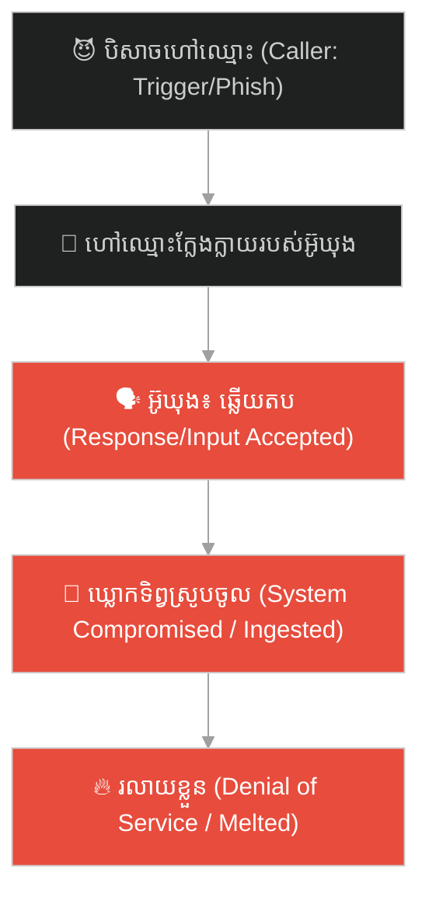
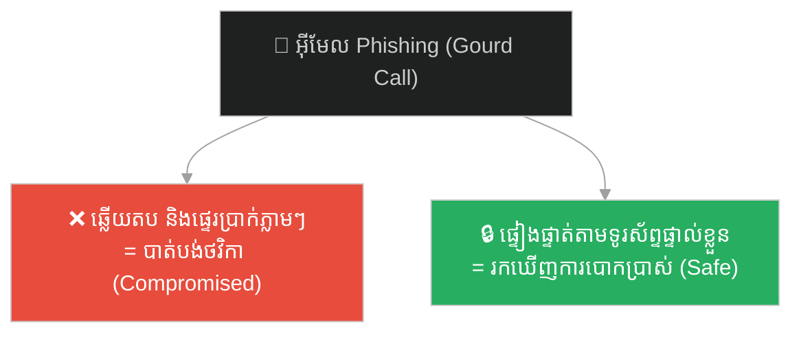
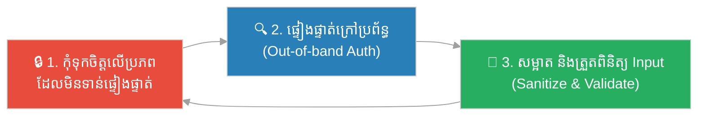

# The Magic Gourd & the Trap of Response (ឃ្លោកទិព្វ និងអន្ទាក់នៃការឆ្លើយតប)៖ ការបោកប្រាស់បែបចិត្តសាស្ត្រ/ព័ត៌មានវិទ្យា ការផ្ទៀងផ្ទាត់ទិន្នន័យ និងគ្រោះថ្នាក់នៃការឆ្លើយតបដោយខ្វះការប្រុងប្រយ័ត្ន (Social Engineering, Input Validation, and the Danger of Blind Responses)

**Author:** ichamrong  
**Date:** 2026-06-04  
**Tags:** #sun-wukong #journey-to-the-west #social-engineering #cybersecurity #phishing #input-validation #trolling #parable  
**Category:** Concepts / Parables  
**Read Time:** ~10 min  

---

## 📌 មាតិកា (Table of Contents)
- [អន្ទាក់ផ្លូវចិត្ត (The Trap)](#0)
- [១. រឿងព្រេង៖ ឃ្លោកពណ៌ស្វាយមាស និងការហៅឈ្មោះ (The Legend: The Purple-Gold Gourd and calling the Name)](#1)
- [២. បញ្ហា៖ ការវាយប្រហារបែបចិត្តសាស្ត្រ និងកង្វះការផ្ទៀងផ្ទាត់ទិន្នន័យ (The Issue: Social Engineering and Lack of Input Validation)](#2)
- [៣. ឧទាហរណ៍ជាក់ស្តែងក្នុងពិភពពិត (Real World Examples)](#3)
  - [ឧទាហរណ៍ទី ១ — បច្ចេកទេស៖ ការវាយប្រហារបែប Phishing និងការបោកប្រាស់អត្តសញ្ញាណ (Phishing Attacks and Social Engineering)](#3-1)
  - [ឧទាហរណ៍ទី ២ — ប្រព័ន្ធបច្ចេកវិទ្យា៖ ការឆ្លើយតបនឹងទិន្នន័យគ្មានការផ្ទៀងផ្ទាត់ (SQL Injection and SSRF)](#3-2)
  - [ឧទាហរណ៍ទី ៣ — ទំនាក់ទំនង/សង្គម៖ ការឆ្លើយតបនឹងការញុះញង់របស់ Trolls (Responding to Provocations and Trolls)](#3-3)
- [៤. ដំណោះស្រាយ៖ ក្របខ័ណ្ឌផ្ទៀងផ្ទាត់ដាច់ខាត (The Solution: Zero-Trust Verification Framework)](#4)
- [សេចក្តីសន្និដ្ឋាន (Conclusion)](#5)
- [ឯកសារយោង (References)](#6)
- [Related Posts](#7)

---

## អន្ទាក់ផ្លូវចិត្ត (The Trap)

នៅពេលអ្នកទទួលបានទូរស័ព្ទ អ៊ីមែល ឬសំណើប្រព័ន្ធដែលហៅឈ្មោះរបស់អ្នកចំៗ តើអ្នកសម្រេចចិត្តឆ្លើយតប និងជឿជាក់លើវាភ្លាមៗដែរឬទេ? នៅក្នុងពិភពព័ត៌មានវិទ្យា និងចិត្តសាស្ត្រ ការឆ្លើយតបដោយងងឹតងងល់ទៅនឹងការសួរនាំ គឺជាចំណុចខ្សោយដ៏ធំបំផុត ដែលនាំទៅរកការបាត់បង់សុវត្ថិភាព ឬការធ្លាក់ចូលក្នុងអន្ទាក់របស់គូប្រជែង។

When you receive a phone call, an email, or a system request that addresses you by name, do you immediately trust it and respond? In information technology and psychology, blindly responding to unsolicited queries is a primary vulnerability that leads to security breaches or falling into an opponent's trap.

បិសាចស្នែងមាស និងស្នែងប្រាក់ មានឃ្លោកទិព្វពណ៌ស្វាយមាស ដែលអាចស្រូបយកមនុស្សណាដែលឆ្លើយតបនៅពេលគេហៅឈ្មោះ។ សូម្បីតែស៊ុនអ៊ូឃុង ដ៏វៃឆ្លាត ដែលបានប្រើឈ្មោះក្លែងក្លាយ ក៏នៅតែត្រូវបានឃ្លោកស្រូបចូលដែរ ព្រោះគាត់បានភ្លេចខ្លួន ហើយឆ្លើយតបទៅនឹងការហៅនោះ។

The Golden-Horned and Silver-Horned demons possessed a magical Purple-Gold Gourd that could suck in and trap anyone who responded when their name was called. Even the clever Sun Wukong, using an alias, was sucked into the gourd because he let his guard down and answered the call.

---

## ១. រឿងព្រេង៖ ឃ្លោកពណ៌ស្វាយមាស និងការហៅឈ្មោះ (The Legend: The Purple-Gold Gourd and calling the Name)

នៅក្នុងដំណើរទៅទិសខាងលិច ព្រះថាងសានចាង និងសិស្ស បានជួបនឹងបិសាចពីរនាក់គឺ ស្នែងមាស (Golden Horn) និងស្នែងប្រាក់ (Silver Horn) នៅភ្នំព័ទ្ធជុំវិញដោយផ្កាឈូក។ បិសាចទាំងនេះមានកំណប់ទិព្វមួយគឺ ឃ្លោកស្វាយមាស (Purple-Gold Gourd) ដែលឡៅស៊ី (Lao Tzu) បានប្រើសម្រាប់ដាក់ថ្នាំទិព្វ។ ឃ្លោកនេះមានសមត្ថភាពអស្ចារ្យ៖ ឱ្យតែហៅឈ្មោះនរណាម្នាក់ ហើយអ្នកនោះឆ្លើយតប (ទោះបីជាឆ្លើយ «បាទ» ឬ «ចា៎» ក៏ដោយ) ពួកគេនឹងត្រូវស្រូបចូលក្នុងឃ្លោកភ្លាមៗ ហើយរលាយខ្លួនទៅជាទឹកក្នុងរយៈពេលបីម៉ោង។

In *Journey to the West*, the pilgrims encountered two demons, Golden Horn and Silver Horn, at the Lotus Flower Cave. The demons possessed a celestial treasure: the Purple-Gold Gourd, originally used by Lao Tzu to store pills of immortality. The gourd had a unique mechanism: if held up and a name was called, and that person responded (even with a simple "Yes" or "What?"), they would be instantly sucked inside and melted into broth within three hours.

ស៊ុនអ៊ូឃុង បានដឹងពីរឿងនេះ ដូច្នេះនៅពេលបិសាចហៅឈ្មោះ «ស៊ុនអ៊ូឃុង» គាត់មិនឆ្លើយតបឡើយ។ បន្ទាប់មក គាត់បានប្រែខ្លួន និងបង្កើតឈ្មោះក្លែងក្លាយថា «ស៊ុនស៊ិងជឺ (Zhe Wukong)» ដើម្បីទៅបញ្ឆោតបិសាច។

Sun Wukong learned of this danger, so when the demons called "Sun Wukong," he remained silent. Later, he shape-shifted and assumed an alias, "Zhe Wukong," to trick the demons.

ទោះជាយ៉ាងណា បិសាចបានលើកឃ្លោកឡើង ហើយហៅឈ្មោះក្លែងក្លាយរបស់គាត់ «ស៊ុនស៊ិងជឺ!»។ ដោយគិតថាឈ្មោះនេះជាឈ្មោះក្លែងក្លាយ គ្មានជាប់ទាក់ទងនឹងអត្តសញ្ញាណពិតរបស់ខ្លួន និងមិនអាចឱ្យឃ្លោកដំណើរការបាន អ៊ូឃុងបានឆ្លើយតបយ៉ាងខ្លាំងថា «អញនៅទីនេះ!»។ ភ្លាមៗនោះ ឃ្លោកទិព្វបានស្រូបយកគាត់ចូលទៅខាងក្នុងភ្លាមៗ។ ឃ្លោកមិនខ្វល់ថាឈ្មោះនោះពិត ឬក្លែងក្លាយឡើយ វាខ្វល់តែការឆ្លើយតប (any response) របស់អ្នកដែលត្រូវបានហៅប៉ុណ្ណោះ។

However, the demon held up the gourd and called, "Zhe Wukong!" Thinking that the alias held no connection to his true identity and therefore the gourd would fail, Wukong boldly answered, "Here I am!" Instantly, the gourd sucked him inside. The gourd did not care if the name was real or fake; it only required a *response* from the target.

---

## ២. បញ្ហា៖ ការវាយប្រហារបែបចិត្តសាស្ត្រ និងកង្វះការផ្ទៀងផ្ទាត់ទិន្នន័យ (The Issue: Social Engineering and Lack of Input Validation)

ឃ្លោកទិព្វរបស់បិសាចតំណាងឱ្យភាពងាយរងគ្រោះនៅក្នុងប្រព័ន្ធបច្ចេកវិទ្យា និងចិត្តសាស្ត្រមនុស្ស៖

The magic gourd represents critical vulnerabilities in both tech systems and human psychology:

- **ការវាយប្រហារបែបបោកប្រាស់ចិត្តសាស្ត្រ (Social Engineering/Phishing)** — បិសាចមិនបានប្រើកម្លាំងបាយដើម្បីចាប់អ៊ូឃុងទេ។ ពួកគេបានប្រើព័ត៌មាន (ឈ្មោះរបស់គាត់) ដើម្បីបញ្ឆោតឱ្យគាត់ធ្វើសកម្មភាព (ឆ្លើយតប)។ នេះជាយន្តការចម្បងនៃ Phishing។
- **កង្វះការផ្ទៀងផ្ទាត់ទិន្នន័យចូល (Input Validation Vulnerability)** — ឃ្លោកទិព្វដំណើរការទៅបាន ឱ្យតែមានការឆ្លើយតបមកវិញ (any return signal)។ វាមិនមានយន្តការការពារ ឬ authentication ដើម្បីផ្ទៀងផ្ទាត់ថាតើឈ្មោះនោះពិតឬអត់ឡើយ។ នៅក្នុងប្រព័ន្ធព័ត៌មានវិទ្យា ការទទួលយក និងដំណើរការទិន្នន័យរាល់ពេលដែលមានការស្នើសុំ គឺជាគ្រោះថ្នាក់ដ៏ធំ។
- **ការឆ្លើយតបដោយអារម្មណ៍ (Emotional Response Trap)** — នៅក្នុងទំនាក់ទំនង Trolls ឬគូប្រជែង ច្រើនតែហៅឈ្មោះ ឬវាយប្រហារយើង ដើម្បីឱ្យយើងប្រតិកម្មតប។ ការឆ្លើយតបរបស់យើង មិនថាដើម្បីការពារខ្លួន ឬប្រកែកឡើយ គឺជារបៀបដែលពួកគេ «ស្រូប» យើងចូលទៅក្នុងហ្គេមរបស់ពួកគេ។

**ភាពខុសគ្នាសំខាន់៖** ប្រព័ន្ធដែលមានសុវត្ថិភាព មិនឆ្លើយតបទៅនឹងសំណើដែលមិនមានការផ្ទៀងផ្ទាត់ភាពត្រឹមត្រូវ (unauthenticated requests) ឡើយ ទោះបីជាសំណើនោះដឹងពីឈ្មោះ ឬទិន្នន័យរបស់យើងក៏ដោយ។

**The key difference:** secure systems do not respond to unauthenticated requests, regardless of how much local context (like a name or ID) the request presents.

---

## ៣. ឧទាហរណ៍ជាក់ស្តែងក្នុងពិភពពិត (Real World Examples)

---

### ឧទាហរណ៍ទី ១ — បច្ចេកទេស៖ ការវាយប្រហារបែប Phishing និងការបោកប្រាស់អត្តសញ្ញាណ (Phishing Attacks and Social Engineering)

បុគ្គលិកផ្នែកហិរញ្ញវត្ថុម្នាក់ ទទួលបានអ៊ីមែលពីគណនីដែលមើលទៅដូចជាគណនីរបស់នាយកប្រតិបត្តិ (CEO) របស់ក្រុមហ៊ុន ដោយសរសេរថា៖ «សួស្ដី [ឈ្មោះបុគ្គលិក], ខ្ញុំកំពុងប្រជុំបន្ទាន់។ ចូរផ្ទេរប្រាក់ទៅដៃគូអាជីវកម្មនេះជាបន្ទាន់»។ ដោយសារតែឃើញគេហៅឈ្មោះខ្លួនចំៗ បុគ្គលិកនោះឆ្លើយតប និងផ្ទេរប្រាក់ភ្លាមៗ (ឆ្លើយតបនឹងឃ្លោក)។ នេះជាការវាយប្រហារបែប Business Email Compromise (BEC) ដែលជោគជ័យដោយសារមនុស្សខ្វះការផ្ទៀងផ្ទាត់ក្រៅប្រព័ន្ធ (out-of-band verification)។

A financial officer receives an email addressing them by name, seemingly from the CEO: "Hello [Employee Name], I'm in an urgent meeting. Please wire funds to this vendor immediately." Seeing their name, the employee complies without verifying the sender outside of the email channel (answering the gourd). This is a Business Email Compromise (BEC) attack, succeeding due to lack of out-of-band authentication.

---

### ឧទាហរណ៍ទី ២ — ប្រព័ន្ធបច្ចេកវិទ្យា៖ ការឆ្លើយតបនឹងទិន្នន័យគ្មានការផ្ទៀងផ្ទាត់ (SQL Injection and SSRF)

នៅក្នុងការសរសេរកម្មវិធី Web Application, ប្រសិនបើប្រព័ន្ធទទួលយក input ពីអ្នកប្រើប្រាស់ (ដូចជា ID ឬឈ្មោះ) ហើយបញ្ចូលវាទៅក្នុង SQL query ដោយផ្ទាល់ដោយគ្មានការ sanitize (input validation) — នោះអ្នកវាយប្រហារអាចបញ្ចូលពាក្យបញ្ជាកូដដើម្បីបំផ្លាញ ឬលួចទិន្នន័យបាន។ នេះហៅថា **SQL Injection**។ ប្រព័ន្ធដំណើរការរាល់ input ទាំងអស់ ដូចជាឃ្លោកទិព្វដែលស្រូបយកអ្វីៗគ្រប់យ៉ាងដែលឆ្លើយតប។

In web development, if an application accepts user input (such as an ID or name) and concatenates it directly into an SQL database query without sanitization—an attacker can inject malicious database command payloads to steal or wipe data. This is **SQL Injection**. The system processes every input without verification, just like the magic gourd swallowing any responder.

---

### ឧទាហរណ៍ទី ៣ — ទំនាក់ទំនង/សង្គម៖ ការឆ្លើយតបនឹងការញុះញង់របស់ Trolls (Responding to Provocations and Trolls)

នៅលើបណ្ដាញសង្គម Trolls ឬអ្នកស្អប់ (haters) តែងតែសរសេរមតិរិះគន់ ជេរប្រមាថ ឬចោទប្រកាន់អ្នកចំៗដោយប្រើឈ្មោះរបស់អ្នក។ គោលបំណងរបស់ពួកគេគឺចង់ឱ្យអ្នកប្រតិកម្មតប (ឆ្លើយតបនឹងឃ្លោក)។ នៅពេលអ្នកឆ្លើយតបដោយកំហឹង ឬការព្យាយាមពន្យល់ — អ្នកបានធ្លាក់ចូលក្នុងអន្ទាក់ពេលវេលារបស់ពួកគេ ហើយពួកគេនឹងស្រូបយកថាមពលរបស់អ្នកទាំងស្រុងដើម្បីបង្កើតការជជែកដេញដោលដ៏គ្មានប្រយោជន៍។

On social media, trolls target you by name with toxic insults or false accusations. Their single objective is to bait you into reacting (answering the gourd). Once you respond in anger or start explaining yourself—you are sucked into their drama vortex, draining your energy in a useless, endless online flame war.

---

## ៤. ដំណោះស្រាយ៖ ក្របខ័ណ្ឌផ្ទៀងផ្ទាត់ដាច់ខាត (The Solution: Zero-Trust Verification Framework)

ជំហាននៃការអនុវត្ត (How to apply):

1. **កុំទុកចិត្តលើការដឹងព័ត៌មានផ្ទាល់ខ្លួន (Never trust identity based on local context alone)៖** គ្រាន់តែអ្នកផ្ញើសារដឹងឈ្មោះ អ៊ីមែល ឬ ID របស់អ្នក មិនមែនមានន័យថាពួកគេជាមនុស្សពិត ឬជាប្រភពដែលគួរឱ្យទុកចិត្តឡើយ។ តែងតែអនុវត្តគោលការណ៍ **Zero Trust**។ *Just because a sender knows your name or ID does not prove their identity. Always apply a Zero-Trust policy.*
2. **ផ្ទៀងផ្ទាត់ភាពត្រឹមត្រូវក្រៅប្រព័ន្ធ (Out-of-band Authentication)៖** ប្រសិនបើទទួលបានសំណើសុំផ្ទេរប្រាក់ ឬប្ដូរលេខសម្ងាត់តាមអ៊ីមែល ចូរទូរស័ព្ទទៅបញ្ជាក់ ឬប្រើប្រាស់ប្រព័ន្ធទំនាក់ទំនងផ្លូវការផ្សេងទៀតដើម្បីផ្ទៀងផ្ទាត់។ *If you receive high-risk requests (wiring money, changing passwords) via email, call to verify or use a verified internal messaging system.*
3. **សម្អាត និងផ្ទៀងផ្ទាត់រាល់ទិន្នន័យចូល (Sanitize and validate all inputs)៖** នៅក្នុងកូដ ត្រូវប្រាកដថា input ទាំងអស់ត្រូវបានត្រួតពិនិត្យយ៉ាងតឹងរ៉ឹង (validation white-lists) និងប្រើប្រាស់ parameterized queries ដើម្បីការពារ SQL Injection។ *In code, strictly enforce input validation white-lists and use parameterized queries to neutralize SQL injections.*
4. **អនុវត្តការមិនអើពើជាយុទ្ធសាស្ត្រ (Strategic Ignorance with Trolls)៖** កុំឆ្លើយតបនឹងការញុះញង់ដែលគ្មានប្រយោជន៍។ ការមិនឆ្លើយតប (no response) គឺជាការការពារដ៏ល្អបំផុតដើម្បីកុំឱ្យធ្លាក់ចូលទៅក្នុងឃ្លោកទិព្វរបស់អ្នកដទៃ។ *Do not answer trolls. Silent ignoring is the ultimate shield to prevent being sucked into other people's time-wasting traps.*

---

## សេចក្តីសន្និដ្ឋាន (Conclusion)

> **ឃ្លោកទិព្វរបស់បិសាចមិនអាចធ្វើអ្វីបានឡើយ បើគ្មានការឆ្លើយតប។ គ្រោះថ្នាក់មិនមែនកើតឡើងដោយសារគេដឹងឈ្មោះរបស់យើង ឬគេហៅយើងឡើយ គឺកើតឡើងដោយសារយើងព្រម «ឆ្លើយតប» ដោយងងឹតងងល់។**
>
> **The magic gourd is powerless without a response. The danger is not that they know our name or call out to us; it is that we choose to answer blindly.**

លើកក្រោយ នៅពេលអ្នកទទួលបានសារ សំណើ ឬពាក្យញុះញង់ដែលហៅឈ្មោះរបស់អ្នកចំៗ — ចូររក្សាភាពស្ងៀមស្ងាត់។ សួរខ្លួនឯងថា៖ «តើនេះជាសំណើដែលបានផ្ទៀងផ្ទាត់ត្រឹមត្រូវ ឬវាគ្រាន់តែជាការហៅដើម្បីស្រូបខ្ញុំចូលទៅក្នុងឃ្លោកទិព្វ?» ភាពស្ងៀមស្ងាត់ និងការផ្ទៀងផ្ទាត់ គឺជាខែលការពារដ៏រឹងមាំបំផុតរបស់អ្នក។

Next time you receive a message, a request, or a provocation addressing you by name—remain silent. Ask yourself: *"Is this request authenticated, or is it just a call to suck me into the magic gourd?"* Silence and out-of-band verification are your strongest shields.

---

## ឯកសារយោង (References)

* **Wu Cheng'en** — *Journey to the West* (西游记), 16th century. ជំពូកទី ៣៣-៣៥៖ បិសាចស្នែងមាស និងស្នែងប្រាក់ (金角大王与银角大王).
* **Kevin Mitnick** — *The Art of Deception* (2002), on Social Engineering and phishing defenses.
* **OWASP** — *Top 10 Web Application Security Risks* (Injection vulnerabilities and validation defenses).

---

## Related Posts
### 🐒 The Journey to the West Series (ស៊េរីរឿងដំណើរទៅទិសខាងលិច)

* **[78 The Seventy-Two Faces of Sun Wukong](../articles/78-the-seventy-two-faces-of-sun-wukong.md)** — អត្ថបទវិទ្យាសាស្ត្រ៖ ខ្លួនពិត vs ខ្លួនក្លែង (science article: true self vs false self).
* **[244 The White Bone Demon & the Fiery Eyes](./244-the-white-bone-demon-and-the-fiery-eyes.md)** — របាំងមុខ vs ខ្លួនពិត (masks vs true self).
* **[246 The Monk Who Banished the Truth](./246-the-monk-who-banished-the-truth.md)** — ភាពស្មោះត្រង់ ≠ ការវិនិច្ឆ័យ (sincerity ≠ discernment).
* **[247 The Real and the Fake Monkey](./247-the-real-and-the-fake-monkey.md)** — ផ្ទៃក្រៅ vs ខ្លឹមសារ (surface vs substance).
* **[248 The Golden Headband](./248-the-golden-headband.md)** — អំណាច ត្រូវការការទទួលខុសត្រូវ (power needs accountability).
* **[249 Trapped Under the Mountain](./249-trapped-under-the-mountain.md)** — ទេពកោសល្យ ត្រូវការវិន័យ និងបេសកកម្ម (talent needs discipline & mission).
* **[250 Havoc in Heaven & the Empty Title](./250-havoc-in-heaven-and-the-empty-title.md)** — ឧទ្ធច្ច និងតួនាទីទទេ (ego and empty titles).
* **[251 The Flaming Mountains & the Banana-Leaf Fan](./251-the-flaming-mountains-and-the-banana-fan.md)** — យុទ្ធសាស្ត្រ > កម្លាំង (strategy > force).
* **[252 The Water Curtain Cave & the Leap of Faith](./252-the-water-curtain-cave-and-the-leap-of-faith.md)** — ការផ្ដើម និងហានិភ័យគណនា (initiative & calculated risk).
* **[253 The Five Pillars & the Limit of Perception](./253-the-five-pillars-and-the-limit-of-perception.md)** — ដែនកំណត់នៃការយល់ដឹង និងអំនួត (cognitive limits & overconfidence).
* **[254 The Ginseng Fruit Tree & the Cost of Impulse](./254-the-ginseng-fruit-tree-and-the-cost-of-impulse.md)** — កំហឹងឆេវឆាវ និងការខូចខាត (emotional impulse & cost of damage).
* **[255 The Magic Gourd & the Trap of Response](./255-the-magic-gourd-and-the-trap-of-response.md)** — ការបោកប្រាស់បែបចិត្តសាស្ត្រ និងការផ្ទៀងផ្ទាត់ (social engineering & input validation).
* **[256 The Three Knocks & the Art of Subtle Signals](./256-the-three-knocks-and-the-art-of-subtle-signals.md)** — ការស្ដាប់ដោយសកម្ម និងសញ្ញាបង្កប់ (active listening & subtext).
---

## Related

- [💡 Concepts README](../README.md)
- [📚 Main Repository README](../../../README.md)
- [Mental Health & Well-being](../../mental-health/README.md)
- [Management & SDLC](../../management/README.md)
