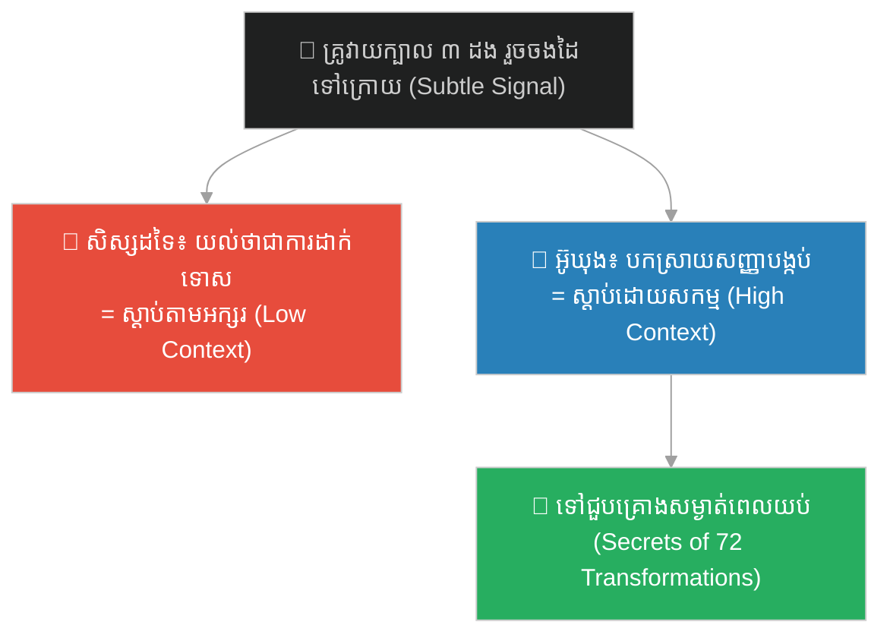
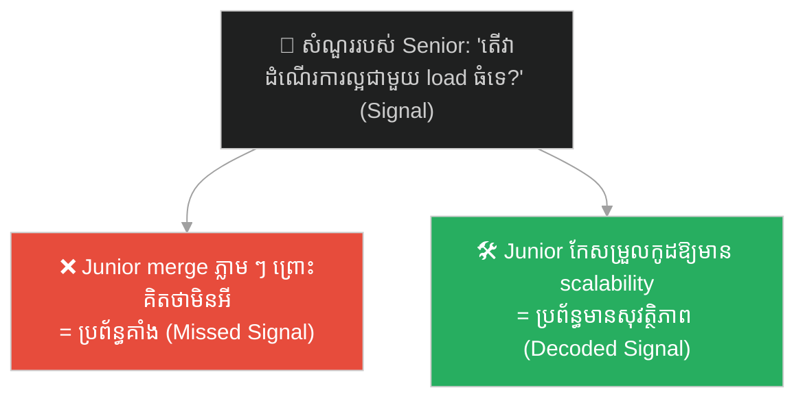
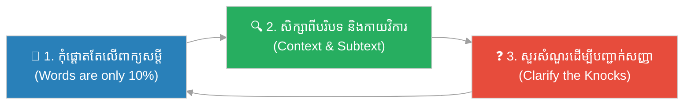

# The Three Knocks & the Art of Subtle Signals (ការគោះបីដង និងសិល្បៈនៃសញ្ញាបង្កប់)៖ ការស្តាប់ដោយយកចិត្តទុកដាក់ ការបកស្រាយសញ្ញាបង្កប់ និងការប្រាស្រ័យទាក់ទងក្នុងបរិបទកម្រិតខ្ពស់ (Active Listening, Decoding Subtle Cues, and High-Context Communication)

**Author:** ichamrong  
**Date:** 2026-06-04  
**Tags:** #sun-wukong #journey-to-the-west #active-listening #high-context-communication #decoding-signals #mentorship #soft-skills #parable  
**Category:** Concepts / Parables  
**Read Time:** ~10 min  

---

## 📌 មាតិកា (Table of Contents)
- [អន្ទាក់ផ្លូវចិត្ត (The Trap)](#0)
- [១. រឿងព្រេង៖ ការគោះក្បាលបីដង និងការបង្រៀនសម្ងាត់ពេលកណ្ដាលអាធ្រាត្រ (The Legend: Three Knocks on the Head and the Midnight Secret Teachings)](#1)
- [២. បញ្ហា៖ ការស្ដាប់តាមតែអក្សរ និងការខកខានមិនបានបកស្រាយសញ្ញាបង្កប់ (The Issue: Literal Listening vs. High-Context Decoding)](#2)
- [៣. ឧទាហរណ៍ជាក់ស្តែងក្នុងពិភពពិត (Real World Examples)](#3)
  - [ឧទាហរណ៍ទី ១ — បច្ចេកទេស៖ មតិយោបល់ក្នុង Code Review និងការព្រមានដោយប្រយោល (Subtle Code Review Comments and Warnings)](#3-1)
  - [ឧទាហរណ៍ទី ២ — ធុរកិច្ច/អតិថិជន៖ ការស្ដាប់យល់ពីតម្រូវការពិតប្រាកដរបស់អតិថិជន (Reading Between the Lines of Client Feedback)](#3-2)
  - [ឧទាហរណ៍ទី ៣ — ទំនាក់ទំនង៖ ការមើលរំលងសញ្ញាអារម្មណ៍របស់ដៃគូ (Ignoring Emotional Cues in Personal Life)](#3-3)
- [៤. ដំណោះស្រាយ៖ ក្របខ័ណ្ឌបកស្រាយសញ្ញា និងស្ដាប់ដោយសកម្ម (The Solution: Active Decoding and Listening Framework)](#4)
- [សេចក្តីសន្និដ្ឋាន (Conclusion)](#5)
- [ឯកសារយោង (References)](#6)
- [Related Posts](#7)

---

## អន្ទាក់ផ្លូវចិត្ត (The Trap)

តើអ្នកស្តាប់ឮតែពាក្យសម្តីដែលគេនិយាយចេញមកចំ ៗ ឬអ្នកអាចបកស្រាយ និងយល់ពីសញ្ញាបង្កប់ ឬការផ្ដល់មតិយោបល់ដោយប្រយោលបាន? នៅក្នុងការដឹកនាំ និងការទំនាក់ទំនង ការយល់តែអត្ថន័យតាមអក្សរ (low-context) ច្រើនតែធ្វើឱ្យយើងមើលរំលងព័ត៌មាន និងការព្រមានសំខាន់ ៗ ដែលគេមិនបាននិយាយចេញមកក្រៅ។

Do you only hear the words that are spoken literally, or are you able to read between the lines and catch the subtle feedback? In leadership and communication, focusing solely on literal speech (low-context) often causes us to miss critical insights and warnings that are left unsaid.

នៅពេលស៊ុនអ៊ូឃុងរៀនធម៌ដំបូងជាមួយគ្រូ ស៊ូប៊ូទី (Patriarch Subhuti) គ្រូបានវាយក្បាលគាត់បីដង រួចដើរចេញទៅក្រោយខ្នង។ សិស្សដទៃទៀតគិតថាអ៊ូឃុងត្រូវគ្រូខឹង និងដាក់ទោស តែអ៊ូឃុងយល់ពីសញ្ញាបង្កប់៖ គ្រូចង់ឱ្យគាត់ទៅជួបជាសម្ងាត់តាមទ្វារក្រោយនៅម៉ោងបីយប់ (third watch) ដើម្បីទទួលបានមេរៀនពិសេស។

When Sun Wukong studied under his master, Patriarch Subhuti, the master struck Wukong's head three times and walked away with his hands behind his back. The other disciples believed Wukong was being punished, but Wukong decoded the subtle signal: the master wanted him to visit his private chamber via the back door at the third watch of the night (midnight) to receive secret teachings.

---

## ១. រឿងព្រេង៖ ការគោះក្បាលបីដង និងការបង្រៀនសម្ងាត់ពេលកណ្ដាលអាធ្រាត្រ (The Legend: Three Knocks on the Head and the Midnight Secret Teachings)

នៅពេលស៊ុនអ៊ូឃុងបានធ្វើដំណើរទៅសុំរៀនធម៌ជាមួយលោកគ្រូ ស៊ូប៊ូទី (Patriarch Subhuti) គាត់បានស្នាក់នៅរៀនជាមួយសិស្សដទៃទៀតជាច្រើនឆ្នាំ។ ថ្ងៃមួយ លោកគ្រូបានសួរអ៊ូឃុងថា តើចង់រៀនធម៌ប្រភេទណា។ អ៊ូឃុងបានបដិសេធរាល់ធម៌ដែលលោកគ្រូបានបង្ហាញ ព្រោះធម៌ទាំងនោះមិនអាចជួយឱ្យគាត់រស់នៅអមតៈបានឡើយ។

When Sun Wukong traveled to study under Patriarch Subhuti, he lived and trained with the other disciples for several years. One day, the master asked Wukong what path of Daoism he wished to study. Wukong rejected every option presented because none of them granted true immortality.

លោកគ្រូ ស៊ូប៊ូទី ធ្វើជាខឹងសម្បារយ៉ាងខ្លាំង ហើយបានស្រែកថា «អាស្វាឈ្លើយនេះ ធម៌នេះក៏មិនរៀន ធម៌នោះក៏មិនរៀន!»។ បន្ទាប់មក គាត់បានលើកដំបងវាយក្បាលអ៊ូឃុងបីដង រួចដើរចេញទៅបន្ទប់ខាងក្រោយដោយដាក់ដៃទាំងពីរទៅក្រោយខ្នងរបស់គាត់។

Patriarch Subhuti feigned deep anger and yelled, "You stubborn monkey, you refuse this path and reject that one!" He then raised his ruler, struck Wukong on the head three times, and walked away into the back chambers with both hands clasped behind his back.

សិស្សដទៃទៀតភ័យខ្លាចខ្លាំងណាស់ ហើយបានស្តីបន្ទោសអ៊ូឃុងថាបានធ្វើឱ្យលោកគ្រូខឹង និងខូចចិត្ត។ ប៉ុន្តែ អ៊ូឃុងមិនបានខឹង ឬយំឡើយ គាត់លួចសើចក្នុងចិត្តយ៉ាងសប្បាយ។ គាត់បានយល់ពីសញ្ញាសម្ងាត់របស់គ្រូ៖
- **ការគោះក្បាលបីដង** គឺចង់ឱ្យគាត់ទៅជួបនៅយាមទីបី (Third Watch / ម៉ោងបីយប់)។
- **ការដើរទៅបន្ទប់ក្រោយដោយចងដៃទៅក្រោយ** គឺចង់ឱ្យគាត់ចូលតាមទ្វារក្រោយនៃវិហារ។

The other disciples were terrified and blamed Wukong for angering their master. But Wukong was not upset; he smiled in secret. He had decoded his master's high-context message:
- *Three knocks on the head* meant to meet him at the third watch of the night (midnight to 3 AM).
- *Walking to the back chamber with hands behind his back* meant to enter through the back door.

នៅពេលយប់ជ្រៅ អ៊ូឃុងបានលួចចូលតាមទ្វារក្រោយ ហើយបានរកឃើញលោកគ្រូកំពុងរង់ចាំគាត់នៅលើគ្រែរួចជាស្រេច។ លោកគ្រូពេញចិត្តនឹងប្រាជ្ញារបស់អ៊ូឃុងយ៉ាងខ្លាំង ហើយបានសម្រេចចិត្តបង្រៀនសម្ងាត់នូវវិជ្ជាប្រែក្រឡា ៧២ មុខ (72 Transformations) និងវិជ្ជាជិះពពកហោះ (Cloud Somersault) ដែលជាគ្រឹះនៃអំណាចរបស់គាត់។

At midnight, Wukong slipped through the back door and found the master waiting for him. The master was delighted by Wukong's perceptiveness and proceeded to teach him the secret spells of the 72 Transformations and the Cloud Somersault, which became the foundation of Wukong's legendary powers.

---

## ២. បញ្ហា៖ ការស្ដាប់តាមតែអក្សរ និងការខកខានមិនបានបកស្រាយសញ្ញាបង្កប់ (The Issue: Literal Listening vs. High-Context Decoding)

សសរទាំងប្រាំ និងការគោះក្បាលបីដង បង្ហាញពីគម្លាតទំនាក់ទំនង៖

The parable of the three knocks reveals a profound communication gap:

- **ការប្រាស្រ័យទាក់ទងបែបបរិបទខ្ពស់ (High-Context Communication)** — នៅក្នុងវប្បធម៌ និងស្ថាប័នខ្លះ គំនិត ឬមតិយោបល់សំខាន់ ៗ មិនត្រូវបាននិយាយចំ ៗ ឡើយ (ដើម្បីរក្សាមុខមាត់ ឬដើម្បីធ្វើតេស្តប្រាជ្ញា)។ ពួកគេប្រើសញ្ញាបង្កប់ កាយវិការ ឬសម្លេង។
- **ការស្តាប់ដោយអសកម្ម (Passive/Literal Listening)** — សិស្សដទៃទៀតស្ដាប់ឮតែពាក្យខឹងសម្បាររបស់គ្រូ និងឃើញដំបងវាយក្បាល (low-context) ដូច្នេះពួកគេសន្និដ្ឋានថាគ្រូខឹងពិតប្រាកដ។ ពួកគេខកខានមិនបានយល់ពីបរិបទបង្កប់។
- **មតិយោបល់លាក់កំបាំង (Silent Feedback Loops)** — នៅក្នុងការងារ អ្នកដឹកនាំជាន់ខ្ពស់ច្រើនតែផ្ដល់មតិយោបល់ដោយប្រយោល ឬសួរសំណួរចាក់ដោត ជំនួសឱ្យការបញ្ជាចំ ៗ ។ បុគ្គលិកដែលយល់ពីសញ្ញាទាំងនេះ នឹងអាចកែលម្អការងារបានមុនពេលបញ្ហាកើតឡើង។

**ភាពខុសគ្នាសំខាន់៖** មនុស្សដែលមានភាពឆ្លាតវៃផ្នែកអារម្មណ៍ (EQ) ខ្ពស់ មិនត្រឹមតែស្ដាប់ឮពាក្យសម្ដីឡើយ តែពួកគេ **សង្កេតបរិបទ កាយវិការ និងបំណងបង្កប់** របស់ដៃគូសន្ទនា។

**The key difference:** people with high emotional intelligence (EQ) do not just register the literal definitions of spoken words; they *actively decode the tone, body language, and systemic intent* behind the message.

---

## ៣. ឧទាហរណ៍ជាក់ស្តែងក្នុងពិភពពិត (Real World Examples)

---

### ឧទាហរណ៍ទី ១ — បច្ចេកទេស៖ មតិយោបល់ក្នុង Code Review និងការព្រមានដោយប្រយោល (Subtle Code Review Comments and Warnings)

នៅក្នុងការពិនិត្យកូដ (Code Review), វិស្វករជាន់ខ្ពស់ម្នាក់បានសរសេរមតិយោបល់លើកូដរបស់វិស្វករវ័យក្មេងម្នាក់ថា៖ «វិធីសាស្ត្រនេះដំណើរការល្អសម្រាប់ការផ្ទេរទិន្នន័យតូច ៗ ប៉ុន្តែតើយើងមានគម្រោងប្រើប្រាស់វាជាមួយទិន្នន័យធំ ឬ concurrency ដែរឬទេ?»។ វិស្វករវ័យក្មេងដែលស្ដាប់តាមអក្សរ គិតថា៖ «គាត់និយាយថាវាដំណើរការល្អហើយ» រួចចុច merge ភ្លាម ៗ ( ignore សំណួរ)។ នេះជាការខកខានមិនបានយល់ពី «ការគោះក្បាលបីដង»។ សំណួរនោះជាការព្រមានប្រយោលថា កូដនោះនឹងបណ្ដាលឱ្យប្រព័ន្ធគាំងនៅលើ Production។

During a code review, a senior architect comments on a junior's PR: "This approach works well for small datasets, but do we plan on running this under large loads or high concurrency?" The low-context junior reads: "It works well," merges the PR, and ignores the question. They missed the "three knocks." The question was a polite, high-context warning that the code would trigger resource starvation in production.

---

### ឧទាហរណ៍ទី ២ — ធុរកិច្ច/អតិថិជន៖ ការស្ដាប់យល់ពីតម្រូវការពិតប្រាកដរបស់អតិថិជន (Reading Between the Lines of Client Feedback)

នៅក្នុងការចរចាគម្រោង អតិថិជនបាននិយាយថា៖ «យើងពិតជាចូលចិត្តមុខងារថ្មីនេះណាស់ ប៉ុន្តែថវិការបស់យើងសម្រាប់ត្រីមាសនេះត្រូវបានកំណត់រួចជាស្រេចហើយ»។ អ្នកលក់ដែលស្ដាប់តាមអក្សរ គិតថា៖ «ពួកគេចូលចិត្តវា ដូច្នេះយើងគ្រាន់តែរង់ចាំពួកគេចុះហត្ថលេខា»។ ប៉ុន្តែ អ្នកលក់ដែលឆ្លាតវៃ យល់ពីសញ្ញាបង្កប់៖ «ពួកគេត្រូវការមុខងារនេះ តែយើងត្រូវបំបែកការទូទាត់ជាដំណាក់កាល ឬកាត់បន្ថយ scope ដើម្បីឱ្យត្រូវនឹងថវិការបស់ពួកគេឥឡូវនេះ»។

In contract negotiations, a client says: "We really love your proposed solution, but our budget for this quarter is already locked in." A low-context salesperson hears: "They love it, we just need to wait." A high-context salesperson decodes the signal: "They want this, but we need to offer flexible milestone pricing or reduce the initial scope to fit their immediate budget."

---

### ឧទាហរណ៍ទី ៣ — ទំនាក់ទំនង៖ ការមើលរំលងសញ្ញាអារម្មណ៍របស់ដៃគូ (Ignoring Emotional Cues in Personal Life)

នៅក្នុងជីវិតផ្ទាល់ខ្លួន ដៃគូរបស់អ្នកនិយាយថា៖ «ខ្ញុំមិនអីទេ ទៅចុះ ខ្ញុំអាចដោះស្រាយការងារផ្ទះទាំងនេះម្នាក់ឯងបាន» ដោយសម្លេងហត់នឿយ និងមិនមើលមុខអ្នក។ ប្រសិនបើអ្នកស្ដាប់តាមអក្សរ ហើយដើរចេញទៅដោយរីករាយ — អ្នកកំពុងបង្កើតគ្រាប់បែកពេលវេលានៃការអាក់អន់ចិត្ត។ សម្លេង និងកាយវិការនោះ គឺជា «ការគោះក្បាលបីដង» ដែលចង់ឱ្យអ្នកនៅជួយ និងបង្ហាញការបារម្ភ។

In personal life, a partner says in a flat, tired voice without making eye contact: "I'm fine, go ahead. I can handle cleaning up this mess by myself." If you take the words literally and cheerfully walk away—you are arming a time bomb of resentment. The tone and lack of eye contact were the "three knocks," signaling they need your physical help and emotional support right now.

---

## ៤. ដំណោះស្រាយ៖ ក្របខ័ណ្ឌបកស្រាយសញ្ញា និងស្ដាប់ដោយសកម្ម (The Solution: Active Decoding and Listening Framework)

ជំហាននៃការអនុវត្ត (How to apply):

1. **យល់ថាពាក្យសម្តីជាចំណែកតូចមួយនៃទំនាក់ទំនង (Words are only a fraction of communication)៖** យកចិត្តទុកដាក់លើសម្លេង ល្បឿននិយាយ កាយវិការ និងបរិបទជុំវិញ។ សួរខ្លួនឯងថា «តើអារម្មណ៍បង្កប់នៅពីក្រោយពាក្យទាំងនេះជាអ្វី?» *Pay attention to tone, pacing, and systemic context. Ask: "What is the unsaid emotion or intent behind these words?"*
2. **ស្វែងរកអត្ថន័យពីក្រោយសំណួរ ឬការព្រមានប្រយោល (Decode the subtext)៖** នៅពេលអ្នកដឹកនាំ ឬអ្នកជំនាញសួរសំណួរចម្លែក ៗ ឬផ្ដល់ដំបូន្មានស្រាល ៗ ចូរកុំមើលរំលង។ ភាគច្រើនពួកគេកំពុងព្យាយាមចង្អុលបង្ហាញកំហុសរបស់អ្នកដោយគួរសម។ *When seniors ask leading questions, don't dismiss them. They are likely highlighting a structural issue politely to let you fix it yourself.*
3. **សួរសំណួរដើម្បីបញ្ជាក់អត្តសញ្ញាណនៃសញ្ញា (Verify the signals)៖** ប្រសិនបើអ្នកមិនច្បាស់ពីសញ្ញាបង្កប់ ចូរប្រើពាក្យបញ្ជាក់ថា៖ «ខ្ញុំចង់ប្រាកដថាខ្ញុំយល់ច្បាស់ តើមានន័យថា... មែនទេ?» ឬ «តើលោកមានការបារម្ភលើចំណុច... ឬ?»។ *Clarify ambiguity directly: "Just to ensure I'm on the same page, does this mean you have concerns about X?" or "Are we highlighting Y here?"*
4. **អភិវឌ្ឍសមត្ថភាពបកស្រាយវប្បធម៌ស្ថាប័ន (Master the corporate context)៖** រៀនស្វែងយល់ពីរបៀបដែលមនុស្សនៅក្នុងក្រុមហ៊ុនបង្ហាញការយល់ស្រប ឬការមិនពេញចិត្ត។ ក្រុមហ៊ុនខ្លះចូលចិត្តការនិយាយចំ ៗ តែក្រុមហ៊ុនខ្លះត្រូវការការស្ដាប់ដោយយកចិត្តទុកដាក់ខ្ពស់។ *Adapt to your environment. Some teams are highly literal, while others communicate through subtle cues. Learn to read your organization's subtext.*

---

## សេចក្តីសន្និដ្ឋាន (Conclusion)

> **សិស្សទូទៅបានត្រឹមតែស្ដាប់ឮពាក្យខឹង និងឃើញដំបងវាយក្បាល តែអ៊ូឃុងបកស្រាយវាជាការណាត់ជួបសម្ងាត់ដើម្បីទទួលបានវិជ្ជាអមតៈ។ វិជ្ជាជាន់ខ្ពស់មិនត្រូវបានបង្រៀនជាសាធារណៈឡើយ គឺសម្រាប់តែអ្នកដែលចេះស្ដាប់ និងបកស្រាយសញ្ញាបង្កប់ប៉ុណ្ណោះ។**
>
> **The average disciples heard only anger and saw only punishment, but Wukong decoded the three knocks as an invitation to receive the secrets of immortality. Master-level secrets are rarely taught openly; they are reserved for those who can decode the subtle cues.**

លើកក្រោយ នៅពេលអ្នកទទួលបាន «ការគោះបីដង» ពីប្រធានការងារ អតិថិជន ឬដៃគូជីវិត — ចូរឈប់ប្រតិកម្មតាមតែពាក្យសម្តីរបស់ពួកគេ។ ចូរផ្អាក សង្កេតកាយវិការ និងបកស្រាយអត្ថន័យពិតប្រាកដដែលនៅពីក្រោយខ្នងរបស់ពួកគេ។ នោះជាការចាប់ផ្ដើមនៃការយល់ចិត្ត និងប្រាជ្ញាកម្រិតខ្ពស់។

Next time you receive "three knocks" from a supervisor, a client, or your partner—stop reacting solely to the literal surface. Pause, observe the clasped hands, and decode the systemic intent. That is the beginning of empathy and advanced wisdom.

---

## ឯកសារយោង (References)

* **Wu Cheng'en** — *Journey to the West* (西游记), 16th century. ជំពូកទី ២៖ អ៊ូឃុងរៀនវិជ្ជាប្រែក្រឡាពីគ្រូស៊ូប៊ូទី (祖师敲头).
* **Edward T. Hall** — *Beyond Culture* (1976), introducing High-Context and Low-Context Communication.
* **Stephen R. Covey** — *The 7 Habits of Highly Effective People* (1989), Habit 5: Seek First to Understand, Then to Be Understood (Active Listening).

---

## Related Posts
### 🐒 The Journey to the West Series (ស៊េរីរឿងដំណើរទៅទិសខាងលិច)

* **[78 The Seventy-Two Faces of Sun Wukong](../articles/78-the-seventy-two-faces-of-sun-wukong.md)** — អត្ថបទវិទ្យាសាស្ត្រ៖ ខ្លួនពិត vs ខ្លួនក្លែង (science article: true self vs false self).
* **[244 The White Bone Demon & the Fiery Eyes](./244-the-white-bone-demon-and-the-fiery-eyes.md)** — របាំងមុខ vs ខ្លួនពិត (masks vs true self).
* **[246 The Monk Who Banished the Truth](./246-the-monk-who-banished-the-truth.md)** — ភាពស្មោះត្រង់ ≠ ការវិនិច្ឆ័យ (sincerity ≠ discernment).
* **[247 The Real and the Fake Monkey](./247-the-real-and-the-fake-monkey.md)** — ផ្ទៃក្រៅ vs ខ្លឹមសារ (surface vs substance).
* **[248 The Golden Headband](./248-the-golden-headband.md)** — អំណាច ត្រូវការការទទួលខុសត្រូវ (power needs accountability).
* **[249 Trapped Under the Mountain](./249-trapped-under-the-mountain.md)** — ទេពកោសល្យ ត្រូវការវិន័យ និងបេសកកម្ម (talent needs discipline & mission).
* **[250 Havoc in Heaven & the Empty Title](./250-havoc-in-heaven-and-the-empty-title.md)** — ឧទ្ធច្ច និងតួនាទីទទេ (ego and empty titles).
* **[251 The Flaming Mountains & the Banana-Leaf Fan](./251-the-flaming-mountains-and-the-banana-fan.md)** — យុទ្ធសាស្ត្រ > កម្លាំង (strategy > force).
* **[252 The Water Curtain Cave & the Leap of Faith](./252-the-water-curtain-cave-and-the-leap-of-faith.md)** — ការផ្ដើម និងហានិភ័យគណនា (initiative & calculated risk).
* **[253 The Five Pillars & the Limit of Perception](./253-the-five-pillars-and-the-limit-of-perception.md)** — ដែនកំណត់នៃការយល់ដឹង និងអំនួត (cognitive limits & overconfidence).
* **[254 The Ginseng Fruit Tree & the Cost of Impulse](./254-the-ginseng-fruit-tree-and-the-cost-of-impulse.md)** — កំហឹងឆេវឆាវ និងការខូចខាត (emotional impulse & cost of damage).
* **[255 The Magic Gourd & the Trap of Response](./255-the-magic-gourd-and-the-trap-of-response.md)** — ការបោកប្រាស់បែបចិត្តសាស្ត្រ និងការផ្ទៀងផ្ទាត់ (social engineering & input validation).
* **[256 The Three Knocks & the Art of Subtle Signals](./256-the-three-knocks-and-the-art-of-subtle-signals.md)** — ការស្ដាប់ដោយសកម្ម និងសញ្ញាបង្កប់ (active listening & subtext).
---

## Related

- [💡 Concepts README](../README.md)
- [📚 Main Repository README](../../../README.md)
- [Mental Health & Well-being](../../mental-health/README.md)
- [Management & SDLC](../../management/README.md)
