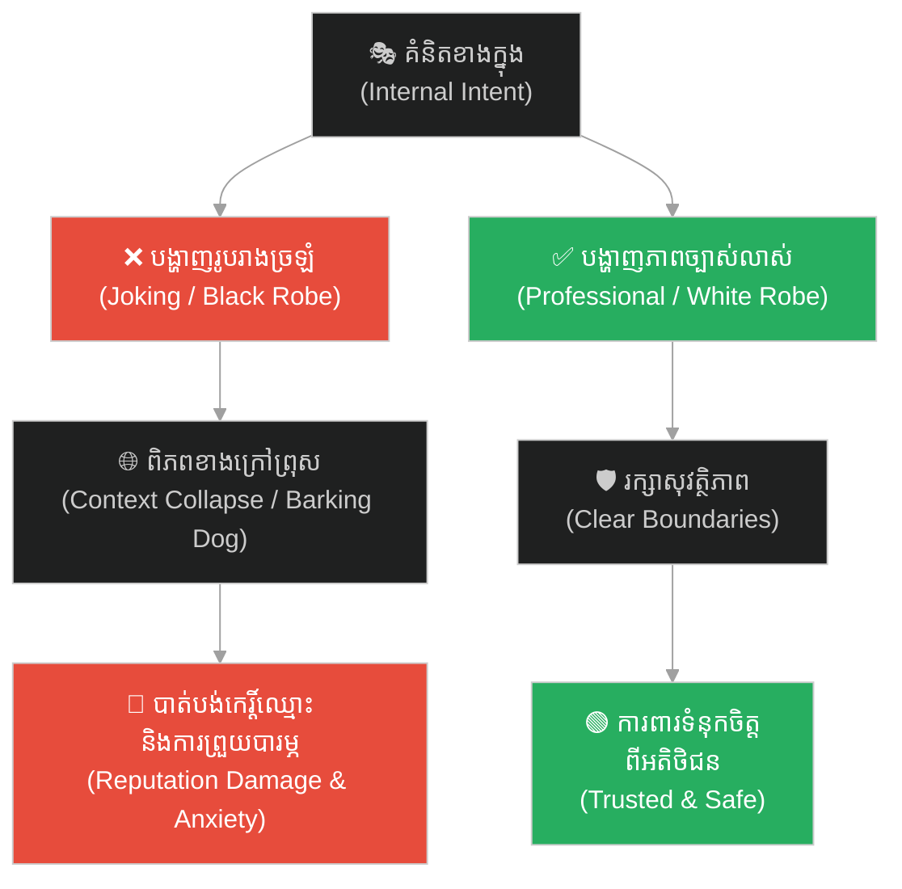
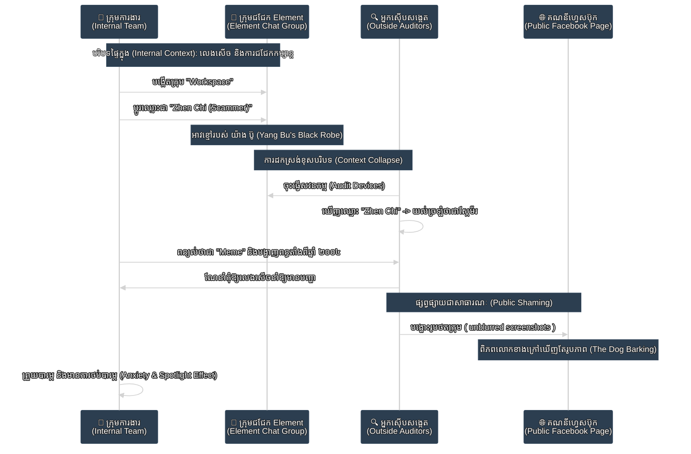
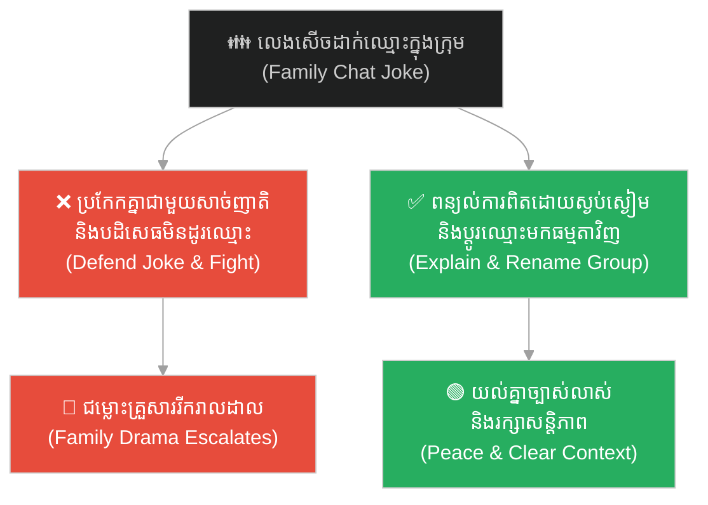
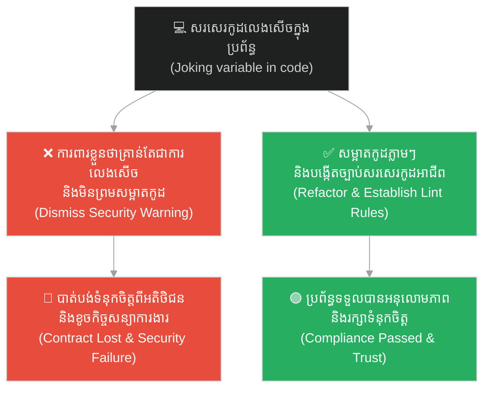
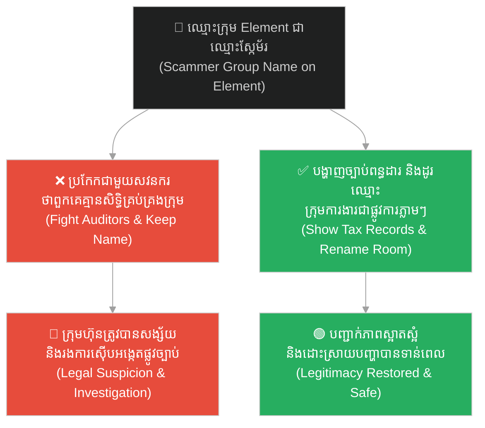
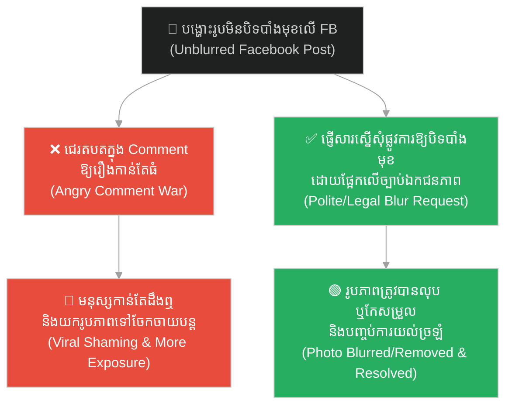
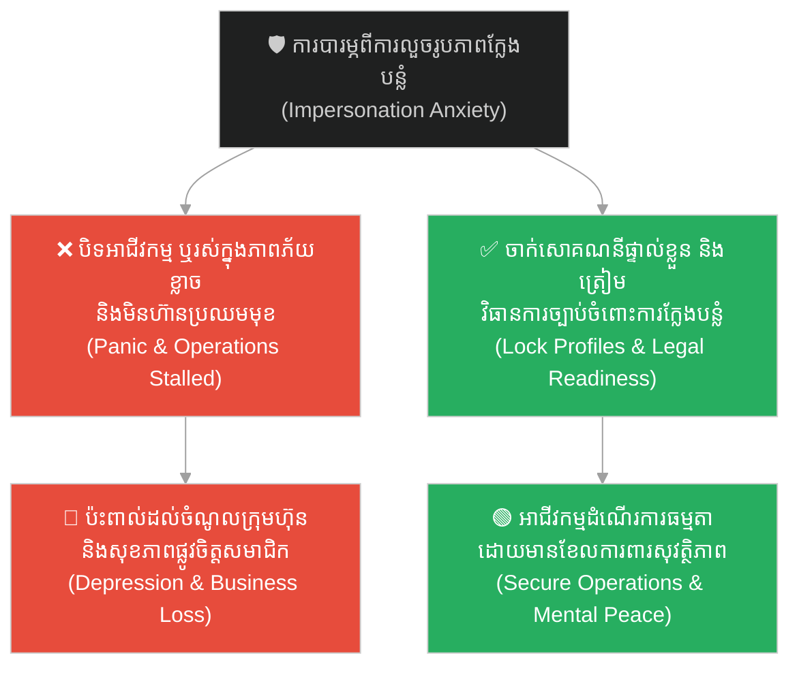
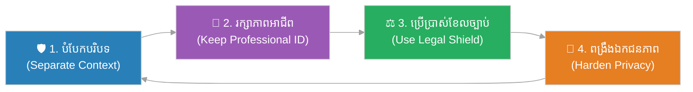

# Context Collapse and the Scammer Meme (ការដួលរលំនៃបរិបទ និង Meme ស្កែម័រ)៖ ហានិភ័យកេរ្តិ៍ឈ្មោះពីការផ្លាស់ប្តូររូបរាងខាងក្រៅ និងការយល់ច្រឡំពីសង្គម (Reputational Risks of Outer Appearance and Context Collapse)

**Author:** ichamrong  
**Date:** 2026-06-09  
**Tags:** #context-collapse #spotlight-effect #reputation-management #privacy-security #visual-communication #critical-thinking #parable  
**Category:** Concepts / Parables  
**Read Time:** ~10 min  

---

> **« កាល យ៉ាង ប៊ូ ស្លៀកពាក់សចេញទៅក្រៅ រួចផ្លាស់ជាអាវខ្មៅត្រឡប់មកវិញ**
> **ឆ្កែរបស់គេក៏ព្រុសដាក់ព្រោះមិនស្គាល់ម្ចាស់។**
> **យ៉ាង ជូ បានដាស់តឿនថា៖ "ប្អូនអើយ កុំវាយវាអី! បើវាចេញទៅសហើយត្រឡប់មកខ្មៅវិញ តើប្អូនមិនប្លែកភ្នែកទេឬ?" »**
>
> *"My brother, do not strike it! If you were in its position, you would have done the exact same thing.*
> *Consider this: if your beloved dog went out with snow-white fur and returned covered in pitch-black mud,*
> *would you not be startled, grow suspicious, and bark to drive it away?"*

---

## 📌 មាតិកា (Table of Contents)
- [អន្ទាក់ផ្លូវចិត្ត (The Trap)](#0)
- [១. រឿងព្រេងប្រវត្តិសាស្ត្រចិន៖ យ៉ាង ប៊ូ និងឆ្កែយាមទ្វារ (The Historic Legend: Yang Bu and the Guard Dog)](#1)
  - [ការយល់ច្រឡំដោយសារសម្លៀកបំពាក់ (The Misunderstanding of Clothes)](#1-1)
- [២. បញ្ហា៖ ការដួលរលំនៃបរិបទ និងឥទ្ធិពលចាំងចង្កៀង (The Issue: Context Collapse and the Spotlight Effect)](#2)
- [៣. ឧទាហរណ៍ជាក់ស្តែងក្នុងពិភពពិត (Real World Examples)](#3)
  - [ឧទាហរណ៍ទី ១ — កម្រិតស្រាល (ទំនាក់ទំនង)៖ ការលេងសើចក្នុងក្រុមគ្រួសារដែលត្រូវគេយល់ច្រឡំ (The Family: Misinterpreted Group Jokes)](#3-1)
  - [ឧទាហរណ៍ទី ២ — កម្រិតមធ្យម (បច្ចេកទេស)៖ ការប្រើប្រាស់ឈ្មោះលេងសើចក្នុងប្រព័ន្ធការងារ (The Dev: Joke Credentials in Production)](#3-2)
  - [ឧទាហរណ៍ទី ៣ — កម្រិតមធ្យម (ធុរកិច្ច)៖ រហស្សនាមកំប្លែងរបស់ក្រុមការងារ និងការចុះស៊ើបអង្កេត (The Business: The Scammer Meme in Internal Workspaces)](#3-3)
  - [ឧទាហរណ៍ទី ៤ — កម្រិតមធ្យម (សង្គម/គ្រប់គ្រង)៖ ការផ្សព្វផ្សាយជាសាធារណៈដោយខ្វះការយល់យោគ (The Management: Public Shaming Without Verification)](#3-4)
  - [ឧទាហរណ៍ទី ៥ — កម្រិតធ្ងន់ (សន្តិសុខ/ឯកជនភាព)៖ ហានិភ័យនៃការលួចយករូបភាពទៅប្រើប្រាស់ក្នុងផ្លូវខុស (The Security: Defamation and Impersonation Risk)](#3-5)
- [៤. ដំណោះស្រាយទូទៅ៖ ការពារបរិបទ និងគ្រប់គ្រងរូបភាពខាងក្រៅ (The General Solution: Protecting Context and Managing Outer Appearances)](#4)
- [សេចក្តីសន្និដ្ឋាន (Conclusion)](#5)
- [ឯកសារយោង (References)](#6)
- [Related Posts](#7)

---

## អន្ទាក់ផ្លូវចិត្ត (The Trap)

តើអ្នកធ្លាប់មានអារម្មណ៍ថា ក្រុមការងារតូចមួយរបស់អ្នក ដែលធ្លាប់តែជា «ជម្រកសុវត្ថិភាព» សម្រាប់ចែករំលែកចំណេះដឹង បេសកកម្មរួមគ្នា ភាពរីករាយ និងការលេងសើចបែប Meme ផ្ទៃក្នុង បែរជាត្រូវរងការគំរាមកំហែង និងយល់ច្រឡំពីពិភពខាងក្រៅដែរឬទេ? នៅក្នុងយុគសម័យបច្ចេកវិទ្យា ព្រំដែនរវាង «ការលេងសើចលក្ខណៈឯកជន» និង «ការវិនិច្ឆ័យលក្ខណៈសាធារណៈ» គឺស្តើងខ្លាំងណាស់។ នៅពេលដែលខ្លឹមសារផ្ទៃក្នុងលេចធ្លាយ ឬរងការស៊ើបអង្កេតពីអ្នកខាងក្រៅ វាអាចបង្កជាការថប់បារម្ភ និងការយល់ច្រឡំជាខ្លាំង។

Have you ever felt that your close-knit team—which was once a "safe haven" for sharing knowledge, missions, laughter, and inside jokes—suddenly became threatened and misunderstood by the outside world? In the digital age, the boundary between "private humor" and "public judgment" is extremely thin. When internal content leaks or faces external audits, it can trigger deep anxiety and confusion.

នេះជា **អន្ទាក់នៃការដួលរលំនៃបរិបទ (Context Collapse Trap)**៖ កើតឡើងនៅពេលដែលរហស្សនាមកំប្លែង ឬ Meme ដែលយើងបង្កើតឡើងដើម្បីភាពសប្បាយរីករាយផ្ទៃក្នុង (ប្រៀបដូចជា អាវខ្មៅរបស់ យ៉ាង ប៊ូ) ត្រូវបានមើលឃើញដោយអ្នកខាងក្រៅដែលគ្មានព័ត៌មាន និងគ្មានការយោគយល់ (ប្រៀបដូចជា ឆ្កែព្រុសដាក់)។ ពួកគេនឹងវាយតម្លៃតែលើរូបភាពខាងក្រៅ បង្កឱ្យមានការថប់បារម្ភចំពោះកេរ្តិ៍ឈ្មោះ និងការបារម្ភពីការលួចអត្តសញ្ញាណ ទោះបីជាការពិតយើងជាក្រុមហ៊ុនស្របច្បាប់ដែលមានប្រវត្តិត្រឹមត្រូវក៏ដោយ។

This is the **Context Collapse Trap**: it occurs when a playful name or meme created for internal amusement (Yang Bu's black robe) is observed by outsiders who lack context and empathy (the barking dog). They judge solely based on outer appearances, triggering reputational anxiety and fear of identity theft, even though we are a legitimate, tax-paying entity with a clean history.

---

## ១. រឿងព្រេងប្រវត្តិសាស្ត្រចិន៖ យ៉ាង ប៊ូ និងឆ្កែយាមទ្វារ (The Historic Legend: Yang Bu and the Guard Dog)

នៅក្នុងទស្សនវិជ្ជាបុរាណរបស់ចិន «លីត្សឺ» (Liezi - 列子) មានដំណើររឿងដ៏មានតម្លៃមួយអំពីយុវជនម្នាក់ឈ្មោះ យ៉ាង ប៊ូ (Yang Bu) ដែលត្រូវជាប្អូនប្រុសបង្កើតរបស់ទស្សនវិទូដ៏ល្បីល្បាញគឺលោក យ៉ាង ជូ (Yang Zhu)។ ថ្ងៃមួយ យ៉ាង ប៊ូ បានស្លៀកពាក់អាវធំពណ៌សស្អាតស្អំយ៉ាងប្រណីត ដើម្បីចេញទៅបំពេញកិច្ចការនៅខាងក្រៅផ្ទះ។

In the ancient Chinese philosophical text *Liezi*, there is a narrative about a young man named Yang Bu, the younger brother of the renowned philosopher Yang Zhu. One day, Yang Bu put on a clean, elegant white robe and stepped out of his house to attend to his affairs.

ខណៈពេលធ្វើដំណើរ ស្រាប់តែមេឃប្រែជាអាប់អួរ ហើយភ្លៀងក៏បានធ្លាក់ចុះមកយ៉ាងគំហក។ ដោយគ្មានទ្រនំជ្រកកោន អាវធំពណ៌សរបស់ យ៉ាង ប៊ូ ត្រូវទទឹកជោកជាំ និងប្រឡាក់ប្រឡូសដោយភក់ដីកខ្វក់មើលលែងយល់។ ដើម្បីការពារខ្លួនពីភាពត្រជាក់ញាក់ញ័រ យ៉ាង ប៊ូ ក៏បានសម្រេចចិត្តដោះអាវសដែលទទឹកនោះចេញ រួចផ្លាស់មកស្លៀកអាវធំពណ៌ខ្មៅមួយដែលបានខ្ចីពីគេជាបណ្តោះអាសន្ន ហើយបន្តដំណើរត្រឡប់មកផ្ទះវិញ។

While he was on the road, the sky darkened unexpectedly, and a torrential downpour swept across the land. With no shelter in sight, his beautiful white robe was instantly drenched and splattered with thick, dark mud. To escape the shivering cold, Yang Bu took off his soiled robe, changed into a black one borrowed from an acquaintance, and hastened back home.

### ការយល់ច្រឡំដោយសារសម្លៀកបំពាក់ (The Misunderstanding of Clothes)

លុះពេលមកដល់មុខទ្វាររបងផ្ទះ ឆ្កែយាមទ្វារដែលធ្លាប់តែស្គាល់ និងស្រឡាញ់ម្ចាស់យ៉ាងខ្លាំង បែរជាមិនអាចចំណាំរូបរាងរបស់គាត់ក្នុងសម្លៀកបំពាក់ពណ៌ខ្មៅនោះបានឡើយ។ ដោយឃើញមនុស្សចម្លែកក្នុងអាវខ្មៅស្រអាប់ដើរចូលមក ឆ្កែនោះក៏ស្ទុះរត់ចេញមកព្រុសសន្ធប់យ៉ាងកាចសាហាវ និងបម្រុងនឹងខាំដាច់សាច់គាត់ថែមទៀត។

Yet, as he reached his own front gate, the family guard dog—which usually adored and protected him—failed to recognize him in the dark clothing. Seeing a stranger in a dark, unfamiliar robe entering the courtyard, the dog rushed forward, barking ferociously and snapping at his heels.

យ៉ាង ប៊ូ មានការខឹងសម្បារ និងអាក់អន់ចិត្តជាពន់ពេក។ គាត់នឹកគិតក្នុងចិត្តថា ខ្លួនជាអ្នកផ្តល់អាហារ និងក្តីស្រឡាញ់ដល់វាជារៀងរាល់ថ្ងៃ បែរជាវាមិនស្គាល់រូបគាត់ទៅវិញ។ ដោយកំហឹងបាំងមុខ យ៉ាង ប៊ូ ក៏បានដើរទៅរើសដំបងឈើមួយយ៉ាងធំ ដើម្បីវាយកម្ទេចឆ្កែនោះឱ្យរាងចាលនឹងភាពល្ងង់ខ្លៅរបស់វា។

Yang Bu was deeply hurt and infuriated. He thought of how he had fed, cared for, and loved this animal daily, only to be treated like an intruder. Blinded by anger, he grabbed a heavy wooden staff, determined to beat the dog to punish its ignorance.

ខណៈនោះ បងប្រុសរបស់គាត់គឺលោក យ៉ាង ជូ បានក្រឡេកឃើញហេតុការណ៍ដ៏ច្របូកច្របូលនេះ ក៏បានស្ទុះមកឃាត់ដៃរបស់ យ៉ាង ប៊ូ រួចពោលពាក្យដាស់តឿនប្រកបដោយគតិបណ្ឌិតថា៖
> **« ប្អូនអើយ កុំវាយវាអី! បើប្អូនស្ថិតក្នុងស្ថានភាពដូចវា ប្អូនក៏នឹងធ្វើដូចវាដែរ។ សាកគិតមើល ប្រសិនបើឆ្កែរបស់ប្អូនធ្លាប់តែមានរោមពណ៌សស្អាត ចេញទៅក្រៅមួយសន្ទុះ ស្រាប់តែត្រឡប់មកវិញមានរោមពណ៌ខ្មៅស្រម៉កទាំងស្រុង តើប្អូនមិនប្លែកភ្នែក មិនសង្ស័យ ហើយព្រុសដេញវាចេញពីផ្ទះទេឬ? »**

Witnessing this chaotic scene, his older brother Yang Zhu rushed over, grabbed Yang Bu's hand, and offered a word of profound wisdom:
> *"My brother, do not strike it! If you were in its position, you would have done the exact same thing. Consider this: if your beloved dog went out with snow-white fur and returned covered in pitch-black mud, would you not be startled, grow suspicious, and bark to drive it away?"*

យ៉ាង ប៊ូ ឮហើយក៏ទម្លាក់ដំបងចុះ ដោយដឹងខ្លួនថា ឆ្កែមិនបានខុសឡើយ គឺវាគ្រាន់តែប្រតិកម្មទៅតាមអ្វីដែលវាឃើញពីខាងក្រៅប៉ុណ្ណោះ។

Yang Bu heard this, dropped the stick, and realized that the dog was not at fault; it was simply reacting to what it saw on the surface.

---

## ២. បញ្ហា៖ ការដួលរលំនៃបរិបទ និងឥទ្ធិពលចាំងចង្កៀង (The Issue: Context Collapse and the Spotlight Effect)

រឿងព្រេងរបស់ យ៉ាង ប៊ូ និងឆ្កែរបស់គាត់ បង្ហាញយ៉ាងច្បាស់ពីបាតុភូតពីរដែលមានឥទ្ធិពលខ្លាំងក្នុងទំនាក់ទំនងសង្គម និងការគ្រប់គ្រងព័ត៌មានឌីជីថល៖

The story of Yang Bu and his dog illustrates two powerful phenomena in modern communication and digital information management:

1. **ការដួលរលំនៃបរិបទ (Context Collapse)៖**
   * **ស្ថានភាព៖** កើតឡើងនៅពេលដែល «ជម្រកសុវត្ថិភាព» នៃក្រុមជជែកផ្ទៃក្នុងរបស់យើង ដែលធ្លាប់តែលេងសើច ប្តូរឈ្មោះក្រុមតាម Meme កំប្លែងៗរបស់ ព្រះអង្គចន្ទមនី ឬ Zhen Chi ត្រូវបានអ្នកខាងក្រៅចូលមកពិនិត្យដោយចៃដន្យ។
   * **លទ្ធផល៖** អ្នកខាងក្រៅ ឬសវនករ មិនមានព័ត៌មាន និងប្រវត្តិការងាររបស់ក្រុមការងារឡើយ។ ពួកគេមើលឃើញតែ «រូបភាពខាងក្រៅ» ហើយសន្និដ្ឋានថា ក្រុមការងារមានគំនិតមិនល្អ ឬកំពុងធ្វើសកម្មភាពខុសច្បាប់។
   * *Context Collapse happens when a safe, private group chat, once full of harmless memes, is audited by outsiders. Lacking internal history, they judge the team solely by their joke identities.*

2. **ឥទ្ធិពលចាំងចង្កៀង (The Spotlight Effect)៖**
   * **ស្ថានភាព៖** ការបារម្ភ និងថប់បារម្ភយ៉ាងខ្លាំង នៅពេលដែលរូបភាពផ្ទៃក្នុងត្រូវបានគេបង្ហោះនៅលើ Facebook Page ដោយគ្មានការបិទបាំងមុខ (Blur)។ យើងខ្លាចថា «Haters» ឬសត្រូវ នឹងយករូបភាពទាំងនោះទៅបង្ខូចកេរ្តិ៍ឈ្មោះ ឬធ្វើបាបយើង។
   * **លទ្ធផល៖** ការពិត ពិភពបណ្តាញសង្គមមានរឿងរ៉ាវរាប់លាន ព័ត៌មាននេះនឹងអណ្តែតបាត់ទៅក្នុងរយៈពេលពីរបីថ្ងៃ។ ប៉ុន្តែភាពភ័យខ្លាចផ្ទាល់ខ្លួនអាចធ្វើឱ្យយើងមានអារម្មណ៍ថា មនុស្សគ្រប់គ្នាកំពុងតាមមើល និងចង្អុលមុខយើងគ្រប់ពេល។
   * *The Spotlight Effect causes deep anxiety when unblurred team photos are shared on social media. We fear adversaries will exploit this, but in truth, the public quickly moves on, and the post sinks into obscurity.*

3. **ការគិតថាយើងមានតម្លាភាព (The Illusion of Transparency)៖**
   * **ស្ថានភាព៖** យើងតែងយល់ថា «យើងមានភាពស្អាតស្អំ ក្រុមហ៊ុនយើងចុះបញ្ជីស្របច្បាប់តាំងពីឆ្នាំ ២០០៤ និងបង់ពន្ធត្រឹមត្រូវ ដូច្នេះការផ្លាស់ប្តូរឈ្មោះក្រុមលេងៗមិនមែនជាបញ្ហាធំឡើយ ព្រោះគ្រប់គ្នាសុទ្ធតែដឹងពីភាពស្មោះត្រង់របស់យើង»។
   * **លទ្ធផល៖** នេះជាការរំពឹងទុកខុសពីការពិត ព្រោះពិភពខាងក្រៅមិនអាចមើលឃើញ «ចិត្តគំនិត និងភាពស្មោះត្រង់» របស់យើងភ្លាមៗឡើយ។ ពួកគេមើលឃើញតែ «អាវខ្មៅ» ដែលយើងពាក់ ហើយព្រុសដាក់យើងភ្លាមៗ។
   * *The Illusion of Transparency is the belief that our clean history and 20-year tax compliance are obvious to everyone. However, the outside world only reacts to the immediate "black robe" we wear.*

---

## ៣. ឧទាហរណ៍ជាក់ស្តែងក្នុងពិភពពិត (Real World Examples)

---

### ឧទាហរណ៍ទី ១ — កម្រិតស្រាល (ទំនាក់ទំនង)៖ ការលេងសើចក្នុងក្រុមគ្រួសារដែលត្រូវគេយល់ច្រឡំ (The Family: Misinterpreted Group Jokes)

**ស្ថានភាព៖** នៅក្នុងក្រុមគ្រួសារមួយ សមាជិកម្នាក់បានប្តូររហស្សនាម (Nickname) របស់ប្អូនប្រុសខ្លួនជា «មេលួចលុយម៉ាក់» គ្រាន់តែដើម្បីសើចសប្បាយផ្ទៃក្នុង ព្រោះប្អូនប្រុសចូលចិត្តសុំលុយម៉ាក់ទិញនំ។
**សកម្មភាពបែបលំអៀង (Bias Action)៖** សមាជិកម្នាក់ទៀតបានថតអេក្រង់ (Screenshot) ផ្ញើទៅឱ្យសាច់ញាតិខាងក្រៅមើល ធ្វើឱ្យសាច់ញាតិទាំងនោះយល់ច្រឡំថា ប្អូនប្រុសនោះជាចោរលួចលុយពិតប្រាកដ និងចាប់ផ្តើមនិយាយអាក្រក់ពីគេ។
**ដំណោះស្រាយ High EQ៖** ឈប់ខឹងសាច់ញាតិ (មិនវាយឆ្កែ) តែត្រូវពន្យល់ពួកគេដោយស្ងប់ស្ងៀម រួចផ្លាស់ប្តូរឈ្មោះនោះត្រឡប់មកធម្មតាវិញ និងពង្រឹងឯកជនភាពក្រុម។

---

### ឧទាហរណ៍ទី ២ — កម្រិតមធ្យម (បច្ចេកទេស)៖ ការប្រើប្រាស់ឈ្មោះលេងសើចក្នុងប្រព័ន្ធការងារ (The Dev: Joke Credentials in Production)

**ស្ថានភាព៖** វិស្វករកម្មវិធីកុំព្យូទ័រ (Software Engineer) ម្នាក់បានប្រើប្រាស់ពាក្យលេងសើចដូចជា `dummy_scammer` ឬ `hacked_test` នៅក្នុងឈ្មោះអថេរ (Variable Names) ឬព័ត៌មានសម្ងាត់សាកល្បង (Test Credentials) នៅក្នុងកូដប្រភព (Source Code) ក្នុងអំឡុងពេលសរសេរកូដសាកល្បង។
**សកម្មភាពបែបលំអៀង (Bias Action)៖** វិស្វករមិនបានសម្អាតកូដទាំងនោះមុនពេលបង្ហោះទៅកាន់ប្រព័ន្ធពិត (Production Server) ឡើយ ដោយគិតថាគ្មានអ្នកណាមកមើលកូដទាំងនេះទេ។ ក្រោយមក ប្រព័ន្ធសន្តិសុខរបស់អតិថិជន (Security Scanner) បានរកឃើញពាក្យទាំងនោះ ហើយរាយការណ៍ថាប្រព័ន្ធរងការវាយប្រហារ។
**ដំណោះស្រាយ High EQ៖** ទទួលស្គាល់កំហុសភ្លាមៗ លុប និងកែសម្រួលកូដទាំងនោះឱ្យមានលក្ខណៈអាជីព និងបង្កើតគោលការណ៍ត្រួតពិនិត្យកូដ (Code Review Policy) ដើម្បីការពារកុំឱ្យមានការប្រើប្រាស់ពាក្យមិនសមរម្យក្នុងគម្រោងការងារ។

---

### ឧទាហរណ៍ទី ៣ — កម្រិតមធ្យម (ធុរកិច្ច)៖ រហស្សនាមកំប្លែងរបស់ក្រុមការងារ និងការចុះស៊ើបអង្កេត (The Business: The Scammer Meme in Internal Workspaces)

**ស្ថានភាព៖** ក្រុមការងាររបស់ក្រុមហ៊ុនមួយដែលដំណើរការតាំងពីឆ្នាំ ២០០៤ និងបង់ពន្ធស្របច្បាប់ បានប្តូរឈ្មោះក្រុមជជែកផ្ទៃក្នុងនៅលើ Element ទៅជាឈ្មោះស្កែម័រល្បីម្នាក់ (Zhen Chi) គ្រាន់តែដើម្បីជាការលេងសើច និងដេញតាមព្រឹត្តិការណ៍ក្តៅៗនៅក្នុងសង្គម។
**សកម្មភាពបែបលំអៀង (Bias Action)៖** ក្នុងអំឡុងពេលចុះធ្វើសវនកម្ម ឬពិនិត្យឧបករណ៍ការងារ (Device Audit) សវនករ ឬក្រុមការងារខាងក្រៅបានឃើញឈ្មោះក្រុមនេះ ហើយបានយល់ច្រឡំថា ក្រុមការងារមានការពាក់ព័ន្ធនឹងសកម្មភាពឆបោកពិតប្រាកដ ដោយសារពួកគេមិនដឹងពីបរិបទលេងសើចរបស់ក្រុមឡើយ។
**ដំណោះស្រាយ High EQ៖** ពន្យល់ការពិត បង្ហាញឯកសារចុះបញ្ជីក្រុមហ៊ុន និងភស្តុតាងបង់ពន្ធតាំងពីឆ្នាំ ២០០៤ ដើម្បីជាខែលការពារ និងផ្លាស់ប្តូរឈ្មោះក្រុមមកជាឈ្មោះអាជីពវិញភ្លាមៗ ដើម្បីបញ្ចៀសការយល់ច្រឡំបន្ថែម។

---

### ឧទាហរណ៍ទី ៤ — កម្រិតមធ្យម (សង្គម/គ្រប់គ្រង)៖ ការផ្សព្វផ្សាយជាសាធារណៈដោយខ្វះការយល់យោគ (The Management: Public Shaming Without Verification)

**ស្ថានភាព៖** គណនី ឬទំព័រហ្វេសប៊ុកខាងក្រៅបានយកថតអេក្រង់ក្រុមការងារដែលមានឈ្មោះ Meme ស្កែម័រ ទៅបង្ហោះជាសាធារណៈដោយមិនបានបិទបាំង (Blur) មុខមាត់សមាជិក ឬអតិថិជនឡើយ ទោះបីជាការពិតសារចុងក្រោយបញ្ជាក់ថា «វាមិនមែនជាការបោកប្រាស់ឡើយ»។
**សកម្មភាពបែបលំអៀង (Bias Action)៖** សមាជិកក្រុមមានអារម្មណ៍ខឹងសម្បារ និងភ័យខ្លាចយ៉ាងខ្លាំង គិតចង់ចូលទៅតតាំង ឬជេរប្រមាថតបតនៅក្នុងប្រអប់មតិ (Comment Section) វិញ ដែលការណ៍នេះកាន់តែធ្វើឱ្យមនុស្សចាប់អារម្មណ៍កាន់តែច្រើន (Spotlight Effect)។
**ដំណោះស្រាយ High EQ៖** ទាក់ទងទៅកាន់អ្នកគ្រប់គ្រងទំព័រហ្វេសប៊ុកនោះដោយសន្តិវិធី និងផ្លូវការ បង្ហាញពីភាពស្របច្បាប់របស់ក្រុមហ៊ុន និងស្នើសុំឱ្យពួកគេបិទបាំងមុខមាត់ ឬលុបរូបភាពនោះចេញ ដោយយោងទៅលើច្បាប់ការពារឯកជនភាព និងផលប៉ះពាល់ដល់អតិថិជន។

---

### ឧទាហរណ៍ទី ៥ — កម្រិតធ្ងន់ (សន្តិសុខ/ឯកជនភាព)៖ ហានិភ័យនៃការលួចយករូបភាពទៅប្រើប្រាស់ក្នុងផ្លូវខុស (The Security: Defamation and Impersonation Risk)

**ស្ថានភាព៖** សមាជិកក្រុមការងារមានការព្រួយបារម្ភថា ប្រសិនបើជនអនាមិក ឬ «Haters» យករូបភាពដែលមិនទាន់បិទបាំងមុខទាំងនោះ ទៅបង្កើតគណនីក្លែងក្លាយ (Fake Profile) ដើម្បីដើរបោកប្រាស់អ្នកដទៃ ឬដើម្បីបង្ខូចកេរ្តិ៍ឈ្មោះក្រុមហ៊ុន។
**សកម្មភាពបែបលំអៀង (Bias Action)៖** ការរស់នៅក្នុងភាពភ័យខ្លាច មិនហ៊ានធ្វើការងារ មិនហ៊ានជួបអតិថិជន ឬការបិទអាជីវកម្មចោលដោយសារតែការថប់បារម្ភនឹងហានិភ័យដែលមិនទាន់កើតឡើង។
**ដំណោះស្រាយ High EQ៖** ពង្រឹងប្រព័ន្ធសុវត្ថិភាពគណនីផ្ទាល់ខ្លួន (Lock Facebook Profiles, Enable 2FA) ធ្វើការតាមដានឈ្មោះក្រុមហ៊ុន និងបុគ្គលិកនៅលើបណ្តាញសង្គមជាប្រចាំ រួចត្រៀមសេចក្តីថ្លែងការណ៍ផ្លូវការ ឬភស្តុតាងច្បាប់ដើម្បីចាត់វិធានការភ្លាមៗ ប្រសិនបើមានករណីក្លែងបន្លំកើតឡើងពិតមែន។

---

## ៤. ដំណោះស្រាយទូទៅ៖ ការពារបរិបទ និងគ្រប់គ្រងរូបភាពខាងក្រៅ (The General Solution: Protecting Context and Managing Outer Appearances)

ដើម្បីការពារកុំឱ្យធ្លាក់ចូលទៅក្នុងអន្ទាក់ «ការដកស្រង់ខុសបរិបទ» និងកាត់បន្ថយការថប់បារម្ភពីពិភពខាងក្រៅ ចូរអនុវត្តតាមក្របខ័ណ្ឌ ៤ ជំហានខាងក្រោម៖

To shield your business and team from context collapse and eliminate reputational anxiety, implement this 4-step security framework:

1. **បំបែកបរិបទឱ្យបានច្បាស់លាស់ (Separate Contexts Rigidly)៖**
   * កុំលាយឡំគ្នារវាងកន្លែងការងារផ្លូវការ (Professional Workspace) និងកន្លែងលេងសើចផ្ទាល់ខ្លួន។ ក្រុមជជែកដែលទាក់ទងនឹងការងារ អតិថិជន ឬគម្រោងក្រុមហ៊ុន ត្រូវរក្សាឈ្មោះ និងខ្លឹមសារផ្លូវការជានិច្ច។ រាល់ការលេងសើច ឬ Meme ត្រូវធ្វើឡើងនៅក្នុងបណ្តាញជជែកផ្ទាល់ខ្លួនដែលគ្មានទំនាក់ទំនងនឹងក្រុមហ៊ុន។
   * *Keep business communication channels strictly formal. Save casual humor for private personal channels.*

2. **កុំប្រើប្រាស់រូបរាងខាងក្រៅដែលបង្កការសង្ស័យ (Avoid Suspicious Outer Identity)៖**
   * សូម្បីតែជាការលេងសើច ក៏មិនត្រូវប្រើប្រាស់ឈ្មោះ រូបភាព ឬគណនីដែលតំណាងឱ្យជនល្មើស ស្កែម័រ ឬសកម្មភាពខុសច្បាប់ឡើយ។ នៅក្នុងភ្នែករបស់អ្នកដទៃដែលគ្មានព័ត៌មានខាងក្នុង រូបរាងខាងក្រៅដែលពួកគេឃើញដំបូង គឺជាការពិតតែមួយគត់ដែលពួកគេនឹងវាស់វែង។
   * *Never adopt names or avatars of scammers or illicit elements, even as a joke. Outsiders lack internal contexts and judge by appearances.*

3. **ចាត់វិធានការដោយស្ងប់ស្ងៀម និងប្រើប្រាស់ខែលច្បាប់ (Act with Calmness and Use Legal Shields)៖**
   * នៅពេលមានការយល់ច្រឡំកើតឡើង កុំប្រតិកម្មដោយអារម្មណ៍ឆេវឆាវ ឬកំហឹង (កុំវាយឆ្កែ)។ ត្រូវបង្ហាញភស្តុតាងច្បាប់ (លិខិតចុះបញ្ជី ការបង់ពន្ធតាំងពីឆ្នាំ ២០០៤ និងក្រុមហ៊ុនដែលចុះកិច្ចសន្យាតាំងពីឆ្នាំ ២០០៤) ដើម្បីបញ្ជាក់ភាពស្អាតស្អំ។ ប្រសិនបើមានការរំលោភឯកជនភាព ចូរទាក់ទងស្នើសុំឱ្យបិទបាំងរូបថតដោយប្រើប្រាស់ភាសាផ្លូវការ និងច្បាប់ការងារ។
   * *Do not react with emotion. Use your legal history and tax compliance as a shield. Request photo redactions politely but firmly based on privacy guidelines.*

4. **ពង្រឹងប្រព័ន្ធឯកជនភាព និងចាក់សោគណនី (Harden Profile Security and Privacy Settings)៖**
   * ណែនាំសមាជិកក្រុមការងារឱ្យចាក់សោគណនីផ្ទាល់ខ្លួន (Lock Facebook Profile) កំណត់ការមើលឃើញរូបថត និងបើកមុខងារផ្ទៀងផ្ទាត់ពីរជំហាន (2FA)។ ការណ៍នេះនឹងការពារមិនឱ្យជនអនាមិកយករូបថតទៅបង្កើតគណនីក្លែងក្លាយបានឡើយ។
   * *Encourage your team to secure their social profiles, limit photo visibility to friends, and enable 2FA to prevent identity theft and impersonations.*

---

## សេចក្តីសន្និដ្ឋាន (Conclusion)

> **« យ៉ាង ប៊ូ ខឹងនឹងឆ្កែដែលមិនស្គាល់ខ្លួន ព្រោះគាត់គិតថាខ្លួនឯងនៅតែជា យ៉ាង ប៊ូ ដដែល។ ប៉ុន្តែឆ្កែមិនបានខុសឡើយ ព្រោះវាឃើញតែអាវខ្មៅថ្មីដែលវាធ្លាប់តែស្អប់។ ការរំពឹងថាអ្នកដទៃត្រូវតែមើលឃើញការពិតក្នុងចិត្តរបស់យើង ដោយយើងមិនព្រមរៀបចំរូបរាងខាងក្រៅឱ្យបានសមរម្យ គឺជាកំហុសរបស់ខ្លួនយើងផ្ទាល់។ »**
> 
> *"Yang Bu was angry at his dog because he believed he was still the same person. But the dog was not wrong; it only saw a unfamiliar black robe. Expecting the world to know your pure intentions while you dress in a thief's clothing is not the world's ignorance—it is your own negligence."*

ការមាន «ជម្រកសុវត្ថិភាព» សម្រាប់ចែករំលែកអារម្មណ៍ និងការលេងសើច Meme ក្នុងក្រុមការងារ ជារឿងល្អណាស់ដើម្បីបំបាត់ភាពតានតឹង។ ប៉ុន្តែ ចូរចងចាំថា ពិភពលោកខាងក្រៅមិនស្គាល់ប្រវត្តិដ៏ល្អរបស់អ្នកតាំងពីឆ្នាំ ២០០៤ ភ្លាមៗឡើយ។ ពួកគេមើលឃើញតែឈ្មោះក្រុម «Zhen Chi (Scammer)» នៅលើអេក្រង់។ លើកក្រោយ មុននឹងប្តូរឈ្មោះក្រុម ឬរូបតំណាង ចូរនឹកគិតដល់រឿង យ៉ាង ប៊ូ ផ្លាស់អាវសទៅជាអាវខ្មៅ។ ការរក្សាព្រំដែនព័ត៌មានការងារឱ្យបានច្បាស់លាស់ គឺជាខែលការពារដ៏រឹងមាំបំផុតសម្រាប់កេរ្តិ៍ឈ្មោះក្រុមហ៊ុន និងសេចក្តីស្ងប់ក្នុងចិត្តរបស់យើងម្នាក់ៗ។

Having a "safe haven" to share emotions and memes inside your team is wonderful for relieving stress. However, remember that the outside world does not instantly know your honest, tax-paying history since 2004. They only see the name "Zhen Chi (Scammer)" on the screen. Next time you change a group name or profile picture, think of Yang Bu changing his white robe to black. Keeping clean boundaries in business communication is the strongest shield for your company's reputation and your own mental peace.

---

## ឯកសារយោង (References)

* **Lie Yu-kou** — *Liezi* (列子), Chapter 8: *Shuofu* (说符 - Explaining Conjunctions), 4th century BCE. និទានដើមអំពី យ៉ាង ប៊ូ និងសម្លៀកបំពាក់ពណ៌ខ្មៅដែលធ្វើឱ្យឆ្កែយល់ច្រឡំ។
* **danah boyd** — *It's Complicated: The Social Lives of Networked Teens* (2014), explaining the concept of "Context Collapse" in social networks and digital platforms.
* **Thomas Gilovich, Victoria Husted Medvec, and Kenneth Savitsky** — *The Spotlight Effect in Social Judgment* (2000), detailing how individuals overestimate the prominence of their actions and appearance to others.
* **Daniel Kahneman** — *Thinking, Fast and Slow* (2011), discussing System 1 fast judgments based on surface appearances and the Illusion of Transparency.

---

## Related Posts

### 🧠 Psychology & Digital Security Series (ស៊េរីចិត្តសាស្ត្រ និងសន្តិសុខឌីជីថល)

* **[01 Projection Effect](./01-projection-effect.md)** — ការវិនិច្ឆ័យអ្នកដទៃតាមរយៈការគិតរបស់ខ្លួនឯង (Egocentric projection trap).
* **[70 McArthur Wheeler & the Lemon Juice](./70-mcarthur-wheeler-and-the-lemon-juice.md)** — ការវាយតម្លៃសមត្ថភាពខ្លួនឯងខ្ពស់ហួសហេតុ (Dunning-Kruger effect and self-blindness).
* **[73 The Spy and the Two-Faced Poem](./73-the-spy-and-the-two-faced-poem.md)** — ហានិភ័យនៃរូបភាពពីរជាន់ និងការលាក់បាំងព័ត៌មាន (Polyglot formats and security interpretation).
* **[258 The Blind Man Riding a Blind Horse](./258-the-blind-man-riding-a-blind-horse.md)** — គ្រោះថ្នាក់នៃការសម្រេចចិត្តដោយខ្វះព័ត៌មានពិតប្រាកដ (Double blindness and strategic risk management).

---

## Related

- [💡 Concepts README](../README.md)
- [📚 Main Repository README](../../../README.md)
- [Management & SDLC](../../management/README.md)
- [Productivity & Workflow](../../productivity/README.md)
