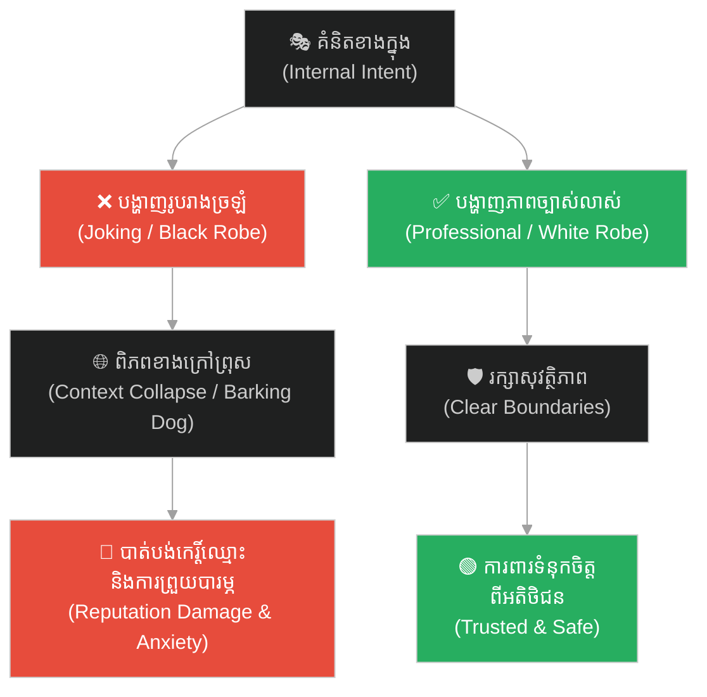
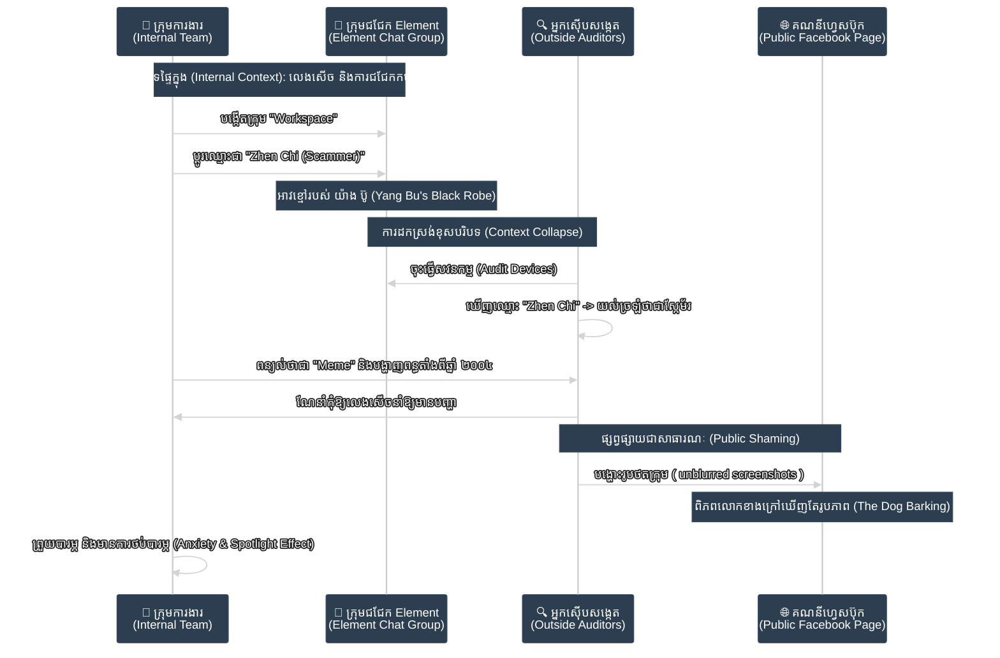
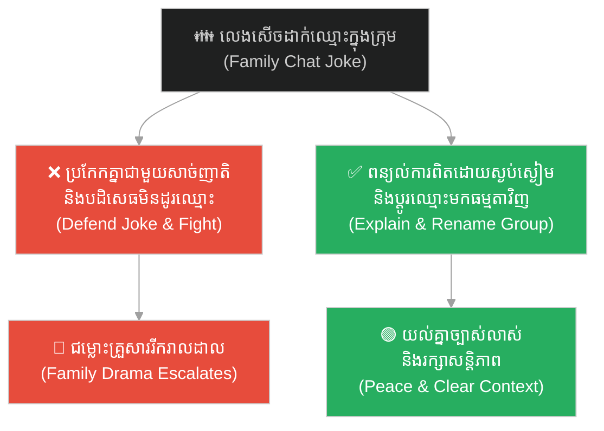
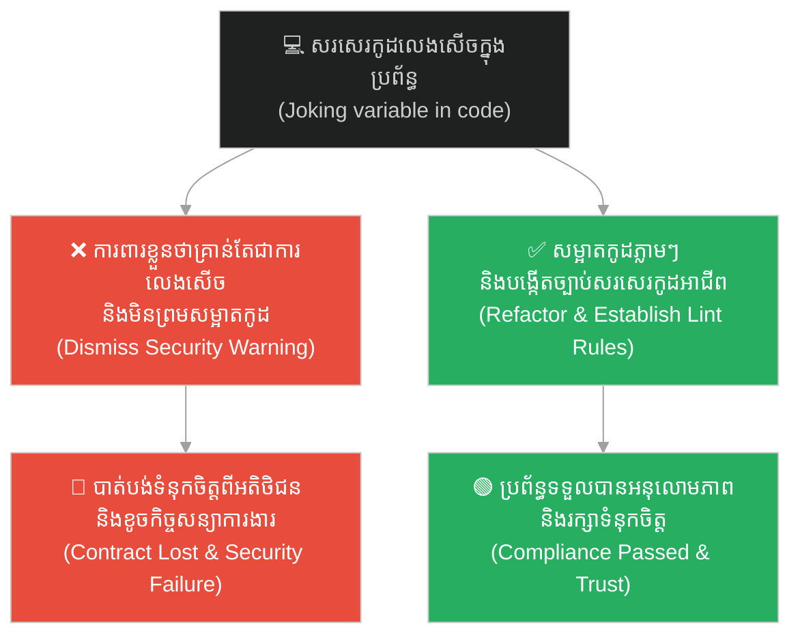
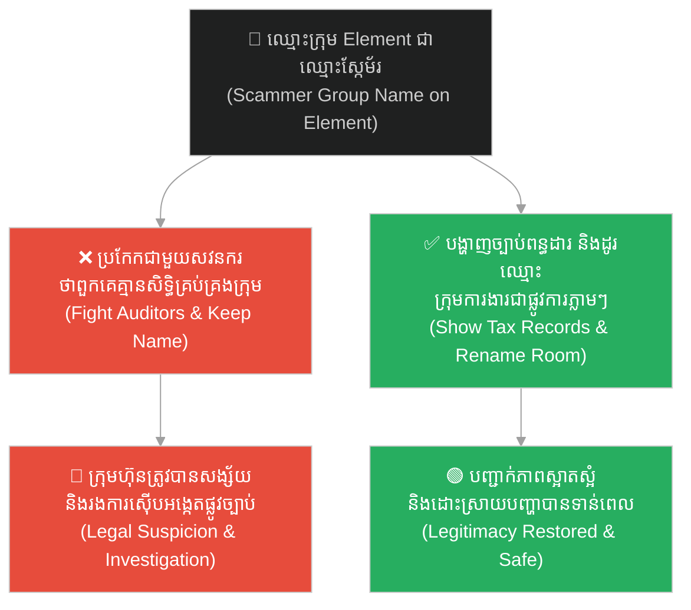
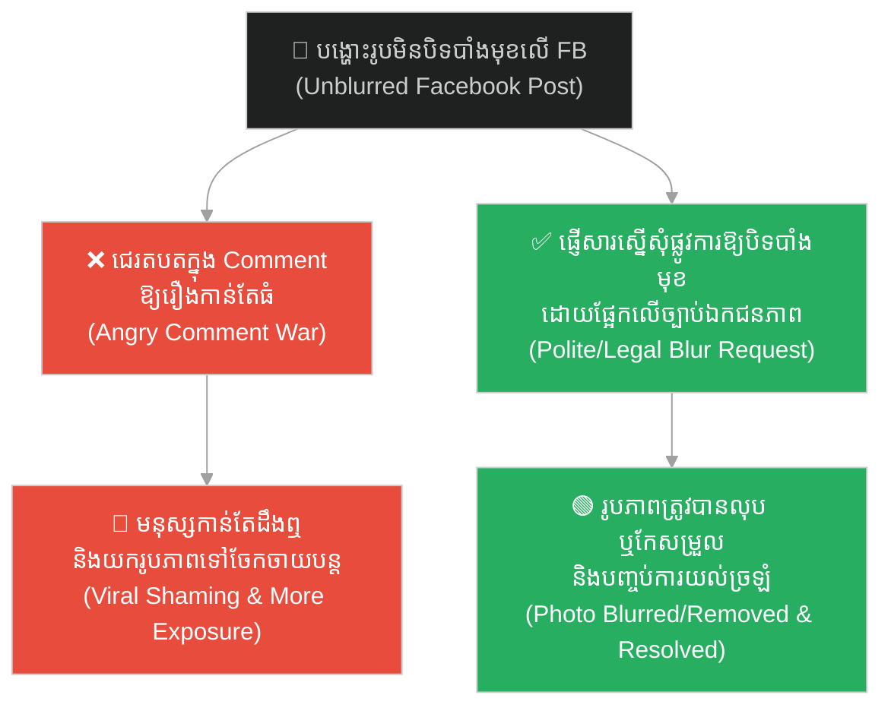
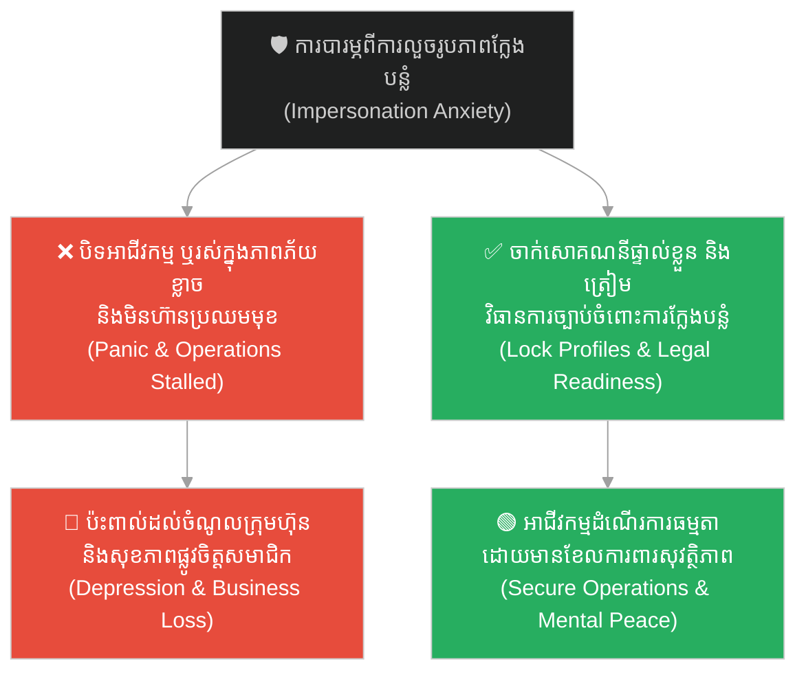
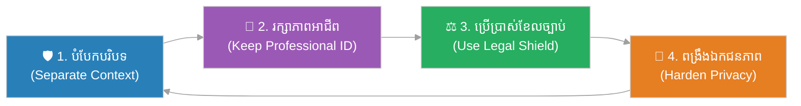

# Context Collapse and the Scammer Meme (ការដួលរលំនៃបរិបទ និង Meme ស្កែម័រ)៖ ហានិភ័យកេរ្តិ៍ឈ្មោះពីការផ្លាស់ប្តូររូបរាងខាងក្រៅ និងការយល់ច្រឡំពីសង្គម (Reputational Risks of Outer Appearance and Context Collapse)

**Author:** ichamrong  
**Date:** 2026-06-09  
**Tags:** #context-collapse #spotlight-effect #reputation-management #privacy-security #visual-communication #critical-thinking #parable  
**Category:** Concepts / Parables  
**Read Time:** ~10 min  

---

> **« កាល យ៉ាង ប៊ូ ស្លៀកពាក់សចេញទៅក្រៅ រួចផ្លាស់ជាអាវខ្មៅត្រឡប់មកវិញ**
> **ឆ្កែរបស់គេក៏ព្រុសដាក់ព្រោះមិនស្គាល់ម្ចាស់។**
> **យ៉ាង ជូ បានដាស់តឿនថា៖ "កុំវាយវាអី! បើវាចេញទៅសហើយត្រឡប់មកខ្មៅវិញ តើអ្នកមិនប្លែកភ្នែកទេឬ?" »**
>
> *"When Yang Bu went out in white clothes and returned in black,*
> *His own dog barked at him because it did not recognize him.*
> *Yang Zhu advised: 'Do not beat it! If your dog went out white and returned black, wouldn't you find it strange too?'"*

---

## 📌 មាតិកា (Table of Contents)
- [អន្ទាក់ផ្លូវចិត្ត (The Trap)](#0)
- [១. រឿងព្រេងប្រវត្តិសាស្ត្រចិន៖ យ៉ាង ប៊ូ និងឆ្កែយាមទ្វារ (The Historic Legend: Yang Bu and the Guard Dog)](#1)
  - [ការយល់ច្រឡំដោយសារសម្លៀកបំពាក់ (The Misunderstanding of Clothes)](#1-1)
- [២. បញ្ហា៖ ការដួលរលំនៃបរិបទ និងឥទ្ធិពលចាំងចង្កៀង (The Issue: Context Collapse and the Spotlight Effect)](#2)
- [៣. ឧទាហរណ៍ជាក់ស្តែងក្នុងពិភពពិត (Real World Examples)](#3)
  - [ឧទាហរណ៍ទី ១ — កម្រិតស្រាល (ទំនាក់ទំនង)៖ ការលេងសើចក្នុងក្រុមគ្រួសារដែលត្រូវគេយល់ច្រឡំ (The Family: Misinterpreted Group Jokes)](#3-1)
  - [ឧទាហរណ៍ទី ២ — កម្រិតមធ្យម (បច្ចេកទេស)៖ ការប្រើប្រាស់ឈ្មោះលេងសើចក្នុងប្រព័ន្ធការងារ (The Dev: Joke Credentials in Production)](#3-2)
  - [ឧទាហរណ៍ទី ៣ — កម្រិតមធ្យម (ធុរកិច្ច)៖ រហស្សនាមកំប្លែងរបស់ក្រុមការងារ និងការចុះស៊ើបអង្កេត (The Business: The Scammer Meme in Internal Workspaces)](#3-3)
  - [ឧទាហរណ៍ទី ៤ — កម្រិតមធ្យម (សង្គម/គ្រប់គ្រង)៖ ការផ្សព្វផ្សាយជាសាធារណៈដោយខ្វះការយល់យោគ (The Management: Public Shaming Without Verification)](#3-4)
  - [ឧទាហរណ៍ទី ៥ — កម្រិតធ្ងន់ (សន្តិសុខ/ឯកជនភាព)៖ ហានិភ័យនៃការលួចយករូបភាពទៅប្រើប្រាស់ក្នុងផ្លូវខុស (The Security: Defamation and Impersonation Risk)](#3-5)
- [៤. ដំណោះស្រាយទូទៅ៖ ការពារបរិបទ និងគ្រប់គ្រងរូបភាពខាងក្រៅ (The General Solution: Protecting Context and Managing Outer Appearances)](#4)
- [សេចក្តីសន្និដ្ឋាន (Conclusion)](#5)
- [ឯកសារយោង (References)](#6)
- [Related Posts](#7)

---

## អន្ទាក់ផ្លូវចិត្ត (The Trap)

តើអ្នកធ្លាប់គិតថា «ទង្វើលេងសើចបន្តិចបន្តួចរបស់យើង មិនមែនជាបញ្ហាធំដុំទេ ព្រោះយើងមិនមានចេតនាអាក្រក់ ហើយការពិតយើងជាមនុស្សត្រឹមត្រូវ» ដែរឬទេ? នៅក្នុងពិភពលោកទំនើបដែលមានការតភ្ជាប់គ្នាយ៉ាងឆាប់រហ័ស ព័ត៌មាន និងរូបភាពដែលយើងបង្កើតឡើងក្នុងបរិបទឯកជន ឬការលេងសើចផ្ទៃក្នុង អាចត្រូវបានគេបកស្រាយខុសទាំងស្រុងនៅពេលវាធ្លាក់ទៅក្នុងដៃមនុស្សខាងក្រៅ។

Have you ever thought: "A small joke we made isn't a big deal, because we have no bad intentions and in reality, we are honest people"? In our highly connected modern world, information and images created within a private context or as an internal joke can be completely misinterpreted when exposed to the outside world.

នេះជា **អន្ទាក់នៃការដួលរលំនៃបរិបទ (Context Collapse Trap)**៖ នៅពេលដែលរូបភាព ឬអត្តសញ្ញាណដែលយើងបង្កើតឡើងសម្រាប់ការសប្បាយផ្ទៃក្នុង (អាវខ្មៅរបស់ យ៉ាង ប៊ូ) ត្រូវបានមើលឃើញដោយអ្នកខាងក្រៅដែលគ្មានព័ត៌មានពិត (ឆ្កែព្រុសដាក់) វានឹងបង្កើតឱ្យមានការយល់ច្រឡំ និងការប៉ះពាល់ដល់កេរ្តិ៍ឈ្មោះដោយជៀសមិនរួច ទោះបីជាយើងមិនមានកំហុសពិតប្រាកដក៏ដោយ។

This is the **Context Collapse Trap**: when an image or identity created for internal amusement (Yang Bu's black robe) is observed by outsiders who lack verified information (the barking dog), it inevitably causes misunderstandings and reputational damage, regardless of our actual innocence.

---

## ១. រឿងព្រេងប្រវត្តិសាស្ត្រចិន៖ យ៉ាង ប៊ូ និងឆ្កែយាមទ្វារ (The Historic Legend: Yang Bu and the Guard Dog)

នៅក្នុងសៀវភៅទស្សនវិជ្ជាបុរាណរបស់ចិន «លីត្សឺ» (Liezi - 列子) មាននិទានខ្លីមួយអំពីយុវជនម្នាក់ឈ្មោះ យ៉ាង ប៊ូ (Yang Bu) ដែលត្រូវជាប្អូនប្រុសរបស់ទស្សនវិទូដ៏ល្បីល្បាញ យ៉ាង ជូ (Yang Zhu)។ ថ្ងៃមួយ យ៉ាង ប៊ូ បានរៀបចំខ្លួនស្លៀកពាក់អាវធំពណ៌សដ៏ស្អាតស្អំ ដើម្បីធ្វើដំណើរទៅបំពេញការងារនៅខាងក្រៅផ្ទះ។

In the ancient Chinese philosophical text *Liezi*, there is a short parable about a young man named Yang Bu, the younger brother of the famous philosopher Yang Zhu. One day, Yang Bu dressed in a pristine white robe and went out to attend to some affairs.

ខណៈពេលដែលគាត់កំពុងធ្វើដំណើរ ស្រាប់តែមេឃប្រែជាខ្មៅងងឹត ហើយមានភ្លៀងធ្លាក់យ៉ាងខ្លាំង។ ដោយគ្មានកន្លែងជ្រកទឹកភ្លៀង អាវធំពណ៌សរបស់ យ៉ាង ប៊ូ ត្រូវបានទទឹកជោកជាំ និងប្រឡាក់ដោយភក់ដីពណ៌ខ្មៅកខ្វក់មើលមិនយល់ឡើយ។ ដើម្បីឱ្យខ្លួនប្រាណមានភាពកក់ក្តៅ និងស្ងួតល្អ យ៉ាង ប៊ូ បានសម្រេចចិត្តដោះអាវសដែលសើមនោះចេញ រួចផ្លាស់ប្តូរទៅស្លៀកពាក់អាវធំពណ៌ខ្មៅមួយដែលគាត់បានខ្ចីពីគេជាបណ្តោះអាសន្ន រួចក៏បន្តធ្វើដំណើរត្រឡប់មកផ្ទះវិញ។

While he was traveling, the sky turned dark and a heavy rainstorm broke out. With no shelter nearby, Yang Bu's clean white robe was soaked through and covered in black, dirty mud. To stay warm and dry, Yang Bu decided to take off his wet white robe and changed into a clean black robe he borrowed from a friend, and then continued his journey back home.

### ការយល់ច្រឡំដោយសារសម្លៀកបំពាក់ (The Misunderstanding of Clothes)

នៅពេលដែល យ៉ាង ប៊ូ ដើរមកដល់មុខទ្វាររបងផ្ទះរបស់ខ្លួន ឆ្កែរបស់គាត់ដែលធ្លាប់តែស្គាល់ម្ចាស់យ៉ាងច្បាស់ មិនបានចំណាំសម្លៀកបំពាក់ពណ៌ខ្មៅនោះឡើយ។ វាឃើញមនុស្សចម្លែកស្លៀកពាក់អាវខ្មៅដើរចូលមកក្នុងផ្ទះ វាក៏បានស្ទុះរត់ចេញមកព្រុសដាក់ យ៉ាង ប៊ូ យ៉ាងខ្លាំងក្លា និងបម្រុងនឹងខាំគាត់ថែមទៀតផង។

When Yang Bu arrived back at his own house gate, his guard dog, which normally knew him very well, did not recognize him in the black robe. Seeing a figure in a black robe entering the property, the dog rushed out, barking furiously and threatening to bite Yang Bu.

យ៉ាង ប៊ូ មានការខឹងសម្បារ និងអាក់អន់ចិត្តយ៉ាងខ្លាំង ដែលឆ្កែដែលខ្លួនធ្លាប់ផ្តល់អាហារ និងចិញ្ចឹមរាល់ថ្ងៃ បែរជាមិនស្គាល់ម្ចាស់ទៅវិញ។ គាត់បានដើរទៅរើសដំបងឈើមួយយ៉ាងធំ ដើម្បីវាយប្រដៅ និងកាត់ទោសឆ្កែនោះចំពោះភាពល្ងង់ខ្លៅរបស់វា។

Yang Bu was enraged and offended that the dog he fed and raised every day failed to recognize him. He walked over to pick up a large wooden stick, intending to beat and punish the dog for its apparent ignorance.

នៅពេលនោះ បងប្រុសរបស់គាត់គឺលោក យ៉ាង ជូ បានឃើញហេតុការណ៍នោះពីចម្ងាយ ក៏បានដើរមកឃាត់ដៃ យ៉ាង ប៊ូ រួចពោលពាក្យដាស់តឿនថា៖
> **« កុំវាយវាអី! អ្នកឯងក៏នឹងធ្វើដូចជាវាដែរ ប្រសិនបើស្ថិតក្នុងស្ថានភាពបែបនេះ។ សាកគិតមើល ប្រសិនបើឆ្កែរបស់អ្នកចេញទៅក្រៅមានរោមពណ៌សស្អាត ស្រាប់តែពេលត្រឡប់មកវិញ វាមានរោមពណ៌ខ្មៅកខ្វក់ទាំងស្រុង តើអ្នកមិនប្លែកភ្នែក មិនសង្ស័យ និងមិនព្រុសដេញវាចេញពីផ្ទះទេឬ? »**

Seeing this from a distance, his older brother Yang Zhu stopped Yang Bu and advised:
> *"Do not beat it! You would have reacted the exact same way. Think about it: if your dog went out with clean white fur, and suddenly returned looking completely black, wouldn't you find it strange, get suspicious, and bark to drive it away?"*

យ៉ាង ប៊ូ ឮហើយក៏ទម្លាក់ដំបងចុះ ដោយដឹងខ្លួនថា ឆ្កែមិនបានខុសឡើយ គឺវាគ្រាន់តែប្រតិកម្មទៅតាមអ្វីដែលវាឃើញពីខាងក្រៅប៉ុណ្ណោះ។

Yang Bu heard this, dropped the stick, and realized that the dog was not at fault; it was simply reacting to what it saw on the surface.

---

## ២. បញ្ហា៖ ការដួលរលំនៃបរិបទ និងឥទ្ធិពលចាំងចង្កៀង (The Issue: Context Collapse and the Spotlight Effect)

រឿងព្រេងរបស់ យ៉ាង ប៊ូ និងឆ្កែរបស់គាត់ បង្ហាញយ៉ាងច្បាស់ពីបាតុភូតពីរដែលមានឥទ្ធិពលខ្លាំងក្នុងទំនាក់ទំនងសង្គម និងការគ្រប់គ្រងព័ត៌មានឌីជីថល៖

The story of Yang Bu and his dog illustrates two powerful phenomena in modern communication and digital information management:

1. **ការដួលរលំនៃបរិបទ (Context Collapse)៖**
   * **ស្ថានភាព៖** កើតឡើងនៅពេលដែលព័ត៌មាន ឬសកម្មភាពដែលត្រូវបានរចនាឡើងសម្រាប់ទស្សនិកជនជាក់លាក់មួយ (ដូចជា ក្រុមការងារផ្ទៃក្នុង មិត្តភក្តិជិតស្និទ្ធ ឬការលេងសើចតាម Meme) ត្រូវបានលេចធ្លាយ ឬត្រូវបានមើលឃើញដោយទស្សនិកជនផ្សេងទៀតដែលគ្មានបរិបទនោះ។
   * **លទ្ធផល៖** អ្នកខាងក្រៅ (ដូចជា សវនករ សន្តិសុខ ឬទស្សនិកជនហ្វេសប៊ុក) មិនមាន «បរិបទខាងក្នុង» ឡើយ។ ពួកគេមើលឃើញតែ «អាវខ្មៅ» (ដូចជា ឈ្មោះក្រុមជាឈ្មោះស្កែម័រ ឬរូបភាពចម្លែកៗ) ហើយធ្វើការវិនិច្ឆ័យភ្លាមៗទៅតាមអ្វីដែលពួកគេឃើញ ដោយគ្មានការយោគយល់ ឬដឹងពីប្រវត្តិពិតឡើយ។
   * *Context Collapse occurs when information meant for a specific audience (internal team, close friends) spills over to another audience. Outsiders judge based purely on surface appearance, lacking the historical context.*

2. **ឥទ្ធិពលចាំងចង្កៀង (The Spotlight Effect)៖**
   * **ស្ថានភាព៖** ជាទំនោរចិត្តសាស្ត្រដែលបុគ្គលម្នាក់ៗគិតថា អ្នកដទៃកំពុងយកចិត្តទុកដាក់ សង្កេតមើល និងវិនិច្ឆ័យរាល់ទង្វើ ឬកំហុសរបស់ខ្លួនគ្រប់ពេល។
   * **លទ្ធផល៖** នៅពេលដែលទំព័រហ្វេសប៊ុកបង្ហោះរូបថតដែលមិនបានបិទបាំងមុខរបស់ក្រុមការងារ យើងមានអារម្មណ៍ថា «មនុស្សគ្រប់គ្នាកំពុងមើលមកយើង និងគិតថាយើងជាមនុស្សអាក្រក់»។ ប៉ុន្តែការពិត ពិភពលោកខាងក្រៅមិនបានចាប់អារម្មណ៍ខ្លាំងដូចអ្វីដែលយើងបារម្ភឡើយ។ រូបភាពនោះនឹងអណ្តែតបាត់ទៅក្នុងលំហរអ៊ីនធឺណិតក្នុងរយៈពេលដ៏ខ្លី។
   * *The Spotlight Effect is the psychological tendency to overestimate how much others notice and judge us. In reality, public attention is short-lived, and a social media post is quickly forgotten by the public.*

3. **ការគិតថាយើងមានតម្លាភាព (The Illusion of Transparency)៖**
   * **ស្ថានភាព៖** យើងតែងតែគិតថា ចេតនា និងការពិតខាងក្នុងរបស់យើងគឺមានតម្លាភាព ដែលអ្នកដទៃអាចមើលឃើញ និងយល់បានដោយងាយ។
   * **លទ្ធផល៖** យ៉ាង ប៊ូ គិតថា «ខ្ញុំនៅតែជាម្ចាស់ដដែល ទោះបីពាក់អាវខ្មៅក៏ដោយ»។ ក្រុមការងារគិតថា «ពួកយើងជាក្រុមហ៊ុនស្របច្បាប់តាំងពីឆ្នាំ ២០០៤ បង់ពន្ធត្រឹមត្រូវ ដូច្នេះការផ្លាស់ប្តូរឈ្មោះក្រុមលេងៗមិនមែនជាបញ្ហាធំឡើយ»។ នេះជាការរំពឹងទុកខុសពីការពិត ព្រោះពិភពខាងក្រៅវិនិច្ឆ័យយើងដោយផ្អែកលើ «សម្លៀកបំពាក់» ដែលយើងពាក់ មិនមែនផ្អែកលើ «ចិត្ត» របស់យើងឡើយ។
   * *The Illusion of Transparency is the belief that our internal states and true nature are obvious to others. In reality, the world judges us by our covers, not by our silent compliance.*

---

## ៣. ឧទាហរណ៍ជាក់ស្តែងក្នុងពិភពពិត (Real World Examples)

---

### ឧទាហរណ៍ទី ១ — កម្រិតស្រាល (ទំនាក់ទំនង)៖ ការលេងសើចក្នុងក្រុមគ្រួសារដែលត្រូវគេយល់ច្រឡំ (The Family: Misinterpreted Group Jokes)

**ស្ថានភាព៖** នៅក្នុងក្រុមគ្រួសារមួយ សមាជិកម្នាក់បានប្តូររហស្សនាម (Nickname) របស់ប្អូនប្រុសខ្លួនជា «មេលួចលុយម៉ាក់» គ្រាន់តែដើម្បីសើចសប្បាយផ្ទៃក្នុង ព្រោះប្អូនប្រុសចូលចិត្តសុំលុយម៉ាក់ទិញនំ។
**សកម្មភាពបែបលំអៀង (Bias Action)៖** សមាជិកម្នាក់ទៀតបានថតអេក្រង់ (Screenshot) ផ្ញើទៅឱ្យសាច់ញាតិខាងក្រៅមើល ធ្វើឱ្យសាច់ញាតិទាំងនោះយល់ច្រឡំថា ប្អូនប្រុសនោះជាចោរលួចលុយពិតប្រាកដ និងចាប់ផ្តើមនិយាយអាក្រក់ពីគេ។
**ដំណោះស្រាយ High EQ៖** ឈប់ខឹងសាច់ញាតិ (មិនវាយឆ្កែ) តែត្រូវពន្យល់ពួកគេដោយស្ងប់ស្ងៀម រួចផ្លាស់ប្តូរឈ្មោះនោះត្រឡប់មកធម្មតាវិញ និងពង្រឹងឯកជនភាពក្រុម។

---

### ឧទាហរណ៍ទី ២ — កម្រិតមធ្យម (បច្ចេកទេស)៖ ការប្រើប្រាស់ឈ្មោះលេងសើចក្នុងប្រព័ន្ធការងារ (The Dev: Joke Credentials in Production)

**ស្ថានភាព៖** វិស្វករកម្មវិធីកុំព្យូទ័រ (Software Engineer) ម្នាក់បានប្រើប្រាស់ពាក្យលេងសើចដូចជា `dummy_scammer` ឬ `hacked_test` នៅក្នុងឈ្មោះអថេរ (Variable Names) ឬព័ត៌មានសម្ងាត់សាកល្បង (Test Credentials) នៅក្នុងកូដប្រភព (Source Code) ក្នុងអំឡុងពេលសរសេរកូដសាកល្បង។
**សកម្មភាពបែបលំអៀង (Bias Action)៖** វិស្វករមិនបានសម្អាតកូដទាំងនោះមុនពេលបង្ហោះទៅកាន់ប្រព័ន្ធពិត (Production Server) ឡើយ ដោយគិតថាគ្មានអ្នកណាមកមើលកូដទាំងនេះទេ។ ក្រោយមក ប្រព័ន្ធសន្តិសុខរបស់អតិថិជន (Security Scanner) បានរកឃើញពាក្យទាំងនោះ ហើយរាយការណ៍ថាប្រព័ន្ធរងការវាយប្រហារ។
**ដំណោះស្រាយ High EQ៖** ទទួលស្គាល់កំហុសភ្លាមៗ លុប និងកែសម្រួលកូដទាំងនោះឱ្យមានលក្ខណៈអាជីព និងបង្កើតគោលការណ៍ត្រួតពិនិត្យកូដ (Code Review Policy) ដើម្បីការពារកុំឱ្យមានការប្រើប្រាស់ពាក្យមិនសមរម្យក្នុងគម្រោងការងារ។

---

### ឧទាហរណ៍ទី ៣ — កម្រិតមធ្យម (ធុរកិច្ច)៖ រហស្សនាមកំប្លែងរបស់ក្រុមការងារ និងការចុះស៊ើបអង្កេត (The Business: The Scammer Meme in Internal Workspaces)

**ស្ថានភាព៖** ក្រុមការងាររបស់ក្រុមហ៊ុនមួយដែលដំណើរការតាំងពីឆ្នាំ ២០០៤ និងបង់ពន្ធស្របច្បាប់ បានប្តូរឈ្មោះក្រុមជជែកផ្ទៃក្នុងនៅលើ Element ទៅជាឈ្មោះស្កែម័រល្បីម្នាក់ (Zhen Chi) គ្រាន់តែដើម្បីជាការលេងសើច និងដេញតាមព្រឹត្តិការណ៍ក្តៅៗនៅក្នុងសង្គម។
**សកម្មភាពបែបលំអៀង (Bias Action)៖** ក្នុងអំឡុងពេលចុះធ្វើសវនកម្ម ឬពិនិត្យឧបករណ៍ការងារ (Device Audit) សវនករ ឬក្រុមការងារខាងក្រៅបានឃើញឈ្មោះក្រុមនេះ ហើយបានយល់ច្រឡំថា ក្រុមការងារមានការពាក់ព័ន្ធនឹងសកម្មភាពឆបោកពិតប្រាកដ ដោយសារពួកគេមិនដឹងពីបរិបទលេងសើចរបស់ក្រុមឡើយ។
**ដំណោះស្រាយ High EQ៖** ពន្យល់ការពិត បង្ហាញឯកសារចុះបញ្ជីក្រុមហ៊ុន និងភស្តុតាងបង់ពន្ធតាំងពីឆ្នាំ ២០០៤ ដើម្បីជាខែលការពារ និងផ្លាស់ប្តូរឈ្មោះក្រុមមកជាឈ្មោះអាជីពវិញភ្លាមៗ ដើម្បីបញ្ចៀសការយល់ច្រឡំបន្ថែម។

---

### ឧទាហរណ៍ទី ៤ — កម្រិតមធ្យម (សង្គម/គ្រប់គ្រង)៖ ការផ្សព្វផ្សាយជាសាធារណៈដោយខ្វះការយល់យោគ (The Management: Public Shaming Without Verification)

**ស្ថានភាព៖** គណនី ឬទំព័រហ្វេសប៊ុកខាងក្រៅបានយកថតអេក្រង់ក្រុមការងារដែលមានឈ្មោះ Meme ស្កែម័រ ទៅបង្ហោះជាសាធារណៈដោយមិនបានបិទបាំង (Blur) មុខមាត់សមាជិក ឬអតិថិជនឡើយ ទោះបីជាការពិតសារចុងក្រោយបញ្ជាក់ថា «វាមិនមែនជាការបោកប្រាស់ឡើយ»។
**សកម្មភាពបែបលំអៀង (Bias Action)៖** សមាជិកក្រុមមានអារម្មណ៍ខឹងសម្បារ និងភ័យខ្លាចយ៉ាងខ្លាំង គិតចង់ចូលទៅតតាំង ឬជេរប្រមាថតបតនៅក្នុងប្រអប់មតិ (Comment Section) វិញ ដែលការណ៍នេះកាន់តែធ្វើឱ្យមនុស្សចាប់អារម្មណ៍កាន់តែច្រើន (Spotlight Effect)។
**ដំណោះស្រាយ High EQ៖** ទាក់ទងទៅកាន់អ្នកគ្រប់គ្រងទំព័រហ្វេសប៊ុកនោះដោយសន្តិវិធី និងផ្លូវការ បង្ហាញពីភាពស្របច្បាប់របស់ក្រុមហ៊ុន និងស្នើសុំឱ្យពួកគេបិទបាំងមុខមាត់ ឬលុបរូបភាពនោះចេញ ដោយយោងទៅលើច្បាប់ការពារឯកជនភាព និងផលប៉ះពាល់ដល់អតិថិជន។

---

### ឧទាហរណ៍ទី ៥ — កម្រិតធ្ងន់ (សន្តិសុខ/ឯកជនភាព)៖ ហានិភ័យនៃការលួចយករូបភាពទៅប្រើប្រាស់ក្នុងផ្លូវខុស (The Security: Defamation and Impersonation Risk)

**ស្ថានភាព៖** សមាជិកក្រុមការងារមានការព្រួយបារម្ភថា ប្រសិនបើជនអនាមិក ឬ «Haters» យករូបភាពដែលមិនទាន់បិទបាំងមុខទាំងនោះ ទៅបង្កើតគណនីក្លែងក្លាយ (Fake Profile) ដើម្បីដើរបោកប្រាស់អ្នកដទៃ ឬដើម្បីបង្ខូចកេរ្តិ៍ឈ្មោះក្រុមហ៊ុន។
**សកម្មភាពបែបលំអៀង (Bias Action)៖** ការរស់នៅក្នុងភាពភ័យខ្លាច មិនហ៊ានធ្វើការងារ មិនហ៊ានជួបអតិថិជន ឬការបិទអាជីវកម្មចោលដោយសារតែការថប់បារម្ភនឹងហានិភ័យដែលមិនទាន់កើតឡើង។
**ដំណោះស្រាយ High EQ៖** ពង្រឹងប្រព័ន្ធសុវត្ថិភាពគណនីផ្ទាល់ខ្លួន (Lock Facebook Profiles, Enable 2FA) ធ្វើការតាមដានឈ្មោះក្រុមហ៊ុន និងបុគ្គលិកនៅលើបណ្តាញសង្គមជាប្រចាំ រួចត្រៀមសេចក្តីថ្លែងការណ៍ផ្លូវការ ឬភស្តុតាងច្បាប់ដើម្បីចាត់វិធានការភ្លាមៗ ប្រសិនបើមានករណីក្លែងបន្លំកើតឡើងពិតមែន។

---

## ៤. ដំណោះស្រាយទូទៅ៖ ការពារបរិបទ និងគ្រប់គ្រងរូបភាពខាងក្រៅ (The General Solution: Protecting Context and Managing Outer Appearances)

ដើម្បីការពារកុំឱ្យធ្លាក់ចូលទៅក្នុងអន្ទាក់ «ការដកស្រង់ខុសបរិបទ» និងកាត់បន្ថយការថប់បារម្ភពីពិភពខាងក្រៅ ចូរអនុវត្តតាមក្របខ័ណ្ឌ ៤ ជំហានខាងក្រោម៖

To shield your business and team from context collapse and eliminate reputational anxiety, implement this 4-step security framework:

1. **បំបែកបរិបទឱ្យបានច្បាស់លាស់ (Separate Contexts Rigidly)៖**
   * កុំលាយឡំគ្នារវាងកន្លែងការងារផ្លូវការ (Professional Workspace) និងកន្លែងលេងសើចផ្ទាល់ខ្លួន។ ក្រុមជជែកដែលទាក់ទងនឹងការងារ អតិថិជន ឬគម្រោងក្រុមហ៊ុន ត្រូវរក្សាឈ្មោះ និងខ្លឹមសារផ្លូវការជានិច្ច។ រាល់ការលេងសើច ឬ Meme ត្រូវធ្វើឡើងនៅក្នុងបណ្តាញជជែកផ្ទាល់ខ្លួនដែលគ្មានទំនាក់ទំនងនឹងក្រុមហ៊ុន។
   * *Keep business communication channels strictly formal. Save casual humor for private personal channels.*

2. **កុំប្រើប្រាស់រូបរាងខាងក្រៅដែលបង្កការសង្ស័យ (Avoid Suspicious Outer Identity)៖**
   * សូម្បីតែជាការលេងសើច ក៏មិនត្រូវប្រើប្រាស់ឈ្មោះ រូបភាព ឬគណនីដែលតំណាងឱ្យជនល្មើស ស្កែម័រ ឬសកម្មភាពខុសច្បាប់ឡើយ។ នៅក្នុងភ្នែករបស់អ្នកដទៃដែលគ្មានព័ត៌មានខាងក្នុង រូបរាងខាងក្រៅដែលពួកគេឃើញដំបូង គឺជាការពិតតែមួយគត់ដែលពួកគេនឹងវាស់វែង។
   * *Never adopt names or avatars of scammers or illicit elements, even as a joke. Outsiders lack internal contexts and judge by appearances.*

3. **ចាត់វិធានការដោយស្ងប់ស្ងៀម និងប្រើប្រាស់ខែលច្បាប់ (Act with Calmness and Use Legal Shields)៖**
   * នៅពេលមានការយល់ច្រឡំកើតឡើង កុំប្រតិកម្មដោយអារម្មណ៍ឆេវឆាវ ឬកំហឹង (កុំវាយឆ្កែ)។ ត្រូវបង្ហាញភស្តុតាងច្បាប់ (លិខិតចុះបញ្ជី តម្រូវការបង់ពន្ធតាំងពីឆ្នាំ ២០០៤) ដើម្បីបញ្ជាក់ភាពស្អាតស្អំ។ ប្រសិនបើមានការរំលោភឯកជនភាព ចូរទាក់ទងស្នើសុំឱ្យបិទបាំងរូបថតដោយប្រើប្រាស់ភាសាផ្លូវការ និងច្បាប់ការងារ។
   * *Do not react with emotion. Use your legal history and tax compliance as a shield. Request photo redactions politely but firmly based on privacy guidelines.*

4. **ពង្រឹងប្រព័ន្ធឯកជនភាព និងចាក់សោគណនី (Harden Profile Security and Privacy Settings)៖**
   * ណែនាំសមាជិកក្រុមការងារឱ្យចាក់សោគណនីផ្ទាល់ខ្លួន (Lock Facebook Profile) កំណត់ការមើលឃើញរូបថត និងបើកមុខងារផ្ទៀងផ្ទាត់ពីរជំហាន (2FA)។ ការណ៍នេះនឹងការពារមិនឱ្យជនអនាមិកយករូបថតទៅបង្កើតគណនីក្លែងក្លាយបានឡើយ។
   * *Encourage your team to secure their social profiles, limit photo visibility to friends, and enable 2FA to prevent identity theft and impersonations.*

---

## សេចក្តីសន្និដ្ឋាន (Conclusion)

> **« យ៉ាង ប៊ូ ខឹងនឹងឆ្កែដែលមិនស្គាល់ខ្លួន ព្រោះគាត់គិតថាខ្លួនឯងនៅតែជា យ៉ាង ប៊ូ ដដែល។ ប៉ុន្តែឆ្កែមិនបានខុសឡើយ ព្រោះវាឃើញតែអាវខ្មៅថ្មីដែលវាធ្លាប់តែស្អប់។ ការរំពឹងថាអ្នកដទៃត្រូវតែមើលឃើញការពិតក្នុងចិត្តរបស់យើង ដោយយើងមិនព្រមរៀបចំរូបរាងខាងក្រៅឱ្យបានសមរម្យ គឺជាកំហុសរបស់ខ្លួនយើងផ្ទាល់។ »**
> 
> *"Yang Bu was angry at his dog because he believed he was still the same person. But the dog was not wrong; it only saw a unfamiliar black robe. Expecting the world to know your pure intentions while you dress in a thief's clothing is not the world's ignorance—it is your own negligence."*

លើកក្រោយ នៅពេលអ្នកសម្រេចចិត្តរៀបចំឈ្មោះក្រុមការងារ ប្រើប្រាស់រូបតំណាងគណនី ឬលេងសើចនឹងប្រធានបទណាមួយ — ចូរគិតដល់រឿង យ៉ាង ប៊ូ ផ្លាស់អាវសទៅជាអាវខ្មៅ។ ចូរសួរខ្លួនឯងថា៖ **«តើការលេងសើចនេះ កំពុងតែផ្លាស់ប្តូរអាវរបស់ខ្ញុំទៅជាពណ៌ខ្មៅនៅចំពោះមុខឆ្កែយាមទ្វារមែនទេ? តើខ្ញុំបានការពារបរិបទការងាររបស់ខ្ញុំត្រឹមត្រូវហើយឬនៅ?»** ការរក្សាព្រំដែនព័ត៌មានឱ្យបានច្បាស់លាស់ គឺជាគន្លឹះដើម្បីគេចផុតពីវិបត្តិ reputational damage និងការថប់បារម្ភទាំងឡាយ។

Next time you configure your workspace names, select user avatars, or engage in casual team humor—remember Yang Bu changing his white robe to black. Ask yourself: *"Is this joke changing my robe to black in front of the guard dog? Have I protected my professional context properly?"* Maintaining clear boundaries is the key to escaping reputational crises and anxiety.

---

## ឯកសារយោង (References)

* **Lie Yu-kou** — *Liezi* (列子), Chapter 8: *Shuofu* (说符 - Explaining Conjunctions), 4th century BCE. និទានដើមអំពី យ៉ាង ប៊ូ និងសម្លៀកបំពាក់ពណ៌ខ្មៅដែលធ្វើឱ្យឆ្កែយល់ច្រឡំ។
* **danah boyd** — *It's Complicated: The Social Lives of Networked Teens* (2014), explaining the concept of "Context Collapse" in social networks and digital platforms.
* **Thomas Gilovich, Victoria Husted Medvec, and Kenneth Savitsky** — *The Spotlight Effect in Social Judgment* (2000), detailing how individuals overestimate the prominence of their actions and appearance to others.
* **Daniel Kahneman** — *Thinking, Fast and Slow* (2011), discussing System 1 fast judgments based on surface appearances and the Illusion of Transparency.

---

## Related Posts

### 🧠 Psychology & Digital Security Series (ស៊េរីចិត្តសាស្ត្រ និងសន្តិសុខឌីជីថល)

* **[01 Projection Effect](./01-projection-effect.md)** — ការវិនិច្ឆ័យអ្នកដទៃតាមរយៈការគិតរបស់ខ្លួនឯង (Egocentric projection trap).
* **[70 McArthur Wheeler & the Lemon Juice](./70-mcarthur-wheeler-and-the-lemon-juice.md)** — ការវាយតម្លៃសមត្ថភាពខ្លួនឯងខ្ពស់ហួសហេតុ (Dunning-Kruger effect and self-blindness).
* **[73 The Spy and the Two-Faced Poem](./73-the-spy-and-the-two-faced-poem.md)** — ហានិភ័យនៃរូបភាពពីរជាន់ និងការលាក់បាំងព័ត៌មាន (Polyglot formats and security interpretation).
* **[258 The Blind Man Riding a Blind Horse](./258-the-blind-man-riding-a-blind-horse.md)** — គ្រោះថ្នាក់នៃការសម្រេចចិត្តដោយខ្វះព័ត៌មានពិតប្រាកដ (Double blindness and strategic risk management).

---

## Related

- [💡 Concepts README](../README.md)
- [📚 Main Repository README](../../../README.md)
- [Management & SDLC](../../management/README.md)
- [Productivity & Workflow](../../productivity/README.md)
