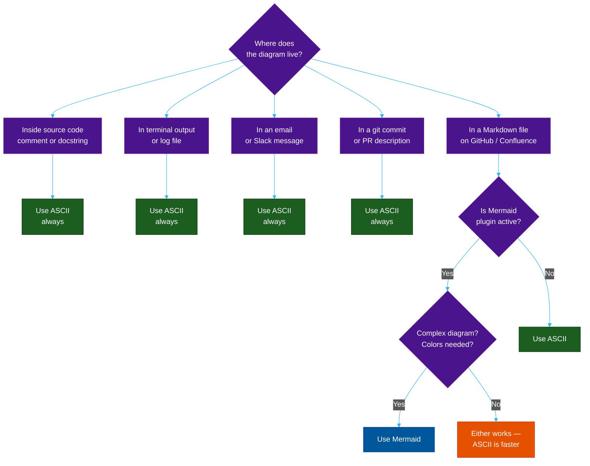

# Part 5 — ASCII Diagrams

> Mermaid requires a renderer. ASCII diagrams require only a font. They work in code comments, terminal output, emails, git commit messages, Slack, and every plain-text surface that has ever existed.

---

## When to Use ASCII vs Mermaid

The single question to ask: **will the reader see a rendered image, or raw text?**

| Context | Use | Why |
| :--- | :--- | :--- |
| Code comments (`//`, `#`, `/* */`) | **ASCII** | Mermaid never renders here |
| Inline in `README.md` (GitHub/GitLab) | **Mermaid** | Rendered automatically |
| Git commit messages | **ASCII** | Plain text only |
| Pull request descriptions (GitHub) | **Mermaid** | Rendered in UI |
| Terminal/CLI output | **ASCII** | No renderer available |
| Slack / Teams messages | **ASCII** | Mermaid not supported |
| Plain-text emails | **ASCII** | HTML may be stripped |
| Confluence / Notion | **Mermaid** | Plugin available |
| Architecture Decision Records (ADR) | **ASCII** | Survives any renderer |
| Blog posts (Markdown with Mermaid plugin) | **Mermaid** | Full color and interactivity |
| Log files, debug output | **ASCII** | Must stay readable as text |
| Onboarding docs that live near the code | **ASCII** | Opens in any editor |

**The rule of thumb:**

```
if (diagram lives inside a code file OR must survive copy-paste):
    use ASCII

if (diagram lives in a doc platform that renders Mermaid):
    use Mermaid
```

---

## ASCII vs Mermaid Decision Flowchart

```
Will the reader see RENDERED output?
│
├── NO (comment, terminal, email, commit)
│   └── Use ASCII diagram
│
└── YES (GitHub, blog, Confluence)
    │
    ├── Is it complex? (>8 nodes, colors needed, UML)
    │   └── Use Mermaid
    │
    └── Is it simple? (< 6 boxes, just showing layout)
        └── ASCII is still fine — it's faster to write
```

---

## The Two Character Sets

### Set 1 — Simple (7-bit ASCII, works everywhere)

```
Corners:    + (all corners)
Lines:      - (horizontal)   | (vertical)
Arrows:     -> <-  -->  <--  =>  <=  >>  <<
Diagonal:   /  \
Bullet:     *  o  #  .
```

Use this set in: terminal output, log files, email, anywhere encoding is uncertain.

### Set 2 — Unicode Box Drawing (UTF-8, works in modern editors)

```
Single line:
  Corners:  ┌ ┐ └ ┘
  Lines:    ─ (horizontal)   │ (vertical)
  Joints:   ├ ┤ ┬ ┴ ┼
  Arrows:   → ← ↑ ↓ ↔

Double line:
  Corners:  ╔ ╗ ╚ ╝
  Lines:    ═ (horizontal)   ║ (vertical)
  Joints:   ╠ ╣ ╦ ╩ ╬

Rounded:
  Corners:  ╭ ╮ ╰ ╯
  Lines:    ─  │

Shading:    ░ ▒ ▓ █
Arrows:     ▶ ◀ ▲ ▼
```

Use this set in: code files, README, documentation where UTF-8 encoding is guaranteed.

---

## ASCII Diagram Types

### Type 1 — Box / Component Diagram

Shows system components and their connections. The most common type in code comments.

**Simple style:**
```
+------------------+       +------------------+       +-----------------+
|   React Client   |------>|   API Gateway    |------>|  Auth Service   |
+------------------+       +------------------+       +-----------------+
                                    |
                                    v
                           +------------------+
                           |  Order Service   |
                           +------------------+
                                    |
                            +-------+-------+
                            |               |
                            v               v
                    +-------------+  +-------------+
                    |  Postgres   |  |    Redis    |
                    |  (orders)   |  |  (sessions) |
                    +-------------+  +-------------+
```

**Unicode style:**
```
╭──────────────────╮       ╭──────────────────╮       ╭─────────────────╮
│   React Client   │──────▶│   API Gateway    │──────▶│  Auth Service   │
╰──────────────────╯       ╰──────────────────╯       ╰─────────────────╯
                                      │
                                      ▼
                            ╭──────────────────╮
                            │  Order Service   │
                            ╰──────────────────╯
                                      │
                            ┌─────────┴─────────┐
                            │                   │
                            ▼                   ▼
                    ╭─────────────╮     ╭─────────────╮
                    │  Postgres   │     │    Redis    │
                    │  (orders)   │     │  (sessions) │
                    ╰─────────────╯     ╰─────────────╯
```

---

### Type 2 — Sequence / Timeline Diagram

Shows time-ordered interactions without a renderer.

```
Client          API Gateway       Auth           Database
  │                  │              │                │
  │──POST /login────▶│              │                │
  │                  │──validate──▶│                │
  │                  │             │──query user───▶│
  │                  │             │◀──user found───│
  │                  │◀──JWT token─│                │
  │◀──200 + JWT──────│              │                │
  │                  │              │                │
  │──GET /orders────▶│              │                │
  │                  │──verify JWT─▶│                │
  │                  │◀──valid──────│                │
  │                  │──────────────────query───────▶│
  │                  │◀─────────────────orders───────│
  │◀──200 + orders───│              │                │
```

**The column alignment formula:**

```
column_width   = max(actor_name_length) + 4 padding
total_width    = num_actors × column_width
message_arrow  = '─' × (column_gap - 2) + '▶'  (right)
               = '◀' + '─' × (column_gap - 2)   (left)
column_gap     = column_width of target - current x position
```

---

### Type 3 — Tree / Hierarchy Diagram

Shows parent-child relationships: file systems, org charts, call trees.

**Style 1 — pipe-and-dash:**
```
src/
├── api/
│   ├── controllers/
│   │   ├── UserController.java
│   │   └── OrderController.java
│   └── middleware/
│       ├── AuthFilter.java
│       └── RateLimiter.java
├── domain/
│   ├── User.java
│   └── Order.java
└── infrastructure/
    ├── database/
    │   └── UserRepository.java
    └── cache/
        └── SessionCache.java
```

**The tree character rules:**

```
Last child in a group:    └──
Non-last child:           ├──
Continuation line:        │
Empty continuation:         (two spaces)

Algorithm:
  for each node at depth d:
    prefix = ''
    for each ancestor from root to parent:
      if ancestor is last child: prefix += '   '   (3 spaces)
      else:                      prefix += '│  '   (pipe + 2 spaces)
    if node is last sibling:     prefix += '└── '
    else:                        prefix += '├── '
    print prefix + node_name
```

**Style 2 — call tree (for code tracing):**
```
main()
 └─▶ loadConfig()
      └─▶ readEnvFile()
           ├─▶ parseYaml()    ← returns Config
           └─▶ validate()     ← throws if invalid
 └─▶ startServer()
      ├─▶ initDatabase()      ← O(1) connection pool
      ├─▶ registerRoutes()
      │    ├─▶ GET /users
      │    └─▶ POST /orders
      └─▶ listen(:8080)
```

---

### Type 4 — State Machine / Flow Diagram

```
             ┌─────────────────────────────────────┐
             │                                     │
             ▼          payment OK                 │
[NEW] ──────▶ [PENDING] ──────────▶ [CONFIRMED]   │
                  │                      │         │
                  │ cancel               │ ship     │
                  ▼                      ▼         │
            [CANCELLED]          [SHIPPED]         │
                                     │             │
                                     │ delivered   │
                                     ▼             │
                                [DELIVERED]        │
                                     │             │
                                     │ return req  │
                                     └─────────────┘
```

---

### Type 5 — Memory / Data Structure Layout

Shows how data sits in memory. Essential for explaining arrays, heaps, and buffers.

**Array memory layout:**
```
Index:  [  0  ][  1  ][  2  ][  3  ][  4  ][  5  ]
Value:  [ 101 ][ 205 ][ 312 ][ 418 ][ 507 ][ 623 ]
Addr:   [0x00 ][0x04 ][0x08 ][0x0C ][0x10 ][0x14 ]
         ^
         base address — add (index × 4) to get element
```

**Linked list vs array:**
```
Array (contiguous):
  ┌────┬────┬────┬────┬────┐
  │ 10 │ 20 │ 30 │ 40 │ 50 │   ← all in one cache line
  └────┴────┴────┴────┴────┘
   0x10 0x14 0x18 0x1C 0x20

Linked list (scattered):
  ┌────┬──────┐     ┌────┬──────┐     ┌────┬──────┐
  │ 10 │ 0x4F │────▶│ 20 │ 0x2A │────▶│ 30 │ null │
  └────┴──────┘     └────┴──────┘     └────┴──────┘
   0x10               0x4F               0x2A
        ^─── cache miss ──────^─── cache miss ──^
```

**Min-heap as array:**
```
Tree view:            Array view:
      1               Index: [ 0 ][ 1 ][ 2 ][ 3 ][ 4 ][ 5 ][ 6 ]
    /   \             Value: [  1 ][  3 ][  2 ][  7 ][  4 ][  5 ][  6 ]
   3     2
  / \   / \           parent(i) = floor((i-1) / 2)
 7   4 5   6          left(i)   = 2i + 1
                      right(i)  = 2i + 2
```

---

### Type 6 — Algorithm Trace

Shows an algorithm executing step by step. Invaluable in code comments.

**Binary search trace:**
```
array = [10, 20, 30, 40, 50, 60, 70, 80, 90]
target = 60

Step 1:  L=0  R=8  mid=4  arr[4]=50  50 < 60  → go right
         [10, 20, 30, 40, 50, 60, 70, 80, 90]
                             ^
                            mid

Step 2:  L=5  R=8  mid=6  arr[6]=70  70 > 60  → go left
         [10, 20, 30, 40, 50, 60, 70, 80, 90]
                                     ^
                                    mid

Step 3:  L=5  R=5  mid=5  arr[5]=60  60 == 60 → FOUND at index 5
         [10, 20, 30, 40, 50, 60, 70, 80, 90]
                                 ^
                                found
```

**Sliding window trace:**
```
array  = [2, 1, 5, 1, 3, 2]   window size = 3
         ├─────┤               window 1: sum = 2+1+5 = 8
            ├─────┤            window 2: sum = 1+5+1 = 7   (+1, -2)
               ├─────┤         window 3: sum = 5+1+3 = 9   (+3, -1)
                  ├─────┤      window 4: sum = 1+3+2 = 6   (+2, -5)
                               max_sum = 9
```

---

### Type 7 — Network / Infrastructure Topology

```
                        ┌─── Internet ───┐
                        │                │
              ┌─────────┴──────┐  ┌──────┴─────────┐
              │  Load Balancer │  │  Load Balancer  │
              │   (primary)    │  │   (secondary)   │
              └────────┬───────┘  └───────┬─────────┘
                       │                  │
              ─────────┴──────────────────┴─────────
                              │
              ┌───────────────┼───────────────┐
              │               │               │
       ┌──────┴──────┐ ┌──────┴──────┐ ┌─────┴───────┐
       │  App Server │ │  App Server │ │  App Server  │
       │   Node 1    │ │   Node 2    │ │   Node 3     │
       └──────┬──────┘ └──────┬──────┘ └─────┬────────┘
              │               │               │
       ───────┴───────────────┴───────────────┴───────
                              │
                    ┌─────────┴─────────┐
                    │                   │
             ┌──────┴──────┐     ┌──────┴──────┐
             │   Postgres  │     │    Redis    │
             │   Primary   │────▶│   Cluster   │
             └──────┬──────┘     └─────────────┘
                    │
             ┌──────┴──────┐
             │   Postgres  │
             │   Replica   │
             └─────────────┘
```

---

## ASCII Sizing Formula

ASCII diagrams are grids. Every element must fit on a consistent character grid.

### Box Sizing

```
box_width  = content_width + 2 (left/right padding) + 2 (left/right border)
           = content_width + 4

box_height = content_lines + 2 (top/bottom border)

content_width = max(len(line) for line in content_lines)

Example: content = "Auth Service"  (12 chars)
  box_width  = 12 + 4 = 16
  box_height = 1 + 2  = 3

  ┌──────────────┐     ← 16 chars wide  (─ × 14 between corners)
  │ Auth Service │     ← 1 space + 12 chars + 1 space
  └──────────────┘
```

### Column Alignment Formula

For sequence diagrams and parallel columns, all boxes must be the same width:

```
uniform_box_width = max(content_width for all boxes) + 4

For actors: ["Client", "API Gateway", "Auth", "Database"]
  lengths:  [6,        10,            4,      8        ]
  max:      10
  uniform_box_width = 10 + 4 = 14

  ┌────────────┐    ┌────────────┐    ┌────────────┐    ┌────────────┐
  │   Client   │    │ API Gateway│    │    Auth    │    │  Database  │
  └────────────┘    └────────────┘    └────────────┘    └────────────┘
```

### Arrow Length Formula

```
gap = x_position(target_box_left) - x_position(source_box_right) - 1

right arrow: '─' × (gap - 1) + '▶'   or   '-' × (gap - 2) + '->'
left arrow:  '◀' + '─' × (gap - 1)   or   '<-' + '-' × (gap - 2)

Example: two 14-char boxes with 4-char gap between them
  gap = 4
  arrow = '─' × 3 + '▶'  =  '───▶'
```

---

## The ASCII Diagram Cheat Sheet

```
┌─────────────────────────────────────────────────────────────────┐
│                    ASCII DIAGRAM CHEAT SHEET                    │
├─────────────┬──────────────────────────────────────────────────┤
│  Element    │  Simple          Unicode                          │
├─────────────┼──────────────────────────────────────────────────┤
│  Box        │  +-...+          ┌─...─┐  or  ╔═...═╗           │
│             │  |   |           │     │       ║     ║           │
│             │  +-...+          └─...─┘       ╚═...═╝           │
├─────────────┼──────────────────────────────────────────────────┤
│  Arrow →    │  ->   -->        ─▶   ──▶                        │
│  Arrow ←    │  <-   <--        ◀─   ◀──                        │
│  Arrow ↓    │  |               │    ▼                          │
│  Arrow ↑    │  |               │    ▲                          │
│  Bidirect   │  <->             ◀──▶                            │
├─────────────┼──────────────────────────────────────────────────┤
│  Tree       │  +--  |          ├──  └──  │                     │
│  Last child │  `--             └──                             │
├─────────────┼──────────────────────────────────────────────────┤
│  Dashed     │  - - -           ╌╌╌  (dashed not in unicode)    │
│  Note box   │  /* text */      ╭─ text ─╮                      │
└─────────────┴──────────────────────────────────────────────────┘
```

---

## When to Choose ASCII Over Mermaid: Summary



---

## References

- **WCAG 2.1** — Web Content Accessibility Guidelines (contrast ratios)
- **Material Design 3** — Google's color system for dark themes
- **Mermaid.js Docs** — [mermaid.js.org](https://mermaid.js.org)
- **Unicode Box Drawing** — U+2500 to U+257F block
- **Feynman, R.** — *Surely You're Joking, Mr. Feynman!*
- **Tufte, E.** — *The Visual Display of Quantitative Information*

---

## Cross-References & Related Reading

- **Agile & Process:** [DoR vs DoD](../../management/02-dor-and-dod-guide.md) | [SDLC Comparison Matrix](../../management/sdlc/06-comparison-matrix.md) | [What is SDLC?](../../management/sdlc/01-what-is-sdlc.md)
- **Documentation & Flow:** [Fast Documentation](../../productivity/01-fast-documentation-workflow.md) | [MCP Guide](../02-mcp-development-guide.md)

---

**Share this post:** [Share on LinkedIn](#) | [Discuss](#)

*Last updated: 2026-05-16*

## Related

- [Career Paths](../../concepts/career-paths/README.md)
