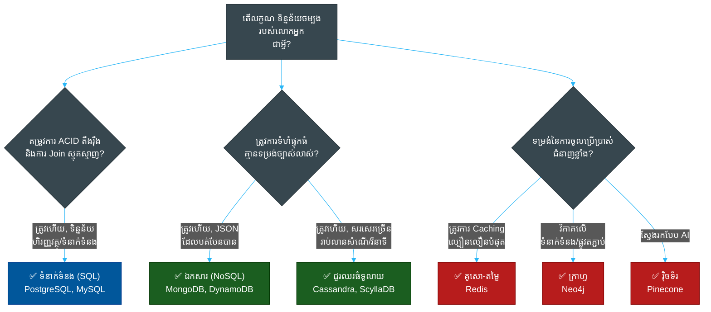

# 📊 ម៉ាទ្រីសប្រៀបធៀបមូលដ្ឋាន​ទិន្នន័យ (Database Comparison Matrix)

> **ស៊េរី (Series)៖** DevOps › Databases · **កម្រិត (Level)៖** Reference · **រយៈពេលអាន (Read Time)៖** ~១០ នាទី (~10 min)

---

## 📖 មាតិកា (Table of Contents)

- [១. ទ្រឹស្តីបទ CAP (CAP Theorem - The Core Tradeoff)](#1)
- [២. ការ​ប្រៀបធៀប​ប្រភេទ​មូលដ្ឋាន​ទិន្នន័យ (Database Type Comparison)](#2)
- [៣. ការ​ជ្រើសរើស​តាម​តម្រូវ​ការ​ការ​ងារ (Choosing by Workload Decision Guide)](#3)

---

## ១. ទ្រឹស្តីបទ CAP (CAP Theorem - The Core Tradeoff)

នៅ​ពេល​រចនាមូលដ្ឋាន​ទិន្នន័យ​ចែកចាយ (Distributed Databases) **ទ្រឹស្តីបទ CAP** ចែងថា ប្រព័ន្ធ​ផ្ទុក​ទិន្នន័យ​ចែកចាយអាចផ្តល់នូវ​ការ​ធានាត្រឹម​តែ **ពី​រ​ក្នុង​ចំណោមបី** ខាងក្រោម​នេះ​តែ​ប៉ុណ្ណោះ​ក្នុង​ពេល​តែ​មួយ៖

1. **ភាពស៊ីសង្វាក់គ្នា (Consistency - C)៖** រាល់​ការ​អាន​ទទួល​បាន​ការ​សរសេរ​ចុងក្រោយ​បង្អស់ ឬ​ទទួល​បាន​សារកំហុស។ (រាល់ node ទាំងអស់​មើលឃើញ​ទិន្នន័យ​ដូចគ្នាបេះបិទ​ក្នុង​ពេល​តែ​មួយ)។
2. **ភាពអាច​ប្រើប្រាស់​បាន (Availability - A)៖** រាល់​សំណើទទួល​បាន​ការ​ឆ្លើយតប​ដែល​មិន​មែន​ជា​សារកំហុស ដោយ​គ្មាន​ការ​ធានាថាវា​មាន​ផ្ទុកនូវ​ការ​សរសេរ​ចុងក្រោយ​បង្អស់​នោះ​ទេ។ (ប្រព័ន្ធ​នៅ​តែ​ដំណើរ​ការ​ទោះបី​ជា node ខ្លះខូចក៏​ដោយ)។
3. **ភាពធន់នឹង​ការ​បែងចែកបណ្តាញ (Partition Tolerance - P)៖** ប្រព័ន្ធ​នៅ​តែ​បន្តដំណើរ​ការ ទោះបី​ជា​មាន​សារមួយចំនួន​ត្រូវ​បាន​បាត់បង់ ឬ​យឺត​យ៉ាវ​ដោយសារ​បណ្តាញរវាង node ក៏​ដោយ។

**នៅក្នុង​ពិភពពិត ការ​បែកបាក់បណ្តាញ (Network Partition - P) គឺ​មិន​អាចជៀសវាង​បាន​ឡើយ។** ដូច្​នេះ មូលដ្ឋាន​ទិន្នន័យ​ចែកចាយ​ត្រូវតែ​ជ្រើសរើសរវាង **ភាពស៊ីសង្វាក់គ្នា (CP)** ឬ **ភាពអាច​ប្រើប្រាស់​បាន (AP)**។

- **មូលដ្ឋាន​ទិន្នន័យ CP (MongoDB, PostgreSQL)៖** ប្រសិនបើ​ការ​តភ្​ជា​ប់បណ្តាញបរាជ័យ ប្រព័ន្ធ​នឹងបញ្ឈប់​ការ​ទទួលយក​ការ​សរសេរ ដើម្បី​ការ​ពារ​កុំ​ឱ្យ​ទិន្នន័យ​មិន​ស៊ីសង្វាក់គ្នា។
- **មូលដ្ឋាន​ទិន្នន័យ AP (Cassandra, DynamoDB)៖** ប្រសិនបើ​ការ​តភ្​ជា​ប់បណ្តាញបរាជ័យ ប្រព័ន្ធ​នឹងទទួលយក​ការ​សរសេរ​លើ​ភាគីទាំងសងខាង​នៃ​ការ​បែងចែកបណ្តាញ ដែល​មាន​ន័យថា​អ្នកប្រើប្រាស់​អាច​អាន​ទិន្នន័យ​ចាស់ ប៉ុន្តែ​ប្រព័ន្ធ​មិន​ដែល​គាំង​ឡើយ (ភាពស៊ីសង្វាក់គ្នា​ចុងក្រោយ - Eventual Consistency)។

---

## ២. ការ​ប្រៀបធៀប​ប្រភេទ​មូលដ្ឋាន​ទិន្នន័យ (Database Type Comparison)

| ប្រភេទ​មូលដ្ឋាន​ទិន្នន័យ | ម៉ូ​ដែល​ទិន្នន័យ​ចម្បង | ករណី​ប្រើប្រាស់​ទូ​ទៅ | ឈានមុខគេ​ក្នុង​វិស័យ | ម៉ូ​ដែល​ពង្រីក​វិសាលភាព |
| :--- | :--- | :--- | :--- | :--- |
| **ទំនាក់ទំនង (SQL)** | តារាង (ជួរដេក និង​ជួរឈរ) | បញ្ជីគណនេយ្យហិរញ្ញវត្ថុ, ប្រព័ន្ធ ERP, ទំនាក់ទំនងតឹងរ៉ឹង។ | PostgreSQL, MySQL, Oracle | បញ្ឈរ (Scale Up) |
| **ឯកសារ (Document NoSQL)** | ឯកសារ JSON / BSON | CMS, កាតាឡុកពាណិជ្ជកម្មអេឡិចត្រូនិច, ការ​បង្កើត​គំរូ​រហ័ស។ | MongoDB, DynamoDB | ផ្ដេក (Scale Out) |
| **គូសោ-តម្លៃ (Key-Value)** | ផែនទី​ហាស (សោ = តម្លៃ) | ការ​ធ្វើ Caching, ការ​គ្រប់​គ្រង Session, តារាងពិន្ទុ (Leaderboards)។ | Redis, Memcached | ក្នុង​អង្គចងចាំ / Sharding |
| **ជួរឈរធំទូលាយ (Wide-Column)** | ក្រុមជួរឈរ (Column Families) | ទិន្នន័យ​សរសេរ​ច្រើនមហាសាល, ស៊េរី​ពេល​វេលា, ឡុក IoT។ | Cassandra, ScyllaDB | ផ្ដេក (Masterless) |
| **ក្រាហ្វ (Graph)** | Node និង Edge | ប្រព័ន្ធ​ណែនាំផលិតផល, ការ​ស្វែងរកបណ្តាញបោកប្រាស់។ | Neo4j, Amazon Neptune | បញ្ឈរ / ការ​បែងចែកក្រាហ្វ |
| **ស៊េរី​ពេល​វេលា (Time-Series)** | ត្រា​ពេល​វេលា និង​រង្វាស់ | ការ​ត្រួតពិនិត្យ​ម៉ាស៊ីនបម្រើ, តម្លៃទីផ្សារភាគហ៊ុន, ទិន្នន័យ IoT។ | InfluxDB, TimescaleDB | ការ​បញ្ចូលខ្ពស់ / Downsampling |
| **វ៉ិចទ័រ (Vector)** | ចំនួនក្បៀសវិមាត្រខ្ពស់ | Embeddings របស់ AI, RAG, ការ​ស្វែងរកអត្ថន័យ (Semantic Search)។ | Pinecone, Qdrant, Milvus | ផ្ដេក / HNSW |

---

## ៣. ការ​ជ្រើសរើស​តាម​តម្រូវ​ការ​ការ​ងារ (Choosing by Workload Decision Guide)

### អនុសាសន៍​យុទ្ធសាស្ត្រ (Strategic Recommendation)
1. **ជ្រើសរើសយក PostgreSQL ជា​លំនាំដើម៖** ប្រសិនបើលោក​អ្នក​ចាប់ផ្​តើ​ម​គម្រោង​ថ្មី ហើយ​មិន​ច្បាស់ថា​ត្រូវ​ជ្រើសរើសអ្វី ចូលជ្រើសរើសយក PostgreSQL។ មក​ទល់បច្ចុប្បន្ន PostgreSQL មាន​មុខងារគាំទ្រ JSONB (ផ្តល់ឱ្យលោក​អ្នក​នូវមុខងារ NoSQL) និង​ផ្នែកបន្ថែម Vector (`pgvector`) ដែល​ធ្វើ​ឱ្យវាក្លាយ​ជា​ឧបករណ៍ចម្រុះដ៏​ល្អ​បំផុត។
2. **បន្ថែម Redis នៅ​ពេល​ដំណើរ​ការ​យឺត៖** នៅ​ពេល​ដែល​មូលដ្ឋាន​ទិន្នន័យ SQL របស់​លោក​អ្នក​ចាប់ផ្​តើ​មដំណើរ​ការ​យឺត ចូល​កុំ​ប្តូរ​ទៅ NoSQL ឡើយ — គ្រាន់​តែ​ដាក់ Redis នៅ​ពី​មុខវា​ដើម្បី​ធ្វើ Caching លើ​សំណើ​អាន​ដែល​ធ្ងន់ ៗ ។
3. **ប្រើប្រាស់ NoSQL សម្រាប់​កម្រិត​វិសាលភាព មិន​មែន​សម្រាប់​ភាពងាយស្រួល​ឡើយ៖** ចូល​ប្រើប្រាស់​តែ MongoDB ឬ Cassandra ប៉ុណ្ណោះ ប្រសិនបើលោក​អ្នក​រំពឹងទុកថានឹង​ត្រូវ​សរសេរ​ទិន្នន័យ​ដ៏មហាសាល ដែល​អាច​ធ្វើ​ឱ្យម៉ាស៊ីនបម្រើ SQL តែ​មួយ​មិន​អាចទ្រទ្រង់​បាន។ ចូល​កុំ​ប្រើប្រាស់ NoSQL គ្រាន់​តែ​ដើម្បី​ជៀសវាង​ការ​សរសេរ Migrations ឡើយ។

## ឯកសារទាក់ទង (Related)

- [គំរូស្ថាបត្យកម្មសូហ្វវែរ (Software Architecture Patterns)](../../clean-code/software-architecture/README.md)
- [API Gateways & Reverse Proxies](../api-gateways/README.md)
- [ភាពអាចសង្កេត​បាន និង​ការ​ត្រួតពិនិត្យ (Observability & Monitoring)](../observability/README.md)
