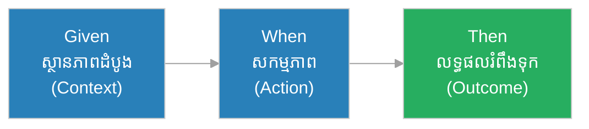
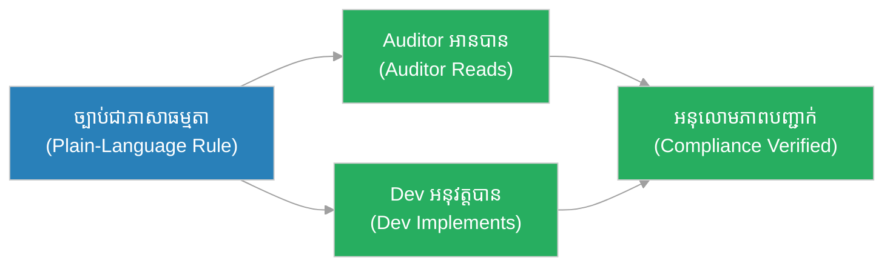
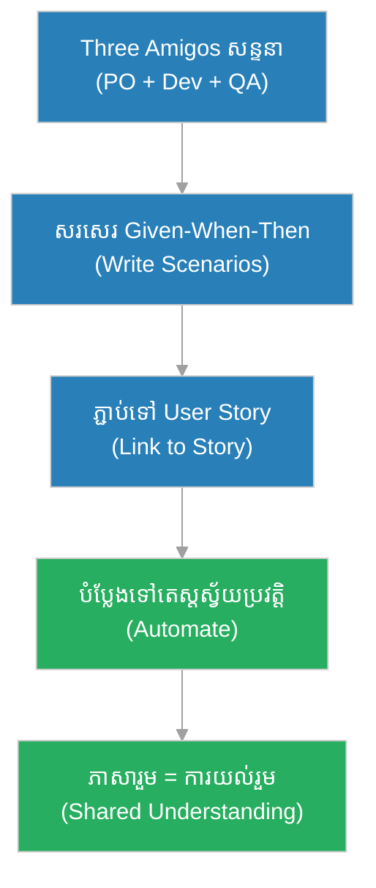

# ការ​អភិវឌ្ឍ​តាម​ឥរិយាបថ (Behavior-Driven Development - BDD)៖ ភាសារួមរវាងស្តេច និង​ស្ថាបត្យករ (The Shared Language of King & Architect)

**អ្នកនិពន្ធ (Author):** ichamrong 
**កាលបរិច្ឆេទ (Date):** 2026-05-30 
**ស្លាក (Tags):** #engineering-practices #bdd #testing #collaboration #parable 
**ប្រភេទ (Category):** Management & Leadership 
**រយៈពេលអាន (Read Time):** ~១២ នាទី (~12 min) 

---

## 📌 មាតិកា (Table of Contents)
- [អន្ទាក់​ដំណើរ​ការ (The Process Trap)](#0)
- [១. រឿងប្រៀបប្រដូច៖ ស្តេច ស្ថាបត្យករ និង​ពាក្យបញ្​ជា​ដែល​យល់ខុស (The Parable: The King, The Architect & The Misread Order)](#1)
- [២. បញ្ហា៖ តើ​អ្វី​ទៅ​ជា BDD? (The Issue: What is BDD?)](#2)
- [៣. ឧទាហរណ៍​ជាក់ស្តែង​ក្នុង​ពិភពពិត (Real World Examples)](#3)
 - [ឧទាហរណ៍​ទី ១ — កម្រិតស្រាល (គ្រួសារ)៖ កិច្ចព្រមព្រៀង​ការ​ងារផ្ទះ (The Chore Agreement)](#3-1)
 - [ឧទាហរណ៍​ទី ២ — កម្រិតមធ្យម (បច្ចេកទេស)៖ មុខងារចូលប្រើ (The Login Scenario)](#3-2)
 - [ឧទាហរណ៍​ទី ៣ — កម្រិតមធ្យម (ធុរកិច្ច)៖ ការ​ដឹកជញ្ជូនឥតគិតថ្លៃ (The Free Shipping Rule)](#3-3)
 - [ឧទាហរណ៍​ទី ៤ — កម្រិតមធ្យម (គ្រប់​គ្រង)៖ ការ​ផ្សះផ្សារវិវាទ PO និង Dev (Resolving the PO-Dev Dispute)](#3-4)
 - [ឧទាហរណ៍​ទី ៥ — កម្រិតធ្ងន់ (ប្រព័ន្ធ​សំខាន់)៖ ច្បាប់អនុលោមភាពធនាគារ (Banking Compliance Rules)](#3-5)
- [៤. ការ​សន្ទនាបែបសាកសួរ (Socratic Dialogue)](#4)
- [៥. ដំណោះស្រាយ៖ Given-When-Then ជា​ភាសារួម (The Solution: Given-When-Then as Shared Language)](#5)
- [សេចក្តីសន្និដ្ឋាន (Conclusion)](#6)
- [ឯកសារយោង (References)](#7)
- [Related Posts](#8)

---

## អន្ទាក់​ដំណើរ​ការ (The Process Trap)

* **អន្ទាក់​ភាសាបច្ចេកទេស (The Tech-Jargon Trap):** អ្នក​អភិវឌ្ឍ​ន៍​សរសេរ​តេស្ត​ជា​ភាសា​កូដ​ដែល​ម្ចាស់ផលិតផល​មិន​យល់ — ដូច្​នេះ​គ្មាន​នរណាផ្ទៀងផ្ទាត់ថា«តើ​យើងសង់អ្វីត្រឹម​ត្រូវ​ឬ​ទេ»។
* **អន្ទាក់​យល់ច្រឡំ (The Misunderstanding Trap):** PO និយាយមួយ Dev យល់មួយ QA សាកមួយ — ហើយលទ្ធផល​មិន​ត្រូវ​ចិត្តនរណា​ឡើយ។

BDD បំបែក​អន្ទាក់​ទាំង​ពី​រ​ដោយ​បង្កើត **ភាសារួមមួយ** ដែល​គ្រប់​គ្នាយល់ដូចគ្នា។

---

## ១. រឿងប្រៀបប្រដូច៖ ស្តេច ស្ថាបត្យករ និង​ពាក្យបញ្​ជា​ដែល​យល់ខុស (The Parable: The King, The Architect & The Misread Order)

ស្តេច​ចង់​បាន​ប្រាសាទមួយ។ ទ្រង់បញ្​ជា​ស្ថាបត្យករថា៖ «សង់ប្រាសាទដ៏ធំមួយឱ្យខ្ញុំ។» ស្ថាបត្យករស្តាប់ហើយស្រមៃប្រាសាទខ្ពស់ ៗ ច្រើន​ជា​ន់។ ប៉ុន្តែ​ស្តេចស្រមៃប្រាសាទទូលាយ​មាន​សួនច្បារ។ បីឆ្នាំ​ក្រោយ​ប្រាសាទសង់រួច — ខ្ពស់ ៗ ច្រើន​ជា​ន់ — ហើយស្តេចខឹងណាស់៖ «នេះ​មិន​មែន​ជា​អ្វី​ដែល​ខ្ញុំ​ចង់​បាន​ឡើយ!»

ស្ថាបត្យករឆ្លាតម្នាក់​ក្រោយ​មក បាន​រៀនមេរៀន។ មុន​សង់ គាត់អង្គុយ​ជា​មួយស្តេច ហើយ​សរសេរ​រួមគ្នា៖ «**ដោយសារ** ស្តេច​មាន​ភ្ញៀវច្រើន **នៅ​ពេល** មាន​ពិធី **នោះ** សាល​ត្រូវ​ផ្ទុកមនុស្ស ៥០០ នាក់។ **ដោយសារ** ស្តេចស្រឡាញ់ផ្កា **នៅ​ពេល** ព្រឹក **នោះ** ត្រូវ​មាន​សួនផ្កាបែរ​ទៅ​ទិសខាងកើត។»

ឥឡូវស្តេច និង​ស្ថាបត្យករយល់ដូចគ្នាច្បាស់លាស់​មុន​ពេល​ដុំថ្មដំបូង​ត្រូវ​ដាក់។ ប្រាសាទ​ត្រូវ​ចិត្តស្តេចតាំង​ពី​ថ្ងៃដំបូង។

---

## ២. បញ្ហា៖ តើ​អ្វី​ទៅ​ជា BDD? (The Issue: What is BDD?)

**BDD (ការ​អភិវឌ្ឍ​តាម​ឥរិយាបថ)** គឺជា​ការ​ពង្រីក​នៃ [TDD](tdd.md) ដែល​ផ្តោត​លើ **ឥរិយាបថ​ដែល​អាជីវកម្ម​ចង់​បាន** ជា​ជា​ង​ការអនុវត្ត​បច្ចេកទេស។ វាប្រើ **ភាសាធម្ម​ជា​តិ​មាន​រចនាសម្ព័ន្ធ** ដែល​អ្នក​បច្ចេកទេស និង​អ្នក​មិន​បច្ចេកទេសអាចយល់ដូចគ្នា។

ទម្រង់ស្នូល​គឺ **Given-When-Then (ដោយសារ-នៅ​ពេល-នោះ)**៖
* **Given (ដោយសារ)៖** ស្ថានភាពដំបូង (the context)។
* **When (នៅ​ពេល)៖** សកម្មភាព​ដែល​កើតឡើង (the action)។
* **Then (នោះ)៖** លទ្ធផលរំពឹងទុក (the outcome)។

> ភាពខុសគ្នារវាង TDD និង BDD៖ TDD សួរ «តើ​កូដ​នេះ​ដំណើរ​ការ​ត្រឹម​ត្រូវ​ឬ​ទេ?» (ទស្សនៈ​អ្នក​អភិវឌ្ឍ​ន៍)។ BDD សួរ «តើ​ប្រព័ន្ធ​ប្រព្រឹត្ត​តាម​អ្វី​ដែល​អាជីវកម្ម​ចង់​បាន​ឬ​ទេ?» (ទស្សនៈ​អ្នកប្រើប្រាស់)។ BDD គឺជា​ស្ពានរវាង [User Story](../artifacts/user-story.md) និង [Acceptance Criteria](../artifacts/acceptance-criteria.md)។

---

## ៣. ឧទាហរណ៍​ជាក់ស្តែង​ក្នុង​ពិភពពិត

---

### ឧទាហរណ៍​ទី ១ — កម្រិតស្រាល (គ្រួសារ)៖ កិច្ចព្រមព្រៀង​ការ​ងារផ្ទះ (The Chore Agreement)

* **ស្ថានភាព៖** ឪពុកម្តាយ និង​កូនឯកភាពគ្នាច្បាស់៖ «**ដោយសារ** ថ្ងៃឈប់សម្រាក **នៅ​ពេល** កូនសម្អាតបន្ទប់រួច **នោះ** កូនអាចលេងហ្គេម ១ ម៉ោង។»
* **លទ្ធផល៖** គ្មាន​ការ​ឈ្លោះគ្នាទៀត​ឡើយ ព្រោះ​លក្ខខណ្ឌច្បាស់លាស់​សម្រាប់​គ្រប់​គ្នា។ កូនដឹងច្បាស់ថា​ត្រូវ​ធ្វើ​អ្វី​ដើម្បី​បាន​លេង។

---

### ឧទាហរណ៍​ទី ២ — កម្រិតមធ្យម (បច្ចេកទេស)៖ មុខងារចូលប្រើ (The Login Scenario)

* **ស្ថានភាព៖** ក្រុម​សរសេរ scenario BDD៖ «**Given** អ្នក​ប្រើ​មាន​គណនី **When** គាត់បញ្ចូលពាក្យសម្ងាត់ខុស ៣ ដង **Then** គណនី​ត្រូវ​ចាក់សោ ៥ នាទី។»
* **លទ្ធផល៖** scenario នេះ​ក្លាយ​ជា​តេស្តស្វ័យប្រវត្តិផ្ទាល់។ PO អាន​បាន QA សាក​បាន Dev សរសេរ​បាន — គ្រប់​គ្នាយល់ដូចគ្នា​ដោយ​គ្មាន​ការ​បកប្រែ។

---

### ឧទាហរណ៍​ទី ៣ — កម្រិតមធ្យម (ធុរកិច្ច)៖ ការ​ដឹកជញ្ជូនឥតគិតថ្លៃ (The Free Shipping Rule)

* **ស្ថានភាព៖** «**Given** កន្ត្រកទិញទំនិញ​មាន​តម្លៃ​លើ​ស $៥០ **When** អតិថិជនទូទាត់ប្រាក់ **Then** ការ​ដឹកជញ្ជូនឥតគិតថ្លៃ។» ច្បាប់​នេះ​ត្រូវ​បាន​សរសេរ​ដោយ​ក្រុមទីផ្សារ មិន​មែន Dev។
* **លទ្ធផល៖** Dev អនុវត្ត​តាមscenario ច្បាស់ QA សាកត្រឹម​ត្រូវ ហើយក្រុមទីផ្សារឃើញច្បាស់ថាច្បាប់អាជីវកម្ម​របស់​ខ្លួន​បាន​អនុវត្តត្រឹម​ត្រូវ។

---

### ឧទាហរណ៍​ទី ៤ — កម្រិតមធ្យម (គ្រប់​គ្រង)៖ ការ​ផ្សះផ្សារវិវាទ PO និង Dev (Resolving the PO-Dev Dispute)

* **ស្ថានភាព៖** [PO](../roles/product-owner.md) អះអាងថាមុខងារ«ខុស» Dev អះអាងថា«ត្រូវ​តាម​ការ​ប្រាប់»។ គ្មាន​ឯកសាររួម​ដើម្បី​សម្រេច។
* **លទ្ធផល៖** ក្រុមចាប់ផ្​តើ​ម​សរសេរ scenario BDD ជា​មុន​សម្រាប់​រាល់ User Story។ ឥឡូវ «ត្រឹម​ត្រូវ»មាន​និយមន័យច្បាស់លាស់ — scenario ត្រូវ​ឆ្លង។ វិវាទបាត់​ទៅ ព្រោះ​ភាសារួ​មក​្លាយ​ជា​អាជ្ញាកណ្តាល។

---

### ឧទាហរណ៍​ទី ៥ — កម្រិតធ្ងន់ (ប្រព័ន្ធ​សំខាន់)៖ ច្បាប់អនុលោមភាពធនាគារ (Banking Compliance Rules)

* **ស្ថានភាព៖** ធនាគារ​ត្រូវ​អនុលោម​តាម​ច្បាប់ប្រឆាំង​ការ​លាងប្រាក់ (AML)។ អ្នក​ត្រួតពិនិត្យ​ផ្លូវច្បាប់ (auditors) មិន​អាន​កូដ​បាន​ឡើយ។
* **លទ្ធផល៖** scenario BDD ត្រូវ​បាន​សរសេរ​ជា​ភាសាធម្មតា៖ «**Given** ការ​ផ្ទេរ​លើ​ស $១០,០០០ **When** ប្រតិបត្តិ​ការ​កើតឡើង **Then** ត្រូវ​រាយ​ការ​ណ៍​ទៅ​អាជ្ញាធរ។» Auditors អាន​បាន​ផ្ទាល់ ផ្ទៀងផ្ទាត់អនុលោមភាព​បាន​ដោយ​គ្មាន​ត្រូវ​ការ​អ្នក​បកប្រែបច្ចេកទេស។

---

## ៤. ការ​សន្ទនាបែបសាកសួរ (Socratic Dialogue)

**សិស្ស៖** លោកគ្រូ យើង​មាន TDD រួចហើយ ហេតុអ្វី​ត្រូវ​ការ BDD ទៀត?

**គ្រូ៖** សួរ​ល្អ។ ប្រាប់ខ្ញុំ​មក — តើ​ម្ចាស់ផលិតផល​របស់​ឯងអាច​អាន​តេស្ត TDD របស់​ឯង​បាន​ឬ​ទេ?

**សិស្ស៖** មិន​បាន​ទេ... វា​ជា​កូដ។ គាត់​មិន​យល់​ឡើយ។

**គ្រូ៖** ដូច្​នេះ បើតេស្ត​របស់​ឯងឆ្លង​ទាំងអស់ តើ​វាបញ្​ជា​ក់ថាឯង​បាន​សង់អ្វី​ដែល​អាជីវកម្ម​ពិត​ជា​ចង់​បាន​ឬ​ទេ?

**សិស្ស៖** អត់ទេ... វាបញ្​ជា​ក់​តែ​ថា​កូដ​ដំណើរ​ការ​តាម​អ្វី​ដែល​ខ្ញុំយល់ — ប៉ុន្តែ​ការ​យល់​របស់​ខ្ញុំអាចខុស។

**គ្រូ៖** នោះ​ហើយ​ជា​គម្លាត​ដែល BDD បំពេញ។ ដូចស្តេច និង​ស្ថាបត្យករ — បើពួកគេ​សរសេរ Given-When-Then រួមគ្នា មុន​ពេល​សង់ តើ​ប្រាសាទនឹងខុសចិត្តស្តេច​ឬ​ទេ?

**សិស្ស៖** អត់ទេ ព្រោះ​ពួកគេ​បាន​ឯកភាពគ្នាច្បាស់លាស់​ជា​មុន។

**គ្រូ៖** ត្រឹម​ត្រូវ​ហើយ។ BDD មិន​មែនគ្រាន់​តែ​ជា​ឧបករណ៍តេស្ត​ឡើយ — វា​ជា **ឧបករណ៍សន្ទនា (a conversation tool)**។ តម្លៃធំបំផុត​របស់​វាកើតឡើង​មុន​ពេល​សរសេរ​កូដ​ណាមួយផង — ពេល​គ្រប់​គ្នាឯកភាព​លើ​ភាសារួមមួយ។

---

## ៥. ដំណោះស្រាយ៖ Given-When-Then ជា​ភាសារួម (The Solution: Given-When-Then as Shared Language)

ដើម្បី​អនុវត្ត BDD ឱ្យ​បាន​ត្រឹម​ត្រូវ៖

1. **សរសេរ scenario រួមគ្នា​ជា​មុន (Write scenarios together first):** PO, Dev, និង QA អង្គុយ​ជា​មួយគ្នា (ការប្រជុំ «Three Amigos»)។
2. **ប្រើភាសាធម្មតា (Use plain language):** scenario ត្រូវ​អាន​បាន​ដោយ​អ្នក​មិន​បច្ចេកទេស។
3. **ភ្​ជា​ប់​ទៅ [User Story](../artifacts/user-story.md):** រាល់ scenario បម្រើ User Story មួយ។
4. **បំប្លែង​ទៅ​តេស្តស្វ័យប្រវត្តិ (Automate scenarios):** ឧបករណ៍ដូច Cucumber/SpecFlow បំប្លែង Given-When-Then ទៅ​តេស្តរត់​បាន។
5. **ប្រើ​ជា [Acceptance Criteria](../artifacts/acceptance-criteria.md):** scenario ក្លាយ​ជា​និយមន័យច្បាស់លាស់​នៃ«រួច​រាល់»។

---

## 🐇 ធ្លាក់ចូល​ក្នុង​រន្ធទន្សាយ (Enter the Rabbit Hole)

* 🚀 **[ការ​សរសេរ​កូដ​ដោយ​ចាប់ផ្​តើ​ម​ពី​តេស្ត (Test-Driven Development - TDD)៖ ស្ពាន​ដែល​សាង​ពី​ខ្សែសុវត្ថិភាព (The Bridge Built From Safety Lines) ➔](tdd.md)**
* 🚀 **[រឿងរ៉ាវរបស់អ្នកប្រើប្រាស់ (User Story) ➔](../artifacts/user-story.md)**
* 🚀 **[លក្ខខណ្ឌទទួលយក (Acceptance Criteria) ➔](../artifacts/acceptance-criteria.md)**

---

## សេចក្តីសន្និដ្ឋាន (Conclusion)

> **«កំហុសដ៏ថ្លៃបំផុត​មិន​មែនកើតឡើង​ក្នុង​កូដ​ឡើយ — វាកើតឡើង​ក្នុង​ការ​យល់ច្រឡំ​មុន​ពេល​សរសេរ​កូដ។»**

BDD បំប្លែង​ការ​ប្រាស្រ័យទាក់ទង​ពី​ការ​ស្​មាន​ឱ្យ​ទៅ​ជា​ភាសារួម។ ដូចស្តេច និង​ស្ថាបត្យករ​ដែល​សរសេរ​រួមគ្នា​មុន​ដាក់ដុំថ្មដំបូង ក្រុ​មក​ារងារ​ដែល​ប្រើ BDD ឯកភាព​លើ«អ្វី​ដែល​ត្រឹម​ត្រូវ»មុន​ពេល​សង់។

---

## ឯកសារយោង (References)

* **Dan North** — *Introducing BDD* (2006).
* **Gojko Adzic** — *Specification by Example* (2011).

---

## Related Posts

* [ការ​សរសេរ​កូដ​ដោយ​ចាប់ផ្​តើ​ម​ពី​តេស្ត (TDD)](tdd.md) — មូលដ្ឋានបច្ចេកទេស​ដែល BDD ពង្រីក។
* [រឿងរ៉ាវរបស់អ្នកប្រើប្រាស់ (User Story)](../artifacts/user-story.md) — scenario BDD បម្រើ User Story។
* [លក្ខខណ្ឌទទួលយក (Acceptance Criteria)](../artifacts/acceptance-criteria.md) — Given-When-Then ជា AC។
