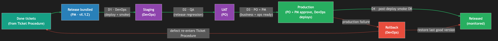

# Deployment Sign-Off Procedure — Release to Production

Standard Operating Procedure (SOP). This is an internal process document, not a legal contract. The signature block records each role's acknowledgement that they have read the procedure and agree to follow it.

This procedure begins where the Ticket Sign-Off Procedure ends. A ticket reaches **Done** in that procedure; this one governs how Done work is bundled into a release and promoted through **Staging → UAT → Production**.

## Document Control

| Field | Value |
|-------|-------|
| Document type | Internal Standard Operating Procedure (SOP) |
| Document owner | `<name / role responsible for maintaining this doc>` |
| Version | `<1.0>` |
| Status | `<Draft / Approved>` |
| Effective date | `<YYYY-MM-DD>` |
| Next review date | `<YYYY-MM-DD>` |
| Applies to | PM, PO, Dev / DevOps, QA on `<team / project>` |

---

## Summary

This document defines how completed (Done) work is released to production. Done tickets are bundled into a single versioned **release** (for example, v24.3.0), which is promoted as one unit through three environments: **Staging**, **UAT**, and **Production**. Each promotion is a gate with a defined owner and exit criteria.

The final push to Production requires **two sign-offs**: the **PO** confirms business readiness (the release delivers the intended value and the client is ready) and the **PM** confirms operational readiness (release window, rollback plan, stakeholders notified). If a release fails in production, the rule is **roll back first, fix after**: restore the last good version immediately, then handle the defect through the Ticket Sign-Off Procedure.

---

## Table of Contents
1. Scope and Relationship to the Ticket Procedure
2. Deployment Flow
   - 2.1 Flow Diagram
   - 2.2 Environments
3. Gate Explanations
   - 3.1 Gate Summary Table
   - 3.2 Notes on Each Gate
4. Ownership & RACI Matrix
5. Rollback Rule
6. Deployment Rules
7. Exceptions & Escalation
8. Release Sign-Off Record
9. Glossary
10. Signature Block
11. Change Log

---

## 1. Scope and Relationship to the Ticket Procedure

The **Ticket Sign-Off Procedure** governs a single ticket from the Functional Spec to **Done**. This **Deployment Sign-Off Procedure** governs what happens after: bundling Done tickets into a release and promoting that release to production.

- Only tickets at **Done** in the Ticket Sign-Off Procedure are eligible for a release.
- A release is a single versioned unit (e.g. v24.3.0); tickets are not deployed individually.
- A defect found after release does not get fixed inside this procedure — it re-enters the Ticket Sign-Off Procedure as a new or reopened ticket.

---

## 2. Deployment Flow

### 2.1 Flow Diagram

```mermaid
%%{init: {
  'theme': 'dark',
  'themeVariables': {
    'background': '#1e1e1e',
    'primaryTextColor': '#ffffff',
    'lineColor': '#a0a0a0'
  },
  'themeCSS': 'svg { background-color: #1e1e1e !important; padding: 1rem !important; border-radius: 8px !important; } .edgeLabel rect { fill: #1e1e1e !important; } text, tspan { fill: #ffffff !important; }'
}}%%
flowchart LR
    DONE["Done tickets<br/>(from Ticket Procedure)"]:::input --> REL["Release bundled<br/>(PM · vX.Y.Z)"]:::process
    REL -->|"D1 · DevOps<br/>(deploy + smoke)"| ST["Staging<br/>(DevOps)"]:::process
    ST -->|"D2 · QA<br/>(release regression)"| UAT["UAT<br/>(PO)"]:::process
    UAT -->|"D3 · PO + PM<br/>(business + ops ready)"| PROD["Production<br/>(PO + PM approve, DevOps deploys)"]:::success
    PROD -->|"D4 · post-deploy smoke OK"| LIVE["Released<br/>(monitored)"]:::success

    PROD -.->|"production failure"| RB["Rollback<br/>(DevOps)"]:::danger
    RB -.->|"restore last good version"| LIVE
    RB -.->|"defect re-enters Ticket Procedure"| DONE

    linkStyle 0,1,2,3,4 stroke:#27ae60,stroke-width:2px
    linkStyle 5,6,7 stroke:#e74c3c,stroke-width:2px

    style DONE fill:#16a085,color:#fff
    style REL fill:#2980b9,color:#fff
    style ST fill:#8e44ad,color:#fff
    style UAT fill:#8e44ad,color:#fff
    style PROD fill:#27ae60,color:#fff
    style LIVE fill:#27ae60,color:#fff
    style RB fill:#e74c3c,color:#fff
```

Line colors: green = forward promotion · red = rollback / failure path.

> For documents where Mermaid does not render (Google Docs, PDF, print), use the exported image: `assets/deployment-flow.png` (or `assets/deployment-flow.svg`). Re-export from `assets/deployment-flow.mmd` if the flow changes.

### 2.2 Environments

| Environment | Purpose | Owner |
|-------------|---------|-------|
| Staging | Integrated build of the release; technical verification and regression | DevOps |
| UAT | Business / client acceptance — does the release deliver the intended value | PO |
| Production | The live system used by real users | PO + PM (approve), DevOps (deploys) |

---

## 3. Gate Explanations

### 3.1 Gate Summary Table

| # | Promotion | Owner (signs off) | Exit criteria (what is confirmed) |
|---|-----------|-------------------|-----------------------------------|
| — | Done → Release bundled | PM | All included tickets are Done; release version assigned; scope listed |
| D1 | Release → Staging | DevOps | Deployed to staging; smoke check passed |
| D2 | Staging → UAT | QA | Release regression passed; no open Sev-1 / Sev-2 defects across the bundle |
| D3 | UAT → Production | PO + PM | PO confirms business readiness; PM confirms operational readiness (window, rollback, stakeholders) |
| D4 | Production → Released | DevOps | Deployed to production; post-deploy smoke check passed; monitoring green |

### 3.2 Notes on Each Gate

**Bundle — Done → Release (PM).** The PM groups the Done tickets into a single versioned release, assigns the version number, and lists the scope (which tickets are in, which are deliberately held). Only Done tickets are eligible.

**Gate D1 — Release → Staging (DevOps).** DevOps deploys the bundled release to the staging environment and runs a smoke check. If staging is unstable, the release does not advance; the problem is fixed before promotion (the same delay/comment rule as the Ticket Procedure applies — comment the cause and CC the relevant members).

**Gate D2 — Staging → UAT (QA).** QA runs release-level regression on staging — not just the individual tickets, but the bundle working together. The release advances to UAT only with no open Sev-1 / Sev-2 defects. A failure here sends the offending ticket back into the Ticket Sign-Off Procedure (Fails → triage), and the release waits or drops that ticket from scope.

**Gate D3 — UAT → Production (PO + PM).** This is the dual sign-off gate.
- **PO confirms business readiness:** UAT passed, the release delivers the intended value, and the client/stakeholders are ready to receive it.
- **PM confirms operational readiness:** a release window is agreed, a rollback plan is ready, and stakeholders are notified.
Both sign-offs are required; neither alone authorizes a production deploy.

**Gate D4 — Production → Released (DevOps).** DevOps executes the production deploy within the agreed window, runs a post-deploy smoke check, and confirms monitoring is green. Only then is the release considered live.

---

## 4. Ownership & RACI Matrix

Owner = the single role (or pair, for Production) who may promote the release out of this stage. R = Responsible, A = Accountable, C = Consulted, I = Informed.

| Stage | Owner (can promote) | PM | PO | Dev / DevOps | QA |
|-------|---------------------|----|----|--------------|----|
| Release bundled | PM | A/R | C | C | C |
| Staging | DevOps | I | I | A/R | C |
| UAT | PO | C | A/R | I | C |
| Production (approve) | PO + PM | A | A | R (deploys) | I |
| Rollback | DevOps | C | C | A/R | I |

Production is the one stage requiring two accountable approvers (PO and PM). DevOps executes the deploy but does not authorize it alone.

---

## 5. Rollback Rule

If a release fails in production, the rule is **roll back first, fix after**.

1. **Roll back immediately.** DevOps restores the last known good version. Stability of production comes before diagnosing the cause.
2. **Notify.** The PM informs stakeholders that a rollback occurred; the PO is informed of any client impact.
3. **Log and re-enter the ticket flow.** The defect is logged and re-enters the Ticket Sign-Off Procedure as a new or reopened ticket (Fails → triage → Pending Fix → fix → re-test). It is not fixed directly in production.
4. **Re-release.** The fix goes through the full deployment flow again (Staging → UAT → Production) in the next release; it does not skip gates because it was urgent.

This keeps production stable and ensures every fix is verified the same way as any other change.

---

## 6. Deployment Rules

1. Only Done work ships. A ticket not at Done in the Ticket Sign-Off Procedure cannot be in a release.
2. Release as one unit. Tickets are promoted as a bundled, versioned release — not individually.
3. Production needs two approvals. Both PO (business) and PM (operational) must sign off before any production deploy.
4. Never skip an environment. A release goes Staging → UAT → Production in order; no jumping straight to production.
5. Roll back first, fix after. A production failure is rolled back immediately; the fix re-enters the Ticket Sign-Off Procedure.
6. Deploy in the agreed window. Production deploys happen in the window agreed at Gate D3, with a rollback plan ready.
7. Frozen during a sprint. This procedure is not changed mid-sprint; problems are noted, discussed at the retrospective, and any change takes effect in the next sprint.

---

## 7. Exceptions & Escalation

- **Emergency hotfix.** A critical production issue may use an expedited path agreed by the PM and PO. Even then, a code review and a QA check are time-boxed, not skipped, and the change still goes through Staging before Production where time allows. Any compressed step is noted on the release.
- **Partial release.** If one ticket fails regression at Gate D2, the PM may drop it from the release and ship the rest, rather than holding the whole bundle. The dropped ticket re-enters the Ticket Sign-Off Procedure.
- **Disagreement at D3.** If PO and PM do not both agree the release is ready, it does not go to production. The matter is escalated and resolved before any deploy.
- **Requesting an exception.** Any role may request an exception by raising it to the document owner or the PM. Approved exceptions are recorded on the release; they do not change the procedure itself.

This procedure is a working agreement: stable within a sprint, improved between sprints.

---

## 8. Release Sign-Off Record

Complete per release.

**Release version:** `<vX.Y.Z>`   **Date:** `<YYYY-MM-DD>`   **Sprint:** `<name / number>`

**Scope (tickets included):** `<PROJ-001, PROJ-002, …>`

| Gate | Owner | Confirmed | Name | Date |
|------|-------|-----------|------|------|
| Release bundled | PM | ☐ | `<name>` | `<YYYY-MM-DD>` |
| D1 · Staging (deploy + smoke) | DevOps | ☐ | `<name>` | `<YYYY-MM-DD>` |
| D2 · UAT (regression passed) | QA | ☐ | `<name>` | `<YYYY-MM-DD>` |
| D3 · Production — business ready | PO | ☐ | `<name>` | `<YYYY-MM-DD>` |
| D3 · Production — operational ready | PM | ☐ | `<name>` | `<YYYY-MM-DD>` |
| D4 · Released (post-deploy smoke + monitoring) | DevOps | ☐ | `<name>` | `<YYYY-MM-DD>` |

**Rollback (if any):** `<date>` · by `<name>` · reason `<…>` · defect ticket `<PROJ-000>`

---

## 9. Glossary

| Term | Meaning |
|------|---------|
| Release | A bundled, versioned set of Done tickets promoted to production as one unit |
| Staging | Pre-production environment for technical verification and regression |
| UAT | User Acceptance Testing — the PO (or client) confirming the release delivers value |
| Production | The live system used by real users |
| Smoke check | A quick post-deploy test confirming the build is up and basic functions work |
| Regression | Testing that existing functionality still works after the new changes |
| Rollback | Restoring the last known good version after a failed deploy |
| Sev-1 / Sev-2 | Defect severity; Sev-1 is critical, Sev-2 is high |
| Release window | The agreed time slot in which a production deploy is performed |

---

## 10. Signature Block

By signing below, each role acknowledges that they have read this procedure and agree to follow it and to respect the ownership rules for every deployment stage. This is an internal working agreement, not a legal contract.

| Role | Name | Signature | Date |
|------|------|-----------|------|
| Product Owner (PO) | `<name>` | `____________` | `<YYYY-MM-DD>` |
| Project Manager (PM) | `<name>` | `____________` | `<YYYY-MM-DD>` |
| DevOps / Release Engineer | `<name>` | `____________` | `<YYYY-MM-DD>` |
| Quality Assurance (QA) | `<name>` | `____________` | `<YYYY-MM-DD>` |

---

## 11. Change Log

| Version | Date | Author | Change |
|---------|------|--------|--------|
| 1.0 | `<YYYY-MM-DD>` | `<name>` | Initial version |
