# Procedure: First 90 Days as a New Business Owner

**Tags:** #procedure #business-owner #strategy #leadership #onboarding #first90days #pnl
**Roles:** Business Owner / Sponsor · Your Exec (CEO/GM/Board) · PM · PO · Eng Manager · Finance · Senior Stakeholders
**Read Time:** ~15 min

> Your first Business Owner role — the executive **sponsor** accountable for a product line's P&L, vision, and ROI — is won or lost in the first 90 days, not by announcing a bold new strategy on day 1, but by **understanding the business before you steer it**. The core shift is profound: you are no longer paid to deliver the work, you are paid to decide *what is worth doing* and to *fund it well*. You own the **WHY** and the **WHAT-MATTERS**; the PM/PO/teams own the **WHAT** and **HOW**. This procedure gives you a week-by-week roadmap on four phases: **Listen → Assess → Plan → Execute.** The biggest mistake first-time owners make is "seagull" leadership — swooping in, dumping decisions, and flying off. Resist it.

---

## 📌 Table of Contents
- [The Core Shift: From Delivering Work to Owning Outcomes](#the-core-shift-from-delivering-work-to-owning-outcomes)
- [The Core Principle](#the-core-principle)
- [Business Owner vs PO vs PM vs EM](#business-owner-vs-po-vs-pm-vs-em)
- [The Four Phases](#the-four-phases)
- [Mermaid Swimlane Diagram](#mermaid-swimlane-diagram)
- [ASCII Flow](#ascii-flow)
- [Step-by-Step Responsibility Table](#step-by-step-responsibility-table)
- [Phase 1 — Listen (Days 1–14)](#phase-1--listen-days-114)
- [Phase 2 — Assess (Days 15–30)](#phase-2--assess-days-1530)
- [Phase 3 — Plan (Days 31–60)](#phase-3--plan-days-3160)
- [Phase 4 — Execute (Days 61–90)](#phase-4--execute-days-6190)
- [Managing Up & Governance](#managing-up--governance)
- [Anti-Patterns to Avoid](#anti-patterns-to-avoid)
- [Related Documents](#related-documents)

---

## The Core Shift: From Delivering Work to Owning Outcomes

The hardest part of becoming a Business Owner is that the skills that got you here — being a great PM, a sharp engineer, a star seller — are no longer the job. Your success is now **measured by business outcomes you cannot produce with your own hands**: revenue, margin, growth, customer value, and return on every dollar you invest.

| Before (PM / PO / Specialist) | After (Business Owner / Sponsor) |
|:------------------------------|:---------------------------------|
| Your output = features shipped, plans delivered | Your output = the business result (revenue, margin, growth) |
| Decide *how* and *when* to build | Decide *whether it's worth building at all* |
| Optimize delivery throughput | Optimize return on investment and focus |
| Measured on on-time, on-scope delivery | Measured on P&L, north-star metric, and ROI |
| Manage a backlog | Manage a portfolio of bets and a budget |
| Solve the problem in front of you | Choose which problems are worth funding |

This is a **change of altitude**, not a bigger version of the old job. Your new leverage is **clarity of direction and quality of investment decisions** — not personal throughput. Every hour you spend doing the team's job (rewriting the backlog, redesigning the screen) is an hour you're not spending on the decisions only you can make: vision, funding, trade-offs, and go/no-go.

> **You will feel removed from the work, and that is the point.** The owner who stays in the weeds starves the business of the decisions only they can make. Learn to create value through clear direction, good funding, and empowered people — not by doing.

---

## The Core Principle

> **Own the outcome; empower the doers.** You set the WHY (vision, strategy) and the WHAT-MATTERS (success metrics, priorities) and you fund it. The PO/PM/EM and their teams figure out the WHAT and the HOW. Your power is in decisions and resources, not in doing the work. Every clear decision you make unblocks dozens of people; every decision you hoard or delay stalls them.

A Business Owner has three jobs, in priority order:
1. **Own the business outcome** — the product line grows, earns its return, and serves real customer value.
2. **Set direction and fund it** — a clear vision, sharp priorities, and a budget invested where it earns the most.
3. **Empower and govern** — the delivery roles are trusted, unblocked, and accountable to outcomes — not micromanaged.

In the first 90 days you mostly do #1 (understand and protect the business), set up #3 (relationships and trust with the delivery roles), and earn the right to do #2 (re-set strategy and re-allocate the budget). **Do not re-set the strategy in week one** — you don't yet know why the business is the way it is.

---

## Business Owner vs PO vs PM vs EM

These four roles are constantly confused, and as the new owner you must be crystal-clear about the boundary — or you'll do everyone's job and neglect your own.

| Dimension | Business Owner (you) | [Product Owner](../product-owner/README.md) | [Project Manager](../pm-leadership/README.md) | [Eng Manager](../engineering-manager/README.md) |
|:----------|:---------------------|:-------------|:-------------------|:------------|
| Altitude | **Business / strategy** | Product / backlog | Delivery / plan | People / team |
| Owns | P&L, vision, budget, ROI, go/no-go | Backlog priority, acceptance, the *what* of the product | Timeline, scope, risk, status | Hiring, growth, team health |
| Decides | **Whether & why to invest; what success means** | Which features, in what order | When & how it gets delivered | Who does it, how they grow |
| Time horizon | Quarters to years | Sprints to quarters | Weeks to a release | Continuous |
| Authority from | Accountability for the business result | Delegated product authority | Delegated delivery authority | People-management authority |
| "Failure" looks like | Flat revenue, wasted spend, no strategy | Building the wrong thing | Slipped dates, surprises | Attrition, burnout |
| Does NOT | Write the backlog or run sprints | Set the P&L or the budget | Set business priorities | Set business strategy |

> **The one-line boundary:** the Business Owner funds the WHY and the WHAT-MATTERS; the PO/PM/EM and teams own the WHAT and the HOW. If you find yourself reordering the backlog or redesigning a feature, you've dropped two altitudes — climb back up.

---

## The Four Phases

| Phase | Days | Goal | Output |
|:------|:-----|:-----|:-------|
| **1 — Listen** | 1–14 | Understand the business, customers, money, and people — change nothing | Stakeholder map, listening notes |
| **2 — Assess** | 15–30 | Diagnose business & product health across 6 dimensions | [Business & Product Assessment](./02-business-and-product-assessment.md) |
| **3 — Plan** | 31–60 | Set vision, strategy, north-star, and where the money goes | [Vision, Strategy & OKRs](./03-vision-strategy-and-okrs.md) + [Budget & ROI](./04-budget-roi-and-investment.md) |
| **4 — Execute** | 61–90 | Make the first real bets, empower the teams, stand up the dashboard | Funded OKRs + business KPI dashboard |

---

## Mermaid Swimlane Diagram

```mermaid
%%{init: {'theme': 'dark', 'themeVariables': {'primaryColor': '#1a237e', 'primaryBorderColor': '#0d47a1', 'primaryTextColor': '#ffffff', 'lineColor': '#5c6bc0', 'secondaryColor': '#004d40', 'tertiaryColor': '#4a148c', 'background': '#1e1e1e', 'mainBkg': '#1a237e', 'nodeBorder': '#0d47a1', 'clusterBkg': '#263238', 'titleColor': '#ffffff', 'edgeLabelBackground': '#263238'},
  'themeCSS': 'svg { background-color: #1e1e1e !important; padding: 1rem !important; border-radius: 8px !important; } text, tspan { fill: #ffffff !important; } .edgeLabel rect { fill: #1e1e1e !important; }'
}}%%
flowchart TD
    START([🎯 Day 1 — New Business Owner])

    subgraph LISTEN ["👂 Phase 1 — Listen (Day 1–14)"]
        L1([Meet your exec —<br>clarify mandate & P&L])
        L2([Meet PM/PO/EM —<br>understand delivery])
        L3([Meet customers, sales,<br>finance, key stakeholders])
        L4([Read the numbers —<br>revenue, costs, metrics])
    end

    subgraph ASSESS ["🔍 Phase 2 — Assess (Day 15–30)"]
        A1([Score health<br>6 dimensions])
        A2([Find top 3 risks<br>+ opportunities])
        A3([Write Business &<br>Product Assessment])
        A4([Review with exec])
    end

    subgraph PLAN ["🗺️ Phase 3 — Plan (Day 31–60)"]
        P1([Set vision +<br>north-star metric])
        P2([Draft strategy +<br>OKRs])
        P3([Set budget +<br>investment bets])
        P4([Socialize + get<br>governance buy-in])
    end

    subgraph EXEC ["🚀 Phase 4 — Execute (Day 61–90)"]
        E1([Fund 1–2 real bets])
        E2([Empower teams —<br>delegate the HOW])
        E3([Stand up KPI<br>dashboard])
        E4([90-day review<br>with exec/board])
    end

    START --> L1 --> L2 --> L3 --> L4
    L4 --> A1 --> A2 --> A3 --> A4
    A4 --> P1 --> P2 --> P3 --> P4
    P4 --> E1 --> E2 --> E3 --> E4

    style LISTEN fill:#1a237e,stroke:#0d47a1,color:#fff
    style ASSESS fill:#4a148c,stroke:#12005e,color:#fff
    style PLAN fill:#004d40,stroke:#00251a,color:#fff
    style EXEC fill:#1b5e20,stroke:#003300,color:#fff
```



---

## ASCII Flow

```
FIRST 90 DAYS — NEW BUSINESS OWNER
══════════════════════════════════════════════════════════════════════════════════

🎯 DAY 1
   │
   ▼
┌──────────────────────────────────────────────────────────────────────────────┐
│  PHASE 1 — LISTEN  (Day 1–14)            RULE: change nothing yet             │
│    ① Meet your exec/board → clarify mandate, P&L ownership, decision rights    │
│    ② Meet the PM/PO/EM → understand how value gets delivered (don't direct)    │
│    ③ Meet customers, sales, finance, senior stakeholders — "where's the pain?" │
│    ④ Read the numbers: revenue, costs, margin, retention, the current strategy │
└────────────────────────────────────────┬─────────────────────────────────────┘
                                         │
                                         ▼
┌──────────────────────────────────────────────────────────────────────────────┐
│  PHASE 2 — ASSESS  (Day 15–30)           RULE: diagnose, don't prescribe      │
│    ① Score health: Market, Product-fit, Financials, Delivery, Team, Metrics   │
│    ② Identify top 3 risks & opportunities by VALUE × CONFIDENCE                │
│    ③ Write the Business & Product Assessment (facts, not opinions)             │
│    ④ Review with your exec — align before publishing widely                    │
└────────────────────────────────────────┬─────────────────────────────────────┘
                                         │
                                         ▼
┌──────────────────────────────────────────────────────────────────────────────┐
│  PHASE 3 — PLAN  (Day 31–60)             RULE: focus over breadth             │
│    ① Set the vision + ONE north-star metric the whole line rallies behind      │
│    ② Draft strategy + OKRs — outcomes, not a feature list                       │
│    ③ Set the budget: where money goes, what you'll stop funding                 │
│    ④ Socialize 1-on-1 BEFORE governance; secure steering buy-in                 │
└────────────────────────────────────────┬─────────────────────────────────────┘
                                         │
                                         ▼
┌──────────────────────────────────────────────────────────────────────────────┐
│  PHASE 4 — EXECUTE  (Day 61–90)          RULE: fund & empower, don't do        │
│    ① Fund 1–2 real bets tied to the north-star — give teams room to run        │
│    ② Empower the PM/PO/EM: set outcomes & guardrails, delegate the HOW         │
│    ③ Stand up a business KPI dashboard (leading + lagging) — review outcomes   │
│    ④ 90-day review: what's clearer, what the numbers show, what's next         │
└────────────────────────────────────────────────────────────────────────────────┘
```

---

## Step-by-Step Responsibility Table

| # | Step | Who Owns | Who Helps | Output |
|:--|:-----|:---------|:----------|:-------|
| 1 | Clarify mandate, P&L & decision rights | Business Owner | Your Exec / Board | 1-page "what success looks like" |
| 2 | Meet PM/PO/EM, understand delivery | Business Owner | PM, PO, EM | Delivery context notes |
| 3 | Meet customers, sales, finance | Business Owner | Sales, Finance, CS | Stakeholder map |
| 4 | Read the numbers & current strategy | Business Owner | Finance, Analytics | Financial baseline |
| 5 | Assess business & product health | Business Owner | PM, Finance, Analytics | [Business & Product Assessment](./02-business-and-product-assessment.md) |
| 6 | Identify top 3 risks & opportunities | Business Owner | Your Exec | Prioritized list |
| 7 | Set vision & north-star metric | Business Owner | PO, PM | [Vision, Strategy & OKRs](./03-vision-strategy-and-okrs.md) |
| 8 | Set budget & investment bets | Business Owner | Finance | [Budget & ROI](./04-budget-roi-and-investment.md) |
| 9 | Socialize & secure governance buy-in | Business Owner | Exec, Steering | [Stakeholders & Governance](./05-stakeholders-and-governance.md) |
| 10 | Fund bets & empower teams | Business Owner | PM, PO, EM | [Empowering Delivery & Metrics](./06-empowering-delivery-and-metrics.md) |
| 11 | 90-day review | Business Owner | Your Exec / Board | Review + next-quarter plan |

---

## Phase 1 — Listen (Days 1–14)

**Goal:** Build a mental model of the business, its customers, its money, and its people. **Make zero strategic changes.**

### Week 1 — Mandate & money
- **First meeting with your exec (CEO / GM / Board).** Ask the questions that define your job:
  - "What does success look like at 90 days? At 12 months?"
  - "What's the one thing about this business you most want fixed?"
  - "What's the P&L reality — revenue, costs, margin, and the trend?"
  - "What's my authority — budget size, hiring, the go/no-go, what needs sign-off?"
  - "Who are the key stakeholders and what's the history with each?"
- **Read the numbers.** Get the last 4–8 quarters of revenue, gross margin, customer acquisition cost, retention/churn, and current burn vs budget. You are now accountable for these — know them cold.
- **Listen 80%, talk 20%.** Take notes. Do not announce a new strategy or kill any initiative yet.

### Week 2 — Customers, delivery & stakeholders
- **Meet the delivery leaders** — PM, PO, EM. Understand how value actually gets built and shipped. Ask: *"What decisions are you waiting on? Where do you feel under-supported?"* — but do **not** start directing the work.
- **Meet customers and the front line** — sales, customer success, support, and 3–5 real customers. The voice of the customer is your most important data source. Ask: *"What do you value, what frustrates you, what would make you pay more / leave?"*
- **Meet finance** — understand the budget cycle, unit economics, and how investment decisions get made and approved here.
- **Read the current strategy, last board decks, win/loss notes, and the roadmap.**

> 🚩 **Red flag for yourself:** If by day 14 you're itching to "announce the new vision," write it down and save it for Phase 3. First understand *why* the business is the way it is — the team has context you don't.

---

## Phase 2 — Assess (Days 15–30)

**Goal:** Turn impressions into an evidence-based diagnosis. See the full method in **[02 — Business & Product Assessment](./02-business-and-product-assessment.md)**.

- Assess across six dimensions: **Market & customers, Product-market fit & value, Financials & unit economics, Delivery capability, Team & org, Metrics & data.** Score each on a 1–5 maturity scale.
- Quantify where you can: revenue trend, gross margin, CAC vs LTV, retention/churn, delivery predictability, north-star (or its absence).
- Rank risks and opportunities by **Value × Confidence**, not by who lobbies hardest.
- Produce the **[Business & Product Assessment](./templates/30-60-90-plan-template.md)** — facts first, recommendations clearly separated.
- **Review with your exec privately first.** Align on the story before any wide publication or board update.

---

## Phase 3 — Plan (Days 31–60)

**Goal:** Convert the diagnosis into a clear, funded, bought-in direction.

- Set the **vision and ONE north-star metric** the whole product line can rally behind. See **[03 — Vision, Strategy & OKRs](./03-vision-strategy-and-okrs.md)**.
- Draft **strategy and OKRs** as outcomes (revenue, retention, value delivered) — not a feature list. Cascade objectives so teams can set their own key results.
- Set the **budget and investment bets** — and, just as importantly, what you'll **stop** funding. See **[04 — Budget, ROI & Investment](./04-budget-roi-and-investment.md)**.
- Prioritize bets using a **Value vs Effort** grid:

```
            HIGH VALUE
                │
    BIG BETS    │   FUND NOW
  (fund, stage) │  (quick ROI)
                │
  ──────────────┼──────────────  EFFORT/COST →
                │
    DON'T FUND  │   FILL-IN
   / DEFER      │  (cheap, low value)
                │
            LOW VALUE
```

- **Socialize 1-on-1 before governance.** Walk your exec and key stakeholders through the plan privately. The steering meeting should hold zero surprises.
- For each bet: a clear **owner** (a PM/PO, not you), a **success metric**, a **budget**, and a **review date**.

---

## Phase 4 — Execute (Days 61–90)

**Goal:** Make the first real bets and lock in an empowered, outcome-driven rhythm.

- **Fund 1–2 real bets** tied to the north-star, with clear outcomes and budgets. Resist funding ten things at once — focus is your scarcest resource. See **[04 — Budget, ROI & Investment](./04-budget-roi-and-investment.md)**.
- **Empower the PM/PO/EM:** hand them the outcome and the guardrails, then get out of the way on the HOW. Your job is to remove blockers and make decisions, not to run the sprint. See **[06 — Empowering Delivery & Metrics](./06-empowering-delivery-and-metrics.md)**.
- **Stand up a business KPI dashboard** — a small set of leading and lagging metrics that show whether the bets are working. **Measure outcomes, not activity, and never surveil individuals.**
- **Run the 90-day review** with your exec/board: what's clearer now, what the numbers show, the funded bets and their first signals, what's next quarter, and what you need.

---

## Managing Up & Governance

A first-time owner often neglects two relationships that are now critical.

**Managing up.** Your exec/board is now your key stakeholder, not just a boss.
- **Agree on a reporting contract:** what they want to hear, how often, in what form. A crisp monthly written update with a clear ask beats surprise meetings.
- **No surprises rule:** they should never learn of a missed number, a failed bet, or a major risk from someone else. Bad news travels to your exec from *you*, early — with options.
- **Ask for what you need explicitly:** budget, headcount, air cover, a faster decision path. Executives can't read your mind.

**Governance.** As owner you sit at the steering/governance layer.
- Establish **clear decision rights** — who decides what (you'll formalize this in [05 — Stakeholders & Governance](./05-stakeholders-and-governance.md)). Ambiguous decision rights are the #1 cause of stalled product lines.
- Run governance to **make decisions and unblock**, not to admire status. Every steering meeting should end with funded decisions or cleared blockers.

> The relationship with your exec/board is the one most new owners under-invest in. A short monthly written update plus a standing check-in buys you enormous trust and room to operate.

---

## Anti-Patterns to Avoid

| Anti-Pattern | Why It Hurts | Do Instead |
|:-------------|:-------------|:-----------|
| **Seagull executive** | Swooping in, dumping decisions, flying off destroys trust and context | Engage steadily; decide with the team's input, then let them run |
| **New strategy in week 1** | You don't yet know why the business is the way it is | Listen first; re-set direction in Phase 3 with evidence |
| **Doing the team's job** | Reordering the backlog / redesigning features starves your real work | Set outcomes & fund them; let PO/PM/EM own the WHAT and HOW |
| **Vanity metrics** | Pretty numbers (signups, page views) that don't tie to value or money | Pick a north-star tied to customer value and revenue |
| **Starving the team of decisions** | Hoarded or delayed go/no-go calls stall everyone | Decide fast, decide clearly; an explicit "no" beats silence |
| **Funding everything** | Spreading the budget thin guarantees nothing wins | Make focused bets; say no at the portfolio level |
| **"At my last company we…"** | Erodes trust and ignores this context | Learn THIS business; borrow ideas silently |
| **Surveillance dashboards** | Watching individual activity destroys trust and morale | Measure team-level outcomes and trends, never police people |
| **Skipping exec alignment** | Acting on findings your exec hasn't seen is a career risk | Always review privately first |

---

## Related Documents
- **Next step:** [02 — Business & Product Assessment](./02-business-and-product-assessment.md)
- [03 — Vision, Strategy & OKRs](./03-vision-strategy-and-okrs.md) · [04 — Budget, ROI & Investment](./04-budget-roi-and-investment.md)
- [05 — Stakeholders & Governance](./05-stakeholders-and-governance.md) · [06 — Empowering Delivery & Metrics](./06-empowering-delivery-and-metrics.md)
- **Templates:** [30/60/90 Plan](./templates/30-60-90-plan-template.md) · [Business Case](./templates/business-case-template.md) · [OKR](./templates/okr-template.md) · [North-Star & KPI](./templates/north-star-and-kpi-template.md)
- **Cross-feed:** [Product Owner Playbook](../product-owner/README.md) · [PM Leadership Playbook](../pm-leadership/README.md) · [Engineering Manager Playbook](../engineering-manager/README.md) · [Management & Leadership](../../management/README.md) · [SDLC Series](../../management/sdlc/README.md) · [Project Kickoff](../project-kickoff/01-project-setup-from-idea.md)

---

*Part of the [Business Owner Playbook](./README.md) · Last updated: 2026-05-31*
