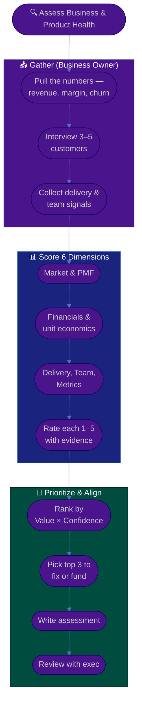

# Procedure: Business & Product Assessment

**Tags:** #procedure #business-owner #strategy #assessment #pnl #product-market-fit
**Roles:** Business Owner · Your Exec · Finance · PM · PO · Analytics · Sales / CS
**Read Time:** ~13 min

> Before you set a new direction, you need an honest diagnosis of where the business actually stands. This procedure scores the health of a product line across **six dimensions** on a 1–5 maturity scale, ranks what to fix or fund by **Value × Confidence**, and produces an evidence-based assessment you align on with your exec. The principle: **diagnose with numbers and customer truth before you prescribe a strategy — opinions are cheap, evidence funds bets.**

---

## 📌 Table of Contents
- [The Principle: Diagnose Before You Steer](#the-principle-diagnose-before-you-steer)
- [The Six Dimensions](#the-six-dimensions)
- [Mermaid Swimlane Diagram](#mermaid-swimlane-diagram)
- [ASCII Flow](#ascii-flow)
- [Step-by-Step Responsibility Table](#step-by-step-responsibility-table)
- [Scoring: The 1–5 Maturity Scale](#scoring-the-15-maturity-scale)
- [Working Each Dimension](#working-each-dimension)
- [Prioritizing What to Fix or Fund](#prioritizing-what-to-fix-or-fund)
- [Anti-Patterns to Avoid](#anti-patterns-to-avoid)
- [Related Documents](#related-documents)

---

## The Principle: Diagnose Before You Steer

> The fastest way to waste a budget is to fund a strategy built on assumptions. A good owner spends Phase 2 turning impressions into evidence: what the numbers say, what customers actually do, and where the real constraint sits. **Your job is to find the one or two things that, if fixed or funded, move the business — not to list everything that's imperfect.**

Two failure modes to avoid:
- **Analysis paralysis** — endless diagnosis, no decision. Time-box the assessment to ~2 weeks.
- **Confirmation bias** — finding only the evidence that supports the strategy you already wanted. Actively look for what would prove you wrong.

---

## The Six Dimensions

| # | Dimension | Core question | Key signals |
|:--|:----------|:--------------|:------------|
| 1 | **Market & Customers** | Is there a real, growing market and do we understand our customers? | TAM/SAM, segment growth, win/loss, customer interviews |
| 2 | **Product–Market Fit & Value** | Do customers get real value and would they miss us? | Retention, NPS, usage depth, "very disappointed" %, referrals |
| 3 | **Financials & Unit Economics** | Does each customer/deal make money, and does the line as a whole? | Gross margin, CAC, LTV, payback period, contribution margin |
| 4 | **Delivery Capability** | Can the team reliably ship value at a sustainable pace? | Delivery predictability, cycle time, quality/incidents, roadmap hit rate |
| 5 | **Team & Org** | Are the right people, roles, and decision rights in place? | Role clarity, key-person risk, morale, ownership gaps |
| 6 | **Metrics & Data** | Can we see whether we're winning, in near-real time? | North-star exists?, dashboard quality, data trust, leading vs lagging |

---

## Mermaid Swimlane Diagram



---

## ASCII Flow

```
BUSINESS & PRODUCT ASSESSMENT
══════════════════════════════════════════════════════════════════════════════════

🔍 START
   │
   ▼
┌──────────────────────────────────────────────────────────────────────────────┐
│  GATHER EVIDENCE                                                             │
│    ① The numbers: revenue trend, gross margin, CAC/LTV, retention/churn       │
│    ② Customer truth: 3–5 interviews + win/loss notes + support themes         │
│    ③ Delivery & team signals: predictability, quality, role clarity, morale   │
└───────────────┬────────────────────────────────────────────────────────────────┘
                ▼
┌──────────────────────────────────────────────────────────────────────────────┐
│  SCORE 6 DIMENSIONS  (1–5 maturity)                                          │
│    ④ Market · ⑤ Product-fit & Value · ⑥ Financials · ⑦ Delivery · ⑧ Team · ⑨ Metrics │
│       — each rated 1–5, every score backed by a fact, not a feeling           │
└───────────────┬────────────────────────────────────────────────────────────────┘
                ▼
┌──────────────────────────────────────────────────────────────────────────────┐
│  PRIORITIZE & ALIGN                                                          │
│    ⑩ Rank issues/opportunities by VALUE × CONFIDENCE                          │
│    ⑪ Pick the top 3 to fix or fund (not everything that's imperfect)          │
│    ⑫ Write assessment → review with exec PRIVATELY before publishing          │
└────────────────────────────────────────────────────────────────────────────────┘
```

---

## Step-by-Step Responsibility Table

| # | Step | Who Owns | Who Helps | Output |
|:--|:-----|:---------|:----------|:-------|
| 1 | Pull the financial baseline | Business Owner | Finance, Analytics | Revenue/margin/CAC/LTV snapshot |
| 2 | Interview customers | Business Owner | Sales, CS | Customer truth notes |
| 3 | Collect delivery & team signals | Business Owner | PM, PO, EM | Delivery & team signals |
| 4 | Score each of 6 dimensions 1–5 | Business Owner | PM, Finance | Scored dimension table |
| 5 | Rank by Value × Confidence | Business Owner | Your Exec | Prioritized list |
| 6 | Pick top 3 to fix/fund | Business Owner | — | Top-3 focus list |
| 7 | Write the assessment | Business Owner | — | Business & Product Assessment |
| 8 | Review with exec | Business Owner | Your Exec | Aligned story |

---

## Scoring: The 1–5 Maturity Scale

Score every dimension on the same scale so you can compare and track over time.

| Score | Label | What it means |
|:-----:|:------|:--------------|
| **1** | Critical | Broken or absent; actively losing money or customers |
| **2** | Weak | Significant gaps; results are unpredictable |
| **3** | Functional | Works, but not a strength; clear room to improve |
| **4** | Strong | A reliable strength you can build on |
| **5** | Excellent | A genuine competitive advantage |

> Anchor every score to a **fact**: "Financials = 2 — gross margin is 41% and CAC payback is 19 months, well above our 12-month target." A score without evidence is just an opinion in a table.

---

## Working Each Dimension

### 1. Market & Customers
- Is the market growing, flat, or shrinking? Who exactly is the customer, and which segment is most valuable?
- Pull **win/loss reasons** and talk to customers directly. Owners who only read dashboards miss the *why*.

### 2. Product–Market Fit & Value
- The clearest PMF signal: **retention**. Do customers stay and expand, or churn? Use the "how disappointed would you be if this went away?" test (>40% "very disappointed" is a strong fit signal).
- Distinguish *usage* from *value* — heavy use of a workaround is a problem, not fit.

### 3. Financials & Unit Economics
- The questions that define a business: **gross margin**, **CAC**, **LTV**, **LTV:CAC ratio** (aim ≥3:1), **payback period**, and **contribution margin** per customer.
- If you can't yet see whether a customer is profitable, that's a Metrics gap to flag too.

### 4. Delivery Capability
- Can the team ship value reliably and sustainably? Look at delivery **predictability**, cycle time, quality/incident load, and roadmap hit rate — sourced from the PM/EM, not invented by you. See the [PM Delivery Assessment](../pm-leadership/02-delivery-assessment.md) for the delivery-side method.
- Healthy delivery is a humane, sustainable pace — not a death march. A burning-out team is a business risk.

### 5. Team & Org
- Are roles and **decision rights** clear? Is there key-person risk? Are there ownership gaps where decisions stall?
- Assess at the team level via your PM/PO/EM — **never** as individual surveillance.

### 6. Metrics & Data
- Does a **north-star metric** exist, and does the org trust the data? Can you see leading indicators, or only lagging financials after the quarter closes?
- A low score here is common and high-leverage — you can't steer what you can't see.

---

## Prioritizing What to Fix or Fund

Rank every issue and opportunity on a **Value × Confidence** grid — value of solving it, and confidence you understand the cause:

```
            HIGH VALUE
                │
   INVESTIGATE  │   ACT NOW
  (big upside,  │  (high value +
   low certainty)│   high confidence)
                │
  ──────────────┼──────────────  CONFIDENCE →
                │
    IGNORE      │   QUICK FIX
  (low value)   │  (cheap, certain)
                │
            LOW VALUE
```

| Quadrant | Move |
|:---------|:-----|
| **Act now** (high value, high confidence) | Fund it this quarter — your top bets |
| **Investigate** (high value, low confidence) | Run a small, time-boxed experiment before betting big |
| **Quick fix** (low value, high confidence) | Delegate it; don't spend strategy time here |
| **Ignore** (low value) | Explicitly decide NOT to fund — saying no is the job |

- Pick the **top 3** to fix or fund. More than three priorities means none of them are.
- Capture the result in the assessment and **review with your exec privately** before any wider share. Promising bets graduate into a [business case](./templates/business-case-template.md).

---

## Anti-Patterns to Avoid

| Anti-Pattern | Why It Hurts | Do Instead |
|:-------------|:-------------|:-----------|
| **Dashboard-only diagnosis** | Numbers tell you *what*, not *why* — you miss the cause | Pair every metric with customer & team conversations |
| **Scoring everything a 3** | A flat assessment hides the real constraint | Force-rank; find the genuine 1s and 5s |
| **Listing 20 priorities** | Diluted focus funds nothing well | Pick top 3 by Value × Confidence |
| **Vanity metrics as fit** | Signups/page-views aren't value or retention | Use retention, expansion, and the disappointment test |
| **Surveilling the team** | Individual activity tracking destroys trust | Assess delivery & team at the system level |
| **Confirming your bias** | You fund the strategy you already wanted | Actively hunt disconfirming evidence |
| **Skipping exec alignment** | Publishing an unreviewed diagnosis is a career risk | Review privately first |

---

## Related Documents
- **Previous:** [01 — First 90 Days](./01-first-90-days.md)
- **Next:** [03 — Vision, Strategy & OKRs](./03-vision-strategy-and-okrs.md)
- [04 — Budget, ROI & Investment](./04-budget-roi-and-investment.md) · [06 — Empowering Delivery & Metrics](./06-empowering-delivery-and-metrics.md)
- **Templates:** [Business Case](./templates/business-case-template.md) · [North-Star & KPI](./templates/north-star-and-kpi-template.md)
- **Cross-feed:** [PM Delivery Assessment](../pm-leadership/02-delivery-assessment.md) · [Product Owner Playbook](../product-owner/README.md) · [Payments & Revenue](../payments-and-revenue/README.md) · [Management & Leadership](../../management/README.md)

---

*Part of the [Business Owner Playbook](./README.md) · Last updated: 2026-05-31*
