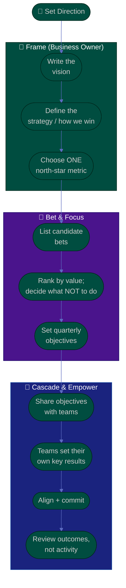

# Procedure: Vision, Strategy & OKRs

**Tags:** #procedure #business-owner #strategy #vision #okrs #north-star #outcomes
**Roles:** Business Owner · Your Exec · PO · PM · EM · Teams
**Read Time:** ~13 min

> A product line without a clear vision drifts; one with too many priorities stalls. As owner, you set the **WHY** (vision), the **strategy** (how you'll win), the **north-star metric** (the one number that captures value), and the **OKRs** that cascade to teams — then you let the teams own the WHAT and HOW. This procedure turns direction into something teams can act on. The principle: **outcomes over outputs, and focus over breadth — strategy is mostly deciding what NOT to do.**

---

## 📌 Table of Contents
- [The Principle: Outcomes Over Outputs](#the-principle-outcomes-over-outputs)
- [The Direction Stack](#the-direction-stack)
- [Mermaid Swimlane Diagram](#mermaid-swimlane-diagram)
- [ASCII Flow](#ascii-flow)
- [Step-by-Step Responsibility Table](#step-by-step-responsibility-table)
- [Writing the Vision](#writing-the-vision)
- [Choosing a North-Star Metric](#choosing-a-north-star-metric)
- [Strategy: Making Bets and Saying No](#strategy-making-bets-and-saying-no)
- [Cascading OKRs Without Micromanaging](#cascading-okrs-without-micromanaging)
- [Anti-Patterns to Avoid](#anti-patterns-to-avoid)
- [Related Documents](#related-documents)

---

## The Principle: Outcomes Over Outputs

> A feature shipped is an **output**; a customer who renews because of it is an **outcome**. As owner you must measure the line by outcomes — value delivered, revenue earned, customers retained — and leave the outputs (which features, in what order) to the PO and teams. The moment your OKRs read like a feature list, you've stopped setting strategy and started writing a backlog you don't own.

Strategy is fundamentally about **focus**. You will always have more good ideas than budget. Your hardest, highest-leverage act is saying **no** to good things so the great things get fully funded.

---

## The Direction Stack

Direction flows from durable to specific. You own the top three; teams own the bottom two.

| Layer | Time horizon | Owns it | Example |
|:------|:-------------|:--------|:--------|
| **Vision** | 3–5 years | Business Owner | "The default way SMB teams run billing" |
| **Strategy** | 1–2 years | Business Owner | "Win by being the easiest to switch to" |
| **North-Star Metric** | Ongoing | Business Owner | Weekly active billing accounts |
| **OKRs** | Quarterly | BO sets objectives; teams set key results | O: lift activation; KR: trial→paid +8pts |
| **Roadmap / Backlog** | Sprints | **PO / PM / teams** | The features and the order |

> You set the *destination and the rules of the game*; the teams choose the *route*. If you specify the route, you've taken the PO's job and demotivated the people best placed to find a better one.

---

## Mermaid Swimlane Diagram



---

## ASCII Flow

```
VISION, STRATEGY & OKRs
══════════════════════════════════════════════════════════════════════════════════

🧭 START
   │
   ▼
┌──────────────────────────────────────────────────────────────────────────────┐
│  FRAME THE DIRECTION  (Business Owner)                                       │
│    ① Vision — where this line is going in 3–5 years (durable, inspiring)      │
│    ② Strategy — how we win (the few choices that matter)                       │
│    ③ North-star — the ONE metric that captures delivered value                 │
└───────────────┬────────────────────────────────────────────────────────────────┘
                ▼
┌──────────────────────────────────────────────────────────────────────────────┐
│  BET & FOCUS                                                                 │
│    ④ List candidate bets that could move the north-star                       │
│    ⑤ Rank by value; explicitly decide what we will NOT do this period         │
│    ⑥ Set 2–4 quarterly OBJECTIVES (qualitative, ambitious)                     │
└───────────────┬────────────────────────────────────────────────────────────────┘
                ▼
┌──────────────────────────────────────────────────────────────────────────────┐
│  CASCADE & EMPOWER                                                           │
│    ⑦ Share objectives + the WHY with PO/PM/teams                              │
│    ⑧ Teams set their OWN key results (you don't dictate the HOW)              │
│    ⑨ Align, commit, fund → ⑩ review OUTCOMES, not activity                    │
└────────────────────────────────────────────────────────────────────────────────┘
```

---

## Step-by-Step Responsibility Table

| # | Step | Who Owns | Who Helps | Output |
|:--|:-----|:---------|:----------|:-------|
| 1 | Write the vision | Business Owner | Your Exec, PO | 1–2 sentence vision |
| 2 | Define the strategy | Business Owner | PO, PM | Strategy on a page |
| 3 | Choose the north-star metric | Business Owner | Analytics, PO | [North-star + KPIs](./templates/north-star-and-kpi-template.md) |
| 4 | List & rank candidate bets | Business Owner | PM, PO | Prioritized bet list |
| 5 | Decide what NOT to do | Business Owner | Your Exec | Explicit "not now" list |
| 6 | Set quarterly objectives | Business Owner | — | 2–4 objectives |
| 7 | Cascade to teams | Business Owner | PO, PM, EM | Shared objectives |
| 8 | Teams set key results | PO / PM / Teams | Business Owner | [OKRs](./templates/okr-template.md) |
| 9 | Review outcomes | Business Owner | PO, PM | Quarterly outcome review |

---

## Writing the Vision

A vision is a **durable, inspiring picture of the future** your product line is working toward. It should outlast any single feature or quarter.

- **Customer-centric, not feature-centric:** "Make billing effortless for SMB teams," not "ship a billing dashboard."
- **Memorable and short** — if the team can't repeat it, it can't guide them.
- **Ambitious but believable** — a stretch the team can rally behind, not a fantasy.

> Test: read your vision to a new engineer. If they can tell you what *not* to build from it, it's doing its job.

---

## Choosing a North-Star Metric

The **north-star** is the single metric that best captures the value your customers get — and that, when it grows, the business grows with it. Use the [North-Star & KPI template](./templates/north-star-and-kpi-template.md).

A good north-star:
- **Reflects customer value**, not just company revenue (revenue follows value).
- **Is a leading indicator** of long-term success, not a lagging financial.
- **Can be influenced** by the teams' work.

| Business type | Weak (vanity) | Strong (value) |
|:--------------|:--------------|:---------------|
| B2B SaaS | Total signups | Weekly active paying accounts |
| Marketplace | Page views | Successful transactions / week |
| Content | Registered users | Weekly engaged readers |
| Payments | Accounts created | Payment volume successfully processed |

> One north-star, supported by 3–5 input metrics. More than one north-star means none of them is.

---

## Strategy: Making Bets and Saying No

Strategy is the **handful of choices** about where to play and how to win. Most of strategy is **deciding what not to do**.

- **Concentrate the budget.** Three fully funded bets beat ten starved ones. See [04 — Budget, ROI & Investment](./04-budget-roi-and-investment.md).
- **Make the "no" list explicit and visible.** Teams need to know what's *off* the table so they stop lobbying for it and focus.
- **Tie every bet to the north-star.** If a bet wouldn't move the north-star or protect the moat, question why it's funded.
- **Stage big bets.** Fund a small experiment first; expand funding only when evidence supports it (see the Value × Confidence grid in [02](./02-business-and-product-assessment.md)).

> Saying no is the most owner-specific skill there is. Every "yes" the org can't fully fund quietly steals from the bets that could win.

---

## Cascading OKRs Without Micromanaging

OKRs translate strategy into measurable quarterly intent. The healthy split:

- **You set the Objectives** — the ambitious, qualitative outcomes (e.g., "Make activation effortless for new accounts").
- **Teams set their own Key Results** — the measurable signals of progress (e.g., "trial→paid conversion +8 points"). When teams author their own KRs, they own them. Use the [OKR template](./templates/okr-template.md).
- **Cascade by alignment, not dictation.** Share the objective and the WHY; let each team connect their work to it. A KR handed down is a target; a KR chosen is a commitment.
- **Keep it small:** 2–4 objectives, 3–5 key results each. OKRs are about focus, not coverage.
- **Review outcomes quarterly**, not activity weekly. Ask "did the metric move and what did we learn?" — not "are you busy?" See [06 — Empowering Delivery & Metrics](./06-empowering-delivery-and-metrics.md).

> OKRs are a focus tool, not a performance-management weapon. Never tie individual compensation to OKR hit-rate — it corrupts the goals into sandbagged, safe numbers and punishes ambition.

---

## Anti-Patterns to Avoid

| Anti-Pattern | Why It Hurts | Do Instead |
|:-------------|:-------------|:-----------|
| **OKRs that are a feature list** | You've written outputs, not outcomes — and taken the PO's job | Objectives = outcomes; let teams choose the features |
| **Too many priorities** | Diluted focus funds nothing well | 2–4 objectives; an explicit "not now" list |
| **Vanity north-star** | Signups/views don't reflect value or revenue | Pick a value-and-retention metric |
| **Dictating key results** | Handed-down KRs kill ownership and motivation | Set objectives; teams author their KRs |
| **Vision as a slogan only** | A poster nobody uses to decide doesn't guide work | Make it specific enough to rule things out |
| **OKRs tied to pay** | People sandbag goals and avoid ambition | Keep OKRs separate from compensation |
| **Set-and-forget** | Direction without review drifts | Review outcomes quarterly, adapt openly |

---

## Related Documents
- **Previous:** [02 — Business & Product Assessment](./02-business-and-product-assessment.md)
- **Next:** [04 — Budget, ROI & Investment](./04-budget-roi-and-investment.md)
- [05 — Stakeholders & Governance](./05-stakeholders-and-governance.md) · [06 — Empowering Delivery & Metrics](./06-empowering-delivery-and-metrics.md)
- **Templates:** [OKR](./templates/okr-template.md) · [North-Star & KPI](./templates/north-star-and-kpi-template.md) · [Business Case](./templates/business-case-template.md)
- **Cross-feed:** [Product Owner Playbook](../product-owner/README.md) · [PM Leadership Playbook](../pm-leadership/README.md) · [SDLC Series](../../management/sdlc/README.md) · [Project Kickoff](../project-kickoff/01-project-setup-from-idea.md)

---

*Part of the [Business Owner Playbook](./README.md) · Last updated: 2026-05-31*
