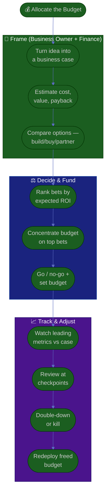

# Procedure: Budget, ROI & Investment

**Tags:** #procedure #business-owner #strategy #budget #roi #investment #unit-economics
**Roles:** Business Owner · Finance · Your Exec · PM · PO · EM
**Read Time:** ~13 min

> Owning the budget is what makes you the owner. Money is your steering wheel: where you invest is what your strategy *actually* is, regardless of the slide deck. This procedure covers turning ideas into **business cases**, judging them by **ROI and payback**, deciding **build vs buy**, managing a **portfolio of bets**, and staying aware of **runway and burn** — all at sponsor altitude. The principle: **fund value, not activity — and concentrate the budget where it earns the most.**

---

## 📌 Table of Contents
- [The Principle: Money Is Your Strategy](#the-principle-money-is-your-strategy)
- [The Investment Lifecycle](#the-investment-lifecycle)
- [Mermaid Swimlane Diagram](#mermaid-swimlane-diagram)
- [ASCII Flow](#ascii-flow)
- [Step-by-Step Responsibility Table](#step-by-step-responsibility-table)
- [Building a Business Case](#building-a-business-case)
- [ROI, Payback & Cost vs Value](#roi-payback--cost-vs-value)
- [Build vs Buy vs Partner](#build-vs-buy-vs-partner)
- [Portfolio Thinking](#portfolio-thinking)
- [Runway & Burn Awareness](#runway--burn-awareness)
- [Anti-Patterns to Avoid](#anti-patterns-to-avoid)
- [Related Documents](#related-documents)

---

## The Principle: Money Is Your Strategy

> Your real strategy is your budget. You can write any vision you like, but where the dollars go is what the company is actually betting on. As owner, treat every funding decision as a **bet with an expected return** — and concentrate capital where the expected return is highest, rather than spreading it thin to keep everyone happy.

Two failure modes to avoid:
- **Spray-and-pray funding** — a little money on everything, enough to win nothing.
- **Sunk-cost loyalty** — pouring more into a failing bet because you've already spent. Judge the *next* dollar on its *future* return, not on what's behind you.

---

## The Investment Lifecycle

| Stage | What happens | Owner's role |
|:------|:-------------|:-------------|
| **Frame** | A problem/opportunity becomes a business case | Define the outcome and the funding bar |
| **Decide** | Compare ROI, payback, risk vs alternatives | Make the go/no-go, set the budget |
| **Fund** | Allocate budget + people to the bet | Concentrate, don't sprinkle |
| **Track** | Watch leading metrics vs the case | Review outcomes; stop or double-down |
| **Harvest / Kill** | Scale what works; cut what doesn't | Kill bravely; redeploy the budget |

---

## Mermaid Swimlane Diagram



---

## ASCII Flow

```
BUDGET, ROI & INVESTMENT
══════════════════════════════════════════════════════════════════════════════════

💰 START
   │
   ▼
┌──────────────────────────────────────────────────────────────────────────────┐
│  FRAME THE BET  (Business Owner + Finance)                                   │
│    ① Turn the idea into a business case (problem, options, costs, expected ROI)│
│    ② Estimate cost & value honestly; compute payback period                    │
│    ③ Compare build vs buy vs partner — total cost of ownership, not sticker    │
└───────────────┬────────────────────────────────────────────────────────────────┘
                ▼
┌──────────────────────────────────────────────────────────────────────────────┐
│  DECIDE & FUND                                                               │
│    ④ Rank candidate bets by expected ROI and strategic fit                    │
│    ⑤ CONCENTRATE budget on the top few — refuse to sprinkle                    │
│    ⑥ Go / no-go → set the budget, the owner, and the review date              │
└───────────────┬────────────────────────────────────────────────────────────────┘
                ▼
┌──────────────────────────────────────────────────────────────────────────────┐
│  TRACK & ADJUST                                                              │
│    ⑦ Watch the leading metrics against the business case                      │
│    ⑧ Review at checkpoints (stage gates), not just year-end                   │
│    ⑨ Double-down on winners · kill losers bravely → ⑩ redeploy the budget     │
└────────────────────────────────────────────────────────────────────────────────┘
```

---

## Step-by-Step Responsibility Table

| # | Step | Who Owns | Who Helps | Output |
|:--|:-----|:---------|:----------|:-------|
| 1 | Turn idea into a business case | Business Owner | PM, Finance | [Business case](./templates/business-case-template.md) |
| 2 | Estimate cost, value, payback | Business Owner | Finance | ROI / payback figures |
| 3 | Compare build/buy/partner | Business Owner | EM, Finance | Options analysis |
| 4 | Rank bets by expected ROI | Business Owner | Finance | Ranked portfolio |
| 5 | Concentrate budget | Business Owner | Your Exec | Funding allocation |
| 6 | Go/no-go & set budget | Business Owner | Your Exec | Funded decision |
| 7 | Track leading metrics | Business Owner | PM, Analytics | Progress vs case |
| 8 | Stop/scale at checkpoints | Business Owner | Finance | Stage-gate decision |

---

## Building a Business Case

A business case turns "I think we should…" into a fundable decision. Use the [business case template](./templates/business-case-template.md). It answers:

1. **Problem / opportunity** — what customer or business need, sized.
2. **Options** — including "do nothing" as a baseline.
3. **Costs** — people, tooling, opportunity cost — over the full period, not just to launch.
4. **Expected value & ROI** — revenue, savings, or risk reduction, with payback.
5. **Risks & assumptions** — what would make this wrong; how confident are you.
6. **Recommendation** — your call, with the funding ask and the success metric.

> Keep it to one or two pages. A business case is a thinking tool, not a thesis. If you can't fit the argument on two pages, you don't yet understand the bet.

---

## ROI, Payback & Cost vs Value

You don't need a finance degree — you need a few honest numbers and good judgment.

| Concept | Plain definition | Rule of thumb |
|:--------|:-----------------|:--------------|
| **ROI** | (Value gained − cost) ÷ cost | Compare bets relative to each other |
| **Payback period** | How long until the bet repays its cost | Shorter is safer; flag anything > ~18 months |
| **Cost of delay** | What you lose for each month it's late | High cost of delay = fund fast |
| **Opportunity cost** | The best bet you *didn't* fund | Every yes is a no to something else |
| **Total cost of ownership** | Build + run + maintain, not just to launch | The build is the cheap part |

- **Value before cost.** Pin down the expected value first; otherwise you'll fund the cheapest thing rather than the most valuable.
- **Use ranges, not false precision.** "≈$400–600k incremental ARR" is more honest and more useful than "$512,340."
- **Watch margin, not just revenue.** A revenue win that craters gross margin can make the business worse.

---

## Build vs Buy vs Partner

A recurring owner-level decision. Default question: *is this a core differentiator or a commodity?*

| Option | Best when | Watch out for |
|:-------|:----------|:--------------|
| **Build** | It's a core differentiator / your moat | Underestimated TCO; opportunity cost; maintenance forever |
| **Buy** | It's a solved commodity (e.g., payments, auth) | Lock-in, fit gaps, per-unit cost at scale |
| **Partner** | You need reach or capability you lack | Margin share, dependency, brand risk |

> Build your moat; buy your plumbing. Building commodity infrastructure (e.g., a payment gateway) is usually a poor use of the budget — see [Payments & Revenue](../payments-and-revenue/README.md) for that decision in depth.

---

## Portfolio Thinking

Treat your funded bets as a **portfolio**, not a wish list. A common balance:

```
        ┌───────────────────────────────────────────────┐
        │  HORIZON 1 — Core (≈70%)                       │
        │  Defend & grow today's revenue. Low risk.      │
        ├───────────────────────────────────────────────┤
        │  HORIZON 2 — Adjacent (≈20%)                   │
        │  Expand to nearby segments/products. Med risk. │
        ├───────────────────────────────────────────────┤
        │  HORIZON 3 — Bets (≈10%)                       │
        │  New, high-uncertainty plays. High risk.       │
        └───────────────────────────────────────────────┘
```

- **Don't bet the whole budget on H3** moonshots, and don't pour 100% into H1 (you'll stagnate). Balance defends the present and funds the future.
- **Stage-gate the risky bets:** small funding to learn, more only on evidence. This is how you take big swings without betting the business.
- **Kill bravely.** The hardest, most valuable owner move is stopping a beloved bet that isn't working and redeploying the budget. Sunk cost is not a reason to continue.

---

## Runway & Burn Awareness

Even within a larger company, your product line has a **burn** (what it spends) and an implied **runway** (how long the business will fund it before it must show return).

- Know your line's **monthly burn** and how it trades against the revenue it generates.
- Understand the **payback the business expects** and by when — that's your real deadline.
- If a bet extends burn, be explicit about the **runway impact** in its business case.
- Keep this at **sponsor altitude**: you set the budget and watch the trend; Finance does the detailed modeling. You don't need to manage cash daily — you need to never be surprised by it.

> The number to never lose track of: *how much are we spending, and what return is expected, by when?* If you can answer that in one breath, you're steering; if you can't, you're a passenger.

---

## Anti-Patterns to Avoid

| Anti-Pattern | Why It Hurts | Do Instead |
|:-------------|:-------------|:-----------|
| **Spray-and-pray funding** | A little on everything wins nothing | Concentrate budget on the top bets |
| **Sunk-cost loyalty** | Throwing good money after bad | Judge the next dollar on future return |
| **Cheapest, not most valuable** | You optimize cost and miss the upside | Pin down value first, then cost |
| **Building commodity plumbing** | Wastes budget on non-differentiators | Build the moat, buy the plumbing |
| **False precision** | "$512,340" implies certainty you don't have | Use honest ranges |
| **Revenue without margin** | A revenue win can still lose money | Watch contribution margin |
| **Year-end-only review** | Bad bets run unchecked for a year | Stage-gate; review at checkpoints |
| **Burn blindness** | Surprised by running out of room | Always know burn, payback, and by-when |

---

## Related Documents
- **Previous:** [03 — Vision, Strategy & OKRs](./03-vision-strategy-and-okrs.md)
- **Next:** [05 — Stakeholders & Governance](./05-stakeholders-and-governance.md)
- [02 — Business & Product Assessment](./02-business-and-product-assessment.md) · [06 — Empowering Delivery & Metrics](./06-empowering-delivery-and-metrics.md)
- **Templates:** [Business Case](./templates/business-case-template.md) · [North-Star & KPI](./templates/north-star-and-kpi-template.md)
- **Cross-feed:** [Payments & Revenue](../payments-and-revenue/README.md) · [Product Owner Playbook](../product-owner/README.md) · [Project Kickoff](../project-kickoff/01-project-setup-from-idea.md) · [Management & Leadership](../../management/README.md)

---

*Part of the [Business Owner Playbook](./README.md) · Last updated: 2026-05-31*
