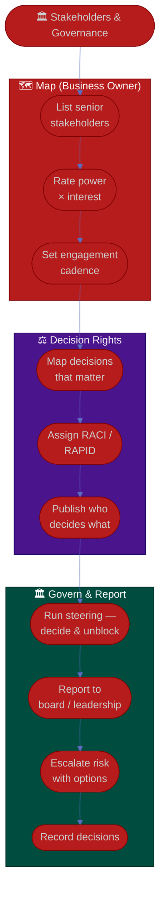

# Procedure: Stakeholders & Governance

**Tags:** #procedure #business-owner #strategy #stakeholders #governance #decision-rights #board
**Roles:** Business Owner · Your Exec / Board · Steering Committee · PM · PO · EM · Finance
**Read Time:** ~12 min

> As owner you operate at the governance layer, where the scarcest resources are **clear decisions** and **senior trust**. This procedure covers mapping senior stakeholders, running steering/governance that decides rather than admires, reporting to the board/leadership, setting **decision rights** (who decides what — RACI / RAPID), and escalating risk at the business level. The principle: **govern to decide and unblock, not to perform — and make decision rights explicit before the disagreement, not during it.**

---

## 📌 Table of Contents
- [The Principle: Govern to Decide](#the-principle-govern-to-decide)
- [Mermaid Swimlane Diagram](#mermaid-swimlane-diagram)
- [ASCII Flow](#ascii-flow)
- [Step-by-Step Responsibility Table](#step-by-step-responsibility-table)
- [Mapping Senior Stakeholders](#mapping-senior-stakeholders)
- [Decision Rights: RACI & RAPID](#decision-rights-raci--rapid)
- [Running Governance & Steering](#running-governance--steering)
- [Board & Leadership Reporting](#board--leadership-reporting)
- [Risk & Escalation at the Business Level](#risk--escalation-at-the-business-level)
- [Anti-Patterns to Avoid](#anti-patterns-to-avoid)
- [Related Documents](#related-documents)

---

## The Principle: Govern to Decide

> A governance forum that only reviews status is a waste of expensive calendars. The owner's governance exists to **make the decisions and clear the blockers that only this group can**. Every steering meeting should end with funded decisions, resolved trade-offs, or removed obstacles — never just a deck everyone nods at.

Two failure modes to avoid:
- **Status theater** — beautiful decks, no decisions; the real issues stay un-surfaced.
- **Decision fog** — nobody knows who actually decides, so everything either escalates to you or stalls. The cure is explicit decision rights.

---

## Mermaid Swimlane Diagram



---

## ASCII Flow

```
STAKEHOLDERS & GOVERNANCE
══════════════════════════════════════════════════════════════════════════════════

🏛️ START
   │
   ▼
┌──────────────────────────────────────────────────────────────────────────────┐
│  MAP SENIOR STAKEHOLDERS                                                     │
│    ① List everyone with power or interest in the line (exec, board, partners) │
│    ② Rate POWER × INTEREST → place in the grid                                │
│    ③ Set engagement cadence per quadrant                                      │
└───────────────┬────────────────────────────────────────────────────────────────┘
                ▼
┌──────────────────────────────────────────────────────────────────────────────┐
│  SET DECISION RIGHTS                                                         │
│    ④ List the decisions that actually matter (scope, budget, go/no-go, pivot) │
│    ⑤ Assign RACI / RAPID — name who decides, who's consulted                  │
│    ⑥ Publish it — so calls get made without escalating everything to you      │
└───────────────┬────────────────────────────────────────────────────────────────┘
                ▼
┌──────────────────────────────────────────────────────────────────────────────┐
│  GOVERN & REPORT                                                             │
│    ⑦ Steering: decide & unblock (not status theater)                          │
│    ⑧ Board/leadership: outcomes, risk, the ask — bad news EARLY               │
│    ⑨ Escalate risk WITH options → ⑩ record every decision                     │
└────────────────────────────────────────────────────────────────────────────────┘
```

---

## Step-by-Step Responsibility Table

| # | Step | Who Owns | Who Helps | Output |
|:--|:-----|:---------|:----------|:-------|
| 1 | List senior stakeholders | Business Owner | Your Exec | Stakeholder list |
| 2 | Rate power × interest | Business Owner | — | Stakeholder grid |
| 3 | Set engagement cadence | Business Owner | — | Engagement plan |
| 4 | Map decisions that matter | Business Owner | PM, PO, Finance | Decision inventory |
| 5 | Assign RACI / RAPID | Business Owner | Your Exec | Decision-rights chart |
| 6 | Run steering forum | Business Owner | Steering members | Decisions + cleared blockers |
| 7 | Report to board/leadership | Business Owner | Finance | Board update |
| 8 | Escalate risk with options | Business Owner | PM, EM | Escalation + recommendation |
| 9 | Record decisions | Business Owner | — | Decision log |

---

## Mapping Senior Stakeholders

Place each senior stakeholder on a **power × interest** grid and engage accordingly:

```
            HIGH POWER
                │
   KEEP         │   MANAGE
   SATISFIED    │   CLOSELY
  (the board)   │  (your exec, key partners)
                │
  ──────────────┼──────────────  INTEREST →
                │
   MONITOR      │   KEEP
  (peripheral)  │   INFORMED
                │  (delivery leads, finance)
            LOW POWER
```

| Quadrant | Strategy |
|:---------|:---------|
| **Manage closely** (high power, high interest) | Frequent, two-way; your exec, major partners, key customers |
| **Keep satisfied** (high power, low interest) | Concise outcome/risk summaries; the board, other execs |
| **Keep informed** (low power, high interest) | Regular updates; delivery leads (PM/PO/EM), finance |
| **Monitor** (low power, low interest) | Light touch; pull in only when relevant |

> Your delivery leads (PM/PO/EM) sit in *keep informed* on governance, but they are *partners*, not stakeholders to manage. You inform and empower them; you don't report up to them.

---

## Decision Rights: RACI & RAPID

Ambiguous decision rights are the single biggest cause of stalled product lines — and of every decision escalating to you. Make them explicit **before** the disagreement.

**RACI** — for tasks and deliverables:

| Letter | Means | Note |
|:------:|:------|:-----|
| **R** | Responsible — does the work | Can be several |
| **A** | Accountable — owns the outcome | Exactly **one** |
| **C** | Consulted — input before | Two-way |
| **I** | Informed — told after | One-way |

**RAPID** — for significant decisions (better when the *decision* itself is the thing):

| Letter | Means |
|:------:|:------|
| **R** | Recommend — frames the proposal |
| **A** | Agree — must sign off (e.g., legal) |
| **P** | Perform — executes once decided |
| **I** | Input — consulted |
| **D** | Decide — the single decision-maker |

Sample decision-rights map for a product line:

| Decision | Decide (D) | Recommend (R) | Input (I) |
|:---------|:-----------|:--------------|:----------|
| Quarterly budget allocation | **Business Owner** | Finance, PM | EM |
| Product priorities / backlog order | **Product Owner** | PM, customers | Business Owner |
| Go / no-go on a launch | **Business Owner** | PM, QA, PO | EM, Sales |
| Hiring within the team | **Eng Manager** | Team Lead | Business Owner |
| Pivot / kill a bet | **Business Owner** | PM, PO, Finance | Exec |

> Notice the owner does **not** decide backlog order — that's the PO's call. Drawing this line in advance is how you empower without abdicating, and how you avoid becoming the bottleneck for every decision.

---

## Running Governance & Steering

- **Steering exists to decide and unblock.** Set the agenda around open decisions and blockers, not a status recap (status goes out *before* the meeting in writing).
- **Pre-read, then decide.** Send the deck/numbers ahead; spend the room's time on judgment calls, not narration.
- **Keep it small.** Only people who can decide or unblock should be in the room.
- **End every session with a decision log** — what was decided, by whom, why — so it isn't re-litigated next month.

---

## Board & Leadership Reporting

The board and senior leadership want **outcomes, risk, and the ask** — at altitude, in minutes.

- **Lead with the headline and a RAG:** are we on track to the plan, and the one number that matters (north-star or revenue).
- **Show the trend, not a snapshot** — direction matters more than a single point.
- **Name the top risks and exactly what you need** — a decision, budget, air cover — with a deadline.
- **Surface bad news early, in person/voice first, then in writing.** The board should never discover a missed number from someone else.

```
RAG quick guide (business level)
🟢 GREEN  — on plan; no help needed
🟡 AMBER  — at risk; mitigation in flight; may need a decision
🔴 RED    — off plan; needs a decision/intervention NOW
```

> For the mechanics of trustworthy status writing, borrow from [PM Stakeholders & Reporting](../pm-leadership/05-stakeholders-and-reporting.md) — the same "truth, early" discipline applies one altitude up.

---

## Risk & Escalation at the Business Level

You own the risks that threaten the *business outcome*, not the delivery-task risks (those sit with the PM).

- **Track business-level risks:** market shifts, key-customer concentration, regulatory/compliance, key-person risk, a failing core bet, runway.
- **Escalate with options, never just problems:** "Our top customer (22% of revenue) is at renewal risk. Options: (a) executive save plan, (b) accelerate the feature they need, (c) accept and diversify. My recommendation is ___."
- **Use the trade-off triangle at portfolio scale** — scope of bets, time, budget, risk. You can't max all four; make the trade explicit and own the call.
- **Record every escalation decision** so the rationale survives the meeting.

For compliance- and money-flow-specific risk, see [Compliance & Accounts](../compliance-and-accounts/README.md) and [Payments & Revenue](../payments-and-revenue/README.md) where relevant.

---

## Anti-Patterns to Avoid

| Anti-Pattern | Why It Hurts | Do Instead |
|:-------------|:-------------|:-----------|
| **Status theater** | Pretty decks, no decisions, real issues hidden | Govern to decide and unblock |
| **Decision fog** | Nobody knows who decides; everything stalls or escalates | Publish RACI/RAPID before the disagreement |
| **Owner decides everything** | You become the bottleneck; the team disempowered | Delegate decisions explicitly (PO owns backlog) |
| **Surprising the board** | A missed number heard secondhand destroys trust | Bad news early, in voice, then writing |
| **Snapshot reporting** | A single point hides the trend | Always show direction over time |
| **Problems without options** | Dumps work on the board; looks rudderless | Escalate with a recommendation |
| **Bloated steering** | Too many people, no decisions | Only deciders & unblockers in the room |
| **Re-litigating decisions** | Wastes senior time monthly | Keep a decision log |

---

## Related Documents
- **Previous:** [04 — Budget, ROI & Investment](./04-budget-roi-and-investment.md)
- **Next:** [06 — Empowering Delivery & Metrics](./06-empowering-delivery-and-metrics.md)
- [01 — First 90 Days](./01-first-90-days.md) · [03 — Vision, Strategy & OKRs](./03-vision-strategy-and-okrs.md)
- **Cross-feed:** [PM Stakeholders & Reporting](../pm-leadership/05-stakeholders-and-reporting.md) · [Product Owner Playbook](../product-owner/README.md) · [Engineering Manager Playbook](../engineering-manager/README.md) · [Compliance & Accounts](../compliance-and-accounts/README.md) · [Management & Leadership](../../management/README.md)

---

*Part of the [Business Owner Playbook](./README.md) · Last updated: 2026-05-31*
