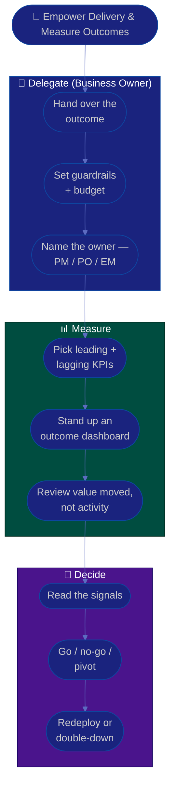

# Procedure: Empowering Delivery & Metrics

**Tags:** #procedure #business-owner #strategy #delegation #metrics #kpis #go-no-go
**Roles:** Business Owner · PM · PO · EM · Teams · Analytics
**Read Time:** ~13 min

> The final owner skill is the hardest: getting results *through* the delivery roles without doing their jobs. This procedure covers empowering the PM/PO/EM, delegating decisions cleanly, building a business KPI dashboard (leading vs lagging), reviewing **outcomes not activity**, and making confident **go/no-go and pivot** calls. The principle: **own the outcome, delegate the path — and measure whether value moved, never whether people looked busy.**

---

## 📌 Table of Contents
- [The Principle: Empower, Don't Micromanage](#the-principle-empower-dont-micromanage)
- [Mermaid Swimlane Diagram](#mermaid-swimlane-diagram)
- [ASCII Flow](#ascii-flow)
- [Step-by-Step Responsibility Table](#step-by-step-responsibility-table)
- [Delegation: Outcome + Guardrails](#delegation-outcome--guardrails)
- [Business KPIs: Leading vs Lagging](#business-kpis-leading-vs-lagging)
- [Reviewing Outcomes, Not Activity](#reviewing-outcomes-not-activity)
- [Go/No-Go and Pivot Decisions](#gono-go-and-pivot-decisions)
- [Anti-Patterns to Avoid](#anti-patterns-to-avoid)
- [Related Documents](#related-documents)

---

## The Principle: Empower, Don't Micromanage

> You hired (or inherited) capable delivery leaders. Your job is to make them *more* capable, not to second-guess them. Empowerment means handing over the **outcome** and the **guardrails**, then trusting the team to find the path — and judging them on whether the outcome moved, not on whether they did it your way. Micromanagement is the fastest way to lose the very people who can deliver your strategy.

Two failure modes to avoid:
- **Abdication** — "you figure it out," with no clear outcome, guardrails, or support. That's not empowerment, it's neglect.
- **Micromanagement** — handing over the outcome but then dictating every step. The team stops thinking and starts waiting.

Healthy empowerment lives between the two: **clear outcomes, clear boundaries, real support, and room to run.**

---

## Mermaid Swimlane Diagram



---

## ASCII Flow

```
EMPOWERING DELIVERY & METRICS
══════════════════════════════════════════════════════════════════════════════════

🤝 START
   │
   ▼
┌──────────────────────────────────────────────────────────────────────────────┐
│  DELEGATE  (Business Owner → PM / PO / EM)                                   │
│    ① Hand over the OUTCOME (the what-matters), not the task list              │
│    ② Set guardrails + budget (the boundaries inside which they're free)       │
│    ③ Name ONE owner per outcome — then get out of the HOW                     │
└───────────────┬────────────────────────────────────────────────────────────────┘
                ▼
┌──────────────────────────────────────────────────────────────────────────────┐
│  MEASURE  (outcomes, never surveillance)                                     │
│    ④ Pick a few LEADING + LAGGING KPIs tied to the north-star                 │
│    ⑤ Stand up a simple outcome dashboard the whole line can see               │
│    ⑥ Review whether VALUE MOVED — not whether people were busy                │
└───────────────┬────────────────────────────────────────────────────────────────┘
                ▼
┌──────────────────────────────────────────────────────────────────────────────┐
│  DECIDE                                                                      │
│    ⑦ Read the signals honestly (incl. the ones you don't like)               │
│    ⑧ Go / no-go / pivot — make the call the team can't                        │
│    ⑨ Redeploy budget from losers · double-down on winners                     │
└────────────────────────────────────────────────────────────────────────────────┘
```

---

## Step-by-Step Responsibility Table

| # | Step | Who Owns | Who Helps | Output |
|:--|:-----|:---------|:----------|:-------|
| 1 | Hand over the outcome | Business Owner | PM, PO | Outcome brief |
| 2 | Set guardrails & budget | Business Owner | Finance | Delegation guardrails |
| 3 | Name the accountable owner | Business Owner | — | Clear single owner |
| 4 | Choose leading + lagging KPIs | Business Owner | Analytics, PO | [North-star + KPIs](./templates/north-star-and-kpi-template.md) |
| 5 | Stand up the dashboard | Business Owner | Analytics | Outcome dashboard |
| 6 | Review outcomes | Business Owner | PM, PO, EM | Outcome review notes |
| 7 | Make go/no-go/pivot calls | Business Owner | PM, PO, Finance | Decision + rationale |
| 8 | Redeploy / double-down | Business Owner | Finance | Re-allocated budget |

---

## Delegation: Outcome + Guardrails

Effective delegation hands over four things and withholds one:

**Hand over:**
1. **The outcome** — the what-matters, expressed as a metric or customer result.
2. **The guardrails** — budget, timeframe, non-negotiables (security, brand, compliance).
3. **The context** — *why* it matters, so the team can make good local trade-offs.
4. **The support** — your availability to unblock and decide fast when asked.

**Withhold:**
- **The how.** The solution, the design, the task breakdown, the sequence — these belong to the PO/PM/team. They're closer to the work and will often find a better path than you would.

| Delegation level | When to use |
|:-----------------|:------------|
| **Decide & act** (full autonomy) | Trusted owner, reversible decision |
| **Decide, then tell me** | Capable owner, you want visibility |
| **Recommend, I decide** | High-stakes or irreversible (go/no-go, big spend) |
| **Let's decide together** | Genuinely ambiguous, shared judgment |

> Match the level to the *stakes and reversibility*, not to your comfort. Most decisions are reversible — push those down. Reserve "I decide" for the genuinely big, hard-to-undo calls.

---

## Business KPIs: Leading vs Lagging

You steer with a small set of KPIs that connect daily work to the business outcome. Capture them in the [North-Star & KPI template](./templates/north-star-and-kpi-template.md).

| Type | What it tells you | Examples |
|:-----|:------------------|:---------|
| **Lagging** | Did we win? (confirms, can't change) | Revenue, gross margin, churn, ARR |
| **Leading** | Are we *about* to win? (predicts, can steer) | Activation rate, trial→paid, pipeline, usage depth |
| **North-star** | The one value metric that ties it together | Weekly active paying accounts |
| **Guardrail** | What we must not break while growing | NPS, incident rate, support load, burn |

- **Lead with leading indicators.** Lagging metrics tell you the quarter is lost *after* it's lost; leading metrics let you steer while it still counts.
- **Pair growth metrics with guardrails.** A team can juice activation by spamming users — the NPS/support guardrail keeps growth humane and sustainable.
- **Keep the dashboard small.** 5–8 metrics the whole line understands beats 40 nobody reads.
- **Make it shared and honest.** Everyone sees the same numbers, including the bad ones. A dashboard that only shows green isn't a dashboard.

---

## Reviewing Outcomes, Not Activity

How you run reviews tells the team what you actually value.

- **Ask "did the metric move and what did we learn?"** — not "are you on schedule?" or "how many tickets closed?"
- **Review at a cadence that fits the bet** — monthly business reviews, quarterly OKR reviews — not daily check-ins that pull leaders out of their work.
- **Treat misses as learning, not blame.** A bet that didn't move the metric but produced a clear insight is a good use of a small budget. Punishing honest misses teaches people to hide them.
- **Never measure individuals via activity dashboards.** Tracking commits, hours, or tickets-per-person destroys trust and optimizes for the wrong thing. Measure **team-level outcomes**; leave individual growth to the [EM](../engineering-manager/README.md).

> The review question that signals a healthy owner: *"What did we learn, and what should we do differently?"* — not *"Who's behind?"*

---

## Go/No-Go and Pivot Decisions

The decisions only you can make. The delivery roles will bring you the evidence; you make the call.

**Go / No-Go** (launch, fund the next stage, kill):
1. **Set the bar in advance** — what evidence would mean go, no-go, or more time? Deciding the bar *after* you see the data invites bias.
2. **Read all the signals**, especially the inconvenient ones. The leading metric that's flat matters more than the demo that looked great.
3. **Decide clearly and fast.** An explicit "no" frees the team and the budget; a slow maybe starves both.

**Pivot** (the strategy isn't working; change direction):
- Distinguish *"the bet is wrong"* from *"we executed the bet poorly."* Pivoting a sound strategy because of an execution stumble wastes the learning; persisting with a disproven strategy wastes the budget.
- A pivot is an owner-level decision with real cost — make it deliberately, communicate the *why* widely, and redeploy the budget with intent. See [04 — Budget, ROI & Investment](./04-budget-roi-and-investment.md).

> Indecision is itself a decision — usually the worst one. Teams can execute a clear "no" far better than they can execute a lingering "maybe."

---

## Anti-Patterns to Avoid

| Anti-Pattern | Why It Hurts | Do Instead |
|:-------------|:-------------|:-----------|
| **Micromanaging the HOW** | Demotivates capable leaders; you become the bottleneck | Hand over outcome + guardrails; trust the path |
| **Abdication** | "You figure it out" with no outcome/support is neglect | Give clear outcomes, boundaries, and real support |
| **Activity metrics** | Tickets/hours/commits optimize for looking busy | Measure outcomes — did value move? |
| **Individual surveillance** | Destroys trust and psychological safety | Team-level outcomes only; growth is the EM's lane |
| **Lagging-only dashboard** | You learn you lost after it's too late | Lead with leading indicators |
| **Growth without guardrails** | You can grow a metric while harming customers | Pair every growth KPI with a guardrail |
| **Slow / no decisions** | A lingering "maybe" starves teams and budget | Decide fast and clearly; set the bar in advance |
| **Blaming honest misses** | Teaches people to hide bad news | Treat misses as learning; reward honesty |

---

## Related Documents
- **Previous:** [05 — Stakeholders & Governance](./05-stakeholders-and-governance.md)
- [01 — First 90 Days](./01-first-90-days.md) · [03 — Vision, Strategy & OKRs](./03-vision-strategy-and-okrs.md) · [04 — Budget, ROI & Investment](./04-budget-roi-and-investment.md)
- **Templates:** [North-Star & KPI](./templates/north-star-and-kpi-template.md) · [OKR](./templates/okr-template.md)
- **Cross-feed:** [Product Owner Playbook](../product-owner/README.md) · [Engineering Manager Playbook](../engineering-manager/README.md) · [PM Leadership Playbook](../pm-leadership/README.md) · [SDLC Series](../../management/sdlc/README.md) · [Management & Leadership](../../management/README.md)

---

*Part of the [Business Owner Playbook](./README.md) · Last updated: 2026-05-31*
