# Procedure: First 90 Days as a New Data / Analytics Lead

**Tags:** #procedure #data-lead #analytics #data #leadership #onboarding #first90days
**Roles:** Data / Analytics Lead · Engineering Manager · Data Engineers · Analysts · PM/PO · Business Owner
**Read Time:** ~14 min

> Your first Data / Analytics Lead role, in a new workspace, is won or lost in the first 90 days — not by rebuilding the warehouse on day 1, but by **earning data credibility before you spend it**. The hardest shift is the one inside you: you are no longer the top analyst who out-queries everyone, you are now a **multiplier accountable for trustworthy data and the decisions made from it**. A data lead earns trust the moment the numbers are right and the insights actually change what people do. This procedure gives you a week-by-week roadmap built on four phases: **Listen → Assess → Plan → Execute.** The fastest way to lose the org's trust is to ship a "better" metric before you understand why today's numbers disagree. Resist it.

---

## 📌 Table of Contents
- [The Core Principle](#the-core-principle)
- [The Analyst → Multiplier Shift](#the-analyst--multiplier-shift)
- [Where You Fit — Data Lead vs EM / PM / Business Owner](#where-you-fit--data-lead-vs-em--pm--business-owner)
- [The Four Phases](#the-four-phases)
- [Mermaid Swimlane Diagram](#mermaid-swimlane-diagram)
- [ASCII Flow](#ascii-flow)
- [Step-by-Step Responsibility Table](#step-by-step-responsibility-table)
- [Phase 1 — Listen (Days 1–14)](#phase-1--listen-days-114)
- [Phase 2 — Assess (Days 15–30)](#phase-2--assess-days-1530)
- [Phase 3 — Plan (Days 31–60)](#phase-3--plan-days-3160)
- [Phase 4 — Execute (Days 61–90)](#phase-4--execute-days-6190)
- [Anti-Patterns to Avoid](#anti-patterns-to-avoid)
- [Related Documents](#related-documents)

---

## The Core Principle

> **Lead through data credibility and trust, not title.** A Data Lead has authority on paper but earns followership in practice. You earn it by making the numbers trustworthy and the insights actionable: reconciling two reports that disagree, killing a stale dashboard everyone secretly distrusts, turning a vague question into a clean answer that changes a decision. Every time the data is right and someone acts on it, you earn trust; every time a dashboard quietly lies or an analysis dead-ends in a slide nobody uses, you spend it.

A Data / Analytics Lead has three jobs, in priority order:
1. **Make the data trustworthy** — the numbers people see are right, fresh, and consistent on your watch.
2. **Grow the team** — your analysts and data engineers get better, and the org gets more data-literate, because you are there.
3. **Improve the system** — the metric layer, pipelines, governance, and self-serve capability get better over time so insight gets cheaper.

In the first 90 days you mostly do #1 (make people trust the numbers again), set up #2 (relationships and team), and earn the right to do #3 (change the data platform and how the org uses it).

> **The whole job in one line:** make data *trustworthy* AND *used*. Trustworthy-but-ignored is a museum. Used-but-wrong is a liability. You own both halves.

---

## The Analyst → Multiplier Shift

The single biggest trap of the role is staying the **analyst** — the person who grabs the gnarliest SQL question and out-models everyone. That made you a great IC; it makes you a mediocre lead. Your output is now measured in **decisions enabled across the org**, not queries you personally wrote.

| | **Analyst (old you)** | **Multiplier (new you)** |
|:--|:----------------------|:-------------------------|
| Measure of success | Your analyses delivered | Decisions the org made on trustworthy data |
| The hard question | You answer it | You make sure it gets answered — often by enabling someone else |
| Ad hoc requests | You take the ticket | You build self-serve so the ticket disappears |
| The metric | Lives in your query | Defined once, certified, reused by everyone |
| Knowledge | In your head & notebooks | In a metrics catalog, docs, and the team |
| Bus factor | You ARE the source of truth | You build the single source of truth |
| Time in the warehouse | ~90% | ~30–50% (and at leadership altitude, not hands-on ETL) |

> You will still write SQL and read pipelines — credibility decays if you go fully hands-off, and you must be able to smell a wrong number. But you work at **leadership altitude**: you own the metric definitions, the data contracts, and the trust, not every transformation. If every "whose number is right?" debate routes through your keyboard, you've recreated the analyst trap with extra steps.

---

## Where You Fit — Data Lead vs EM / PM / Business Owner

New data leads get pulled in every direction because everyone wants numbers. Be clear about what you own versus your neighbors:

| Role | Owns | Authority | Does NOT |
|:-----|:-----|:----------|:---------|
| **Data / Analytics Lead** | Data trust, the metric layer / SSOT, governance, analytics enablement, the data team's craft | Over metric definitions, data quality standards, what counts as "certified" | Set business strategy or own delivery dates |
| **Engineering Manager** | People — hiring, growth, performance, team health | Direct people-management authority | Decide metric definitions or data correctness |
| **Project / Product Manager** | Delivery, scope, the roadmap, dates | Over what ships and when | Decide which number is the right number |
| **Business Owner** | The questions, the strategy, the P&L | Funding & go/no-go; sets what matters | Tell you *how* to define or compute a metric |

> **The clean handoff:** the **Business Owner** asks *"is revenue growing?"*, the **PM** decides *what to build and when*, and **you** guarantee that *"revenue" means one thing, is computed correctly, is fresh, and the answer actually reaches the decision.* You are the bridge between *what the business asks* and *a number it can bet on.*

If your company is small, you may wear several of these hats at once — name which one you're wearing in each conversation so the org knows whether you're deciding the question or guaranteeing the answer.

---

## The Four Phases

| Phase | Days | Goal | Output |
|:------|:-----|:-----|:-------|
| **1 — Listen** | 1–14 | Understand people, data, and pain — change nothing | Stakeholder map, notes |
| **2 — Assess** | 15–30 | Diagnose data maturity objectively across 6 dimensions | [Data Assessment](./02-data-assessment.md) |
| **3 — Plan** | 31–60 | Propose a prioritized data trust & enablement plan | [Quality & Governance](./03-data-quality-and-governance.md) + [SSOT](./04-metrics-and-single-source-of-truth.md) roadmap |
| **4 — Execute** | 61–90 | Ship 1–2 high-impact trust wins, build cadence | Reconciled metric + first metrics on data health |

---

## Mermaid Swimlane Diagram

```mermaid
%%{init: {'theme': 'dark', 'themeVariables': {'primaryColor': '#1a237e', 'primaryBorderColor': '#0d47a1', 'primaryTextColor': '#ffffff', 'lineColor': '#5c6bc0', 'secondaryColor': '#004d40', 'tertiaryColor': '#4a148c', 'background': '#1e1e1e', 'mainBkg': '#1a237e', 'nodeBorder': '#0d47a1', 'clusterBkg': '#263238', 'titleColor': '#ffffff', 'edgeLabelBackground': '#263238'},
  'themeCSS': 'svg { background-color: #1e1e1e !important; padding: 1rem !important; border-radius: 8px !important; } text, tspan { fill: #ffffff !important; } .edgeLabel rect { fill: #1e1e1e !important; }'
}}%%
flowchart TD
    START([🎯 Day 1 — New Data Lead])

    subgraph LISTEN ["👂 Phase 1 — Listen (Day 1–14)"]
        L1([Meet manager —<br>clarify mandate])
        L2([1-on-1 with<br>every analyst / DE])
        L3([Meet PM, PO,<br>Business Owner, Eng])
        L4([Trace one number<br>source → dashboard])
    end

    subgraph ASSESS ["🔍 Phase 2 — Assess (Day 15–30)"]
        A1([Audit data maturity<br>6 dimensions])
        A2([Find top 3 pains<br>impact × effort])
        A3([Write Data<br>Assessment])
        A4([Review with manager])
    end

    subgraph PLAN ["🗺️ Phase 3 — Plan (Day 31–60)"]
        P1([Draft trust + SSOT<br>+ enablement plan])
        P2([Prioritize fixes —<br>impact vs effort])
        P3([Socialize plan<br>with stakeholders])
        P4([Get buy-in + capacity])
    end

    subgraph EXEC ["🚀 Phase 4 — Execute (Day 61–90)"]
        E1([Reconcile 1 key metric<br>quick win])
        E2([Stand up cadence<br>+ 1-on-1s])
        E3([Define data-health<br>metrics])
        E4([90-day review<br>with manager])
    end

    START --> L1 --> L2 --> L3 --> L4
    L4 --> A1 --> A2 --> A3 --> A4
    A4 --> P1 --> P2 --> P3 --> P4
    P4 --> E1 --> E2 --> E3 --> E4

    style LISTEN fill:#1a237e,stroke:#0d47a1,color:#fff
    style ASSESS fill:#4a148c,stroke:#12005e,color:#fff
    style PLAN fill:#004d40,stroke:#00251a,color:#fff
    style EXEC fill:#1b5e20,stroke:#003300,color:#fff
```



---

## ASCII Flow

```
FIRST 90 DAYS — NEW DATA / ANALYTICS LEAD
══════════════════════════════════════════════════════════════════════════════════

🎯 DAY 1
   │
   ▼
┌──────────────────────────────────────────────────────────────────────────────┐
│  PHASE 1 — LISTEN  (Day 1–14)            RULE: change nothing yet             │
│    ① Meet your manager → clarify your mandate & how success is measured       │
│    ② 1-on-1 with every analyst & data engineer (current or future reports)    │
│    ③ Meet PM/PO, Business Owner, Eng, top stakeholders — "where does data     │
│       hurt, and which number do you NOT trust?"                               │
│    ④ Trace ONE key number end-to-end: source → pipeline → metric → dashboard  │
└────────────────────────────────────────┬─────────────────────────────────────┘
                                         │
                                         ▼
┌──────────────────────────────────────────────────────────────────────────────┐
│  PHASE 2 — ASSESS  (Day 15–30)           RULE: diagnose, don't prescribe      │
│    ① Audit 6 dims: quality/trust, pipelines, governance, SSOT, enablement,    │
│       team skills                                                             │
│    ② Identify top 3 pains by IMPACT × EFFORT (not by loudest stakeholder)      │
│    ③ Write the Data Assessment (facts + maturity scores, not opinions)         │
│    ④ Review findings with your manager — align before you publish widely       │
└────────────────────────────────────────┬─────────────────────────────────────┘
                                         │
                                         ▼
┌──────────────────────────────────────────────────────────────────────────────┐
│  PHASE 3 — PLAN  (Day 31–60)             RULE: prioritize ruthlessly          │
│    ① Draft the trust + SSOT + enablement plan (metric layer, contracts)        │
│    ② Rank fixes: Impact (High/Med/Low) vs Effort — pick the quadrant wins      │
│    ③ Socialize the plan 1-on-1 BEFORE the group meeting (no surprises)         │
│    ④ Secure buy-in, capacity, and a clear owner for each item                  │
└────────────────────────────────────────┬─────────────────────────────────────┘
                                         │
                                         ▼
┌──────────────────────────────────────────────────────────────────────────────┐
│  PHASE 4 — EXECUTE  (Day 61–90)          RULE: ship visible TRUST wins        │
│    ① Reconcile 1 high-stakes metric — one certified number everyone agrees on  │
│    ② Establish cadence: intake triage, 1-on-1s, metric reviews, retros         │
│    ③ Define 3–5 data-health metrics (freshness, incident rate, trust score)    │
│    ④ 90-day review: what changed, what the data shows, what's next             │
└────────────────────────────────────────────────────────────────────────────────┘
```

---

## Step-by-Step Responsibility Table

| # | Step | Who Owns | Who Helps | Output |
|:--|:-----|:---------|:----------|:------------------|
| 1 | Clarify mandate & success metrics | Data Lead | Eng Manager | 1-page "what success looks like" |
| 2 | 1-on-1 with each analyst / data engineer | Data Lead | — | Notes per person ([template](./templates/one-on-one-template.md)) |
| 3 | Meet cross-functional partners | Data Lead | PM, PO, Business Owner | Stakeholder map |
| 4 | Trace one key number end-to-end | Data Lead | A buddy analyst/DE | Lineage notes + first trust gaps |
| 5 | Audit data maturity | Data Lead | The team | [Data Assessment](./02-data-assessment.md) |
| 6 | Identify top 3 pains | Data Lead | Eng Manager | Prioritized pain list |
| 7 | Draft trust + SSOT + enablement plan | Data Lead | Senior analysts, DE | [Quality & Governance](./03-data-quality-and-governance.md) · [SSOT](./04-metrics-and-single-source-of-truth.md) |
| 8 | Prioritize & socialize plan | Data Lead | Eng Manager | Roadmap + RACI |
| 9 | Ship a trust quick win | Data Lead | The team | One reconciled, certified metric |
| 10 | Establish cadence & metrics | Data Lead | The team | [Enablement & Growth](./06-enablement-and-growth.md) |
| 11 | 90-day review | Data Lead | Eng Manager | Review deck + next-quarter plan |

---

## Phase 1 — Listen (Days 1–14)

**Goal:** Build a mental model of people, data, and pain. **Make zero changes to pipelines, metrics, or dashboards.**

### Week 1 — People & mandate
- **First meeting with your manager.** Ask the questions that define your job:
  - "What does success look like at 90 days? At 6 months?"
  - "Which number does leadership most distrust right now?"
  - "What's the one data thing you most want fixed?"
  - "Am I expected to stay hands-on in the warehouse, and roughly how much?"
  - "Who are my key stakeholders, and what's the history with each?"
  - "What's my budget, tooling authority, and hiring authority?"
- **1-on-1 with every analyst and data engineer.** This is the highest-leverage thing you do all month. Use the same opening questions for each (see [one-on-one template](./templates/one-on-one-template.md)):
  - "What's working well that I should NOT change?"
  - "What's the most frustrating part of your week — technical and otherwise?"
  - "Which dashboard or metric do you secretly not trust?"
  - "If you were me, what's the first thing you'd fix?"
  - "What do you want to learn / where do you want to grow?"
- **Listen 80%, talk 20%.** Take notes. Do not promise new pipelines or redefinitions yet.

### Week 2 — Data & process
- **Meet cross-functional partners:** PM/PO, the Business Owner / sponsor, Eng leads, and the loudest dashboard consumers (Finance, Sales, Marketing). Ask each: *"Which number do you rely on, which do you NOT trust, and where does waiting on data slow you down?"*
- **Trace one key number end-to-end** — pick a high-stakes metric (revenue, active users, conversion) and follow it from raw source → ingestion → transformation → metric definition → the dashboard leadership reads. Feeling the real lineage teaches you more than any wiki, and you'll usually find your first trust gap here.
- **Read everything:** the warehouse schema and naming conventions, the BI/dashboard inventory, the data catalog (if any), the last 3 retro/incident notes, the request backlog/ticket queue, and any existing metric definitions. Note where two reports compute "the same" thing differently.

> 🚩 **Red flag for yourself:** If by day 14 you're itching to "just redefine the obviously wrong metric," that urge is the trap. Write it down and save it for Phase 3. The conflicting definition usually has a history — and a stakeholder — you don't know yet.

---

## Phase 2 — Assess (Days 15–30)

**Goal:** Turn impressions into an evidence-based diagnosis. See the full method in **[02 — Data Assessment](./02-data-assessment.md)**.

- Audit across six dimensions: **Data Quality & Trust, Pipelines & Architecture, Governance & Access, Metric Definitions / SSOT, Analytics Enablement / Self-Serve, Team Skills.**
- Quantify where you can: data freshness SLAs vs reality, pipeline failure/incident rate, number of conflicting definitions for top metrics, ticket queue size and turnaround, % of stakeholders who self-serve.
- Score each dimension on a **1–5 maturity scale** so progress is measurable next quarter.
- Rank pains by **Impact × Effort**, not by whichever executive complained last.
- Produce the **[Data Assessment](./templates/data-assessment-template.md)** — facts and scores first, recommendations clearly separated.
- **Review with your manager privately first.** Align on the story before any wide publication.

---

## Phase 3 — Plan (Days 31–60)

**Goal:** Convert the diagnosis into a prioritized, bought-in plan for trust and enablement.

- Draft the plan across the three pillars you own: **trust** ([Quality & Governance](./03-data-quality-and-governance.md)), the **metric layer / single source of truth** ([SSOT](./04-metrics-and-single-source-of-truth.md)), and **enablement** ([Enablement & Growth](./06-enablement-and-growth.md)).
- Build an improvement roadmap using an **Impact vs Effort** grid:

```
            HIGH IMPACT
                │
    SCHEDULE    │   DO NOW
   (big bets)   │  (quick wins)
                │
  ──────────────┼──────────────  EFFORT →
                │
    AVOID /     │   FILL-IN
   DEPRIORITIZE │  (easy, low value)
                │
            LOW IMPACT
```

- **Socialize 1-on-1 before the group.** Walk each stakeholder through the plan privately. The group meeting should hold zero surprises — and a metric definition the org helped shape is a definition the org will actually use.
- For each roadmap item: a clear **owner** (often *not* you — delegate to grow people), a **due window**, and a **definition of done**.

---

## Phase 4 — Execute (Days 61–90)

**Goal:** Deliver visible value and lock in a sustainable rhythm — as a multiplier, not the org's query desk.

- **Ship a trust quick win the whole org feels** — most powerfully, **reconcile one high-stakes metric** so every team finally sees the same number, certify it, and document it once in the [metrics catalog](./04-metrics-and-single-source-of-truth.md). Killing one "whose number is right?" fire earns more trust than any platform migration.
- **Establish the operating cadence:** how requests are intake'd and triaged (so the team isn't a ticket desk), regular 1-on-1s, a recurring metric/insight review, retro participation. See **[06 — Enablement & Growth](./06-enablement-and-growth.md)**.
- **Define 3–5 starter data-health metrics** (don't over-instrument): data freshness vs SLA, pipeline incident rate, time-to-answer for requests, number of certified metrics, self-serve adoption.
- **Run the 90-day review** with your manager: what changed, what the data shows, what's next quarter, and what you need.

---

## Anti-Patterns to Avoid

| Anti-Pattern | Why It Hurts | Do Instead |
|:-------------|:-------------|:-----------|
| **Redefining a key metric in week 1** | You don't yet know why today's numbers disagree or who depends on each | Listen first; reconcile in Phase 4 with buy-in |
| **The report factory / ticket desk** | If every request is a one-off SQL ticket, the team scales linearly and never improves the system | Triage requests; invest in self-serve and a metric layer |
| **Dashboard graveyard** | Building dashboards no one trusts or opens wastes the team and erodes credibility | Build for a decision; retire stale dashboards ruthlessly |
| **Data without decisions** | Analysis that ends in a slide nobody acts on is theater | Tie every analysis to a decision; log the decision |
| **Boiling the data-quality ocean** | Trying to fix every table at once finishes nothing | Fix the highest-stakes metric first; expand outward |
| **Staying the top analyst** | Grabbing every hard query caps the org at your throughput | Enable others; own definitions, not every answer |
| **"At my last company we…"** | Erodes trust and ignores this context | Learn THIS data; borrow ideas silently |
| **Skipping the manager alignment** | Publishing findings your manager hasn't seen is a career risk | Always review privately first |

---

## Related Documents
- **Next step:** [02 — Data State Assessment](./02-data-assessment.md)
- [03 — Data Quality & Governance](./03-data-quality-and-governance.md) · [04 — Metrics & Single Source of Truth](./04-metrics-and-single-source-of-truth.md)
- [05 — Experimentation & Decisions](./05-experimentation-and-decisions.md) · [06 — Enablement & Growth](./06-enablement-and-growth.md)
- **Templates:** [30/60/90 Plan](./templates/30-60-90-plan-template.md) · [1-on-1](./templates/one-on-one-template.md)
- **Cross-feed:** [DoR vs DoD](../../management/02-dor-and-dod-guide.md) · [Team Lead Playbook](../team-lead/README.md) · [PM Leadership Playbook](../pm-leadership/README.md) · [QA Leadership Playbook](../qa-leadership/README.md)

---

*Part of the [Data & Analytics Lead Playbook](./README.md) · Last updated: 2026-05-31*
