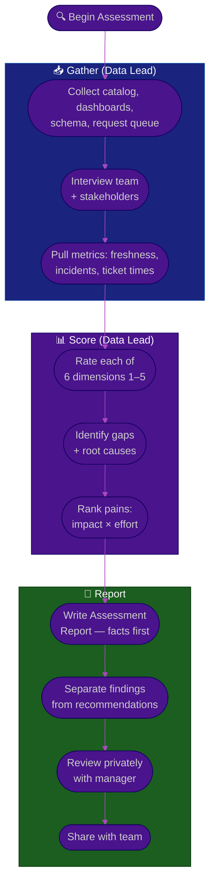

# Procedure: Data State Assessment — Auditing a New Workspace

**Tags:** #procedure #data-lead #analytics #data #assessment #audit
**Roles:** Data / Analytics Lead · Analysts · Data Engineers · Eng Lead · PM/PO · Business Owner
**Read Time:** ~12 min

> Before you can improve the data, you must see it clearly. This procedure is a repeatable audit across **six dimensions** that turns vague impressions ("our numbers feel unreliable") into evidence ("three teams compute revenue three ways, and the exec dashboard is 36h stale"). Run it in Phase 2 of your [first 90 days](./01-first-90-days.md). The output is a **Data Assessment Report** your manager can act on.

---

## 📌 Table of Contents
- [The Six Dimensions](#the-six-dimensions)
- [Mermaid Swimlane Diagram](#mermaid-swimlane-diagram)
- [ASCII Flow](#ascii-flow)
- [Step-by-Step Responsibility Table](#step-by-step-responsibility-table)
- [Dimension Checklists](#dimension-checklists)
- [Scoring the Maturity](#scoring-the-maturity)
- [Prioritizing Pains](#prioritizing-pains)
- [Related Documents](#related-documents)

---

## The Six Dimensions

| # | Dimension | Key Question |
|:--|:----------|:-------------|
| 1 | **Data Quality & Trust** | Are the numbers right, fresh, complete, and consistent — and do people believe them? |
| 2 | **Pipelines & Architecture** | How does data flow from source to consumption, and is it reliable? |
| 3 | **Governance & Access** | Who can see what, is it documented, and is privacy/compliance handled? |
| 4 | **Metric Definitions / SSOT** | Is each metric defined once, or does every team have its own version? |
| 5 | **Analytics Enablement / Self-Serve** | Can stakeholders answer their own questions, or is the team a ticket queue? |
| 6 | **Team Skills** | What skills exist on the data team, and where are the gaps? |

---

## Mermaid Swimlane Diagram



---

## ASCII Flow

```
DATA STATE ASSESSMENT
══════════════════════════════════════════════════════════════════════════════════

🔍 START
   │
   ▼
┌──────────────────────────────────────────────────────────────────────────────┐
│  GATHER EVIDENCE                                                             │
│    ① Collect: schema, dashboard inventory, data catalog, request queue        │
│    ② Interview: analysts, DEs, PM/PO, Business Owner, top consumers           │
│    ③ Pull hard numbers: freshness vs SLA, pipeline incidents, conflicting     │
│       definitions, ticket turnaround, self-serve adoption                     │
└────────────────────────────────────────┬─────────────────────────────────────┘
                                         │
                                         ▼
┌──────────────────────────────────────────────────────────────────────────────┐
│  SCORE THE 6 DIMENSIONS  (1 = chaotic … 5 = optimized)                       │
│    Quality/Trust · Pipelines · Governance · SSOT · Enablement · Team Skills   │
│    ④ For each: current score, evidence, root cause of the gap                 │
│    ⑤ Rank pains by IMPACT × EFFORT — find the top 3                           │
└────────────────────────────────────────┬─────────────────────────────────────┘
                                         │
                                         ▼
┌──────────────────────────────────────────────────────────────────────────────┐
│  WRITE & REVIEW                                                              │
│    ⑥ Assessment Report: Findings (facts) | Recommendations (clearly labeled)  │
│    ⑦ Review with manager PRIVATELY → then share with team                     │
└────────────────────────────────────────────────────────────────────────────────┘
```

---

## Step-by-Step Responsibility Table

| # | Step | Who Owns | Who Helps | Output |
|:--|:-----|:---------|:----------|:-------|
| 1 | Collect artifacts | Data Lead | Team, Eng | Document & dashboard inventory |
| 2 | Interview team + stakeholders | Data Lead | — | Pain notes (verbatim) |
| 3 | Pull objective metrics | Data Lead | Data Engineers, Eng | Data-health snapshot |
| 4 | Score 6 dimensions | Data Lead | Team (sanity check) | Maturity scorecard |
| 5 | Root-cause the gaps | Data Lead | Senior analyst/DE | Gap → cause map |
| 6 | Rank pains | Data Lead | Eng Manager | Top-3 prioritized list |
| 7 | Write report | Data Lead | — | [Data Assessment](./templates/data-assessment-template.md) |
| 8 | Review & share | Data Lead | Eng Manager | Aligned, published report |

---

## Dimension Checklists

### 1. Data Quality & Trust
- [ ] Is data **accuracy** validated anywhere, or is "looks right" the only check?
- [ ] **Completeness** — are there silent gaps (dropped rows, missing late-arriving data)?
- [ ] **Timeliness** — what's the real freshness of key tables vs what stakeholders assume?
- [ ] **Consistency** — do the same facts agree across tables/reports?
- [ ] Is there any monitoring/alerting on data quality, or do consumers find bugs first?
- [ ] Which dashboards do people **privately distrust**? (Ask directly — it's the truest signal.)

### 2. Pipelines & Architecture
- [ ] What are the sources, and how is data ingested (batch, streaming, manual exports)?
- [ ] Is there a layered model (raw → staged → marts) or a tangle of one-off queries?
- [ ] How often do pipelines fail, and how is failure detected and recovered?
- [ ] Is transformation logic version-controlled and tested, or hand-edited in the warehouse?
- [ ] Is lineage known — can you say what feeds a given table? (See [03 — Quality & Governance](./03-data-quality-and-governance.md))

### 3. Governance & Access
- [ ] Who can access what, and is access granted by role or ad hoc?
- [ ] Is sensitive/PII data identified, masked, and access-controlled?
- [ ] Are there privacy/compliance obligations (GDPR, regional, contractual) being met?
- [ ] Is there a data catalog / documentation, or is it tribal knowledge?
- [ ] Is ownership of each dataset/domain assigned, or orphaned?

### 4. Metric Definitions / SSOT
- [ ] Are core metrics (revenue, active users, conversion) defined **once**, or per team?
- [ ] When two reports disagree, is there a way to tell which is right?
- [ ] Is there a metrics catalog / semantic layer, or do definitions live in scattered SQL?
- [ ] Is there a notion of **certified** vs **exploratory** data? (See [04 — SSOT](./04-metrics-and-single-source-of-truth.md))
- [ ] How many active definitions exist for the top 5 metrics? (Count them — it's revealing.)

### 5. Analytics Enablement / Self-Serve
- [ ] Can stakeholders answer common questions themselves, or must they file a ticket?
- [ ] How big is the request queue, and what's the median turnaround?
- [ ] Is there documentation/training so non-analysts can read data correctly?
- [ ] Are dashboards built for decisions, or is it a graveyard of unused reports?
- [ ] What fraction of the team's time is reactive tickets vs proactive improvement?

### 6. Team Skills
- [ ] How many analysts vs data engineers? What's the manual-vs-platform skill mix?
- [ ] Who owns which domain (the "bus factor")?
- [ ] Skill gaps (data modeling, experimentation/stats, pipeline engineering, BI, governance)?
- [ ] Are roles & responsibilities documented, or tribal?
- [ ] Morale & turnover history — why did the last lead leave?

---

## Scoring the Maturity

Rate each dimension on a simple 1–5 scale. This makes progress visible later.

| Score | Level | Meaning |
|:-----:|:------|:--------|
| 1 | **Chaotic** | No process; numbers are heroics and luck, no one trusts the data |
| 2 | **Reactive** | Some pipelines/reports, but inconsistent, undocumented, found-broken-by-users |
| 3 | **Defined** | Documented definitions & pipelines, followed most of the time |
| 4 | **Managed** | Monitored, tested, certified metrics, self-serve emerging |
| 5 | **Optimized** | Trustworthy by default, self-serve, data drives decisions, self-correcting |

> Record the score **and the evidence**. "SSOT: 2 — three teams compute revenue differently; no certified definition; Finance and Sales disagree by ~8%." A score without evidence is just an opinion.

---

## Prioritizing Pains

Don't fix the loudest complaint — fix the costliest one. Score each pain:

```
PAIN PRIORITY  =  IMPACT (decisions at risk / trust lost)  ×  EFFORT (inverse — easier wins rank up)
```

| Pain | Impact | Effort | Priority | Notes |
|:-----|:------:|:------:|:--------:|:------|
| Conflicting revenue numbers | High (exec decisions) | Med | 🔴 High | Reconcile + certify first |
| Stale exec dashboard (36h late) | High | Low | 🔴 High | Quick win, high visibility |
| Analysts as ticket desk | High (team can't scale) | High | 🟡 Med | Needs self-serve investment |
| No PII access controls | High (compliance risk) | Med | 🔴 High | Risk, not just annoyance |
| Slow ad hoc query turnaround | Med | Low | 🟢 Low | Annoying, not decision-critical |

Pick the **top 3**. These feed directly into your [Phase 3 plan](./01-first-90-days.md#phase-3--plan-days-3160).

---

## Related Documents
- **Previous:** [01 — First 90 Days](./01-first-90-days.md)
- **Next:** [03 — Data Quality & Governance](./03-data-quality-and-governance.md)
- **Then:** [04 — Metrics & Single Source of Truth](./04-metrics-and-single-source-of-truth.md)
- **Template:** [Data Assessment Report](./templates/data-assessment-template.md)
- **Cross-feed:** [DoR vs DoD](../../management/02-dor-and-dod-guide.md) · [SDLC Series](../../management/sdlc/README.md)

---

*Part of the [Data & Analytics Lead Playbook](./README.md) · Last updated: 2026-05-31*
