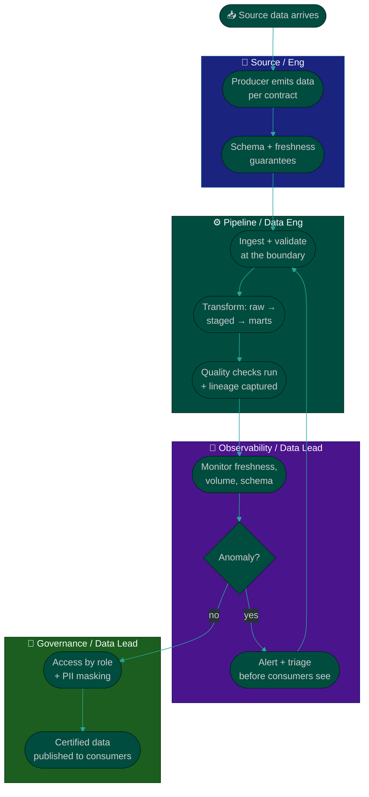

# Procedure: Owning Data Trust — Quality & Governance

**Tags:** #procedure #data-lead #analytics #data #quality #governance #lineage
**Roles:** Data / Analytics Lead · Data Engineers · Analysts · Eng · Security/Compliance · PM/PO
**Read Time:** ~13 min

> Data trust is the foundation everything else stands on — a brilliant analysis built on wrong data is worse than no analysis. This procedure is how you, as the lead, **own data trust at leadership altitude**: you define the quality dimensions that matter, set data contracts at the boundaries, make lineage knowable, stand up observability so you find problems before consumers do, and put governance and access controls in place. You don't hand-build every check — you set the standard and make trust the default.

---

## 📌 Table of Contents
- [The Trust Equation](#the-trust-equation)
- [The Four Quality Dimensions](#the-four-quality-dimensions)
- [Mermaid Swimlane Diagram](#mermaid-swimlane-diagram)
- [ASCII Flow](#ascii-flow)
- [Step-by-Step Responsibility Table](#step-by-step-responsibility-table)
- [Data Contracts](#data-contracts)
- [Lineage](#lineage)
- [Observability & Monitoring](#observability--monitoring)
- [Governance, Access & Privacy](#governance-access--privacy)
- [Anti-Patterns to Avoid](#anti-patterns-to-avoid)
- [Related Documents](#related-documents)

---

## The Trust Equation

> **Trust = Correctness × Freshness × Consistency × Transparency.** If any factor is zero, trust is zero. A correct-but-stale number is distrusted. A fresh-but-inconsistent number ("which one is right?") is distrusted. And a number nobody can explain or trace is distrusted even when it's right. Your job is to keep all four factors high — and to make it *visible* that you do.

Trust is asymmetric: it takes months of right numbers to build and one wrong number on the exec dashboard to lose. That asymmetry is why a new lead's highest-leverage early win is almost always a **trust win** (see [01 — First 90 Days](./01-first-90-days.md#phase-4--execute-days-6190)), not a new feature.

---

## The Four Quality Dimensions

| Dimension | Question | Example failure |
|:----------|:---------|:----------------|
| **Accuracy** | Are the values correct? | Revenue double-counts refunded orders |
| **Completeness** | Is anything silently missing? | A source feed dropped 4% of rows last night |
| **Timeliness** | Is it fresh enough for the decision? | Dashboard is 36h stale; users assume "today" |
| **Consistency** | Do the same facts agree everywhere? | Sales and Finance "revenue" differ by 8% |

> For each high-stakes table, write down the **target** for each dimension (e.g., "freshness ≤ 2h", "completeness ≥ 99.5% of expected rows"). Targets you can measure are the line between "data quality" as a slogan and as an SLA.

---

## Mermaid Swimlane Diagram



---

## ASCII Flow

```
DATA TRUST PIPELINE — QUALITY & GOVERNANCE
══════════════════════════════════════════════════════════════════════════════════

📥 SOURCE
   │
   ▼
┌──────────────────────────────────────────────────────────────────────────────┐
│  CONTRACT AT THE BOUNDARY                                                    │
│    ① Producer guarantees schema, types, freshness, and volume                 │
│    ② Ingestion validates against the contract — reject/quarantine bad data    │
└────────────────────────────────────────┬─────────────────────────────────────┘
                                         │
                                         ▼
┌──────────────────────────────────────────────────────────────────────────────┐
│  TRANSFORM + CHECK  (raw → staged → marts)                                   │
│    ③ Version-controlled, tested transformations (no hand edits in warehouse)  │
│    ④ Quality checks: accuracy, completeness, timeliness, consistency          │
│    ⑤ Lineage captured: every table knows its upstream + downstream            │
└────────────────────────────────────────┬─────────────────────────────────────┘
                                         │
                                         ▼
┌──────────────────────────────────────────────────────────────────────────────┐
│  OBSERVE  (find problems before consumers do)                                │
│    ⑥ Monitor freshness, row volume, schema drift, null/distribution shifts    │
│    ⑦ Anomaly → alert the owning team → triage → fix → backfill                │
└────────────────────────────────────────┬─────────────────────────────────────┘
                                         │
                                         ▼
┌──────────────────────────────────────────────────────────────────────────────┐
│  GOVERN + PUBLISH                                                            │
│    ⑧ Access by role; PII identified, masked, audited                          │
│    ⑨ Only CERTIFIED data reaches consumer dashboards & the metric layer       │
└────────────────────────────────────────────────────────────────────────────────┘
```

---

## Step-by-Step Responsibility Table

| # | Step | Who Owns | Who Helps | Output |
|:--|:-----|:---------|:----------|:-------|
| 1 | Define quality dimensions & targets | Data Lead | Senior analyst/DE | Per-table SLAs |
| 2 | Establish data contracts at sources | Data Lead | Eng (producers), DE | Contract specs |
| 3 | Validate at ingestion boundary | Data Engineers | Data Lead | Reject/quarantine rules |
| 4 | Make transforms tested & versioned | Data Engineers | Data Lead | Tested transformation code |
| 5 | Capture & expose lineage | Data Engineers | Data Lead | Lineage map / catalog |
| 6 | Stand up observability | Data Lead | DE, Eng | Monitors + alert routing |
| 7 | Define incident response for data | Data Lead | Team | Data-incident runbook |
| 8 | Set governance & access policy | Data Lead | Security/Compliance | Access matrix + PII policy |
| 9 | Certify & publish trusted data | Data Lead | Analysts | Certified datasets/metrics |

---

## Data Contracts

A **data contract** is an explicit agreement between a data producer (an app team, a source system) and you, the consumer. It is the single most effective way to stop "garbage in" — because it moves quality enforcement to the boundary, before bad data poisons everything downstream.

A contract specifies, at minimum:
- **Schema** — fields, types, and what's nullable.
- **Semantics** — what each field *means* (a `status` of `2` means what?).
- **Freshness** — how often it lands and the max acceptable delay.
- **Volume** — expected row counts / ranges, so a silent drop is detectable.
- **Ownership** — who to call when it breaks, on both sides.
- **Change policy** — how breaking changes are announced (never silently).

> Start contracts where breakage hurts most — the sources feeding your top metrics. You don't need a contract for every table on day one; you need one for the feed that, when it broke last quarter, made the revenue dashboard wrong.

---

## Lineage

**Lineage** answers two questions you will be asked constantly: *"Where does this number come from?"* and *"If I change this table, what breaks?"* Without it, every fix is archaeology and every change is a gamble.

- **Upstream lineage** (origins): trace a metric back through marts → staging → raw → source. Essential for debugging a wrong number and for the [trace-one-number exercise](./01-first-90-days.md#week-2--data--process) in your first weeks.
- **Downstream lineage** (impact): before changing a definition or table, know every dashboard, report, and model that depends on it — so a "small" change doesn't silently break Finance's close.
- Capture lineage **automatically** where your tooling allows (most modern transformation and catalog tools derive it from the code). Hand-maintained lineage rots.

> Lineage is the prerequisite for confidently doing the [metric reconciliation](./04-metrics-and-single-source-of-truth.md) work — you can't unify a definition you can't trace.

---

## Observability & Monitoring

Observability is how you keep the trust promise: **you find the problem before the CEO does.** The goal is to flip the org from "consumers report bad data" (trust-destroying) to "the data team caught and fixed it first" (trust-building).

Monitor, at least, for your high-stakes tables:
- **Freshness** — did the data land on time? (Alert when it doesn't.)
- **Volume** — is row count within the expected range? (Catches silent drops & dupes.)
- **Schema drift** — did a column change type or disappear?
- **Distribution / null rate** — did a key field's nulls or values shift suddenly?
- **Reconciliation** — do critical totals tie out against a trusted source?

Pair monitoring with a lightweight **data-incident runbook**: severity levels, who's paged, how consumers are notified ("the revenue dashboard is delayed; do not use until 14:00"), and a blameless post-incident note. Treat a wrong number on a key dashboard like an outage — because for decision-making, it is one.

---

## Governance, Access & Privacy

Governance is not bureaucracy — it's how trust scales without becoming risk. At leadership altitude you set policy; you don't approve every access request by hand.

- **Access by role, least privilege.** Grant access to data domains by role, not one-off favors. Ad hoc grants become an un-auditable mess and a breach waiting to happen.
- **Identify and protect sensitive data.** Know where PII / financial / regulated data lives. Mask, tokenize, or restrict it. You cannot protect what you haven't catalogued.
- **Privacy & compliance.** Understand obligations (GDPR/CCPA, regional residency, contractual). Support deletion/access requests, retention limits, and audit trails. Partner with Security/Legal — own the data side, not the legal interpretation.
- **Ownership.** Every important dataset has a named owner. Orphaned data is untrusted data.
- **Documentation / catalog.** A searchable catalog with definitions, owners, freshness, and certification status turns tribal knowledge into a shared asset and feeds [self-serve](./06-enablement-and-growth.md).

---

## Anti-Patterns to Avoid

| Anti-Pattern | Why It Hurts | Do Instead |
|:-------------|:-------------|:-----------|
| **Quality checks only at the dashboard** | Bad data has already spread everywhere | Validate at the source boundary with contracts |
| **Consumers find the bugs** | Every miss is a public trust hit | Observability that alerts you first |
| **Hand-edited transforms in the warehouse** | Untraceable, untestable, unrepeatable | Version-controlled, tested transformations |
| **No lineage** | Every debug is archaeology; every change is a gamble | Capture lineage automatically |
| **Ad hoc access grants** | Un-auditable, compliance risk | Role-based, least-privilege access |
| **"We'll govern PII later"** | "Later" is after the breach | Catalog & protect sensitive data from day one |
| **Treating a wrong number as a minor bug** | It's an outage for every decision made on it | Data-incident runbook + blameless post-mortem |
| **Boiling the ocean on quality** | Nothing gets finished | Start with the tables feeding top metrics |

---

## Related Documents
- **Previous:** [02 — Data State Assessment](./02-data-assessment.md)
- **Next:** [04 — Metrics & Single Source of Truth](./04-metrics-and-single-source-of-truth.md)
- [05 — Experimentation & Decisions](./05-experimentation-and-decisions.md) · [06 — Enablement & Growth](./06-enablement-and-growth.md)
- **Template:** [Metric Definition](./templates/metric-definition-template.md)
- **Cross-feed:** [DoR vs DoD](../../management/02-dor-and-dod-guide.md) · [Engineering Manager Playbook](../engineering-manager/README.md) · [QA Leadership Playbook](../qa-leadership/README.md)

---

*Part of the [Data & Analytics Lead Playbook](./README.md) · Last updated: 2026-05-31*
