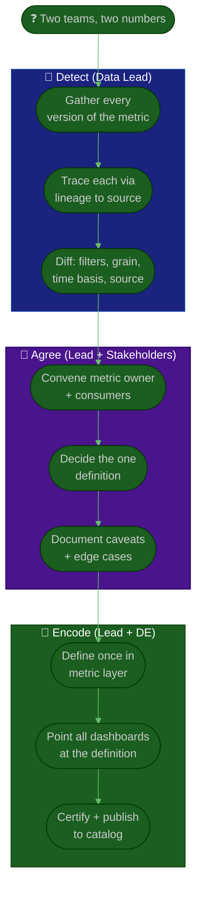

# Procedure: The Metric Layer — Defining a Single Source of Truth

**Tags:** #procedure #data-lead #analytics #data #metrics #ssot #semantic-layer
**Roles:** Data / Analytics Lead · Analysts · Data Engineers · PM/PO · Business Owner · Finance
**Read Time:** ~13 min

> "Whose number is right?" is the most expensive question in a data org — every time it's asked, a meeting derails, a decision stalls, and trust erodes. This procedure kills that question by building a **metric layer**: each metric is defined **once**, owned, documented, and certified, so every dashboard and report computes it the same way. The single source of truth (SSOT) isn't a database — it's an agreement, encoded so it can't drift.

---

## 📌 Table of Contents
- [Why Numbers Disagree](#why-numbers-disagree)
- [The Metric Layer](#the-metric-layer)
- [Certified vs Exploratory](#certified-vs-exploratory)
- [Mermaid Swimlane Diagram](#mermaid-swimlane-diagram)
- [ASCII Flow](#ascii-flow)
- [Step-by-Step Responsibility Table](#step-by-step-responsibility-table)
- [Anatomy of a Metric Definition](#anatomy-of-a-metric-definition)
- [Running a Reconciliation](#running-a-reconciliation)
- [Anti-Patterns to Avoid](#anti-patterns-to-avoid)
- [Related Documents](#related-documents)

---

## Why Numbers Disagree

When two teams report different "revenue," it's almost never because one is "wrong" — it's because they quietly made different, reasonable choices. The usual culprits:

| Source of disagreement | Example |
|:-----------------------|:--------|
| **Different filters** | One includes refunds/test accounts, the other doesn't |
| **Different grain** | One counts orders, the other counts line items |
| **Different time basis** | Booking date vs recognition date vs ship date |
| **Different source table** | One reads the app DB, the other a stale export |
| **Different definitions** | "Active user" = logged in, or = took an action? |
| **Different freshness** | Same query, run against data 36h apart |

> The fix is rarely "find the right number." It's **"agree on one definition and encode it once."** Most reconciliations end not with a winner but with a documented choice everyone can live with.

---

## The Metric Layer

A **metric layer** (a.k.a. semantic layer / metrics catalog) is the place where each metric is defined exactly once, in code or config, and every consumer — dashboards, reports, notebooks, exports — pulls from it. Change the definition once, and every surface updates consistently.

What it gives you:
- **Consistency** — one definition, computed identically everywhere.
- **Discoverability** — a catalog where anyone can find "active customer" and read its exact meaning.
- **Governance** — definitions are reviewed and versioned, not improvised in a dashboard filter.
- **Leverage** — the lead owns *definitions*, not every query; the org self-serves on trusted building blocks.

> Stay tool-agnostic. Whether you use a dedicated semantic layer, your BI tool's modeling layer, or a governed set of warehouse views, the principle is identical: **define once, reuse everywhere, change in one place.**

---

## Certified vs Exploratory

Not all data deserves equal trust, and pretending it does is its own trust problem. Make the distinction explicit and visible:

| Tier | Meaning | Use for |
|:-----|:--------|:--------|
| 🟢 **Certified** | Reviewed, owned, monitored, definition locked in the metric layer | Exec dashboards, board numbers, decisions |
| 🟡 **Exploratory** | Analyst's working data — useful, not guaranteed | Hypotheses, drafts, one-off investigations |

- **Label everything.** A certified badge on a dashboard tells leadership "you can bet on this." The absence of one tells an analyst "verify before you ship it upward."
- **Exploratory is allowed and good** — it's where insight is born. The harm is only when exploratory numbers leak into decisions wearing a certified face.
- **Promotion path:** exploratory analysis that proves durable gets reviewed, defined in the metric layer, and certified.

---

## Mermaid Swimlane Diagram



---

## ASCII Flow

```
KILLING "WHOSE NUMBER IS RIGHT?" — METRIC RECONCILIATION
══════════════════════════════════════════════════════════════════════════════════

❓ TWO TEAMS, TWO NUMBERS
   │
   ▼
┌──────────────────────────────────────────────────────────────────────────────┐
│  DETECT THE DRIFT                                                            │
│    ① Gather every live version of the metric (each team's query)              │
│    ② Trace each back to source via lineage                                    │
│    ③ Diff the choices: filters · grain · time basis · source table · freshness│
└────────────────────────────────────────┬─────────────────────────────────────┘
                                         │
                                         ▼
┌──────────────────────────────────────────────────────────────────────────────┐
│  AGREE ON ONE DEFINITION  (the hard part is people, not SQL)                 │
│    ④ Convene the metric owner + the disagreeing consumers                      │
│    ⑤ Decide ONE definition — document WHY the choice was made                 │
│    ⑥ Capture caveats & known edge cases (refunds, test accounts, late data)   │
└────────────────────────────────────────┬─────────────────────────────────────┘
                                         │
                                         ▼
┌──────────────────────────────────────────────────────────────────────────────┐
│  ENCODE IT ONCE                                                              │
│    ⑦ Define the metric a single time in the metric layer                      │
│    ⑧ Re-point every dashboard/report at the one definition                    │
│    ⑨ Mark CERTIFIED, publish to the catalog, announce the change              │
└────────────────────────────────────────────────────────────────────────────────┘
```

---

## Step-by-Step Responsibility Table

| # | Step | Who Owns | Who Helps | Output |
|:--|:-----|:---------|:----------|:-------|
| 1 | Inventory all versions of the metric | Data Lead | Analysts | List of live definitions |
| 2 | Trace each to source | Data Lead | Data Engineers | Lineage diff |
| 3 | Diff the modeling choices | Data Lead | Analysts | Root-cause of disagreement |
| 4 | Convene owner + consumers | Data Lead | PM/PO, Business Owner | Decision meeting |
| 5 | Decide the one definition | Metric Owner | Data Lead, stakeholders | Agreed definition + rationale |
| 6 | Write the metric spec | Data Lead | Analyst | [Metric Definition](./templates/metric-definition-template.md) |
| 7 | Encode once in metric layer | Data Engineers | Data Lead | Single source definition |
| 8 | Re-point all surfaces | Analysts | Data Engineers | Consistent dashboards |
| 9 | Certify, publish, announce | Data Lead | — | Catalog entry + comms |

---

## Anatomy of a Metric Definition

Every certified metric gets a spec (use the [metric definition template](./templates/metric-definition-template.md)). A complete spec answers every question that could cause a future disagreement:

- **Name** — the canonical name (and known aliases to retire).
- **Definition** — a one-sentence plain-English meaning a non-analyst understands.
- **Formula** — the exact computation.
- **Grain** — the level each row represents (per user? per order? per day?).
- **Source** — the upstream certified table(s) it's built from.
- **Owner** — the named person accountable for it.
- **Certified status** — 🟢 certified / 🟡 exploratory, and the review date.
- **Caveats** — edge cases, exclusions (refunds, test accounts), and known limitations.

> The caveats section is where reconciliations are won or lost. "Revenue **excludes** refunds and internal test accounts; **recognized** on ship date" is the sentence that prevents the next eight arguments.

---

## Running a Reconciliation

Reconciliation is mostly a **people** exercise wearing a SQL costume. The data work (diff the queries) is the easy 20%; the hard 80% is getting Finance and Sales to agree which definition wins — and to feel ownership of the result.

1. **Bring the disagreers into one room.** Don't reconcile in private and decree the answer; the loser of an unseen decision won't adopt it.
2. **Make it about the choice, not the person.** "Both are reasonable; they make different assumptions" defuses defensiveness.
3. **Decide and document the *why*.** The rationale matters as much as the formula — it's what stops the re-litigation.
4. **Encode once, re-point everything, announce loudly.** Until every surface uses the one definition, you've just created a third number.
5. **Certify and catalog it.** Now it's the source of truth — and the next person who asks "whose number is right?" gets a link, not a meeting.

> This is the highest-leverage early win for a new data lead (see [01 — Phase 4](./01-first-90-days.md#phase-4--execute-days-6190)). One reconciled, certified, high-stakes metric buys more trust than a quarter of platform work.

---

## Anti-Patterns to Avoid

| Anti-Pattern | Why It Hurts | Do Instead |
|:-------------|:-------------|:-----------|
| **Definitions live in dashboard filters** | Every dashboard drifts independently | Define once in the metric layer |
| **Reconciling in private, then decreeing** | The unconvinced team keeps their own number | Decide with the stakeholders in the room |
| **Picking a "winner" without rationale** | The argument reopens next quarter | Document *why* the choice was made |
| **No certified/exploratory distinction** | Draft numbers reach decisions unflagged | Label tiers; gate decisions on certified |
| **Renaming without retiring aliases** | Old name lingers and re-diverges | Deprecate aliases; redirect to canonical |
| **Encoding once but not re-pointing surfaces** | You've just created a third number | Migrate every consumer, then announce |
| **Owning every query yourself** | You become the bottleneck and SSOT-in-your-head | Own definitions; let the org self-serve |

---

## Related Documents
- **Previous:** [03 — Data Quality & Governance](./03-data-quality-and-governance.md)
- **Next:** [05 — Experimentation & Decisions](./05-experimentation-and-decisions.md)
- [06 — Enablement & Growth](./06-enablement-and-growth.md)
- **Template:** [Metric Definition](./templates/metric-definition-template.md)
- **Cross-feed:** [DoR vs DoD](../../management/02-dor-and-dod-guide.md) · [Product Owner Playbook](../product-owner/README.md) · [Business Owner Playbook](../business-owner/README.md)

---

*Part of the [Data & Analytics Lead Playbook](./README.md) · Last updated: 2026-05-31*
