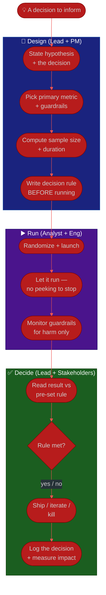

# Procedure: Sound Experimentation & Turning Analysis into Decisions

**Tags:** #procedure #data-lead #analytics #data #experimentation #ab-testing #decisions
**Roles:** Data / Analytics Lead · Analysts · PM/PO · Business Owner · Eng · Data Engineers
**Read Time:** ~13 min

> Data only matters when it changes what people do. This procedure covers the second half of your mandate — **decisions made from trustworthy data**: how to run experiments that produce honest answers (clear hypotheses, A/B tests, sample size and significance, guardrails), how to avoid the statistical traps that produce confident nonsense (p-hacking, HARKing, peeking), and how to convert analysis into decisions that get logged and measured. A wrong experiment is worse than none: it launders a bad decision in the credibility of data.

---

## 📌 Table of Contents
- [Analysis Exists to Serve a Decision](#analysis-exists-to-serve-a-decision)
- [Anatomy of a Sound Experiment](#anatomy-of-a-sound-experiment)
- [The Statistics That Keep You Honest](#the-statistics-that-keep-you-honest)
- [Mermaid Swimlane Diagram](#mermaid-swimlane-diagram)
- [ASCII Flow](#ascii-flow)
- [Step-by-Step Responsibility Table](#step-by-step-responsibility-table)
- [Avoiding the Traps](#avoiding-the-traps)
- [Decision Logs & Measuring Impact](#decision-logs--measuring-impact)
- [Anti-Patterns to Avoid](#anti-patterns-to-avoid)
- [Related Documents](#related-documents)

---

## Analysis Exists to Serve a Decision

> **Before any analysis, ask: "What decision will this change, and what would each outcome lead us to do?"** If no answer changes any action, don't run it. Analysis with no decision attached is the [data-without-decisions anti-pattern](./01-first-90-days.md#anti-patterns-to-avoid) — expensive theater.

This reframes your team's work. You are not a query desk filling requests; you are a **decision-support function**. The lead's job is to push every analysis and every experiment back to the decision it serves — and to make sure the decision actually gets made and recorded.

---

## Anatomy of a Sound Experiment

A trustworthy experiment is designed **before** any data is collected, and written down. Use the [experiment brief template](./templates/experiment-brief-template.md). It pins down:

| Element | Question it answers |
|:--------|:--------------------|
| **Hypothesis** | What do we believe, and why? Stated *before* the test |
| **Primary metric** | The ONE metric that decides success |
| **Guardrail metrics** | What must NOT get worse (latency, churn, refunds) |
| **Design** | A/B split, unit of randomization, eligibility |
| **Sample size** | How many units, computed from the effect we care about |
| **Duration** | How long to run — and the commitment not to stop early |
| **Decision rule** | "If primary metric +X% at p<0.05 and guardrails hold → ship" |

> The decision rule is written **before** the experiment starts. Pre-committing to the rule is the single most powerful defense against fooling yourself after the data arrives.

---

## The Statistics That Keep You Honest

You don't need to be a statistician, but as the lead you set the bar and catch the errors. The essentials:

- **Sample size & power.** Decide the minimum effect worth detecting, then compute the sample size *up front*. An underpowered test that shows "no significant difference" hasn't proven the change is useless — it just couldn't see.
- **Statistical significance (p-value).** Roughly, the chance you'd see this result if there were truly no effect. A common bar is p<0.05, but it's a convention, not a law. Significance ≠ importance — a "significant" 0.1% lift may not be worth shipping.
- **Practical significance.** Always ask "is the effect *big enough to matter*?" alongside "is it real?"
- **Confidence intervals.** Prefer reporting the range of plausible effects over a bare yes/no — "+2% to +6%" tells a richer story than "significant."
- **Guardrails.** A win on the primary metric that tanks a guardrail (page latency, refund rate, long-term retention) is not a win.

---

## Mermaid Swimlane Diagram



---

## ASCII Flow

```
SOUND EXPERIMENTATION → DECISION
══════════════════════════════════════════════════════════════════════════════════

💡 A DECISION TO INFORM
   │
   ▼
┌──────────────────────────────────────────────────────────────────────────────┐
│  DESIGN  (before any data)                                                   │
│    ① Hypothesis + the decision it serves                                      │
│    ② ONE primary metric + guardrail metrics (what must not get worse)         │
│    ③ Sample size & duration from the minimum effect worth detecting           │
│    ④ Decision rule WRITTEN DOWN before launch (pre-commit)                    │
└────────────────────────────────────────┬─────────────────────────────────────┘
                                         │
                                         ▼
┌──────────────────────────────────────────────────────────────────────────────┐
│  RUN  (resist the urge to interfere)                                         │
│    ⑤ Randomize properly; launch A vs B                                        │
│    ⑥ Run to planned duration — NO peeking-to-stop (it inflates false wins)    │
│    ⑦ Watch guardrails only to halt on real HARM                               │
└────────────────────────────────────────┬─────────────────────────────────────┘
                                         │
                                         ▼
┌──────────────────────────────────────────────────────────────────────────────┐
│  DECIDE  (the whole point)                                                   │
│    ⑧ Compare result to the PRE-SET rule — not to a story you now prefer       │
│    ⑨ Ship / iterate / kill — and LOG the decision + rationale                 │
│    ⑩ Measure post-launch impact; confirm the lift was real                    │
└────────────────────────────────────────────────────────────────────────────────┘
```

---

## Step-by-Step Responsibility Table

| # | Step | Who Owns | Who Helps | Output |
|:--|:-----|:---------|:----------|:-------|
| 1 | Frame the decision | PM/PO or Business Owner | Data Lead | Decision + options |
| 2 | Write the hypothesis | Data Lead | Analyst, PM | Hypothesis statement |
| 3 | Choose primary + guardrail metrics | Data Lead | PM | Metric set (certified) |
| 4 | Compute sample size & duration | Analyst | Data Lead | Power calculation |
| 5 | Write the decision rule | Data Lead | PM, Business Owner | [Experiment Brief](./templates/experiment-brief-template.md) |
| 6 | Implement randomization & launch | Eng | Analyst, DE | Running experiment |
| 7 | Run to duration, monitor guardrails | Analyst | Eng | Clean results |
| 8 | Analyze vs the pre-set rule | Analyst | Data Lead | Result readout |
| 9 | Decide & log | PM/Business Owner | Data Lead | Decision log entry |
| 10 | Measure realized impact | Data Lead | Analyst | Impact follow-up |

---

## Avoiding the Traps

These are the ways smart teams fool themselves. As the lead, you are the last line of defense.

- **p-hacking** — slicing the data many ways until *something* clears p<0.05. With enough segments, false positives are guaranteed. **Defense:** pre-register the primary metric and the cuts you'll examine.
- **HARKing** (Hypothesizing After Results are Known) — finding a pattern, then pretending you predicted it. It turns noise into a "finding." **Defense:** write the hypothesis before you look; label post-hoc findings as exploratory, to be confirmed by a fresh test.
- **Peeking / optional stopping** — checking the test repeatedly and stopping the moment it's significant. This dramatically inflates false positives. **Defense:** fix the duration in advance, or use a method explicitly designed for sequential looks.
- **Multiple comparisons** — testing 20 metrics and celebrating the one that "won." **Defense:** one primary metric; correct for the rest or treat them as exploratory.
- **Ignoring guardrails** — shipping a primary-metric win that quietly raised churn. **Defense:** guardrails are part of the decision rule, not an afterthought.
- **Survivorship / selection bias** — non-random assignment or analyzing only who stayed. **Defense:** randomize properly; analyze who was *assigned*, not who *finished* (intent-to-treat).

> A culture norm worth setting early: **a null result is a real result.** If killing experiments is treated as failure, your team learns to p-hack until something "wins." Celebrate honest negatives — they save the company from shipping nothing-burgers.

---

## Decision Logs & Measuring Impact

An experiment that doesn't end in a recorded decision is wasted. A **decision log** is a lightweight, append-only record of consequential decisions:

| Field | Example |
|:------|:--------|
| **Date** | 2026-04-18 |
| **Decision** | Ship the new checkout layout to 100% |
| **Evidence** | Experiment #214: +3.1% conversion (CI +1.2% to +5.0%), guardrails held |
| **Decision-maker** | PM (Lina), with Data Lead sign-off on the analysis |
| **Rationale** | Met pre-set rule; effect practically meaningful |
| **Revisit** | Re-measure realized lift at +30 days |

Why it matters:
- **Accountability & learning** — six months later you can see *why* you chose this, and whether it worked.
- **Closing the loop** — the log's "revisit" field forces you to **measure realized impact**. Many "+3% lift" experiments don't hold up in production; confirming (or not) is how a data org earns lasting credibility.
- **Reducing re-litigation** — decided-and-logged beats re-arguing.

> Owning the decision log is one of the clearest ways a Data Lead moves from "answers questions" to "drives trustworthy decisions." The PM or Business Owner makes the call; you guarantee it was made on honest evidence and that someone checks whether it worked.

---

## Anti-Patterns to Avoid

| Anti-Pattern | Why It Hurts | Do Instead |
|:-------------|:-------------|:-----------|
| **Analysis with no decision attached** | Expensive theater; nothing changes | Tie every analysis to a decision up front |
| **Deciding the rule after seeing data** | You'll rationalize the result you want | Pre-commit the decision rule before launch |
| **Peeking and stopping early** | Inflates false positives badly | Fix duration; use sequential methods if needed |
| **Slicing until something is significant** | Manufactured findings (p-hacking) | Pre-register primary metric & cuts |
| **Treating significance as importance** | Ships trivial "wins" | Check practical effect size too |
| **No guardrails** | A win that tanks churn/latency | Guardrails are part of the decision rule |
| **Never re-measuring post-launch** | "Lifts" silently evaporate | Decision log with a revisit date |
| **Punishing null results** | Trains the team to p-hack | Celebrate honest negatives |

---

## Related Documents
- **Previous:** [04 — Metrics & Single Source of Truth](./04-metrics-and-single-source-of-truth.md)
- **Next:** [06 — Enablement & Growth](./06-enablement-and-growth.md)
- [03 — Data Quality & Governance](./03-data-quality-and-governance.md)
- **Template:** [Experiment Brief](./templates/experiment-brief-template.md)
- **Cross-feed:** [DoR vs DoD](../../management/02-dor-and-dod-guide.md) · [Product Owner Playbook](../product-owner/README.md) · [PM Leadership Playbook](../pm-leadership/README.md) · [Business Owner Playbook](../business-owner/README.md)

---

*Part of the [Data & Analytics Lead Playbook](./README.md) · Last updated: 2026-05-31*
