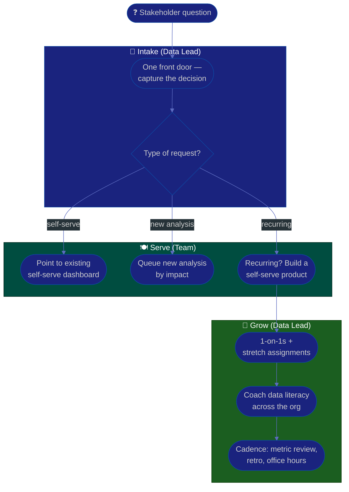

# Procedure: Enablement, Cadence & Growing the Data Team

**Tags:** #procedure #data-lead #analytics #data #enablement #self-serve #mentoring
**Roles:** Data / Analytics Lead · Analysts · Data Engineers · PM/PO · Business Owner · Eng
**Read Time:** ~12 min

> A data team that answers every question by hand scales linearly and burns out; a data team that **enables the org to answer its own questions** scales the impact of every person on it. This procedure covers the multiplier half of the role: building self-serve analytics and data literacy across the org, serving stakeholders without becoming a ticket desk, partnering with PM/PO/Business Owner/Eng, and growing your analysts and data engineers through cadence, 1-on-1s, and mentoring.

---

## 📌 Table of Contents
- [From Ticket Desk to Platform](#from-ticket-desk-to-platform)
- [Self-Serve & Data Literacy](#self-serve--data-literacy)
- [Serving Stakeholders Without Becoming a Queue](#serving-stakeholders-without-becoming-a-queue)
- [Mermaid Swimlane Diagram](#mermaid-swimlane-diagram)
- [ASCII Flow](#ascii-flow)
- [Step-by-Step Responsibility Table](#step-by-step-responsibility-table)
- [Working With Partners](#working-with-partners)
- [Growing the Team](#growing-the-team)
- [Operating Cadence](#operating-cadence)
- [Anti-Patterns to Avoid](#anti-patterns-to-avoid)
- [Related Documents](#related-documents)

---

## From Ticket Desk to Platform

> **Every recurring question is a self-serve product you haven't built yet.** The first time someone asks "how many active customers in EU?", answer it. The third time, build the certified dataset and dashboard so the fourth person never has to ask you.

The trap that consumes new data leads is the [report factory / ticket desk](./01-first-90-days.md#anti-patterns-to-avoid): a queue of one-off requests that grows faster than the team. You escape it by treating the data team as a **platform**, not a service window — the org pulls trusted, reusable building blocks instead of pushing tickets.

| | **Ticket desk (the trap)** | **Platform (the goal)** |
|:--|:---------------------------|:------------------------|
| Unit of work | One-off query per request | Reusable certified dataset/dashboard |
| Scaling | Linear with headcount | Sub-linear — questions self-serve |
| Team's time | ~80% reactive | Shifts toward proactive enablement |
| Stakeholder waits | On the queue | On nothing — self-serves |

---

## Self-Serve & Data Literacy

Self-serve has two halves, and a tool without the second half just creates a [dashboard graveyard](./01-first-90-days.md#anti-patterns-to-avoid).

1. **The means** — certified building blocks (the [metric layer](./04-metrics-and-single-source-of-truth.md)), a searchable catalog with definitions and owners, and well-built, decision-oriented dashboards. People can only self-serve on data they can find and trust.
2. **The literacy** — teaching the org to read data correctly: what a metric means, the difference between certified and exploratory, why a 3% week-over-week move might be noise, and how to spot when a chart is misleading. Run short "how to read our data" sessions, office hours, and a glossary.

> Self-serve is not "here's the warehouse, good luck." That produces a fresh wave of conflicting numbers. Self-serve is *governed*: people build on certified definitions, not raw tables, so freedom doesn't recreate the chaos you just fixed.

---

## Serving Stakeholders Without Becoming a Queue

You can't say "no tickets" — real questions need answers. The art is an **intake and triage** system that protects the team's time while serving the business:

- **One front door.** A single intake channel/form, not five managers DMing analysts. Capture the *decision* behind each request — half evaporate when asked "what will you do differently with the answer?"
- **Triage by impact.** Sort requests: quick self-serve (point them at an existing dashboard), genuine new analysis (queue by impact), or "this keeps coming up" (turn into a self-serve product).
- **Protect maker time.** Reserve capacity for proactive platform/enablement work, or it gets eaten entirely by reactive tickets and the team never gets ahead.
- **Make the queue visible.** A transparent backlog lets stakeholders see trade-offs and lets you push prioritization decisions back to PM/Business Owner instead of absorbing them silently.

---

## Mermaid Swimlane Diagram



---

## ASCII Flow

```
ENABLEMENT, CADENCE & GROWTH
══════════════════════════════════════════════════════════════════════════════════

❓ STAKEHOLDER QUESTION
   │
   ▼
┌──────────────────────────────────────────────────────────────────────────────┐
│  INTAKE  (one front door)                                                    │
│    ① Single channel/form; capture the DECISION behind the request             │
│    ② Triage: self-serve? · new analysis? · recurring (→ build a product)?     │
└────────────────────────────────────────┬─────────────────────────────────────┘
                                         │
                                         ▼
┌──────────────────────────────────────────────────────────────────────────────┐
│  SERVE  (without becoming a queue)                                           │
│    ③ Self-serve   → point to existing certified dashboard                     │
│    ④ New analysis → queue by impact; protect maker time                       │
│    ⑤ Recurring    → build a reusable, certified self-serve product            │
└────────────────────────────────────────┬─────────────────────────────────────┘
                                         │
                                         ▼
┌──────────────────────────────────────────────────────────────────────────────┐
│  GROW THE TEAM + THE ORG                                                     │
│    ⑥ 1-on-1s, stretch assignments, ownership of domains                       │
│    ⑦ Teach data literacy across the org (read metrics, certified vs explore)  │
│    ⑧ Cadence: metric/insight review, retro, office hours, 90-day check-ins    │
└────────────────────────────────────────────────────────────────────────────────┘
```

---

## Step-by-Step Responsibility Table

| # | Step | Who Owns | Who Helps | Output |
|:--|:-----|:---------|:----------|:-------|
| 1 | Stand up a single intake front door | Data Lead | PM/PO | Intake channel/form |
| 2 | Triage requests by impact | Data Lead | Team | Visible, prioritized queue |
| 3 | Convert recurring asks to self-serve | Data Lead | Analysts, DE | Certified dashboards/datasets |
| 4 | Run data-literacy enablement | Data Lead | Analysts | Sessions + glossary |
| 5 | Assign domain ownership | Data Lead | — | Owners per data domain |
| 6 | Run regular 1-on-1s | Data Lead | — | [1-on-1 notes](./templates/one-on-one-template.md) |
| 7 | Set growth goals & stretch work | Data Lead | Each report | Growth plan per person |
| 8 | Establish operating cadence | Data Lead | Team | Metric review, retro, office hours |

---

## Working With Partners

You are the bridge between *what the business asks* and *a number it can bet on*. Each partner needs a different posture (see the role boundaries in [01](./01-first-90-days.md#where-you-fit--data-lead-vs-em--pm--business-owner)):

- **Business Owner** — sets the questions and strategy. Your job: translate fuzzy strategic questions ("are we growing the right segment?") into measurable metrics and honest answers. Push back when a question can't be answered with the data you have — and say what it would take.
- **Product Owner** — owns value and the backlog. Partner on which experiments to run and which metrics define product success. Feed them trustworthy evidence so the backlog is value-ranked on data, not opinion.
- **PM / Project Manager** — owns delivery and dates. Give them realistic timelines for data work and flag data dependencies early.
- **Engineering** — owns the systems producing your raw data. Partner on [data contracts](./03-data-quality-and-governance.md#data-contracts) so quality is enforced at the source.
- **Engineering Manager** — owns people. If you don't have direct people-management authority over your team, partner closely with the EM on growth, performance, and hiring. (See [Engineering Manager Playbook](../engineering-manager/README.md).)

---

## Growing the Team

Your output is the team's growth, not your queries. Grow people deliberately:

- **Domain ownership.** Give each analyst/DE a domain (revenue, growth, a product area) they own end-to-end — definitions, quality, the dashboards. Ownership grows people faster than tickets and reduces your bus factor.
- **Stretch assignments.** Hand the gnarly reconciliation or the first experiment design to someone ready to grow, and coach them through it — don't grab it yourself.
- **Balance the craft.** Most teams skew toward either analysis or engineering. Identify the gap (data modeling, stats/experimentation, pipeline engineering, BI, governance) and close it through hiring, training, or pairing.
- **Career paths.** Analysts and data engineers grow differently — make both an IC depth track and a leadership track visible, and tie 1-on-1 growth goals to them.

---

## Operating Cadence

Lock in a sustainable rhythm so trust and enablement compound instead of decaying:

| Cadence | Cadence | Purpose |
|:--------|:--------|:--------|
| **1-on-1s** | Weekly/biweekly | Growth, blockers, feedback ([template](./templates/one-on-one-template.md)) |
| **Metric / insight review** | Weekly | What the data shows; what decisions it implies |
| **Data-health check** | Weekly | Freshness, incidents, queue — own the trust metrics |
| **Office hours** | Weekly | Stakeholders bring questions; you grow self-serve & literacy |
| **Retro** | Per cycle | Improve how the data team works |
| **Stakeholder review** | Monthly | Re-align priorities with PM/PO/Business Owner |

> Keep your own scoreboard small (see [01 — Phase 4](./01-first-90-days.md#phase-4--execute-days-6190)): data freshness vs SLA, incident rate, time-to-answer, number of certified metrics, self-serve adoption. These prove the platform is working — and protect you from being measured only by ticket volume.

---

## Anti-Patterns to Avoid

| Anti-Pattern | Why It Hurts | Do Instead |
|:-------------|:-------------|:-----------|
| **Answering every ask by hand** | Team scales linearly, then burns out | Convert recurring asks to self-serve |
| **"Self-serve = here's the warehouse"** | Recreates conflicting numbers | Govern self-serve on certified building blocks |
| **Dashboards with no literacy** | A graveyard nobody trusts or reads | Pair tools with training & a glossary |
| **No front door for requests** | Analysts get DM'd into chaos | One intake channel, triaged by impact |
| **Absorbing prioritization silently** | You become the bottleneck & scapegoat | Make the queue visible; push trade-offs to PM/Owner |
| **Hoarding the hard problems** | Caps the team at your throughput; no growth | Delegate stretch work; coach the solver |
| **Measuring only ticket volume** | Rewards the desk, punishes the platform | Track trust & enablement metrics too |

---

## Related Documents
- **Previous:** [05 — Experimentation & Decisions](./05-experimentation-and-decisions.md)
- **Start of series:** [01 — First 90 Days](./01-first-90-days.md)
- [03 — Data Quality & Governance](./03-data-quality-and-governance.md) · [04 — Metrics & SSOT](./04-metrics-and-single-source-of-truth.md)
- **Template:** [1-on-1 Notes](./templates/one-on-one-template.md)
- **Cross-feed:** [Engineering Manager Playbook](../engineering-manager/README.md) · [Team Lead Playbook](../team-lead/README.md) · [Product Owner Playbook](../product-owner/README.md) · [Business Owner Playbook](../business-owner/README.md)

---

*Part of the [Data & Analytics Lead Playbook](./README.md) · Last updated: 2026-05-31*
