# Procedure: First 90 Days as a New Designer Lead

**Tags:** #procedure #designer-lead #design #ux #leadership #onboarding #first90days
**Roles:** Designer Lead / Design Lead · Design Manager · Designers · PM/PO · Engineering · QA
**Read Time:** ~14 min

> Your first Designer Lead role, in a new workspace, is won or lost in the first 90 days — not by redesigning the product on day 1, but by **earning craft credibility before you spend it**. The hardest shift is the one inside you: you are no longer paid to be the best individual designer, you are paid to be a **multiplier** of the whole design team's quality and growth. And unlike an engineering lead, you have almost no formal authority over what ships — design **earns** its seat through trust, evidence, and visibly better outcomes. This procedure gives you a week-by-week roadmap built on four phases: **Listen → Assess → Plan → Execute.** The fastest way to lose a new design team is to arrive and "fix the pixels" before you understand why the product looks the way it does. Resist it.

---

## 📌 Table of Contents
- [The Core Principle](#the-core-principle)
- [The IC-Designer → Multiplier Shift](#the-ic-designer--multiplier-shift)
- [Designer Lead vs PM vs PO vs Team Lead](#designer-lead-vs-pm-vs-po-vs-team-lead)
- [The Four Phases](#the-four-phases)
- [Mermaid Swimlane Diagram](#mermaid-swimlane-diagram)
- [ASCII Flow](#ascii-flow)
- [Step-by-Step Responsibility Table](#step-by-step-responsibility-table)
- [Phase 1 — Listen (Days 1–14)](#phase-1--listen-days-114)
- [Phase 2 — Assess (Days 15–30)](#phase-2--assess-days-1530)
- [Phase 3 — Plan (Days 31–60)](#phase-3--plan-days-3160)
- [Phase 4 — Execute (Days 61–90)](#phase-4--execute-days-6190)
- [Anti-Patterns to Avoid](#anti-patterns-to-avoid)
- [Related Documents](#related-documents)

---

## The Core Principle

> **Lead through craft credibility and influence, not authority.** A Designer Lead rarely controls what ships — engineers build it, PMs prioritize it, the business funds it. You earn followership by being demonstrably useful: untangling a messy flow, turning a vague PM brief into a sharp design problem, making a critique feel like a gift instead of a gauntlet, shipping a component that saves the team a week. Every time you make a designer better or a decision more grounded in users, you earn trust; every time you redesign someone's work without asking or impose taste with no rationale, you spend it.

A Designer Lead has three jobs, in priority order:
1. **Protect the experience** — what reaches the customer is usable, consistent, and worthy of the brand on your watch.
2. **Grow the designers** — every person on your team gets sharper because you are there.
3. **Raise the system** — the design system, design ops, research practice, and craft bar improve over time.

In the first 90 days you mostly do #1 (keep the quality bar from slipping), set up #2 (relationships and trust), and earn the right to do #3 (change how design works here).

---

## The IC-Designer → Multiplier Shift

The single biggest trap of the role is staying the **star IC** — the person who grabs the highest-visibility screen and out-designs everyone. That made you a great designer; it makes you a mediocre lead. Your output is now measured in **team output and quality**, not personal pixels.

| | **Star IC (old you)** | **Multiplier (new you)** |
|:--|:----------------------|:-------------------------|
| Measure of success | Your screens shipped | The team's quality & growth |
| The hard design problem | You solve it | You make sure it gets solved well (often by coaching) |
| Critique | You wait to be reviewed | You run great critique; you raise the bar |
| Craft knowledge | In your head & your files | Spread across the team via the system & patterns |
| Bus factor | You ARE the design system | You codify it so anyone can extend it |
| Time in the canvas | ~90% | ~40–60% (and falling, healthily) |

> You will still design — credibility decays if you go fully hands-off, and design respect is earned at the canvas. But you take the work **no one else can yet** (the hairy zero-to-one flow, the system foundations, the exploratory spike) and you leave the rest for the team to grow into. If every screen routes through your approval, you've recreated the star-IC trap with extra steps — and made yourself the bottleneck on quality instead of the multiplier of it.

---

## Designer Lead vs PM vs PO vs Team Lead

These roles collaborate constantly and are easy to confuse. The clearest way to tell them apart is **what each one owns** and **where their authority comes from**.

| Role | Owns | Authority | Does NOT |
|:-----|:-----|:----------|:---------|
| **Designer Lead** | Design quality, consistency, the design system, research practice, design team growth | Craft credibility & influence — no control over what ships | Decide business priorities, dates, or the backlog |
| **Product Owner** | The backlog, priorities, acceptance — the *what & why* | Over backlog order & value decisions | Direct the visual/UX craft or *how* it's designed |
| **Project Manager** | Plan, timeline, scope, risk, reporting — *will it ship?* | Delegated by sponsor (delivery) | Own design quality or people's careers |
| **Team Lead / Tech Lead** | Technical direction, code quality — *is it built well?* | Technical credibility + (often) line mgmt | Own the experience or the design system |

> **A quick heuristic:** if you're accountable for **whether the experience is usable, consistent, and on-brand**, you're the Designer Lead. For **what's most valuable to build next**, Product Owner. For **dates and scope**, PM. For **how it's engineered**, Team Lead. The Designer Lead's superpower is turning user evidence and craft into influence — you win arguments with prototypes and research, not with org-chart authority. See the [Leadership Playbooks hub](../leadership-playbooks.md) for how all the roles interlock.

---

## The Four Phases

| Phase | Days | Goal | Output |
|:------|:-----|:-----|:-------|
| **1 — Listen** | 1–14 | Understand people, product, and pain — change nothing | Stakeholder map, notes |
| **2 — Assess** | 15–30 | Diagnose design maturity objectively | [Design Assessment](./02-design-assessment.md) |
| **3 — Plan** | 31–60 | Propose a prioritized design plan & system direction | [Design System & Ops](./03-design-system-and-ops.md) + roadmap |
| **4 — Execute** | 61–90 | Ship 1–2 high-impact wins, build cadence | Working rhythm + first metrics |

---

## Mermaid Swimlane Diagram

```mermaid
%%{init: {'theme': 'dark', 'themeVariables': {'primaryColor': '#1a237e', 'primaryBorderColor': '#0d47a1', 'primaryTextColor': '#ffffff', 'lineColor': '#5c6bc0', 'secondaryColor': '#004d40', 'tertiaryColor': '#4a148c', 'background': '#1e1e1e', 'mainBkg': '#1a237e', 'nodeBorder': '#0d47a1', 'clusterBkg': '#263238', 'titleColor': '#ffffff', 'edgeLabelBackground': '#263238'},
  'themeCSS': 'svg { background-color: #1e1e1e !important; padding: 1rem !important; border-radius: 8px !important; } text, tspan { fill: #ffffff !important; } .edgeLabel rect { fill: #1e1e1e !important; }'
}}%%
flowchart TD
    START([🎯 Day 1 — New Designer Lead])

    subgraph LISTEN ["👂 Phase 1 — Listen (Day 1–14)"]
        L1([Meet manager —<br>clarify mandate])
        L2([1-on-1 with<br>every designer])
        L3([Meet PM, PO, Eng,<br>QA, Research])
        L4([Use the product,<br>audit live screens])
    end

    subgraph ASSESS ["🔍 Phase 2 — Assess (Day 15–30)"]
        A1([Audit design maturity<br>6 dimensions])
        A2([Find top 3 pains<br>impact × effort])
        A3([Write Design<br>Assessment])
        A4([Review with manager])
    end

    subgraph PLAN ["🗺️ Phase 3 — Plan (Day 31–60)"]
        P1([Set system & ops<br>direction])
        P2([Prioritize fixes —<br>impact vs effort])
        P3([Socialize plan<br>with team + partners])
        P4([Get buy-in + capacity])
    end

    subgraph EXEC ["🚀 Phase 4 — Execute (Day 61–90)"]
        E1([Ship 1–2 quick wins])
        E2([Stand up critique<br>+ 1-on-1s])
        E3([Define first metrics])
        E4([90-day review<br>with manager])
    end

    START --> L1 --> L2 --> L3 --> L4
    L4 --> A1 --> A2 --> A3 --> A4
    A4 --> P1 --> P2 --> P3 --> P4
    P4 --> E1 --> E2 --> E3 --> E4

    style LISTEN fill:#1a237e,stroke:#0d47a1,color:#fff
    style ASSESS fill:#4a148c,stroke:#12005e,color:#fff
    style PLAN fill:#004d40,stroke:#00251a,color:#fff
    style EXEC fill:#1b5e20,stroke:#003300,color:#fff
```



---

## ASCII Flow

```
FIRST 90 DAYS — NEW DESIGNER LEAD
══════════════════════════════════════════════════════════════════════════════════

🎯 DAY 1
   │
   ▼
┌──────────────────────────────────────────────────────────────────────────────┐
│  PHASE 1 — LISTEN  (Day 1–14)            RULE: change nothing yet             │
│    ① Meet your manager → clarify your mandate & how success is measured       │
│    ② 1-on-1 with every designer (current or future reports)                   │
│    ③ Meet PM/PO, Eng leads, QA, Research — ask "where does design hurt?"       │
│    ④ Use the product as a real user. Audit live screens. Open the design files.│
└────────────────────────────────────────┬─────────────────────────────────────┘
                                         │
                                         ▼
┌──────────────────────────────────────────────────────────────────────────────┐
│  PHASE 2 — ASSESS  (Day 15–30)           RULE: diagnose, don't prescribe      │
│    ① Audit: design system, UX/research, handoff, ops, accessibility, skills   │
│    ② Identify top 3 pains by IMPACT × EFFORT (not by what offends your taste)  │
│    ③ Write the Design Assessment (facts + maturity scores, not opinions)       │
│    ④ Review findings with your manager — align before you publish widely       │
└────────────────────────────────────────┬─────────────────────────────────────┘
                                         │
                                         ▼
┌──────────────────────────────────────────────────────────────────────────────┐
│  PHASE 3 — PLAN  (Day 31–60)             RULE: prioritize ruthlessly          │
│    ① Set design direction: system foundations, ops, critique, research cadence │
│    ② Rank fixes: Impact (High/Med/Low) vs Effort — pick the quadrant wins      │
│    ③ Socialize the plan 1-on-1 BEFORE the group meeting (no surprises)         │
│    ④ Secure buy-in, capacity, and a clear owner for each item                  │
└────────────────────────────────────────┬─────────────────────────────────────┘
                                         │
                                         ▼
┌──────────────────────────────────────────────────────────────────────────────┐
│  PHASE 4 — EXECUTE  (Day 61–90)          RULE: ship visible wins              │
│    ① Deliver 1–2 quick wins the WHOLE team feels (e.g., a token foundation)    │
│    ② Establish cadence: weekly critique, 1-on-1s, design-dev sync, research    │
│    ③ Define 3–5 starter metrics (consistency, handoff churn, usability score)  │
│    ④ 90-day review: what changed, what's next, what you need                   │
└────────────────────────────────────────────────────────────────────────────────┘
```

---

## Step-by-Step Responsibility Table

| # | Step | Who Owns | Who Helps | Output |
|:--|:-----|:---------|:----------|:------------------|
| 1 | Clarify mandate & success metrics | Designer Lead | Design Manager | 1-page "what success looks like" |
| 2 | 1-on-1 with each designer | Designer Lead | — | Notes per person ([template](./templates/one-on-one-template.md)) |
| 3 | Meet cross-functional partners | Designer Lead | PM, PO, Eng Lead | Stakeholder map |
| 4 | Use the product & audit live screens | Designer Lead | A buddy designer | First-impressions audit notes |
| 5 | Audit design maturity | Designer Lead | The design team | [Design Assessment](./02-design-assessment.md) |
| 6 | Identify top 3 pains | Designer Lead | Design Manager | Prioritized pain list |
| 7 | Set system & ops direction | Designer Lead | Senior designers, Eng | [Design System & Ops](./03-design-system-and-ops.md) |
| 8 | Prioritize & socialize plan | Designer Lead | Design Manager | Roadmap + RACI |
| 9 | Ship quick wins | Designer Lead | The design team | Working improvement |
| 10 | Establish cadence & metrics | Designer Lead | The team | [Collaboration & Growth](./06-collaboration-and-growth.md) |
| 11 | 90-day review | Designer Lead | Design Manager | Review deck + next-quarter plan |

---

## Phase 1 — Listen (Days 1–14)

**Goal:** Build a mental model of people, product, and pain. **Make zero design changes beyond your own private notes.**

### Week 1 — People & mandate
- **First meeting with your manager.** Ask the questions that define your job:
  - "What does success look like at 90 days? At 6 months?"
  - "What's the one design thing you most want fixed?"
  - "What's design's reputation with PM/Eng/the business right now?"
  - "Am I expected to be hands-on in the canvas, and roughly how much?"
  - "Who are my key stakeholders, and what's the history with each?"
  - "What's my budget — for research, tooling, and hiring?"
- **1-on-1 with every designer.** This is the highest-leverage thing you do all month. Use the same opening questions for each (see [one-on-one template](./templates/one-on-one-template.md)):
  - "What's working well that I should NOT change?"
  - "What's the most frustrating part of your week — craft, process, or people?"
  - "If you were me, what's the first thing you'd fix about how design works here?"
  - "How do you like to receive critique and feedback?"
  - "What do you want to learn / where do you want to grow?"
- **Listen 80%, talk 20%.** Take notes. Do not promise redesigns or new rules yet.

### Week 2 — Product & process
- **Meet cross-functional partners:** PM/PO, Eng leads, QA, and anyone doing research. Ask each: *"Where does design cause you pain, and where does design save you?"* PMs and engineers will tell you in five minutes what a month of file-reading wouldn't.
- **Use the product as a real user** — sign up, complete the core flows, hit the edge cases on a real device. Then **audit the live screens**: screenshot the inconsistencies (six button styles, three date pickers, mismatched spacing). This first-impressions audit is gold; you only get to see it with fresh eyes once.
- **Open the design files and read everything:** the design system (if any), the file structure, naming conventions, the last few handoffs, any research repository, the brand guidelines, recent retro notes. Note every paper cut — a designer joining next month will hit them too.

> 🚩 **Red flag for yourself:** If by day 14 you're itching to "just clean up the obvious visual mess," that urge is the trap. Write it down and save it for Phase 3. The inconsistency usually has a history — a deadline, a re-org, a missing system — that you don't know yet.

---

## Phase 2 — Assess (Days 15–30)

**Goal:** Turn impressions into an evidence-based diagnosis. See the full method in **[02 — Design Assessment](./02-design-assessment.md)**.

- Audit across six dimensions: **Design System & Consistency, UX/Research Practice, Design–Dev Handoff, Design Ops & Tooling, Accessibility, and Team Skills.**
- Quantify where you can: number of one-off components vs system components, handoff churn (rework after dev starts), usability-test cadence (probably zero), accessibility violations, file-naming consistency.
- Score each dimension on a **1–5 maturity scale** so progress is measurable next quarter.
- Rank pains by **Impact × Effort**, not by what offends your design taste.
- Produce the **[Design Assessment](./templates/design-assessment-template.md)** — facts and scores first, recommendations clearly separated.
- **Review with your manager privately first.** Align on the story before any wide publication.

---

## Phase 3 — Plan (Days 31–60)

**Goal:** Convert the diagnosis into a prioritized, bought-in design direction.

- Set the **[Design System & Ops](./03-design-system-and-ops.md)** direction — token foundations, a component contribution model, file/naming sources of truth, and a handoff contract with engineering. Pair this with a healthy **[critique culture](./04-critique-and-quality.md)** and a **[research cadence](./05-research-and-user-centered.md)**.
- Build an improvement roadmap using an **Impact vs Effort** grid:

```
            HIGH IMPACT
                │
    SCHEDULE    │   DO NOW
   (big bets)   │  (quick wins)
                │
  ──────────────┼──────────────  EFFORT →
                │
    AVOID /     │   FILL-IN
   DEPRIORITIZE │  (easy, low value)
                │
            LOW IMPACT
```

- **Socialize 1-on-1 before the group.** Walk each designer and partner through the plan privately. The group meeting should hold zero surprises — and a system the team helped shape is a system the team will actually use.
- For each roadmap item: a clear **owner** (often *not* you — delegate to grow people), a **due window**, and a **definition of done**.

---

## Phase 4 — Execute (Days 61–90)

**Goal:** Deliver visible value and lock in a sustainable rhythm — as a multiplier, not a star IC.

- **Ship 1–2 quick wins** the whole team feels — e.g., a shared color/spacing token foundation, a fixed file structure with naming conventions, a single canonical button component, a research-debrief that changes one shipped decision.
- **Establish the operating cadence:** weekly design critique, regular 1-on-1s, a recurring design–dev sync, a research/insight share. See **[04 — Critique & Quality](./04-critique-and-quality.md)** and **[06 — Collaboration & Growth](./06-collaboration-and-growth.md)**.
- **Define 3–5 starter metrics** (don't over-instrument): design-system adoption %, one-off-component count trend, handoff rework rate, usability-test cadence, top-task success rate.
- **Run the 90-day review** with your manager: what changed, what the evidence shows, what's next quarter, and what you need.

---

## Anti-Patterns to Avoid

| Anti-Pattern | Why It Hurts | Do Instead |
|:-------------|:-------------|:-----------|
| **Redesigning everyone's work in week 1** | You don't yet know why the product looks the way it does | Listen first; change in Phase 3 |
| **The lead who redesigns everyone's work** | Quietly reworking a designer's screens teaches them nothing and signals distrust | Coach through critique; let them own the fix |
| **Pixel dictator** | "Move it 2px because I said so" with no rationale kills morale and learning | Tie every note to a user goal or system rule |
| **Ivory-tower design system** | A system built in isolation that no one adopts is shelfware | Build with engineers & designers; ship adoption, not just artifacts |
| **Staying the star IC** | Grabbing every hero screen caps the team at your throughput | Take only what no one else can yet; coach the rest |
| **"At my last company we…"** | Erodes trust and ignores this context | Learn THIS product; borrow ideas silently |
| **Becoming the approval bottleneck** | If every screen waits on your sign-off, the team stalls | Set a quality bar; review by exception, not by default |
| **Design as a service desk** | Taking pixel tickets with no "why" reduces design to decoration | Reframe requests as problems; ask for the user goal |
| **Opinion over evidence** | Winning by taste loses to the HiPPO every time | Bring research and prototypes; let users decide |
| **Skipping the manager alignment** | Publishing findings your manager hasn't seen is a career risk | Always review privately first |

---

## Related Documents
- **Next step:** [02 — Design Assessment](./02-design-assessment.md)
- [03 — Design System & Ops](./03-design-system-and-ops.md) · [04 — Critique & Quality](./04-critique-and-quality.md)
- [05 — Research & User-Centered Design](./05-research-and-user-centered.md) · [06 — Collaboration & Growth](./06-collaboration-and-growth.md)
- **Templates:** [30/60/90 Plan](./templates/30-60-90-plan-template.md) · [1-on-1](./templates/one-on-one-template.md)
- **Cross-feed:** [Team Lead Playbook](../team-lead/README.md) · [PM Leadership Playbook](../pm-leadership/README.md) · [Product Owner Playbook](../product-owner/README.md) · [Engineering Manager Playbook](../engineering-manager/README.md) · [QA Leadership Playbook](../qa-leadership/README.md) · [Management & Leadership](../../management/README.md)

---

*Part of the [Designer Lead Playbook](./README.md) · Last updated: 2026-05-31*
