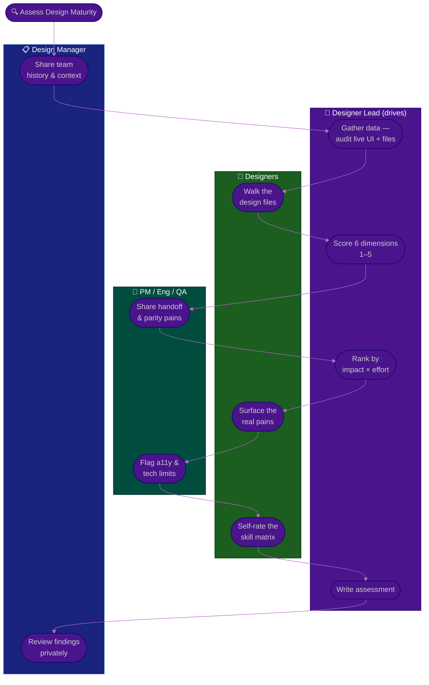

# Procedure: Design Assessment

**Tags:** #procedure #designer-lead #design #ux #assessment #designsystem #accessibility
**Roles:** Designer Lead / Design Lead · Design Manager · Designers · PM/PO · Engineering · QA

**Read Time:** ~13 min

> You cannot improve what you haven't honestly diagnosed. In Phase 2 of your first 90 days, you turn first impressions into an **evidence-based picture of design maturity** across six dimensions: **Design System & Consistency, UX/Research Practice, Design–Dev Handoff, Design Ops & Tooling, Accessibility, and Team Skills.** Each gets a **1–5 maturity score**, each finding is a fact (with a number or screenshot where possible), and every recommendation is ranked by **impact × effort** — not by what offends your taste. The golden rule: **diagnose before you prescribe.** A confident redesign plan written in week two is a guess wearing a beautiful mockup.

---

## 📌 Table of Contents
- [Why Score Maturity](#why-score-maturity)
- [The Six Dimensions](#the-six-dimensions)
- [Mermaid Swimlane Diagram](#mermaid-swimlane-diagram)
- [ASCII Flow](#ascii-flow)
- [Step-by-Step Responsibility Table](#step-by-step-responsibility-table)
- [The 1–5 Maturity Scale](#the-15-maturity-scale)
- [Dimension 1 — Design System & Consistency](#dimension-1--design-system--consistency)
- [Dimension 2 — UX / Research Practice](#dimension-2--ux--research-practice)
- [Dimension 3 — Design–Dev Handoff](#dimension-3--designdev-handoff)
- [Dimension 4 — Design Ops & Tooling](#dimension-4--design-ops--tooling)
- [Dimension 5 — Accessibility](#dimension-5--accessibility)
- [Dimension 6 — Team Skills](#dimension-6--team-skills)
- [Prioritizing by Impact × Effort](#prioritizing-by-impact--effort)
- [Anti-Patterns to Avoid](#anti-patterns-to-avoid)
- [Related Documents](#related-documents)

---

## Why Score Maturity

A score turns a vibe ("the UI is a mess") into a baseline ("design-system maturity is 2/5: 6 button variants in production, no tokens, components live in 3 files"). Scores let you:
- **Show progress** — a 2 → 3 next quarter is a visible, defensible win.
- **Prioritize** — the lowest scores in the highest-impact dimensions are where you start.
- **Align** — your manager and team argue about *one number per dimension* instead of everything at once.

Score honestly. Inflating today's number steals next quarter's win, and your team will know it's fake.

---

## The Six Dimensions

| # | Dimension | Asks | Key Signals |
|:--|:----------|:-----|:------------|
| 1 | **Design System & Consistency** | Is the UI built from reusable, governed parts? | Tokens, component coverage, one-off count, variant sprawl |
| 2 | **UX / Research Practice** | Are decisions grounded in user evidence? | Research cadence, insight repo, usability tests, evidence vs opinion |
| 3 | **Design–Dev Handoff** | Does design intent survive into code? | Handoff churn, spec clarity, parity between design & shipped UI |
| 4 | **Design Ops & Tooling** | Is the way design works fast and findable? | File structure, naming, source of truth, version hygiene |
| 5 | **Accessibility** | Can everyone actually use it? | Contrast, keyboard/focus, semantics, WCAG conformance |
| 6 | **Team Skills** | Who's strong where — and what's the bus factor? | Skill matrix, ownership concentration, craft & growth gaps |

---

## Mermaid Swimlane Diagram



---

## ASCII Flow

```
DESIGN ASSESSMENT — 6 DIMENSIONS
══════════════════════════════════════════════════════════════════════════════════

🔍 ASSESS DESIGN MATURITY
   │
   ▼
┌──────────────────────────────────────────────────────────────────────────────┐
│  STEP 1 — GATHER DATA   (Designer Lead)                                       │
│    Audit live UI, open design files, count variants, screenshot inconsistency │
└───────────────┬────────────────────────────────────────────────────────────────┘
                ▼
┌──────────────────────────────────────────────────────────────────────────────┐
│  STEP 2 — SCORE 6 DIMENSIONS  (Designer Lead + Designers + Partners)  each 1–5│
│    ① Design System & Consistency  ② UX / Research  ③ Design–Dev Handoff       │
│    ④ Design Ops & Tooling  ⑤ Accessibility  ⑥ Team Skills                     │
└───────────────┬────────────────────────────────────────────────────────────────┘
                ▼
┌──────────────────────────────────────────────────────────────────────────────┐
│  STEP 3 — RANK BY IMPACT × EFFORT   (Designer Lead)                           │
│    Lowest scores in highest-impact dimensions first · quick wins up top        │
└───────────────┬────────────────────────────────────────────────────────────────┘
                ▼
┌──────────────────────────────────────────────────────────────────────────────┐
│  STEP 4 — WRITE & REVIEW   (Designer Lead → Design Manager privately)         │
│    Facts + scores + screenshots, then recommendations · align before publishing│
└────────────────────────────────────────────────────────────────────────────────┘
```

---

## Step-by-Step Responsibility Table

| # | Step | Who Owns | Who Helps | Output |
|:--|:-----|:---------|:----------|:-------|
| 1 | Audit live UI & capture inconsistencies | Designer Lead | A buddy designer | Screenshot inventory |
| 2 | Walk the design files & naming | Designer Lead | Senior designers | Annotated file map |
| 3 | Score the six dimensions | Designer Lead | The team | Scorecard (1–5 each) |
| 4 | Gather handoff & parity pains | Designer Lead | PM, Eng, QA | Partner pain notes |
| 5 | Build the skill matrix | Designer Lead | Each designer | Skill matrix + bus-factor map |
| 6 | Rank pains by impact × effort | Designer Lead | Design Manager | Prioritized backlog |
| 7 | Write the assessment | Designer Lead | — | [Design Assessment](./templates/design-assessment-template.md) |
| 8 | Review privately | Designer Lead | Design Manager | Aligned narrative |

---

## The 1–5 Maturity Scale

| Score | Label | What it looks like |
|:-----:|:------|:-------------------|
| **1** | Ad hoc | No standard; every screen is whatever the designer felt that day |
| **2** | Repeatable | Some patterns exist but are inconsistent and undocumented |
| **3** | Defined | Documented and mostly followed; gaps are known |
| **4** | Measured | Practiced consistently and tracked (adoption %, a11y scores, research cadence) |
| **5** | Optimizing | Metrics and user evidence drive continuous, deliberate improvement |

Most healthy-but-imperfect design teams land at **2–3** across the board. A fresh assessment that's all 4s and 5s is either an exceptional team or a dishonest scorecard.

---

## Dimension 1 — Design System & Consistency

**Asks:** Is the UI assembled from a small set of reusable, governed parts — or reinvented every screen?

- **Count the variants.** How many button styles, input fields, modals, and date pickers actually ship? Six button styles is a maturity-1 signal you can screenshot.
- **Tokens or hard-coded values?** Are color, spacing, and type defined as named tokens (`color.primary`, `space.4`) or as raw hex and pixel values scattered across files? No tokens = no single lever to change the look.
- **Component coverage:** what fraction of the live UI is built from system components vs one-offs? Estimate it — even a rough "~30% systemized" beats a vibe.
- **Governance:** is there an owner, a contribution model, and a changelog — or does the "system" drift every time someone nudges a component? See [03 — Design System & Ops](./03-design-system-and-ops.md).

---

## Dimension 2 — UX / Research Practice

**Asks:** Are design decisions grounded in user evidence, or in whoever argued hardest?

- **Cadence:** how often does anyone watch a real user use the product? "Never" or "only at launch" is maturity 1–2.
- **Evidence vs opinion:** in the last 5 shipped decisions, how many cite a user insight vs a stakeholder preference (the HiPPO — Highest-Paid Person's Opinion)?
- **Insight repository:** is there a findable, reusable record of what's been learned, or does research evaporate after each readout?
- **Methods fit:** is the team using the right tool (quick usability tests, surveys, analytics, interviews) for the question — or defaulting to opinion? Deep-dive in [05 — Research & User-Centered](./05-research-and-user-centered.md).

---

## Dimension 3 — Design–Dev Handoff

**Asks:** Does design intent survive the trip into production?

- **Parity check:** put the design file next to the shipped screen. How far apart are they? Big drift signals broken handoff, not lazy engineers.
- **Handoff churn:** how often does a design get reworked *after* engineering starts because the spec was ambiguous or unbuildable? Track it as a rate.
- **Spec clarity:** are states (empty, loading, error, edge), responsive behavior, and interactions specified — or left for engineers to guess?
- **Collaboration model:** is design involved through build, or thrown over a wall? The healthiest teams treat handoff as a conversation, not a delivery. Cross-reference the [Feature Lifecycle](../software-delivery/01-feature-lifecycle.md).

---

## Dimension 4 — Design Ops & Tooling

**Asks:** Can anyone find the current truth and work fast, or is design archaeology a daily tax?

- **Source of truth:** is it obvious which file/page is canonical, or are there five "final_v3_REAL" copies? Ambiguity here is maturity 1.
- **File structure & naming:** are pages, frames, and layers named to a convention, or is it `Frame 482`? New joiners and engineers pay for chaos here.
- **Version hygiene:** are explorations separated from the source of truth? Is there a branching/library workflow?
- **Tooling:** the right plugins, a shared component library, a design–code bridge. Tooling is a means; don't score the logo on the tool, score whether work flows.

---

## Dimension 5 — Accessibility

**Asks:** Can people with disabilities — and people on bad screens, in bright sun, on a phone — actually use it?

- **Contrast:** sample text and UI against WCAG AA (4.5:1 body, 3:1 large/UI). Failing contrast is the most common, most fixable a11y debt.
- **Keyboard & focus:** can the core flow be completed without a mouse, with a visible focus order? Try it.
- **Semantics & labels:** are form fields labeled, images alt-texted, and is there a heading structure — or is everything a `<div>`?
- **Conformance target:** does the team even have one (e.g., WCAG 2.2 AA)? No target = maturity 1. Accessibility is also a quality and often a legal requirement — partner with QA here.

---

## Dimension 6 — Team Skills

**Asks:** Who's strong where — and where is the bus factor dangerously low?

- Build a **skill matrix**: rows are designers, columns are skills/areas (visual, interaction, research, prototyping, systems, content, a11y), cells a 0–3 familiarity. Have each designer self-rate, then sanity-check.
- Find the **single points of knowledge** — the one person who understands the design system, or the only one who can run research. Those are your top mentoring targets.
- Note **growth gaps and ambitions** from your 1-on-1s — who wants to deepen craft, who wants to lead, who's quietly stalled.
- This dimension feeds your people plan directly; a low team-skills score with high bus-factor risk often outranks a polish fix. See [06 — Collaboration & Growth](./06-collaboration-and-growth.md).

---

## Prioritizing by Impact × Effort

Don't fix the dimension that annoys you most. Fix the one with the best ratio of pain relieved to effort spent.

```
            HIGH IMPACT
                │
    SCHEDULE    │   DO NOW
   (big bets)   │  (quick wins)
   e.g. full    │  e.g. token + color
   research op  │  foundation, one button
                │
  ──────────────┼──────────────  EFFORT →
                │
    AVOID /     │   FILL-IN
   DEPRIORITIZE │  (easy, low value)
   pixel polish │  rename one tidy file
   on dead pages│
                │
            LOW IMPACT
```

- **Do Now** (high impact, low effort) — your Phase 4 quick wins. A shared token + color foundation and a single canonical button often qualify. Lead with these to earn trust.
- **Schedule** (high impact, high effort) — the big bets (a full system build, standing up a research practice). Plan them with capacity.
- **Fill-in / Avoid** — resist. Polishing pages no one visits feels productive and isn't.

---

## Anti-Patterns to Avoid

| Anti-Pattern | Why It Hurts | Do Instead |
|:-------------|:-------------|:-----------|
| **Scoring on taste, not facts** | "This isn't how I'd design it" isn't a finding | Anchor every score to a count, screenshot, or example |
| **Prescribing in the report** | A diagnosis full of "redesign X" reads as a hidden agenda | Facts and scores first; recommendations clearly separated |
| **Ignoring accessibility** | A beautiful UI no one can use fails the actual users (and the law) | Score a11y as seriously as visual craft |
| **Skipping the partners** | Handoff and parity pain is invisible from the design side alone | Interview PM/Eng/QA; their pain is data |
| **Ignoring the human dimension** | A perfect system with a bus factor of 1 is fragile | Score team skills as seriously as the UI |
| **Boiling the ocean** | Listing 200 inconsistencies paralyzes everyone | Surface the 3 that cost the most |
| **Publishing before manager review** | Findings your manager hasn't seen are a career risk | Always align privately first |

---

## Related Documents
- **Previous:** [01 — First 90 Days](./01-first-90-days.md)
- **Next:** [03 — Design System & Ops](./03-design-system-and-ops.md)
- **Template:** [Design Assessment](./templates/design-assessment-template.md)
- **Cross-feed:** [UI Design System with AI](../system-design/03-ui-design-system-with-ai.md) · [UI: From Inspiration to Production](../system-design/04-ui-from-inspiration-to-production.md) · [Feature Lifecycle](../software-delivery/01-feature-lifecycle.md) · [QA Leadership Playbook](../qa-leadership/README.md) · [Management & Leadership](../../management/README.md)

---

*Part of the [Designer Lead Playbook](./README.md) · Last updated: 2026-05-31*
