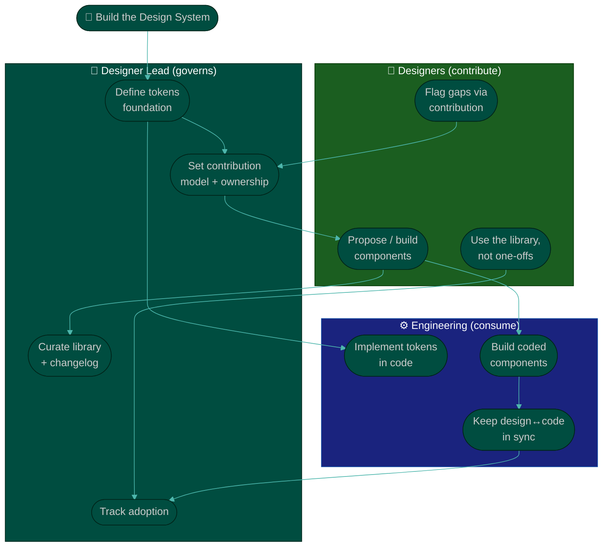

# Procedure: Design System & Design Ops

**Tags:** #procedure #designer-lead #design #designsystem #designops #tokens #handoff
**Roles:** Designer Lead / Design Lead · Designers · Engineering · PM/PO · Design Manager
**Read Time:** ~14 min

> Consistency is the cheapest quality you can buy — once. A **design system** turns "every screen reinvented" into "every screen assembled from governed parts," and **design ops** turns "where's the real file?" into "the truth is obvious and findable." This is the highest-leverage thing a Designer Lead owns: it multiplies every designer, speeds every engineer, and makes the whole product feel intentional. But a system built in an ivory tower is shelfware. The rule here: **build the system *with* the people who use it, ship adoption (not just artifacts), and govern it like a product.**

---

## 📌 Table of Contents
- [Why the System Is Leverage](#why-the-system-is-leverage)
- [The Layers of a Design System](#the-layers-of-a-design-system)
- [Mermaid Swimlane Diagram](#mermaid-swimlane-diagram)
- [ASCII Flow](#ascii-flow)
- [Step-by-Step Responsibility Table](#step-by-step-responsibility-table)
- [Tokens — The Foundation](#tokens--the-foundation)
- [Components — The Building Blocks](#components--the-building-blocks)
- [Governance & the Contribution Model](#governance--the-contribution-model)
- [Design Ops — Files, Naming & Source of Truth](#design-ops--files-naming--source-of-truth)
- [Handoff to Engineering](#handoff-to-engineering)
- [Measuring Adoption](#measuring-adoption)
- [Anti-Patterns to Avoid](#anti-patterns-to-avoid)
- [Related Documents](#related-documents)

---

## Why the System Is Leverage

A one-off button helps one screen. A systemized button helps every screen, forever — and the day the brand changes, you update one token instead of 400 layers. The system is the single highest-multiplier artifact a Designer Lead produces because:
- **It scales your taste** — the bar lives in the components, not in your head or your review queue.
- **It speeds delivery** — designers and engineers compose instead of reinvent.
- **It enforces consistency by default** — the easy path becomes the consistent path.
- **It reduces your bottleneck** — you govern the system, you don't approve every pixel.

But leverage cuts both ways: a system nobody adopts is pure cost. Adoption — not the Figma library's beauty — is the only metric that matters.

---

## The Layers of a Design System

| Layer | What it is | Owned with |
|:------|:-----------|:-----------|
| **Tokens** | Named primitives: color, spacing, type, radius, elevation | Eng (they consume them in code) |
| **Components** | Reusable parts: button, input, modal, card — with states & variants | Designers + Eng |
| **Patterns** | Compositions: forms, empty states, page templates, flows | Designers + PM |
| **Guidelines** | When/how to use, voice & tone, accessibility rules | Whole team |
| **Governance** | Ownership, contribution model, versioning, changelog | Designer Lead |

Build bottom-up: tokens first (they're cheap and high-leverage), then the most-used components, then patterns. Don't try to ship all five layers at once.

---

## Mermaid Swimlane Diagram



---

## ASCII Flow

```
DESIGN SYSTEM & OPS — BUILD → GOVERN → ADOPT
══════════════════════════════════════════════════════════════════════════════════

🧱 START
   │
   ▼
┌──────────────────────────────────────────────────────────────────────────────┐
│  ① TOKENS  (Designer Lead + Eng)                                              │
│    Color · spacing · type · radius · elevation → named, shared, in code        │
└───────────────┬────────────────────────────────────────────────────────────────┘
                ▼
┌──────────────────────────────────────────────────────────────────────────────┐
│  ② COMPONENTS  (Designers + Eng)                                              │
│    Build the most-used parts first · all states · variants · a11y baked in     │
└───────────────┬────────────────────────────────────────────────────────────────┘
                ▼
┌──────────────────────────────────────────────────────────────────────────────┐
│  ③ GOVERNANCE  (Designer Lead)                                                │
│    Owner · contribution model · versioning · changelog · deprecation path      │
└───────────────┬────────────────────────────────────────────────────────────────┘
                ▼
┌──────────────────────────────────────────────────────────────────────────────┐
│  ④ DESIGN OPS  (Designer Lead)                                                │
│    Source of truth · file structure · naming · branching · plugins             │
└───────────────┬────────────────────────────────────────────────────────────────┘
                ▼
┌──────────────────────────────────────────────────────────────────────────────┐
│  ⑤ HANDOFF + ADOPTION  (Designer Lead + Eng + Designers)                      │
│    Design↔code parity · specs that survive · MEASURE adoption %                │
└────────────────────────────────────────────────────────────────────────────────┘
```

---

## Step-by-Step Responsibility Table

| # | Step | Who Owns | Who Helps | Output |
|:--|:-----|:---------|:----------|:-------|
| 1 | Define the token foundation | Designer Lead | Eng | Token set (color/space/type) |
| 2 | Implement tokens in code | Eng | Designer Lead | Shared token source |
| 3 | Build the top-N components | Designers | Designer Lead, Eng | Library components (all states) |
| 4 | Set the contribution model | Designer Lead | The team | Contribution doc + RACI |
| 5 | Establish source of truth & naming | Designer Lead | Designers | Ops conventions doc |
| 6 | Define the handoff contract | Designer Lead | Eng, QA | Handoff checklist |
| 7 | Track adoption | Designer Lead | Eng | Adoption dashboard |

---

## Tokens — The Foundation

Tokens are named design decisions: `color.text.primary`, `space.4`, `font.size.body`, `radius.md`. They are the cheapest, highest-leverage layer.

- **Start with the primitives:** a color ramp, a spacing scale (a 4- or 8-point grid), a type scale, radii, and elevation. Resist a 200-token taxonomy on day one.
- **Name by role, not by value.** `color.primary` survives a rebrand; `blue-500` doesn't. Semantic tokens (`color.surface.danger`) let the same primitive serve many uses.
- **One source, two consumers.** Tokens should live somewhere both design and code read from — so a change propagates without manual reconciliation.
- **Tokens unlock theming** (light/dark, brands) for nearly free later. Set the structure now even if you ship one theme.

For the deeper, AI-assisted build, see **[UI Design System with AI](../system-design/03-ui-design-system-with-ai.md)**.

---

## Components — The Building Blocks

- **Build by usage, not by ambition.** Inventory what the product actually uses, sort by frequency, and systemize the top of the list first (usually: button, input, select, checkbox, modal, card, nav). One canonical button replacing six is a Phase-4 quick win.
- **Every component ships all its states:** default, hover, focus, active, disabled, loading, error, empty. A component missing states just relocates the inconsistency.
- **Bake in accessibility:** contrast, focus rings, labels, and hit targets belong *in* the component so every use is accessible by default. (See [02 — Accessibility dimension](./02-design-assessment.md).)
- **Variants, not forks.** Use structured props/variants so the system stays small. Ten one-off buttons is the disease; one button with three variants is the cure.

The journey from a reference design to a production-ready, systemized component is detailed in **[UI: From Inspiration to Production](../system-design/04-ui-from-inspiration-to-production.md)**.

---

## Governance & the Contribution Model

A system without governance rots into the chaos it replaced. Govern it like a product.

- **Name an owner** (often you, or a senior designer you grow into it). The owner curates, not gatekeeps.
- **Define a contribution model:** how does a new component get proposed, reviewed, accepted, and published? A lightweight path beats a bureaucratic one — the goal is *more* good contributions, not fewer.
- **Version and changelog.** Every change is recorded; breaking changes get a migration note. This is how you keep trust with engineers consuming the library.
- **Deprecation path.** When a pattern is replaced, mark the old one deprecated with a pointer to the new one — don't just delete it out from under live screens.
- **Decide centralized vs federated.** Small team: you curate. Larger org: a federated model where teams contribute and a core group governs. Match the model to the org.

---

## Design Ops — Files, Naming & Source of Truth

Design ops is the unglamorous plumbing that makes everything else fast.

- **One source of truth, unmistakably marked.** Kill the `final_v3_REAL` problem: one canonical place, explorations clearly separated (a branch, a scratch page, a separate file).
- **Naming conventions** for pages, frames, layers, and components. `Checkout / Step 2 — Payment` beats `Frame 482`. Engineers and new designers pay the tax of chaos.
- **File structure** that mirrors the product (by feature/flow), so anyone can find the screen they need without a tour guide.
- **A branching / library workflow** so the source of truth is never broken by in-progress work.
- **Tooling as a means:** the right plugins, a published library, a design–code bridge. Don't fetishize tools — score whether work *flows*.

---

## Handoff to Engineering

Design intent is worthless if it dies on the way to production. Handoff is a contract, not a toss-over-the-wall.

- **A handoff checklist:** all states specified, responsive behavior defined, interactions/motion noted, edge cases covered, tokens referenced (not raw values), a11y notes included.
- **Specs that survive:** annotate the *why*, not just the *what* — so when engineering hits a constraint, they can make a faithful trade-off instead of a guess.
- **Stay engaged through build.** A 10-minute design–dev sync mid-build catches drift cheaply; a parity review before ship catches the rest.
- **Measure handoff churn** — rework after dev starts. Falling churn is proof the contract works. Map this to the [Feature Lifecycle](../software-delivery/01-feature-lifecycle.md).

---

## Measuring Adoption

The library's beauty is vanity; **adoption** is the metric.

- **Adoption %:** what fraction of the live UI is built from system components/tokens? Track the trend, not a snapshot.
- **One-off count:** new one-off components created per month should fall as the system matures.
- **Detachment rate:** how often designers detach/override components — a high rate flags a missing variant, not a disobedient designer.
- **Time-to-compose:** anecdotally, how fast can a designer assemble a new screen? Falling time = working system.

> If adoption is low, the answer is almost never "enforce harder." It's "the system doesn't fit the work yet." Fix the fit and adoption follows.

---

## Anti-Patterns to Avoid

| Anti-Pattern | Why It Hurts | Do Instead |
|:-------------|:-------------|:-----------|
| **Ivory-tower system** | Built in isolation, fits no real work, adopted by no one | Build with designers & engineers; ship adoption |
| **Boiling the ocean** | A 200-component v1 ships in 6 months and is already stale | Tokens + top components first; iterate |
| **Hard-coded values** | No tokens means no single lever; every change is manual | Name decisions as semantic tokens |
| **Components missing states** | Relocates inconsistency to error/empty/loading | Ship every state or it isn't a component |
| **No governance** | The system drifts back into chaos | Owner + contribution model + changelog |
| **Library beauty as the goal** | A gorgeous unused library is pure cost | Measure adoption %, not aesthetics |
| **Handoff as a wall** | Intent dies; engineers guess; parity drifts | Handoff is a contract + a conversation |
| **Enforcing adoption by decree** | Low adoption is a fit problem, not a discipline problem | Fix the fit; adoption follows |

---

## Related Documents
- **Previous:** [02 — Design Assessment](./02-design-assessment.md)
- **Next:** [04 — Critique & Quality](./04-critique-and-quality.md)
- **Deep dives:** [UI Design System with AI](../system-design/03-ui-design-system-with-ai.md) · [UI: From Inspiration to Production](../system-design/04-ui-from-inspiration-to-production.md)
- **Cross-feed:** [Feature Lifecycle](../software-delivery/01-feature-lifecycle.md) · [Team Lead Playbook](../team-lead/README.md) · [QA Leadership Playbook](../qa-leadership/README.md) · [Management & Leadership](../../management/README.md) · [Templates feed](../../templates/README.md)

---

*Part of the [Designer Lead Playbook](./README.md) · Last updated: 2026-05-31*
