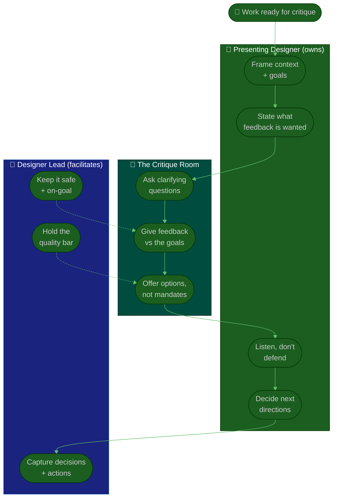

# Procedure: Critique & Quality

**Tags:** #procedure #designer-lead #design #critique #quality #feedback #craft
**Roles:** Designer Lead / Design Lead · Designers · PM/PO · Engineering · Design Manager
**Read Time:** ~12 min

> Critique is how a design team's quality bar lives outside any one person's head. Done well, it makes every designer sharper and keeps the work consistent without you approving every pixel. Done badly, it becomes a gauntlet that crushes confidence — or a rubber stamp that protects nothing. The Designer Lead's job is to **own the quality bar while making critique feel like a gift, not a verdict** — and to escape the two traps that catch every new lead: becoming the **bottleneck** (every screen waits on you) and the **sole approver** (your taste is the only standard).

---

## 📌 Table of Contents
- [Critique vs Approval vs Feedback](#critique-vs-approval-vs-feedback)
- [The Quality Bar](#the-quality-bar)
- [Mermaid Swimlane Diagram](#mermaid-swimlane-diagram)
- [ASCII Flow](#ascii-flow)
- [Step-by-Step Responsibility Table](#step-by-step-responsibility-table)
- [Running a Healthy Critique](#running-a-healthy-critique)
- [Feedback That Improves Without Crushing](#feedback-that-improves-without-crushing)
- [Escaping the Bottleneck / Approver Trap](#escaping-the-bottleneck--approver-trap)
- [Calibrating the Bar Across the Team](#calibrating-the-bar-across-the-team)
- [Anti-Patterns to Avoid](#anti-patterns-to-avoid)
- [Related Documents](#related-documents)

---

## Critique vs Approval vs Feedback

These three get conflated, and conflating them is what makes critique toxic.

| | **Critique** | **Approval** | **Async Feedback** |
|:--|:-------------|:-------------|:-------------------|
| Purpose | Improve the thinking & the work | Decide it can proceed | Quick, targeted input |
| Mindset | Collaborative, exploratory | Gatekeeping, binary | Lightweight, specific |
| Who leads | The presenter (their work, their agenda) | The owner of the bar | Whoever's asked |
| When | Mid-flight, regularly | At a gate | Anytime |
| Output | Sharper directions, options | Go / iterate | A few pointed notes |

> The failure mode is running **approval theater disguised as critique** — a room waiting for the lead's thumbs-up. Real critique serves the *designer's* goals, not the lead's verdict. Keep approval separate, rare, and explicit.

---

## The Quality Bar

A quality bar makes "good" objective enough that the team can self-assess. Define it once, with the team, so it isn't just your taste. A useful bar covers:

- **Usability** — can a real user complete the task? (Evidence beats opinion — see [05](./05-research-and-user-centered.md).)
- **Consistency** — does it use the system (tokens, components) or reinvent? (See [03](./03-design-system-and-ops.md).)
- **Accessibility** — contrast, focus, labels, hit targets — meets the team's WCAG target.
- **Completeness** — all states designed: empty, loading, error, edge, responsive.
- **Craft** — alignment, hierarchy, spacing, typography — the polish that signals care.
- **Intent** — does it solve the actual problem, tied to a user goal and a metric?

Write it down as a short checklist. A shared, written bar is what lets you review *by exception* instead of inspecting every pixel.

---

## Mermaid Swimlane Diagram



---

## ASCII Flow

```
DESIGN CRITIQUE — A HEALTHY SESSION
══════════════════════════════════════════════════════════════════════════════════

🎨 WORK READY FOR CRITIQUE
   │
   ▼
┌──────────────────────────────────────────────────────────────────────────────┐
│  ① CONTEXT  (Presenter)                                                       │
│    The problem · the user · the goal · constraints · where this is in flight   │
└───────────────┬────────────────────────────────────────────────────────────────┘
                ▼
┌──────────────────────────────────────────────────────────────────────────────┐
│  ② ASK  (Presenter)                                                           │
│    "I want feedback on X and Y — not on Z (already decided)"                   │
└───────────────┬────────────────────────────────────────────────────────────────┘
                ▼
┌──────────────────────────────────────────────────────────────────────────────┐
│  ③ CRITIQUE ROUNDS  (Room, facilitated by Lead)                               │
│    Clarify → react to the GOALS → offer options · safe, specific, kind         │
└───────────────┬────────────────────────────────────────────────────────────────┘
                ▼
┌──────────────────────────────────────────────────────────────────────────────┐
│  ④ DECISIONS + ACTIONS  (Presenter owns, Lead captures)                       │
│    What changes, what's parked, who does what by when                          │
└────────────────────────────────────────────────────────────────────────────────┘
```

---

## Step-by-Step Responsibility Table

| # | Step | Who Owns | Who Helps | Output |
|:--|:-----|:---------|:----------|:-------|
| 1 | Set the critique cadence & format | Designer Lead | The team | [Critique template](./templates/design-critique-template.md) |
| 2 | Frame context & goals | Presenting designer | — | Shared problem framing |
| 3 | State the feedback wanted | Presenting designer | — | Scoped ask |
| 4 | Facilitate safe, on-goal critique | Designer Lead | The room | Useful feedback |
| 5 | Hold the quality bar | Designer Lead | Senior designers | Calibrated standard |
| 6 | Capture decisions & actions | Designer Lead | Presenter | Decisions/actions log |
| 7 | Approve at the gate (by exception) | Designer Lead | — | Go / iterate |

---

## Running a Healthy Critique

Use a consistent structure (see the [critique template](./templates/design-critique-template.md)):

1. **Context first (presenter).** The problem, the user, the goal, the constraints, and where the work is in its lifecycle. Early explorations get divergent feedback; near-final work gets convergent polish. The room must know which.
2. **Scope the ask (presenter).** "I want feedback on the onboarding flow and the empty state — the color direction is already locked." This is the single biggest lever for useful critique: it stops the room solving the wrong problem.
3. **Clarify before reacting (room).** Questions before opinions. Half of bad feedback dissolves once the room understands the constraint.
4. **React to the goals, not your taste (room).** "This makes the primary task harder to find" beats "I'd use a different blue."
5. **Offer options, not mandates (room).** "What if the CTA anchored to the bottom?" invites thinking; "Move the CTO to the bottom" shuts it down.
6. **Decisions & actions (presenter owns, lead captures).** The presenter decides what to act on — it's their work. The lead records what changes, what's parked, and who does what.

Keep it small and regular — a 45-minute weekly crit beats a quarterly marathon. Rotate presenters so it's the team's ritual, not the lead's show.

---

## Feedback That Improves Without Crushing

- **Critique the work, never the person.** "This flow has three dead-ends" not "you always over-complicate."
- **Be specific and actionable.** Vague praise ("looks great!") and vague criticism ("feels off") both fail. Name the thing and why.
- **Tie every note to a reason** — a user goal, a system rule, an accessibility requirement. A note without a "because" is just taste, and taste is where the pixel-dictator trap begins.
- **Lead with questions for senior designers, with direction for juniors** — calibrate the scaffolding to the person's level. Coaching, not just correcting.
- **Balance is not 1:1 flattery.** The goal isn't a compliment sandwich; it's honest, kind, useful. Protect psychological safety so people bring rough work — that's where critique pays off most.
- **Model receiving it well.** When your own work is critiqued, listen without defending. The team copies how the lead takes feedback.

---

## Escaping the Bottleneck / Approver Trap

The new lead's instinct — "I'll personally review everything to protect quality" — guarantees you become the constraint and the team never internalizes the bar.

- **Review by exception, not by default.** Once the written bar and the system exist, most work doesn't need you. Spot-check, sample, and trust.
- **Push the bar into the system.** Every standard you encode into a component or token is a review you never have to do again. (See [03](./03-design-system-and-ops.md).)
- **Grow other reviewers.** Train seniors to run critique and hold the bar so it survives your vacation. A bar only you can enforce is a bus factor of one.
- **Separate "needs critique" from "needs approval."** Most work needs the former (anytime, peer-driven) and rarely the latter (a gate, explicit).
- **Time-box your involvement.** If you're in every crit and every approval, you've recreated the star-IC trap as a manager.

> The measure of a great Designer Lead isn't how good the work is when you touch it — it's how good it is when you *don't*.

---

## Calibrating the Bar Across the Team

A bar everyone interprets differently isn't a bar. Calibrate it:

- **Review the same work together** occasionally, and surface where people score it differently — those gaps are your calibration targets.
- **Keep a small set of exemplars** ("this is what a 'done' empty state looks like") so "good" is concrete, not abstract.
- **Write the bar down** and evolve it with the team; a co-owned bar is one the team defends.
- **Connect the bar to evidence.** When usability data contradicts the bar, update the bar — quality serves users, not aesthetics. (See [05](./05-research-and-user-centered.md).)

---

## Anti-Patterns to Avoid

| Anti-Pattern | Why It Hurts | Do Instead |
|:-------------|:-------------|:-----------|
| **Lead as sole approver** | Your taste becomes the only bar; team never grows it | Co-own a written bar; review by exception |
| **Critique as a gauntlet** | Crushes confidence; people hide rough work | Make it safe; critique the work, not the person |
| **Approval theater** | A room waiting for your thumbs-up isn't critique | Serve the presenter's goals; separate approval |
| **Feedback without a "because"** | Untethered taste = pixel-dictator | Tie every note to a goal, rule, or evidence |
| **No scoped ask** | The room solves the wrong problem | Presenter states exactly what feedback is wanted |
| **Rubber-stamp critique** | "Looks great!" protects nothing | Honest, specific, kind |
| **Lead in every review** | You become the bottleneck and bus factor | Grow other reviewers; encode the bar in the system |

---

## Related Documents
- **Previous:** [03 — Design System & Ops](./03-design-system-and-ops.md)
- **Next:** [05 — Research & User-Centered Design](./05-research-and-user-centered.md)
- **Template:** [Design Critique](./templates/design-critique-template.md) · [1-on-1](./templates/one-on-one-template.md)
- **Cross-feed:** [Team Lead — Code Review & Quality parallels](../team-lead/README.md) · [QA Leadership Playbook](../qa-leadership/README.md) · [Engineering Manager Playbook](../engineering-manager/README.md) · [Management & Leadership](../../management/README.md)

---

*Part of the [Designer Lead Playbook](./README.md) · Last updated: 2026-05-31*
