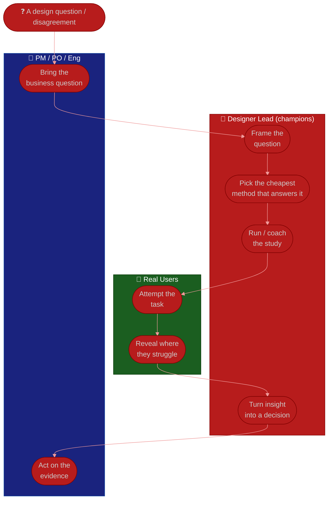

# Procedure: Research & User-Centered Design

**Tags:** #procedure #designer-lead #design #ux #research #usability #evidence
**Roles:** Designer Lead / Design Lead · Designers · PM/PO · Engineering · Research · Design Manager
**Read Time:** ~12 min

> Design has no authority, so it wins arguments with **evidence** — or it loses them to the loudest voice in the room. The most reliable way to lose to the HiPPO (the Highest-Paid Person's Opinion) is to defend your work with taste; the most reliable way to earn design's seat at the table is to consistently bring what real users actually do. A Designer Lead champions a **user-centered** culture: small, frequent research over rare big studies; insight turned into decisions; and design impact measured, not assumed. The rule: **opinions are hypotheses until a user touches the thing.**

---

## 📌 Table of Contents
- [Why Evidence Beats Opinion](#why-evidence-beats-opinion)
- [The Research Ladder](#the-research-ladder)
- [Mermaid Swimlane Diagram](#mermaid-swimlane-diagram)
- [ASCII Flow](#ascii-flow)
- [Step-by-Step Responsibility Table](#step-by-step-responsibility-table)
- [A Sustainable Usability Cadence](#a-sustainable-usability-cadence)
- [Turning Insight Into Decisions](#turning-insight-into-decisions)
- [Measuring Design Impact](#measuring-design-impact)
- [Defeating the HiPPO Problem](#defeating-the-hippo-problem)
- [Anti-Patterns to Avoid](#anti-patterns-to-avoid)
- [Related Documents](#related-documents)

---

## Why Evidence Beats Opinion

In a room with a PM, an engineer, and an executive, the designer is rarely the most senior person. Without evidence, design loses every disagreement to seniority or volume. With evidence — five users failing the same step on video — the conversation stops being about taste and starts being about facts. Evidence is the Designer Lead's source of influence:

- **It de-personalizes decisions** — "the users struggled here" replaces "I think" vs "you think."
- **It builds credibility compounding** — a team known for being right about users gets trusted with bigger calls.
- **It catches expensive mistakes cheaply** — a $200 usability test that kills a wrong direction saves a quarter of engineering.

You don't need a PhD or a research team to start. You need to watch a few real users, regularly.

---

## The Research Ladder

Match the method to the question and the time you have. Most teams skip straight to "build it and hope" — your job is to insert cheap evidence earlier.

| Rung | Method | Answers | Cost |
|:-----|:-------|:--------|:-----|
| 1 | **Analytics & funnels** | *Where* are users dropping? | ~Free, already there |
| 2 | **Quick usability test (5 users)** | *Why* are they dropping? | A day |
| 3 | **Prototype test** | Does the new direction work before we build? | A few days |
| 4 | **Surveys** | What do many users think/prefer? | Days |
| 5 | **Interviews / discovery** | What problem should we even solve? | Weeks |

> The famous finding: **~5 users surface the majority of usability problems.** You almost never need 30 — you need to actually run the 5, this sprint, not "someday when we have a researcher."

---

## Mermaid Swimlane Diagram



---

## ASCII Flow

```
RESEARCH → DECISION → IMPACT
══════════════════════════════════════════════════════════════════════════════════

❓ QUESTION OR DISAGREEMENT
   │
   ▼
┌──────────────────────────────────────────────────────────────────────────────┐
│  ① FRAME  (Designer Lead + PM/PO)                                             │
│    What do we actually need to know to decide? · turn opinion into hypothesis  │
└───────────────┬────────────────────────────────────────────────────────────────┘
                ▼
┌──────────────────────────────────────────────────────────────────────────────┐
│  ② CHOOSE METHOD  (Designer Lead)                                             │
│    Cheapest rung that answers it: analytics → 5-user test → prototype → survey │
└───────────────┬────────────────────────────────────────────────────────────────┘
                ▼
┌──────────────────────────────────────────────────────────────────────────────┐
│  ③ RUN + WATCH  (Designer Lead / designers + real users)                      │
│    Observe behavior, not opinions · invite PM/Eng to watch live                │
└───────────────┬────────────────────────────────────────────────────────────────┘
                ▼
┌──────────────────────────────────────────────────────────────────────────────┐
│  ④ DECIDE + MEASURE  (Designer Lead → PM/PO → team)                           │
│    Insight → a changed decision · then measure the design's impact on the metric│
└────────────────────────────────────────────────────────────────────────────────┘
```

---

## Step-by-Step Responsibility Table

| # | Step | Who Owns | Who Helps | Output |
|:--|:-----|:---------|:----------|:-------|
| 1 | Frame the question | Designer Lead | PM/PO | A testable hypothesis |
| 2 | Choose the cheapest method | Designer Lead | Research (if any) | Study plan |
| 3 | Recruit participants | Designer Lead | PM, Support | 5+ real users |
| 4 | Run & observe the study | Designer Lead | Designers | Session recordings/notes |
| 5 | Synthesize insights | Designer Lead | The team | Top findings (ranked) |
| 6 | Turn insight into a decision | Designer Lead | PM/PO | A changed design/decision |
| 7 | Measure the impact | Designer Lead | PM, Data | Before/after metric |

---

## A Sustainable Usability Cadence

The trap is treating research as a rare, heavy event. Make it small and routine instead.

- **A standing slot.** Reserve a recurring research slot (e.g., one round of 5 users every sprint or two). A cadence beats heroics.
- **A participant pipeline.** The slowest part is recruiting; keep a rolling list (existing users, a panel, Support's contacts) so you can run on demand.
- **Lightweight by default.** A 20-minute moderated test on a prototype answers most product questions. Don't gold-plate the protocol.
- **Invite partners to watch.** A PM who *watches* three users fail is converted instantly — far more than any report. Make observation easy.
- **Build an insight repository.** Tag findings so research compounds instead of evaporating. The repo turns one study into reusable knowledge.
- **Coach designers to do their own.** You're a multiplier — every designer running their own quick tests scales evidence far past what you can run alone.

---

## Turning Insight Into Decisions

Research that doesn't change a decision is theater. Close the loop:

- **Rank findings by severity × frequency** — fix the things many users hit hard, before the cosmetic ones.
- **Convert each insight into a "so we will…"** — a finding without an action is just trivia. "Users miss the save button (4/5) → we will move it into the sticky header."
- **Feed it back into critique and the bar.** When evidence contradicts the team's quality bar, update the bar. (See [04 — Critique & Quality](./04-critique-and-quality.md).)
- **Make insights traceable.** Link the shipped change to the study so the next person understands *why* the design is the way it is — and so you can defend it later.
- **Where design fits delivery:** insight should arrive *before* the build, not as a post-mortem. Map this onto the [Feature Lifecycle](../software-delivery/01-feature-lifecycle.md).

---

## Measuring Design Impact

"Design is subjective" is the excuse that keeps design out of the room. Counter it by measuring.

- **Task-level metrics:** task-success rate, time-on-task, error rate — directly attributable to a design change.
- **Behavioral metrics:** funnel conversion, drop-off, feature adoption, support-ticket volume for the redesigned flow.
- **Attitudinal metrics:** SUS (System Usability Scale), CSAT, or a simple post-task ease rating for a lightweight trend.
- **Before/after framing.** A redesign with a measured before and after ("checkout completion 71% → 84%") is a story the business respects and funds.
- **Tie to the business.** Where you can, connect the design metric to the outcome the [Product Owner](../product-owner/README.md) and business care about. That's how design earns budget for research and headcount.

> You won't perfectly attribute every win to design, and that's fine. The goal is a *credible* story that design moves the numbers — credibility compounds into influence.

---

## Defeating the HiPPO Problem

The HiPPO problem: the highest-paid person's opinion overrides everyone, including the users. You don't beat it with a better argument — you beat it with a process.

- **Pre-commit to evidence.** Agree *before* the work how you'll decide ("we'll test the two directions with 5 users"). It's far easier to agree on a process than to overturn a boss mid-fight.
- **Reframe opinions as hypotheses.** "Great idea — let's treat that as a hypothesis and check it with users." This respects the person while routing around the authority.
- **Bring the user into the room.** A 90-second clip of a real user failing ends most debates that a deck never could.
- **Pick battles by stakes.** Spend evidence on decisions that matter; concede the trivial ones gracefully to keep credibility for the big ones.
- **Make leaders watch sessions.** Conviction comes from witnessing, not reading. A skeptical exec who watches one test becomes your strongest ally.

---

## Anti-Patterns to Avoid

| Anti-Pattern | Why It Hurts | Do Instead |
|:-------------|:-------------|:-----------|
| **Defending work with taste** | Loses to seniority and volume every time | Bring user evidence; reframe as hypothesis |
| **Research as a rare big event** | "Someday" research never happens | Standing cadence: 5 users, every sprint or two |
| **Insight that changes nothing** | Research theater erodes trust in research | Every finding gets a "so we will…" |
| **Reporting instead of showing** | A deck doesn't convert skeptics | Make partners watch sessions live |
| **Over-engineering the study** | A 40-page protocol delays the decision | Lightweight 20-min test answers most questions |
| **Not measuring design** | "Design is subjective" keeps design out of the room | Before/after metrics on the task & funnel |
| **Confusing preference with behavior** | What users *say* ≠ what they *do* | Observe behavior; treat opinions as weak signal |

---

## Related Documents
- **Previous:** [04 — Critique & Quality](./04-critique-and-quality.md)
- **Next:** [06 — Collaboration & Growth](./06-collaboration-and-growth.md)
- **Cross-feed:** [Product Owner Playbook](../product-owner/README.md) · [PM Leadership Playbook](../pm-leadership/README.md) · [Feature Lifecycle](../software-delivery/01-feature-lifecycle.md) · [QA Leadership Playbook](../qa-leadership/README.md) · [Management & Leadership](../../management/README.md)

---

*Part of the [Designer Lead Playbook](./README.md) · Last updated: 2026-05-31*
