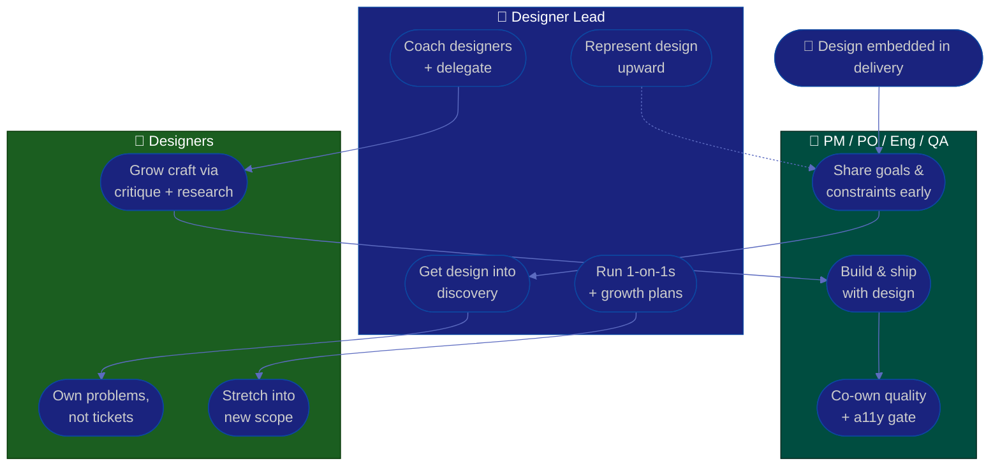

# Procedure: Collaboration & Growth

**Tags:** #procedure #designer-lead #design #collaboration #mentoring #growth #1on1
**Roles:** Designer Lead / Design Lead · Designers · PM/PO · Engineering · QA · Design Manager
**Read Time:** ~13 min

> Design's impact is capped by two things: how well it's **embedded in delivery** and how well its people **grow**. A Designer Lead who hoards the craft and fights for a seat alone will plateau the whole team. The job is to make design a trusted partner to PM, PO, Engineering, and QA — and to grow designers from executors into autonomous, evidence-driven craftspeople. Design has no authority over what ships, so it earns its seat by being **early, useful, and reliable** — and keeps it by making everyone around it better.

---

## 📌 Table of Contents
- [Two Halves of the Job](#two-halves-of-the-job)
- [Embedding Design in Delivery](#embedding-design-in-delivery)
- [Mermaid Swimlane Diagram](#mermaid-swimlane-diagram)
- [ASCII Flow](#ascii-flow)
- [Step-by-Step Responsibility Table](#step-by-step-responsibility-table)
- [Working With PM / PO / Eng / QA](#working-with-pm--po--eng--qa)
- [Earning Design's Seat at the Table](#earning-designs-seat-at-the-table)
- [Growing Designers](#growing-designers)
- [Career Paths & 1-on-1s](#career-paths--1-on-1s)
- [Anti-Patterns to Avoid](#anti-patterns-to-avoid)
- [Related Documents](#related-documents)

---

## Two Halves of the Job

| | **Collaboration (outward)** | **Growth (inward)** |
|:--|:----------------------------|:--------------------|
| Goal | Design is embedded, trusted, early | Designers get sharper & more autonomous |
| Currency | Reliability & evidence | Coaching, feedback, opportunity |
| Failure mode | Service desk / thrown over the wall | Lead does the work, team stagnates |
| Measure | Design in delivery from day one | Designers leveling up, low bus factor |

Both halves serve the same end: **multiply design's impact beyond what you alone could produce.**

---

## Embedding Design in Delivery

Design fails when it arrives too late ("here's the ticket, make it pretty") or too separate (a wall between design and build). Embed it instead:

- **Be in discovery, not just delivery.** Design's leverage is highest when shaping *what* to build, alongside the PM/PO — before requirements harden. (See [Product Owner](../product-owner/README.md) and [PM Leadership](../pm-leadership/README.md).)
- **Map design into the lifecycle.** Know where design fits each stage — discovery, definition, build, QA, release — and show up at each. See the [Feature Lifecycle](../software-delivery/01-feature-lifecycle.md).
- **Pair, don't hand off.** Design–dev pairing through the build keeps parity high and surfaces constraints early (see [03 — Handoff](./03-design-system-and-ops.md)).
- **Partner with QA on quality.** Visual, interaction, and accessibility quality are shared with QA — align so a11y and design parity are part of the gate, not an afterthought. (See [QA Leadership](../qa-leadership/README.md).)

---

## Mermaid Swimlane Diagram



---

## ASCII Flow

```
COLLABORATION & GROWTH — EMBED + MULTIPLY
══════════════════════════════════════════════════════════════════════════════════

🤝 START
   │
   ▼
┌──────────────────────────────────────────────────────────────────────────────┐
│  ① EMBED IN DELIVERY  (Designer Lead + PM/PO/Eng/QA)                          │
│    Design in discovery · pair through build · co-own the a11y/quality gate     │
└───────────────┬────────────────────────────────────────────────────────────────┘
                ▼
┌──────────────────────────────────────────────────────────────────────────────┐
│  ② EARN THE SEAT  (Designer Lead)                                             │
│    Be early, useful, reliable · win with evidence, not authority               │
└───────────────┬────────────────────────────────────────────────────────────────┘
                ▼
┌──────────────────────────────────────────────────────────────────────────────┐
│  ③ GROW DESIGNERS  (Designer Lead)                                            │
│    Delegate problems not tasks · coach via critique · stretch assignments      │
└───────────────┬────────────────────────────────────────────────────────────────┘
                ▼
┌──────────────────────────────────────────────────────────────────────────────┐
│  ④ 1-ON-1s + CAREERS  (Designer Lead)                                         │
│    Regular 1-on-1s · growth plans · IC vs lead tracks · feedback both ways      │
└────────────────────────────────────────────────────────────────────────────────┘
```

---

## Step-by-Step Responsibility Table

| # | Step | Who Owns | Who Helps | Output |
|:--|:-----|:---------|:----------|:-------|
| 1 | Get design into discovery | Designer Lead | PM/PO | Design in the kickoff |
| 2 | Establish design–dev pairing | Designer Lead | Eng Lead | Parity + early constraints |
| 3 | Co-own the quality/a11y gate | Designer Lead | QA Lead | Design in the release gate |
| 4 | Delegate problems, not tasks | Designer Lead | — | Designers owning outcomes |
| 5 | Coach via critique & research | Designer Lead | Senior designers | Sharper craft |
| 6 | Run regular 1-on-1s | Designer Lead | — | [1-on-1 notes](./templates/one-on-one-template.md) |
| 7 | Build growth & career plans | Designer Lead | Design Manager | Per-person growth plan |

---

## Working With PM / PO / Eng / QA

| Partner | They own | Design partners by | Friction to avoid |
|:--------|:---------|:-------------------|:------------------|
| **Product Owner** | Backlog, value, *what & why* | Co-shaping the problem with user evidence | Design reduced to decorating decided features |
| **Project Manager** | Dates, scope, delivery | Realistic design timelines; flagging risk early | Design as the silent bottleneck on a deadline |
| **Engineering** | How it's built | Pairing, tokens, feasible specs | Over-the-wall handoff; impossible designs |
| **QA** | The release gate, quality | Shared a11y & parity checks | A11y/visual bugs found only at the end |

> The throughline: **bring design forward in time.** Most design–partner friction is a timing problem — design arriving too late to influence anything but polish. Be early and you trade decoration for direction.

---

## Earning Design's Seat at the Table

Design has no positional authority, so the seat is earned and re-earned. The levers:

- **Be reliable.** Hit the dates you commit to. A team that trusts design to deliver invites it earlier.
- **Speak the partner's language.** Talk outcomes and metrics with PMs, feasibility with engineers, risk with QA — not just aesthetics.
- **Bring evidence, not opinions.** This is the deepest lever; it's why [05 — Research](./05-research-and-user-centered.md) exists. Evidence converts a seat-at-the-table from a favor into a necessity.
- **Make others look good.** Solve a partner's problem and they become your advocate. Influence is a network, not a title.
- **Pick battles.** Concede the trivial gracefully; spend credibility on the decisions that shape the experience.
- **Represent design upward.** Translate the team's craft into business value for leadership — funding for research, tooling, and headcount follows a clear story.

---

## Growing Designers

You're a multiplier; the team's growth *is* your output.

- **Delegate problems, not tasks.** "Make this button blue" grows no one. "Users abandon checkout here — own solving it" grows a designer. Hand over outcomes and let them own the path.
- **Coach through critique.** Critique is your primary teaching tool — questions for seniors, scaffolding for juniors. (See [04 — Critique & Quality](./04-critique-and-quality.md).)
- **Stretch assignments.** Give people work just past their current level, with support. Growth lives at the edge of comfort.
- **Spread the craft.** Pair designers, rotate who owns the system or research, run skill-shares — reduce the bus factor you mapped in [02 — Team Skills](./02-design-assessment.md).
- **Make feedback continuous.** Don't save it for reviews; small, specific, timely beats a once-a-quarter dump.
- **Protect focus and morale.** Shield the team from churn and thrash; a designer constantly context-switching produces shallow work and burns out.

---

## Career Paths & 1-on-1s

- **Two tracks, equal respect.** Make the **IC craft track** (senior → staff → principal designer) as prestigious and well-paid as the **lead/management track**. Not everyone should become a manager; forcing your best designer into management to get a raise loses you a great designer and gains a reluctant manager.
- **Name the next step.** Each designer should know what growth looks like for *them* and what closing the gap requires — concrete behaviors, not vibes.
- **Regular 1-on-1s.** Per-report, recurring, **their** agenda. Use the [1-on-1 template](./templates/one-on-one-template.md); keep a running doc; in your first weeks lean on the discovery questions.
- **Feedback both directions.** Ask how *you* can lead better. A lead who takes feedback well builds a team that gives it.
- **Connect growth to opportunity.** The fastest growth is real ownership of real problems — pair the growth plan to the roadmap so development isn't theoretical.

> Partner with your manager/EM on compensation, leveling, and performance — the [Engineering Manager](../engineering-manager/README.md) playbook covers the people-management mechanics you'll lean on.

---

## Anti-Patterns to Avoid

| Anti-Pattern | Why It Hurts | Do Instead |
|:-------------|:-------------|:-----------|
| **Design as a service desk** | Pixel tickets with no "why" reduce design to decoration | Reframe requests as problems; get into discovery |
| **Arriving too late** | Design can only polish a decided thing | Be in discovery; bring design forward in time |
| **Delegating tasks, not problems** | Executors never become owners | Hand over outcomes; let them own the path |
| **Lead does the hard work** | Caps the team at your throughput; stalls growth | Coach the solver; take only what no one else can |
| **One career track only** | Forces great ICs into management; loses craft | Equal IC and lead tracks |
| **Winning by authority** | Design has none; the tactic backfires | Win with evidence, reliability, and allies |
| **A11y/parity left to the end** | Expensive bugs found at the gate | Co-own quality with QA from the start |
| **Skipping 1-on-1s when busy** | Growth and trust quietly decay | Protect the cadence; it's the highest-leverage hour |

---

## Related Documents
- **Previous:** [05 — Research & User-Centered Design](./05-research-and-user-centered.md)
- **Series start:** [01 — First 90 Days](./01-first-90-days.md)
- **Templates:** [1-on-1](./templates/one-on-one-template.md) · [30/60/90 Plan](./templates/30-60-90-plan-template.md)
- **Cross-feed:** [Engineering Manager Playbook](../engineering-manager/README.md) · [Product Owner Playbook](../product-owner/README.md) · [PM Leadership Playbook](../pm-leadership/README.md) · [Team Lead Playbook](../team-lead/README.md) · [QA Leadership Playbook](../qa-leadership/README.md) · [Feature Lifecycle](../software-delivery/01-feature-lifecycle.md) · [Management & Leadership](../../management/README.md)

---

*Part of the [Designer Lead Playbook](./README.md) · Last updated: 2026-05-31*
