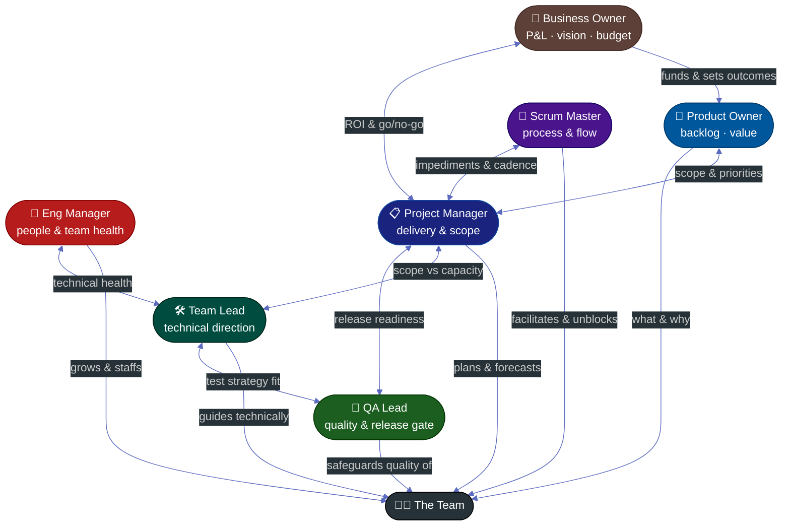

# 🧭 Leadership Playbooks — Hub

Practical, step-by-step guides for stepping into a **leadership role for the first time, in a new workspace.** Each playbook covers both halves of the job: the **onboarding** you do in your first 90 days, and the **process artifacts** you produce for the team.

> One spine runs through all of them: **Listen → Assess → Plan → Execute.** Don't change anything in month one — earn trust and understand the system first, then improve it deliberately. Every playbook follows the house format: a **Mermaid swimlane diagram**, a portable **ASCII flow**, and **step-by-step responsibility tables**.

---

## 📚 The Seven Playbooks

Roughly ordered by altitude — from the business outcome down to the day-to-day craft:

| Playbook | For someone becoming… | Leads through… | Core question |
|:---------|:----------------------|:---------------|:--------------|
| [💼 Business Owner](./business-owner/README.md) | A first-time business/product-line owner (sponsor) | Outcomes & funding | *Is this worth doing — and winning?* |
| [🎯 Product Owner](./product-owner/README.md) | A first-time PO | Value & the backlog | *Are we building the most valuable thing?* |
| [📋 Project Manager](./pm-leadership/README.md) | A first-time delivery/Agile PM | Influence, not authority | *Will it ship, predictably?* |
| [👥 Engineering Manager](./engineering-manager/README.md) | A first-time EM | Building the team | *Is the team healthy & growing?* |
| [🛠️ Team Lead / Tech Lead](./team-lead/README.md) | A first-time Team/Tech Lead | Technical credibility | *Is it built well?* |
| [🔄 Scrum Master](./scrum-master/README.md) | A first-time Scrum Master | Servant leadership | *Is the team effective at how it works?* |
| [🧪 QA Lead](./qa-leadership/README.md) | A first-time QA Lead | Quality partnership | *Is it safe to ship?* |

---

## 🤔 Which Role Am I? (and how they differ)

These titles overlap and companies use them loosely. The clearest way to tell them apart is **what each one owns** and **where their authority comes from**:

| Role | Owns | Authority | Does NOT |
|:-----|:-----|:----------|:---------|
| **Business Owner** | The P&L, vision, budget, ROI — the *why-it-matters* | Funding & go/no-go; ultimate decision-maker | Run the backlog or the team day-to-day |
| **Product Owner** | The product backlog, priorities, acceptance — the *what & why* | Over backlog order & value decisions | Own the budget; commit dates; direct *how* it's built |
| **Project Manager** | Plan, timeline, scope, risk, reporting | Delegated by sponsor (delivery) | Manage people's careers; estimate for the team |
| **Eng Manager** | People — hiring, growth, performance, team health | Direct people-management authority | Micromanage technical decisions or daily work |
| **Team Lead** | Technical direction, code quality, the *how* | Technical credibility + (often) line mgmt | Own the backlog or business priorities |
| **Scrum Master** | The *process* and team effectiveness | None — pure servant-leadership | Assign work, commit dates, or manage people |
| **QA Lead** | Test strategy, defect process, release gate | Over QA practice & sign-off | Decide business scope or dates |

> **A quick heuristic:** if you're accountable for the **business outcome & budget**, you're the Business Owner. For **what's most valuable to build next**, Product Owner. For **dates and scope**, PM. For **people's careers**, EM. For **technical decisions and code**, Team Lead. For **how well the team runs its process**, Scrum Master. For **quality and the release gate**, QA Lead. In small companies one person wears several of these hats — read more than one playbook.
>
> 💡 **The two easiest to confuse:** the **Business Owner** sets the *why* and *funds* it; the **Product Owner** decides *what* to build to deliver that value; the **PM** makes sure it *ships*. Owner → outcome, PO → value, PM → delivery.

---

## 🗺️ The Shared First-90-Days Spine

Every playbook applies the same four phases — only the *content* of each phase changes by role.

```
        ┌──────────┐   ┌──────────┐   ┌──────────┐   ┌──────────┐
DAY 1 → │  LISTEN  │ → │  ASSESS  │ → │   PLAN   │ → │ EXECUTE  │ → 90
        │  1–14    │   │  15–30   │   │  31–60   │   │  61–90   │
        └──────────┘   └──────────┘   └──────────┘   └──────────┘
         understand     diagnose       prioritize      ship visible
         people &       the current    & socialize     wins, build
         pain           state (6-dim   a bought-in     a sustainable
         (change        assessment)    plan            cadence
          nothing)
```

Each playbook ships with a **30/60/90 plan template** and a **1-on-1 template** (with role-specific first-meeting discovery questions) so you can start on day one.

---

## 🧩 How They Work Together

On a real team these roles collaborate constantly. A simplified picture of who leans on whom:



---

## 🚦 Start Here

1. **Pick your playbook** from the table above (or read two if you wear multiple hats).
2. **Read its `01-first-90-days.md` today** and fill the 30/60/90 template.
3. **Start your 1-on-1s tomorrow** using the discovery questions.
4. Work the phases — the rest of the series maps to days 15→90.

> New and short on time? Just do steps 1–3 this week. Everything else can wait until you understand the team.

---

## 🔗 Related
- [All Procedures](./README.md)
- [Management & Leadership feed](../management/README.md) — [DoR vs DoD](../management/02-dor-and-dod-guide.md) · [SDLC Series](../management/sdlc/README.md) · [Project Tools](../management/01-project-management-tools.md)
- [Sprint Ceremonies](./software-delivery/03-sprint-ceremonies.md) — the role-by-role ceremony breakdown all five playbooks reference
- [Templates feed](../templates/README.md)

---

*Part of the [Procedures](./README.md) collection · Last updated: 2026-05-31*
