# Procedure: First 90 Days as a New Product Owner

**Tags:** #procedure #product-owner #agile #scrum #backlog #onboarding #first90days
**Roles:** Product Owner · Business Owner / Sponsor · Project Manager · Scrum Master · Developers · QA · Stakeholders / Customers
**Read Time:** ~14 min

> Your first Product Owner role, in a new workspace, is won or lost in the first 90 days — not by reordering the backlog on day 1, but by **understanding the value before you reorder it**. A PO is not a ticket-writer or a proxy who relays requests; you *own the product backlog* and you are accountable for the *value* the team delivers. This procedure gives you a week-by-week roadmap built on four phases: **Listen → Assess → Plan → Execute.** The fastest way to fail is to treat the backlog as a request inbox and yourself as its scribe. Resist it — own the *why*.

---

## 📌 Table of Contents
- [The Core Principle](#the-core-principle)
- [PO vs PM vs SM vs Business Owner](#po-vs-pm-vs-sm-vs-business-owner)
- [The Four Phases](#the-four-phases)
- [Mermaid Swimlane Diagram](#mermaid-swimlane-diagram)
- [ASCII Flow](#ascii-flow)
- [Step-by-Step Responsibility Table](#step-by-step-responsibility-table)
- [Phase 1 — Listen (Days 1–14)](#phase-1--listen-days-114)
- [Phase 2 — Assess (Days 15–30)](#phase-2--assess-days-1530)
- [Phase 3 — Plan (Days 31–60)](#phase-3--plan-days-3160)
- [Phase 4 — Execute (Days 61–90)](#phase-4--execute-days-6190)
- [Anti-Patterns to Avoid](#anti-patterns-to-avoid)
- [Related Documents](#related-documents)

---

## The Core Principle

> **You are the owner of value, not a ticket-writer.** A Product Owner exists to maximize the value the development team delivers. That power comes from *deciding what matters and why* — owning and ordering a single backlog, and being decisive about it. Every time you make the *why* clear and the next-most-valuable thing obvious, you earn trust. Every time you dump an unranked request into the backlog and walk away, you spend it.

A Product Owner has three jobs, in priority order:
1. **Maximize value** — the team builds the most valuable thing next, and you can explain *why* it's most valuable.
2. **Own the backlog** — one ordered, visible, healthy backlog that the whole team trusts as the single source of *what's next*.
3. **Be decisive & available** — answer the team's "what & why" fast, accept or reject completed work, and protect the team from churn and conflicting direction.

In the first 90 days you mostly do #1 and #3 (keep the team unblocked and pointed at value), set up #2 (a backlog people can trust), and earn the authority to say *no* on behalf of the product.

The PO decides **WHAT** and **WHY**. The development team decides **HOW**. The Scrum Master owns the **PROCESS**. The Project Manager (if present) owns **DELIVERY / TIMELINE**. Blurring these lines is the most common way a new PO loses the room.

---

## PO vs PM vs SM vs Business Owner

These roles are constantly confused. The clearest way to tell them apart is **what each one owns** and **what each one decides**:

| Role | Owns | Decides | Authority | Does NOT |
|:-----|:-----|:--------|:----------|:---------|
| **Product Owner** | The product backlog & its order | *What* to build next and *why* | Single, final say over backlog order & acceptance | Decide *how* it's built; commit the team's dates; manage the process |
| **Project Manager** | The plan, timeline, scope, risk, reporting | *When* it ships and how delivery flows | Delegated by sponsor over delivery | Reorder the backlog or define product value |
| **Scrum Master** | The process & team effectiveness | *How well* the team runs its way of working | None — pure servant-leadership | Order the backlog, assign work, or commit dates |
| **Business Owner / Sponsor** | The budget, the business case, the bet | *Whether* to fund it and the high-level outcome | Funding & strategic direction | The day-to-day backlog or sprint contents |

> **A quick heuristic:** if you're accountable for **what's most valuable next**, you're the PO. For **the schedule and delivery**, PM. For **the team's process health**, SM. For **the money and the strategic bet**, the Business Owner. On small teams one person wears several hats — but keep the *decisions* straight even when the people overlap.

---

## The Four Phases

| Phase | Days | Goal | Output |
|:------|:-----|:-----|:-------|
| **1 — Listen** | 1–14 | Understand product, customers, team, and pain — change nothing | Stakeholder map, value notes |
| **2 — Assess** | 15–30 | Diagnose product & backlog health objectively | [Product & Backlog Assessment](./02-product-and-backlog-assessment.md) |
| **3 — Plan** | 31–60 | Set vision, roadmap, and a re-ordered, healthy backlog | [Vision & Roadmap](./03-vision-and-roadmap.md) + ordered backlog |
| **4 — Execute** | 61–90 | Run a clean refinement→review cycle, ship visible value | Trusted backlog + first outcome metrics |

---

## Mermaid Swimlane Diagram

```mermaid
%%{init: {'theme': 'dark', 'themeVariables': {'primaryColor': '#1a237e', 'primaryBorderColor': '#0d47a1', 'primaryTextColor': '#ffffff', 'lineColor': '#5c6bc0', 'secondaryColor': '#004d40', 'tertiaryColor': '#4a148c', 'background': '#1e1e1e', 'mainBkg': '#1a237e', 'nodeBorder': '#0d47a1', 'clusterBkg': '#263238', 'titleColor': '#ffffff', 'edgeLabelBackground': '#263238'},
  'themeCSS': 'svg { background-color: #1e1e1e !important; padding: 1rem !important; border-radius: 8px !important; } text, tspan { fill: #ffffff !important; } .edgeLabel rect { fill: #1e1e1e !important; }'
}}%%
flowchart TD
    START([🎯 Day 1 — New Product Owner])

    subgraph LISTEN ["👂 Phase 1 — Listen (Day 1–14)"]
        L1([Meet sponsor —<br>clarify the bet])
        L2([1-on-1 with<br>every team member])
        L3([Meet PM, SM, QA,<br>stakeholders])
        L4([Read backlog, learn<br>the customer])
    end

    subgraph ASSESS ["🔍 Phase 2 — Assess (Day 15–30)"]
        A1([Score product &<br>backlog — 6 dims])
        A2([Find top 3 value<br>gaps + risks])
        A3([Write Product &<br>Backlog Assessment])
        A4([Review with sponsor])
    end

    subgraph PLAN ["🗺️ Phase 3 — Plan (Day 31–60)"]
        P1([Set vision +<br>outcome roadmap])
        P2([Re-order backlog<br>by value])
        P3([Socialize with<br>stakeholders])
        P4([Align team +<br>get buy-in])
    end

    subgraph EXEC ["🚀 Phase 4 — Execute (Day 61–90)"]
        E1([Run refinement →<br>review cycle])
        E2([Accept/reject work<br>against AC])
        E3([Define outcome<br>metrics])
        E4([90-day review<br>with sponsor])
    end

    START --> L1 --> L2 --> L3 --> L4
    L4 --> A1 --> A2 --> A3 --> A4
    A4 --> P1 --> P2 --> P3 --> P4
    P4 --> E1 --> E2 --> E3 --> E4

    style LISTEN fill:#1a237e,stroke:#0d47a1,color:#fff
    style ASSESS fill:#4a148c,stroke:#12005e,color:#fff
    style PLAN fill:#004d40,stroke:#00251a,color:#fff
    style EXEC fill:#1b5e20,stroke:#003300,color:#fff
```



---

## ASCII Flow

```
FIRST 90 DAYS — NEW PRODUCT OWNER
══════════════════════════════════════════════════════════════════════════════════

🎯 DAY 1
   │
   ▼
┌──────────────────────────────────────────────────────────────────────────────┐
│  PHASE 1 — LISTEN  (Day 1–14)            RULE: change nothing yet             │
│    ① Meet your sponsor → clarify the business bet & how value is measured     │
│    ② 1-on-1 with every team member (devs, QA, designers)                      │
│    ③ Meet PM, Scrum Master, QA, stakeholders — ask "what should we build why" │
│    ④ Read it all: the backlog, customer feedback, analytics, last 3 reviews   │
└────────────────────────────────────────┬─────────────────────────────────────┘
                                         │
                                         ▼
┌──────────────────────────────────────────────────────────────────────────────┐
│  PHASE 2 — ASSESS  (Day 15–30)           RULE: diagnose, don't prescribe      │
│    ① Score 6 dims: vision, backlog health, story quality, prioritization,     │
│       stakeholder alignment, value/outcome measurement                         │
│    ② Identify top 3 value gaps / risks by IMPACT × EFFORT                      │
│    ③ Write the Product & Backlog Assessment (facts, not opinions)              │
│    ④ Review with your sponsor — align before publishing widely                 │
└────────────────────────────────────────┬─────────────────────────────────────┘
                                         │
                                         ▼
┌──────────────────────────────────────────────────────────────────────────────┐
│  PHASE 3 — PLAN  (Day 31–60)             RULE: value over volume              │
│    ① Set a product vision + outcome-based roadmap (themes, not feature lists)  │
│    ② Re-order the backlog by value — one ordered list, top is "next & ready"   │
│    ③ Socialize 1-on-1 BEFORE the group meeting (no surprises)                  │
│    ④ Align the team & stakeholders, secure buy-in on the "why"                 │
└────────────────────────────────────────┬─────────────────────────────────────┘
                                         │
                                         ▼
┌──────────────────────────────────────────────────────────────────────────────┐
│  PHASE 4 — EXECUTE  (Day 61–90)          RULE: ship value, decisively         │
│    ① Run ONE clean refinement → sprint → review cycle, model availability      │
│    ② Accept/reject completed work against acceptance criteria — no rubber-stamp│
│    ③ Define 3–5 outcome metrics (adoption, activation, value delivered)        │
│    ④ 90-day review: what's clearer, what shipped, what the data shows, what's  │
│       next                                                                     │
└────────────────────────────────────────────────────────────────────────────────┘
```

---

## Step-by-Step Responsibility Table

| # | Step | Who Owns | Who Helps | Output / Artifact |
|:--|:-----|:---------|:----------|:------------------|
| 1 | Clarify the business bet & value measures | PO | Business Owner / Sponsor | 1-page "what value looks like" |
| 2 | 1-on-1 with each team member | PO | — | Notes per person ([template](./templates/30-60-90-plan-template.md)) |
| 3 | Map stakeholders & customers | PO | PM, SM | Stakeholder map |
| 4 | Learn the product & customer | PO | Support, Analytics | Customer & usage notes |
| 5 | Assess product & backlog health | PO | Team, QA | [Assessment](./02-product-and-backlog-assessment.md) |
| 6 | Identify top 3 value gaps/risks | PO | Sponsor | Prioritized gap list |
| 7 | Set vision & outcome roadmap | PO | Sponsor, PM | [Vision & Roadmap](./03-vision-and-roadmap.md) |
| 8 | Re-order the backlog by value | PO | Team (refinement) | [Ordered backlog](./04-backlog-and-stories.md) |
| 9 | Run a refinement→review cycle | PO | SM, Team | [Stakeholders & Collaboration](./06-stakeholders-and-collaboration.md) |
| 10 | Accept/reject completed work | PO | QA | Accepted increment |
| 11 | 90-day review | PO | Sponsor | Review + next-quarter outcomes |

---

## Phase 1 — Listen (Days 1–14)

**Goal:** Build a mental model of the product, the customer, the team, and the pain. **Make zero backlog changes.**

### Week 1 — Value & mandate
- **First meeting with your sponsor / Business Owner.** Ask the questions that define your job:
  - "What does success look like at 90 days? At 6 months? What outcome are we betting on?"
  - "How do we measure value today — and is anyone actually watching those numbers?"
  - "What's the one thing about this product you most want fixed?"
  - "Who are the key stakeholders and customers, and what's the history with each?"
  - "What's my decision authority — can I say *no* to a stakeholder request and make it stick?"
- **1-on-1 with every team member.** Highest-leverage thing you do all month (and a chance to learn the product from the people who built it):
  - "What's working well that I should NOT change?"
  - "What's the most painful part of how we decide what to build?"
  - "If you were me, what's the first thing you'd reprioritize?"
  - "What do you wish you understood about the *why* behind the work?"
- **Listen 80%, talk 20%.** Take notes. Do not re-rank the backlog or promise features yet.

### Week 2 — Product, customer & process
- **Meet your partners:** the PM (delivery/timeline), the Scrum Master (process), QA, design, support, and key business stakeholders. Ask each: *"What should we be building, and why — and where do today's priorities feel wrong?"*
- **Learn the customer.** Read support tickets, watch session recordings or analytics, sit in on a sales or support call. You cannot order a backlog by value if you don't know who you're creating value for.
- **Read everything:** the full backlog, customer feedback, product analytics, the last 3 sprint reviews, any roadmap or PRD ([PRD template](../../templates/engineering-docs/01-prd.md)), and the [Definition of Ready / Done](../../management/02-dor-and-dod-guide.md) the team uses today.

> 🚩 **Red flag for yourself:** If by day 14 you're itching to "just clean up the backlog and re-rank everything," write the urge down and save it for Phase 3. First understand *why* it's ordered (or not) the way it is.

---

## Phase 2 — Assess (Days 15–30)

**Goal:** Turn impressions into an evidence-based diagnosis. See the full method in **[02 — Product & Backlog Assessment](./02-product-and-backlog-assessment.md)**.

- Score across six dimensions: **Vision clarity, Backlog health, Story quality / AC, Prioritization, Stakeholder alignment, Value / outcome measurement** — each 1–5.
- Quantify where you can: backlog item count & age, % of top-of-backlog stories that are *ready*, story carry-over rate, time-to-answer for team "what/why" questions, and whether any outcome metric is actually tracked.
- Rank gaps by **Impact × Effort**, not by who lobbies loudest.
- Produce the **[Product & Backlog Assessment](./02-product-and-backlog-assessment.md)** — facts first, recommendations clearly separated.
- **Review with your sponsor privately first.** Align on the story before any wide publication.

---

## Phase 3 — Plan (Days 31–60)

**Goal:** Convert the diagnosis into a clear, bought-in product direction.

- Set a **[product vision and an outcome-based roadmap](./03-vision-and-roadmap.md)** — themes and outcomes ("users can pay a friend in under 10 seconds"), not a dated feature list.
- **Re-order the backlog by value** so the top is always the next-most-valuable, *ready* work. See **[04 — Backlog & Stories](./04-backlog-and-stories.md)** and **[05 — Prioritization & Value](./05-prioritization-and-value.md)**.
- Prioritize improvements using an **Impact vs Effort** grid:

```
            HIGH IMPACT
                │
    SCHEDULE    │   DO NOW
   (big bets)   │  (quick wins)
                │
  ──────────────┼──────────────  EFFORT →
                │
    AVOID /     │   FILL-IN
   DEPRIORITIZE │  (easy, low value)
                │
            LOW IMPACT
```

- **Socialize 1-on-1 before the group.** Walk each stakeholder through the vision and the new order privately. The group meeting should hold zero surprises.
- For each top-of-backlog item: a clear **outcome it serves**, **acceptance criteria**, and a state of **ready**.

---

## Phase 4 — Execute (Days 61–90)

**Goal:** Deliver visible value and lock in a backlog the team trusts.

- **Run one clean refinement → sprint → review cycle.** Be available to answer "what & why" within hours, not days. See **[06 — Stakeholders & Collaboration](./06-stakeholders-and-collaboration.md)** and the [Sprint Ceremonies](../software-delivery/03-sprint-ceremonies.md) flow.
- **Accept or reject completed work at the review** against acceptance criteria — decisively. Accepting work that doesn't meet AC teaches the team that "done" is negotiable; it isn't.
- **Define 3–5 outcome metrics** (don't over-instrument): adoption, activation, task success rate, retention, or value delivered per theme. Outcomes over outputs.
- **Run the 90-day review** with your sponsor: what's clearer now, what shipped, what the data shows, what the next quarter's outcomes are, and what you need.

---

## Anti-Patterns to Avoid

| Anti-Pattern | Why It Hurts | Do Instead |
|:-------------|:-------------|:-----------|
| **Re-ranking the backlog in week 1** | You don't yet know what creates value here | Listen first; re-order in Phase 3 |
| **"Ticket-writer" PO** | Transcribing requests with no *why* makes you a bottleneck, not an owner | Own the outcome; explain the value of every item |
| **Backlog as a dumping ground** | An unranked 300-item list no one trusts is worse than no backlog | One ordered list; top is always next & ready |
| **Proxy PO with no authority** | Relaying decisions you can't make stalls the team and erodes trust | Get real decision authority from your sponsor on day 1 |
| **Saying yes to everyone** | A backlog that serves every stakeholder serves no outcome | Say no with a reason; defend the product's focus |
| **Outputs over outcomes** | Shipping features nobody adopts is motion, not value | Tie work to a measurable outcome; track it |
| **Absent at review** | If you don't accept/reject work, "done" becomes meaningless | Be present; judge against AC, decisively |
| **Skipping sponsor alignment** | Publishing a roadmap your sponsor hasn't seen is a career risk | Always review privately first |

---

## Related Documents
- **Next step:** [02 — Product & Backlog Assessment](./02-product-and-backlog-assessment.md)
- [03 — Vision & Roadmap](./03-vision-and-roadmap.md) · [04 — Backlog & Stories](./04-backlog-and-stories.md)
- [05 — Prioritization & Value](./05-prioritization-and-value.md) · [06 — Stakeholders & Collaboration](./06-stakeholders-and-collaboration.md)
- **Templates:** [30/60/90 Plan](./templates/30-60-90-plan-template.md) · [User Story](./templates/user-story-template.md) · [Product Roadmap](./templates/product-roadmap-template.md)
- **Cross-feed:** [DoR vs DoD](../../management/02-dor-and-dod-guide.md) · [Sprint Ceremonies](../software-delivery/03-sprint-ceremonies.md) · [Feature Lifecycle](../software-delivery/01-feature-lifecycle.md) · [PM Leadership Playbook](../pm-leadership/README.md) · [Scrum Master Playbook](../scrum-master/README.md)

---

*Part of the [Product Owner Playbook](./README.md) · Last updated: 2026-05-31*
