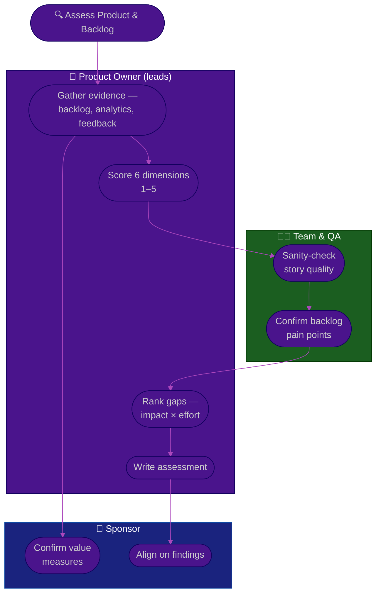

# Procedure: Product & Backlog Assessment

**Tags:** #procedure #product-owner #agile #backlog #assessment #prioritization
**Roles:** Product Owner · Business Owner / Sponsor · Project Manager · Scrum Master · Developers · QA
**Read Time:** ~12 min

> Before you re-order a single backlog item, you need an honest diagnosis of what you inherited. This procedure scores product & backlog health across **six dimensions**, each on a **1–5 maturity scale**, then prioritizes the gaps by **Impact × Effort** so you fix the few things that matter most. The golden rule: **score the system, not the people.** A neglected backlog is almost never the fault of the last person — it's the predictable result of no one owning value. Your job is to make the diagnosis objective enough that the fix is obvious.

---

## 📌 Table of Contents
- [Why Assess First](#why-assess-first)
- [The Six Dimensions](#the-six-dimensions)
- [The 1–5 Maturity Scale](#the-15-maturity-scale)
- [Mermaid Swimlane Diagram](#mermaid-swimlane-diagram)
- [ASCII Flow](#ascii-flow)
- [Step-by-Step Responsibility Table](#step-by-step-responsibility-table)
- [Scoring Each Dimension](#scoring-each-dimension)
- [Prioritizing the Gaps](#prioritizing-the-gaps)
- [Anti-Patterns to Avoid](#anti-patterns-to-avoid)
- [Related Documents](#related-documents)

---

## Why Assess First

A new PO's instinct is to start fixing — re-rank the backlog, rewrite stories, add ceremonies. But without a baseline you can't tell a *symptom* (carry-over every sprint) from a *cause* (stories have no acceptance criteria). The assessment turns a vague feeling of "this backlog is a mess" into a ranked list of specific, fixable gaps you can show your sponsor and your team.

Do this in **Phase 2 (Days 15–30)** — after you've listened (Phase 1) and before you re-plan (Phase 3). See [01 — First 90 Days](./01-first-90-days.md).

---

## The Six Dimensions

| # | Dimension | The core question |
|:--|:----------|:------------------|
| 1 | **Vision clarity** | Can everyone state, in one sentence, what this product is *for* and who it serves? |
| 2 | **Backlog health** | Is there *one* ordered, visible, right-sized backlog the team trusts? |
| 3 | **Story quality / AC** | Are top stories small, valuable, and testable, with crisp acceptance criteria? |
| 4 | **Prioritization** | Is the order driven by *value* (ROI / cost-of-delay), and is it defensible? |
| 5 | **Stakeholder alignment** | Do stakeholders & customers agree on what's next — and trust the PO to decide? |
| 6 | **Value / outcome measurement** | Do we measure *outcomes* (adoption, value) — not just *outputs* (features shipped)? |

---

## The 1–5 Maturity Scale

| Score | Label | What it looks like |
|:-----:|:------|:-------------------|
| **1** | Absent | No artifact, no ownership, ad-hoc and reactive |
| **2** | Initial | Exists but inconsistent, stale, or distrusted |
| **3** | Defined | A repeatable practice exists and is mostly followed |
| **4** | Managed | Consistently followed, measured, and reviewed |
| **5** | Optimizing | Continuously improved with data; a competitive strength |

> Score honestly and with evidence. A "2" you can defend with facts is more useful than a hopeful "4." Most inherited products land at 2–3 on most dimensions — that's normal, and it's your opportunity.

---

## Mermaid Swimlane Diagram



---

## ASCII Flow

```
PRODUCT & BACKLOG ASSESSMENT
══════════════════════════════════════════════════════════════════════════════════

🔍 START — DAYS 15–30
   │
   ▼
┌──────────────────────────────────────────────────────────────────────────────┐
│  STEP ① — GATHER EVIDENCE   (PO)                                              │
│    Backlog export · product analytics · support/feedback · last 3 reviews      │
└───────────────┬────────────────────────────────────────────────────────────────┘
                ▼
┌──────────────────────────────────────────────────────────────────────────────┐
│  STEP ② — SCORE 6 DIMENSIONS  1–5   (PO, sanity-checked by team)              │
│    Vision · Backlog health · Story quality/AC · Prioritization ·              │
│    Stakeholder alignment · Value/outcome measurement                           │
└───────────────┬────────────────────────────────────────────────────────────────┘
                ▼
┌──────────────────────────────────────────────────────────────────────────────┐
│  STEP ③ — RANK GAPS   (PO)                                                    │
│    Plot each gap on IMPACT × EFFORT · pick the DO-NOW quadrant                 │
└───────────────┬────────────────────────────────────────────────────────────────┘
                ▼
┌──────────────────────────────────────────────────────────────────────────────┐
│  STEP ④ — WRITE & ALIGN   (PO → Sponsor)                                      │
│    Facts first, recommendations separated · review privately with sponsor      │
└────────────────────────────────────────────────────────────────────────────────┘
```

---

## Step-by-Step Responsibility Table

| # | Step | Who Owns | Who Helps | Output |
|:--|:-----|:---------|:----------|:-------|
| 1 | Gather evidence | PO | Analytics, Support | Backlog export + data pack |
| 2 | Score 6 dimensions (1–5) | PO | Team, QA | Scored radar |
| 3 | Confirm story-quality reality | Team | PO | Sampled story review |
| 4 | Rank gaps by impact × effort | PO | — | Prioritized gap list |
| 5 | Write the assessment | PO | — | Assessment doc |
| 6 | Review privately with sponsor | PO | Sponsor | Aligned findings |

---

## Scoring Each Dimension

### 1 — Vision clarity
Ask five people (sponsor, a dev, QA, a stakeholder, yourself) to state the product's purpose and target user in one sentence. **Five different answers = score 1–2.** A crisp, shared sentence everyone repeats = 4–5. This is the root dimension: a backlog can't be ordered by value if no one agrees what value *is*. See [03 — Vision & Roadmap](./03-vision-and-roadmap.md).

### 2 — Backlog health
- Is there **one** backlog, or several competing lists (a spreadsheet, a Slack channel, the PM's head)?
- **Size & age:** how many items, and how old is the oldest? A 300-item backlog with two-year-old entries scores low — most of it is noise that will never be built.
- **Order:** is it a true single ordered list, or is everything "high priority"?
- **Right-sizing:** are near-top items small (sprint-sized), with bigger epics deeper down?

### 3 — Story quality / AC
Sample the top 10–15 items. For each, check: does it express **role / goal / benefit**, is it **INVEST**-shaped, and does it have **testable acceptance criteria**? If QA and devs can't tell when a story is "done" without asking you, score low. See [04 — Backlog & Stories](./04-backlog-and-stories.md).

### 4 — Prioritization
Is order driven by a **value method** (ROI, cost-of-delay, WSJF, RICE) or by recency and volume? Ask "why is *this* item above *that* one?" — if there's no defensible answer, it's not really prioritized. See [05 — Prioritization & Value](./05-prioritization-and-value.md).

### 5 — Stakeholder alignment
Do stakeholders agree on what's next, or is each one privately convinced their item is #1? Is there a **single PO** they trust to decide, or do they route around you to the team? Misalignment here shows up as mid-sprint scope injection and contradicting direction.

### 6 — Value / outcome measurement
Is *any* outcome tracked (adoption, activation, retention, task success), or do you only count features shipped? A team that can't tell whether the last 5 features were used is flying blind. Outputs are easy to count; outcomes are what matter.

---

## Prioritizing the Gaps

Plot each gap on **Impact × Effort** and start top-right:

```
            HIGH IMPACT
                │
    SCHEDULE    │   DO NOW
   (big bets)   │  (quick wins)
                │
  ──────────────┼──────────────  EFFORT →
                │
    AVOID /     │   FILL-IN
   DEPRIORITIZE │  (easy, low value)
                │
            LOW IMPACT
```

- **DO NOW** (high impact, low effort): e.g., adopt acceptance criteria for top stories; archive the 200 dead backlog items; publish one ordered list.
- **SCHEDULE** (high impact, high effort): e.g., establish an outcome-metrics dashboard; rebuild the vision with the sponsor.
- **FILL-IN / AVOID:** cosmetic tidying that feels productive but moves no value.

Pick **1–3 gaps** to fix in Phase 3 — not ten. A finished fix beats five half-started ones.

---

## Anti-Patterns to Avoid

| Anti-Pattern | Why It Hurts | Do Instead |
|:-------------|:-------------|:-----------|
| **Scoring from a feeling** | "It's a mess" isn't actionable and isn't defensible | Score with evidence — counts, samples, data |
| **Inflating the scores** | A hopeful "4" hides the gap you most need to fix | Score honestly; a defensible 2 is more useful |
| **Boiling the ocean** | Ten gaps = zero fixes finished | Pick 1–3 by impact × effort |
| **Blaming the predecessor** | Burns goodwill, learns nothing about the system | Diagnose the system, not the person |
| **Counting outputs as health** | "We shipped 40 features" says nothing about value | Measure outcomes; that's dimension 6 |
| **Publishing before sponsor sees it** | Surprising your sponsor with findings is a career risk | Review privately first |

---

## Related Documents
- **Previous:** [01 — First 90 Days](./01-first-90-days.md)
- **Next:** [03 — Vision & Roadmap](./03-vision-and-roadmap.md)
- [04 — Backlog & Stories](./04-backlog-and-stories.md) · [05 — Prioritization & Value](./05-prioritization-and-value.md)
- **Templates:** [Product Roadmap](./templates/product-roadmap-template.md) · [Prioritization Matrix](./templates/prioritization-matrix-template.md)
- **Cross-feed:** [DoR vs DoD](../../management/02-dor-and-dod-guide.md) · [Sprint Ceremonies](../software-delivery/03-sprint-ceremonies.md) · [QA Leadership Playbook](../qa-leadership/README.md)

---

*Part of the [Product Owner Playbook](./README.md) · Last updated: 2026-05-31*
