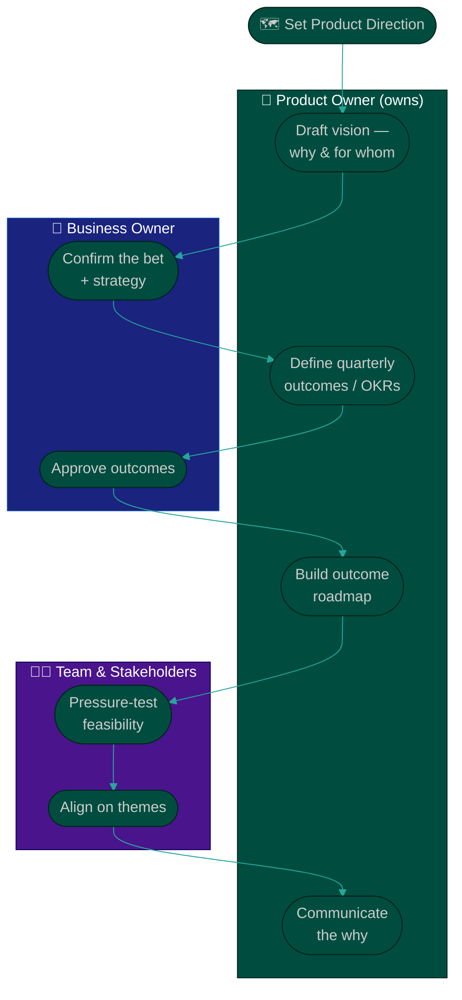

# Procedure: Product Vision & Roadmap

**Tags:** #procedure #product-owner #agile #vision #roadmap #okr #outcomes
**Roles:** Product Owner · Business Owner / Sponsor · Project Manager · Scrum Master · Developers · Stakeholders
**Read Time:** ~13 min

> A backlog without a vision is just a to-do list, and a roadmap that's a dated feature list is a promise you'll break. This procedure builds product direction in three layers — **Vision → Outcomes → Roadmap** — so that every backlog item can trace its lineage back to *why it matters*. The golden rule: **outcomes over outputs.** A roadmap should promise the *change you intend to create* ("a new user can send their first payment in under 2 minutes"), not the *features you'll build* ("ship the onboarding wizard"). Features are how; outcomes are why.

---

## 📌 Table of Contents
- [Vision, Outcomes, Roadmap](#vision-outcomes-roadmap)
- [The Three Layers](#the-three-layers)
- [Mermaid Swimlane Diagram](#mermaid-swimlane-diagram)
- [ASCII Flow](#ascii-flow)
- [Step-by-Step Responsibility Table](#step-by-step-responsibility-table)
- [Layer 1 — Vision](#layer-1--vision)
- [Layer 2 — Outcomes & OKRs](#layer-2--outcomes--okrs)
- [Layer 3 — The Value-Based Roadmap](#layer-3--the-value-based-roadmap)
- [Communicating the Why](#communicating-the-why)
- [Anti-Patterns to Avoid](#anti-patterns-to-avoid)
- [Related Documents](#related-documents)

---

## Vision, Outcomes, Roadmap

| | **Vision** | **Outcomes / OKRs** | **Roadmap** |
|:--|:-----------|:--------------------|:------------|
| Horizon | 1–3 years | A quarter | Now / Next / Later |
| Answers | *Why we exist* | *What change this quarter* | *What we'll pursue, in order* |
| Granularity | One statement | 3–5 measurable results | Themes & outcomes |
| Changes | Rarely | Quarterly | Continuously, but deliberately |
| Owner | PO + Business Owner | PO | PO |

Don't confuse them. A vision that changes every quarter isn't a vision; a roadmap with exact dates and feature names is a fiction.

---

## The Three Layers

| Layer | Defines | Output |
|:--|:--|:--|
| 1 — **Vision** | Why the product exists, for whom | One-sentence vision |
| 2 — **Outcomes** | The measurable change we want this quarter | OKRs / success metrics |
| 3 — **Roadmap** | The themes we'll pursue, in value order | Outcome-based roadmap |

---

## Mermaid Swimlane Diagram



---

## ASCII Flow

```
PRODUCT VISION & ROADMAP
══════════════════════════════════════════════════════════════════════════════════

🗺️ SET DIRECTION
   │
   ▼
┌──────────────────────────────────────────────────────────────────────────────┐
│  LAYER 1 — VISION   (PO + Business Owner)                                     │
│    Why the product exists, for whom — one durable sentence                     │
└───────────────┬────────────────────────────────────────────────────────────────┘
                ▼
┌──────────────────────────────────────────────────────────────────────────────┐
│  LAYER 2 — OUTCOMES / OKRs   (PO owns, sponsor approves)                       │
│    3–5 measurable results for the quarter — the CHANGE, not the features       │
└───────────────┬────────────────────────────────────────────────────────────────┘
                ▼
┌──────────────────────────────────────────────────────────────────────────────┐
│  LAYER 3 — ROADMAP   (PO, team pressure-tests)                                │
│    NOW / NEXT / LATER themes · each tied to an outcome + success metric         │
│    No exact dates, no feature-list promises                                    │
└───────────────┬────────────────────────────────────────────────────────────────┘
                ▼
┌──────────────────────────────────────────────────────────────────────────────┐
│  COMMUNICATE THE WHY   (PO → everyone, repeatedly)                            │
│    Every backlog item traces to a theme → outcome → vision                      │
└────────────────────────────────────────────────────────────────────────────────┘
```

---

## Step-by-Step Responsibility Table

| # | Step | Who Owns | Who Helps | Output |
|:--|:-----|:---------|:----------|:-------|
| 1 | Draft the vision | PO | Business Owner | One-sentence vision |
| 2 | Confirm the strategic bet | Business Owner | PO | Aligned vision |
| 3 | Define quarterly outcomes / OKRs | PO | Sponsor, PM | 3–5 OKRs |
| 4 | Pressure-test feasibility | Team | PO, PM | Reality-checked themes |
| 5 | Build the outcome roadmap | PO | Team, Stakeholders | [Roadmap](./templates/product-roadmap-template.md) |
| 6 | Communicate the why | PO | SM | Shared, repeated narrative |

---

## Layer 1 — Vision

A product vision is a **single, durable sentence** that answers *why this product exists and for whom*. A useful shape:

> **For** [target customer] **who** [need], **the** [product] **is a** [category] **that** [key benefit]. **Unlike** [alternative], **we** [key differentiator].

- It should be **stable** (it doesn't change sprint to sprint), **aspirational** (worth working toward), and **shared** (everyone can repeat it).
- Co-author it with the **Business Owner** — they own the strategic bet; you own translating it into product direction.
- Test it: if five people give five different one-sentence answers about the product's purpose, you don't have a vision yet — you have a backlog.

---

## Layer 2 — Outcomes & OKRs

Outcomes are the **measurable change** you intend to create this quarter — the bridge between the lofty vision and the concrete roadmap.

- Express each as an **Objective** (the qualitative aim) with 2–4 **Key Results** (measurable):
  - **Objective:** New users reach value fast and come back.
  - **KR1:** First-payment completion within 24h of signup: 35% → 60%.
  - **KR2:** Week-1 retention: 22% → 35%.
  - **KR3:** Support tickets about onboarding: −40%.
- **Outcomes, not outputs.** "Ship the wizard" is an output; "60% of new users complete a first payment in 24h" is an outcome. Build the wizard *if and only if* you believe it moves that number.
- Keep it to **3–5 results** total. More than that and nothing is a priority.
- Each Key Result is a **success metric** you'll watch in Phase 4 and report at the 90-day review. See [02 — Assessment, dimension 6](./02-product-and-backlog-assessment.md).

---

## Layer 3 — The Value-Based Roadmap

A roadmap communicates **direction and intent**, not commitments to dates. Use a **Now / Next / Later** structure (or quarterly themes), where each item is a **theme tied to an outcome** — never a dated feature list.

```
   NOW (this quarter)        NEXT (1–2 quarters)      LATER (exploring)
 ┌───────────────────┐    ┌───────────────────┐    ┌───────────────────┐
 │ THEME: Fast first │    │ THEME: Trust &    │    │ THEME: Merchant   │
 │ payment           │    │ safety            │    │ payments          │
 │ OUTCOME: 60% pay  │    │ OUTCOME: fraud    │    │ OUTCOME: explore  │
 │ in 24h            │    │ disputes −30%     │    │ demand & fit      │
 │ METRIC: activation│    │ METRIC: dispute % │    │ METRIC: TBD       │
 └───────────────────┘    └───────────────────┘    └───────────────────┘
       committed              directional               a hypothesis
```

- **Themes, not features.** "Fast first payment" is a theme; "build the onboarding wizard" is a guess about how to achieve it. Leave the *how* to the team and to refinement.
- **Confidence decreases left to right.** *Now* is committed and detailed; *Later* is a hypothesis you may discard. This is honest — it tells stakeholders what's solid and what isn't.
- **Every theme carries its outcome and success metric.** If you can't name the outcome, the theme isn't ready for the roadmap.
- The roadmap **feeds the backlog**: themes become epics, epics become stories. See [04 — Backlog & Stories](./04-backlog-and-stories.md).

See the full [Product Roadmap template](./templates/product-roadmap-template.md).

---

## Communicating the Why

A vision and roadmap only create value if people internalize them. As PO you are the **chief repeater**:

- **Open every sprint review** by tying the increment back to a theme and an outcome. "This quarter is about *fast first payment* — here's what we shipped toward it."
- **Answer "why" before "what."** When the team or a stakeholder asks why an item is prioritized, the answer should always ladder up: item → theme → outcome → vision.
- **Make it visible.** Pin the vision and roadmap where the team and stakeholders see them (board header, wiki home, sprint review deck).
- **Repeat past the point you're bored of it.** The moment you're tired of saying the vision is roughly when the team is starting to remember it.

---

## Anti-Patterns to Avoid

| Anti-Pattern | Why It Hurts | Do Instead |
|:-------------|:-------------|:-----------|
| **Dated feature-list roadmap** | Becomes a broken promise the moment reality shifts | Outcome themes; Now/Next/Later confidence |
| **Outputs masquerading as outcomes** | "Shipped the wizard" tells you nothing about value | State the measurable change; track it |
| **Vision by committee** | A 60-word vision no one can repeat is no vision | One sentence, co-owned with the sponsor |
| **Roadmap as a contract** | Stakeholders treat *Later* as a commitment | Label confidence; revisit each quarter |
| **Set-and-forget OKRs** | Unwatched metrics never change behavior | Review outcomes every sprint review |
| **Silent direction** | If only the PO knows the why, the team builds blind | Repeat the why relentlessly |

---

## Related Documents
- **Previous:** [02 — Product & Backlog Assessment](./02-product-and-backlog-assessment.md)
- **Next:** [04 — Backlog & Stories](./04-backlog-and-stories.md)
- [05 — Prioritization & Value](./05-prioritization-and-value.md) · [06 — Stakeholders & Collaboration](./06-stakeholders-and-collaboration.md)
- **Templates:** [Product Roadmap](./templates/product-roadmap-template.md) · [Prioritization Matrix](./templates/prioritization-matrix-template.md)
- **Cross-feed:** [PRD template](../../templates/engineering-docs/01-prd.md) · [Feature Lifecycle](../software-delivery/01-feature-lifecycle.md) · [PM Leadership Playbook](../pm-leadership/README.md)

---

*Part of the [Product Owner Playbook](./README.md) · Last updated: 2026-05-31*
