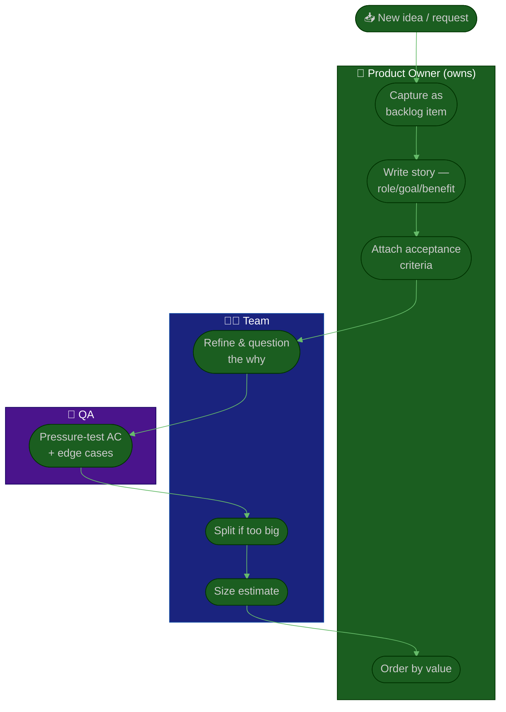

# Procedure: Backlog & User Stories

**Tags:** #procedure #product-owner #agile #backlog #user-stories #invest #refinement
**Roles:** Product Owner · Developers · QA · Scrum Master · Project Manager
**Read Time:** ~13 min

> The backlog is the PO's primary artifact — the single, ordered, visible list of everything the team might do, with the most valuable, *ready* work at the top. This procedure covers owning that backlog and the craft of the items in it: writing **user stories** (role / goal / benefit), shaping them with **INVEST**, attaching crisp **acceptance criteria** in Given/When/Then, **splitting** big stories, and running **refinement**. The golden rule: **the PO owns the *what* and *why*; the team owns the *how*.** A good story states the problem and the proof of "done" — never the implementation.

---

## 📌 Table of Contents
- [What the Backlog Is](#what-the-backlog-is)
- [The Story Pipeline](#the-story-pipeline)
- [Mermaid Swimlane Diagram](#mermaid-swimlane-diagram)
- [ASCII Flow](#ascii-flow)
- [Step-by-Step Responsibility Table](#step-by-step-responsibility-table)
- [Writing a User Story](#writing-a-user-story)
- [INVEST](#invest)
- [Acceptance Criteria](#acceptance-criteria)
- [Splitting Stories](#splitting-stories)
- [Definition of Ready & Done](#definition-of-ready--done)
- [Refinement](#refinement)
- [Anti-Patterns to Avoid](#anti-patterns-to-avoid)
- [Related Documents](#related-documents)

---

## What the Backlog Is

The product backlog is **one ordered list**, owned by the PO, that is:
- **Single** — not a spreadsheet *plus* a Slack channel *plus* the PM's head. One source of truth for *what's next*.
- **Ordered** — a true ranking, not five tiers of "high." The top is always the next-most-valuable, *ready* work.
- **Visible** — the whole team and stakeholders can see it.
- **Emergent** — it's never "done." It's continuously refined as you learn.
- **Right-sized by depth** — top items are small and ready; deeper items are coarse epics. Don't over-detail work you may never build.

> Only the PO changes the *order*. Anyone can *propose* items, but the PO decides what's in and where it ranks. That single point of decision is what makes a backlog trustworthy.

---

## The Story Pipeline

| Stage | The item looks like | Owner |
|:------|:--------------------|:------|
| **Idea / request** | A one-liner from a stakeholder, customer, or the team | Anyone proposes |
| **Backlog epic** | A coarse, valuable chunk tied to a roadmap theme | PO |
| **Refined story** | Role/goal/benefit + AC, INVEST-shaped, sized | PO + Team |
| **Ready story** | Meets Definition of Ready — top of backlog | PO (team agrees) |
| **In sprint** | Committed, being built | Team |
| **Done** | Meets Definition of Done, accepted by PO | Team builds, PO accepts |

---

## Mermaid Swimlane Diagram



---

## ASCII Flow

```
BACKLOG & USER STORIES
══════════════════════════════════════════════════════════════════════════════════

📥 IDEA / REQUEST
   │
   ▼
┌──────────────────────────────────────────────────────────────────────────────┐
│  ① CAPTURE & FRAME   (PO)                                                     │
│    As a [role], I want [goal], so that [benefit] — tied to a roadmap theme     │
└───────────────┬────────────────────────────────────────────────────────────────┘
                ▼
┌──────────────────────────────────────────────────────────────────────────────┐
│  ② ACCEPTANCE CRITERIA   (PO writes, QA pressure-tests)                       │
│    Given [context] / When [action] / Then [observable result] · + edge cases   │
└───────────────┬────────────────────────────────────────────────────────────────┘
                ▼
┌──────────────────────────────────────────────────────────────────────────────┐
│  ③ INVEST CHECK & SPLIT   (PO + Team)                                         │
│    Independent · Negotiable · Valuable · Estimable · Small · Testable          │
│    Too big? Split by workflow / data / rules / happy-path-first                │
└───────────────┬────────────────────────────────────────────────────────────────┘
                ▼
┌──────────────────────────────────────────────────────────────────────────────┐
│  ④ READY → ORDER   (PO)                                                       │
│    Meets Definition of Ready → place at top of backlog in value order          │
└────────────────────────────────────────────────────────────────────────────────┘
```

---

## Step-by-Step Responsibility Table

| # | Step | Who Owns | Who Helps | Output |
|:--|:-----|:---------|:----------|:-------|
| 1 | Capture & frame the story | PO | Proposer | Story (role/goal/benefit) |
| 2 | Write acceptance criteria | PO | QA | Given/When/Then AC |
| 3 | Pressure-test AC & edge cases | QA | PO, Team | Hardened AC |
| 4 | INVEST check & split | PO | Team | Right-sized stories |
| 5 | Estimate | Team | PO (facilitate) | Sized story |
| 6 | Mark Ready & order | PO | Team agrees | Ordered, ready backlog |
| 7 | Accept at review | PO | QA | Accepted (DoD met) |

---

## Writing a User Story

A user story captures **who** wants something, **what** they want, and **why** — and deliberately leaves out the *how*:

> **As a** [role / persona], **I want** [goal / capability], **so that** [benefit / outcome].

- **Center the user, not the system.** "As a wallet user, I want to send money to a contact, so that I don't need their account number." — not "As the system, I want a transfer endpoint."
- **The `so that` is the most important clause.** It's the value. If you can't write a real benefit, question whether the story belongs in the backlog.
- **Stories are a placeholder for a conversation**, not a spec. The card is a reminder to talk; refinement is the talk. Don't try to write the implementation into the story.

---

## INVEST

A good story is **INVEST**-shaped:

| Letter | Means | Test |
|:------:|:------|:-----|
| **I** | Independent | Can it be built without depending on another story? |
| **N** | Negotiable | Is it a problem to solve, not a fixed spec? |
| **V** | Valuable | Does a user or the business get value from this alone? |
| **E** | Estimable | Does the team understand it well enough to size it? |
| **S** | Small | Can it fit comfortably inside a sprint? |
| **T** | Testable | Are there clear acceptance criteria to verify "done"? |

If a story fails a letter, it usually needs splitting (too big), clarifying (not estimable), or rethinking (not valuable).

---

## Acceptance Criteria

Acceptance criteria define **when a story is done** in observable, testable terms. Use **Given / When / Then**:

```
Scenario: Send money to a saved contact
  GIVEN I am logged in with a balance of $50
  AND I have a saved contact "Dara"
  WHEN I send $20 to Dara
  THEN my balance shows $30
  AND Dara receives a notification of +$20
  AND the transaction appears in my history as "Sent · Dara · $20"
```

- **Cover the unhappy paths too:** insufficient balance, network failure, invalid recipient, daily limit exceeded.
- **AC are the contract** between PO, devs, and QA. QA tests against them; the PO accepts against them. Write them *with* QA — that's what dimension 3 of the [assessment](./02-product-and-backlog-assessment.md) measures.
- **Describe outcomes, not implementation.** "Then the balance updates" — not "Then the `balances` table row decrements."

---

## Splitting Stories

When a story is too big to fit a sprint or to estimate confidently, split it — while keeping **each slice valuable** (a vertical slice, not a technical layer):

- **By workflow step:** sign-up → add funds → send → receive — ship the simplest end-to-end path first.
- **By business rule:** the happy path first; limits, fraud checks, and edge cases as follow-ups.
- **By data variation:** support one currency before many; one payment method before all.
- **By operations (CRUD):** "view balance" before "edit profile."
- **Happy-path-first:** the thinnest slice that delivers real value, then enrich.

> Never split by technical layer ("build the API" / "build the UI"). A layer alone delivers no value and can't be demoed or accepted.

---

## Definition of Ready & Done

The PO is the guardian of both gates — they keep "what's next" trustworthy and "done" meaningful. See the full **[DoR vs DoD Guide](../../management/02-dor-and-dod-guide.md)**.

- **Definition of Ready (DoR):** a story may *enter* a sprint only if it's clear, valuable, sized, and has acceptance criteria. The PO ensures top-of-backlog stories are Ready *before* planning — no scrambling mid-sprint.
- **Definition of Done (DoD):** a story is *done* only when it meets the team's quality bar (tested, reviewed, AC satisfied). The PO accepts against the DoD and the AC — never rubber-stamps.

A story isn't Ready because the PO says so; it's Ready because the team agrees they could pick it up and build it without coming back with questions.

---

## Refinement

Backlog refinement (grooming) is the ongoing activity of keeping the top of the backlog Ready:

- **Cadence:** a regular session (often weekly, ~1 hour) plus continuous PO upkeep. The Scrum Master facilitates; the PO brings the items and the *why*. See [Sprint Ceremonies](../software-delivery/03-sprint-ceremonies.md).
- **Goal:** the top ~2 sprints of work is small, clear, AC'd, and estimated. You don't refine the whole backlog — only what's coming up.
- **PO's role:** explain the value, answer "why," accept clarifications and splits, and re-order based on what's learned. You facilitate the conversation about *what*; the team owns the *how*.
- **Outcome:** a healthy "ready" buffer so sprint planning is fast and the team is never blocked waiting on you.

---

## Anti-Patterns to Avoid

| Anti-Pattern | Why It Hurts | Do Instead |
|:-------------|:-------------|:-----------|
| **Stories as specs** | Dictating the *how* removes the team's ownership and ideas | State the problem & AC; leave the how to the team |
| **No acceptance criteria** | QA and devs guess at "done"; rework follows | Given/When/Then AC on every ready story |
| **Splitting by layer** | "Build the API" delivers no demoable value | Split by vertical slice — each one valuable |
| **A 300-item backlog** | Nobody trusts or reads it; the value is buried | Keep it lean; archive dead items ruthlessly |
| **Over-refining everything** | Detailing work you may never build is waste | Refine only the top ~2 sprints |
| **Rubber-stamping at review** | Accepting work that misses AC makes "done" meaningless | Accept against AC & DoD, decisively |
| **PO absent from refinement** | The team can't proceed without the *why* | Show up; bring the value and answer questions |

---

## Related Documents
- **Previous:** [03 — Vision & Roadmap](./03-vision-and-roadmap.md)
- **Next:** [05 — Prioritization & Value](./05-prioritization-and-value.md)
- [06 — Stakeholders & Collaboration](./06-stakeholders-and-collaboration.md)
- **Templates:** [User Story](./templates/user-story-template.md) · [Prioritization Matrix](./templates/prioritization-matrix-template.md)
- **Cross-feed:** [DoR vs DoD](../../management/02-dor-and-dod-guide.md) · [Sprint Ceremonies](../software-delivery/03-sprint-ceremonies.md) · [Feature Lifecycle](../software-delivery/01-feature-lifecycle.md) · [QA Leadership Playbook](../qa-leadership/README.md)

---

*Part of the [Product Owner Playbook](./README.md) · Last updated: 2026-05-31*
