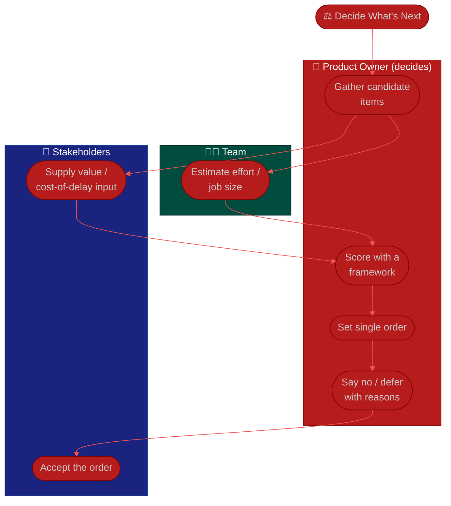

# Procedure: Prioritization & Value

**Tags:** #procedure #product-owner #agile #prioritization #value #roi #wsjf #rice #moscow
**Roles:** Product Owner · Business Owner / Sponsor · Project Manager · Developers · Stakeholders
**Read Time:** ~12 min

> Prioritization is where a PO's value is made or broken. Anyone can keep a list; a PO decides *which* item creates the most value next, and can *defend* that decision when three stakeholders each want their thing first. This procedure gives you four frameworks — **Value vs Effort, MoSCoW, WSJF / Cost-of-Delay, and RICE** — and, just as important, the skill of **saying no**. The golden rule: **the backlog has exactly one order, and you own it.** Prioritization isn't a popularity contest or a queue; it's a continuous bet on where the next unit of effort returns the most value.

---

## 📌 Table of Contents
- [Why One Order Matters](#why-one-order-matters)
- [Four Frameworks](#four-frameworks)
- [Mermaid Swimlane Diagram](#mermaid-swimlane-diagram)
- [ASCII Flow](#ascii-flow)
- [Step-by-Step Responsibility Table](#step-by-step-responsibility-table)
- [Value vs Effort](#value-vs-effort)
- [MoSCoW](#moscow)
- [WSJF & Cost of Delay](#wsjf--cost-of-delay)
- [RICE](#rice)
- [Saying No & Managing Trade-offs](#saying-no--managing-trade-offs)
- [Anti-Patterns to Avoid](#anti-patterns-to-avoid)
- [Related Documents](#related-documents)

---

## Why One Order Matters

A backlog where everything is "high priority" has no priority at all. The team can only build one thing next, so the backlog must express a **single, total order**. The PO's job is to make that order:
- **Value-driven** — ranked by ROI / cost-of-delay, not by recency or who shouted loudest.
- **Defensible** — for any two items you can answer "why is this above that?"
- **Maximizing** — focused on the value the team delivers, not on keeping everyone happy.

A framework doesn't make the decision *for* you — it makes your reasoning **visible and consistent**, which is what lets you defend it. Pick one, apply it consistently, and don't agonize over false precision.

---

## Four Frameworks

| Framework | Best for | Inputs | Output |
|:----------|:---------|:-------|:-------|
| **Value vs Effort** | Fast triage of many items | Value, effort (2 axes) | Quadrant ranking |
| **MoSCoW** | Scoping a release / MVP | Must / Should / Could / Won't | Scope buckets |
| **WSJF** | Maximizing flow of value | Cost of delay ÷ job size | Numeric rank |
| **RICE** | Comparing diverse features | Reach × Impact × Confidence ÷ Effort | Numeric score |

---

## Mermaid Swimlane Diagram



---

## ASCII Flow

```
PRIORITIZATION & VALUE
══════════════════════════════════════════════════════════════════════════════════

⚖️ DECIDE WHAT'S NEXT
   │
   ▼
┌──────────────────────────────────────────────────────────────────────────────┐
│  ① GATHER CANDIDATES   (PO)                                                   │
│    Epics/stories competing for the top of the backlog                          │
└───────────────┬────────────────────────────────────────────────────────────────┘
                ▼
┌──────────────────────────────────────────────────────────────────────────────┐
│  ② SCORE   (PO; team sizes effort, stakeholders supply value)                 │
│    Value vs Effort · MoSCoW · WSJF (CoD ÷ size) · RICE                          │
└───────────────┬────────────────────────────────────────────────────────────────┘
                ▼
┌──────────────────────────────────────────────────────────────────────────────┐
│  ③ SET SINGLE ORDER   (PO decides — final say)                                │
│    One total ranking · top is next-most-valuable & ready                        │
└───────────────┬────────────────────────────────────────────────────────────────┘
                ▼
┌──────────────────────────────────────────────────────────────────────────────┐
│  ④ SAY NO / DEFER   (PO, with reasons)                                        │
│    "Not now, because X is higher value" · trade-off made visible                │
└────────────────────────────────────────────────────────────────────────────────┘
```

---

## Step-by-Step Responsibility Table

| # | Step | Who Owns | Who Helps | Output |
|:--|:-----|:---------|:----------|:-------|
| 1 | Gather candidate items | PO | Stakeholders | Candidate list |
| 2 | Estimate effort / job size | Team | PO (facilitate) | Sized items |
| 3 | Supply value / cost-of-delay | Stakeholders | PO | Value inputs |
| 4 | Score with a framework | PO | — | Scored matrix |
| 5 | Set the single order | PO | — | Ordered backlog |
| 6 | Say no / defer with reasons | PO | Sponsor (backs you) | Communicated trade-offs |

---

## Value vs Effort

The fastest triage. Plot each item on two axes and work the quadrants:

```
            HIGH VALUE
                │
    BIG BETS    │   QUICK WINS
   (schedule)   │   (do now)
                │
  ──────────────┼──────────────  EFFORT →
                │
    AVOID /     │   FILL-INS
   DEPRIORITIZE │   (low value, easy)
                │
            LOW VALUE
```

- **Quick wins** (high value, low effort) first — they build momentum and trust.
- **Big bets** (high value, high effort) need slicing into smaller valuable pieces (see [04 — splitting](./04-backlog-and-stories.md#splitting-stories)).
- **Fill-ins** only when capacity is idle; **avoid** the low-value-high-effort quadrant entirely.

Great for a first pass over many items. For finer comparisons, reach for WSJF or RICE.

---

## MoSCoW

Best when **scoping a release or MVP** — bucketing rather than ranking:

| Bucket | Meaning |
|:-------|:--------|
| **Must** | Release fails without it (legal, core value, no workaround) |
| **Should** | Important but has a workaround; painful to omit |
| **Could** | Desirable; include only if time allows |
| **Won't** (this time) | Explicitly out of scope — *say it out loud* |

- The **Won't** bucket is the point: naming what you're *not* doing prevents scope creep and is a form of saying no.
- Watch for "everything is a Must." If more than ~60% is Must, you haven't really prioritized — push back.

---

## WSJF & Cost of Delay

**Weighted Shortest Job First** maximizes the flow of value by doing the highest-value, shortest jobs first:

```
              Cost of Delay
   WSJF  =  ───────────────────
                Job Size

   Cost of Delay = User/Business Value + Time Criticality + Risk Reduction / Opportunity
```

- Score each component (e.g., 1–10 or a relative scale), sum for Cost of Delay, divide by job size (your estimate).
- **Higher WSJF = do it sooner.** A modest-value job that's tiny can outrank a high-value job that's huge — because you can deliver it and move on.
- **Cost of Delay** is the key idea even without the full formula: *what does it cost us each week we don't have this?* A compliance deadline has steep, cliff-edged cost of delay; a nice-to-have has nearly none.

---

## RICE

Best for **comparing diverse features** on a common score:

```
            Reach × Impact × Confidence
   RICE  =  ───────────────────────────
                     Effort
```

- **Reach:** how many users/events per period this affects.
- **Impact:** how much it moves the outcome (e.g., 3 = massive, 1 = medium, 0.25 = minimal).
- **Confidence:** how sure you are (%), which honestly discounts wishful thinking.
- **Effort:** person-weeks (team estimate).

RICE's strength is **Confidence** — it forces you to discount the feature you *want* to build but have little evidence for.

---

## Saying No & Managing Trade-offs

Prioritization is mostly the art of **saying no gracefully** — because saying yes to everything means the backlog serves no outcome.

- **"No" is really "not now, because…"** Always pair the no with the reason and the higher-value thing it protects. "We're not building merchant payments this quarter because *fast first payment* will move activation more — here's the data."
- **Make the trade-off visible, let the right person own it.** When a stakeholder pushes a date or scope, show the cost: "Adding this pushes the activation work to next quarter. Your call which matters more." That's their decision; surfacing it is yours. The PM owns timeline trade-offs — loop them in.
- **Protect the team from churn.** Don't reshuffle priorities mid-sprint on a whim; that thrash is expensive. Capture new requests, rank them at refinement.
- **Your sponsor backs your no.** Part of the [first-90-days](./01-first-90-days.md) mandate conversation is confirming you have the authority to decline a request and make it stick. Without it, you're a proxy, not an owner.
- **ROI is the north star.** Every yes consumes capacity that can't go elsewhere. Maximize return: the next thing built should be the thing that returns the most value per unit of effort.

---

## Anti-Patterns to Avoid

| Anti-Pattern | Why It Hurts | Do Instead |
|:-------------|:-------------|:-----------|
| **Everything is "high priority"** | No priority at all; the team picks for you | One total order; force-rank |
| **Loudest-voice prioritization** | Value gets hijacked by whoever lobbies hardest | Score with a framework; defend with data |
| **Saying yes to all** | A backlog serving everyone serves no outcome | Say no with a reason; protect focus |
| **False precision** | Agonizing over RICE decimals wastes time | Use scores to rank, not to certify |
| **Mid-sprint re-shuffling** | Churn destroys the team's throughput | Hold changes for refinement; protect the sprint |
| **Ignoring cost of delay** | Time-critical items slip behind shiny ones | Weight time criticality (WSJF) |
| **No sponsor air-cover** | A "no" with no authority gets overruled | Confirm decision authority up front |

---

## Related Documents
- **Previous:** [04 — Backlog & Stories](./04-backlog-and-stories.md)
- **Next:** [06 — Stakeholders & Collaboration](./06-stakeholders-and-collaboration.md)
- [03 — Vision & Roadmap](./03-vision-and-roadmap.md) · [02 — Product & Backlog Assessment](./02-product-and-backlog-assessment.md)
- **Templates:** [Prioritization Matrix](./templates/prioritization-matrix-template.md) · [Product Roadmap](./templates/product-roadmap-template.md)
- **Cross-feed:** [DoR vs DoD](../../management/02-dor-and-dod-guide.md) · [PM Leadership Playbook](../pm-leadership/README.md) · [Project Tools](../../management/01-project-management-tools.md)

---

*Part of the [Product Owner Playbook](./README.md) · Last updated: 2026-05-31*
