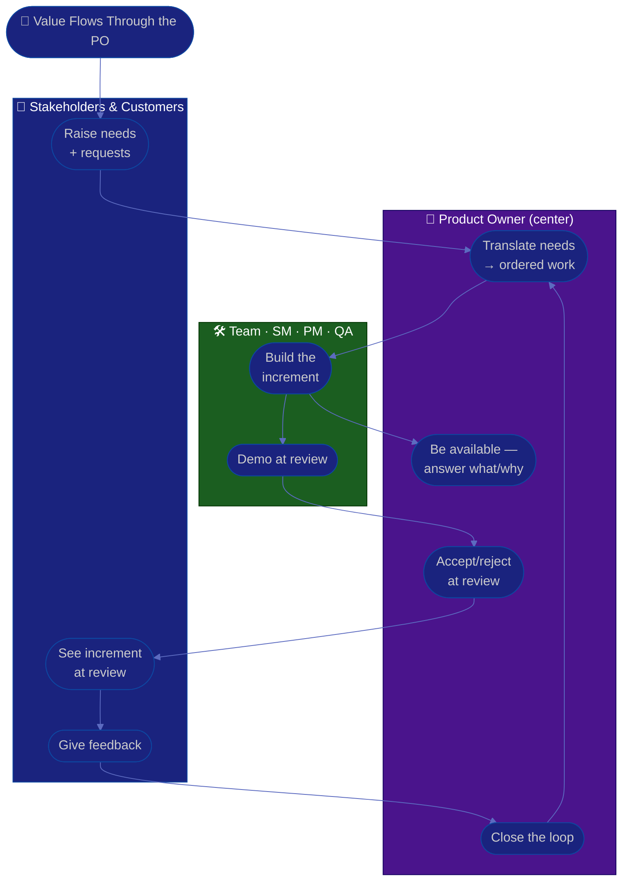

# Procedure: Stakeholders & Collaboration

**Tags:** #procedure #product-owner #agile #stakeholders #collaboration #review #feedback
**Roles:** Product Owner · Business Owner / Sponsor · Project Manager · Scrum Master · Developers · QA · Customers
**Read Time:** ~12 min

> A Product Owner sits at the center of a web — customers and stakeholders on one side, the delivery team on the other — and the value flows through *you*. This procedure covers the relationships that make the role work: **aligning stakeholders & customers**, **being available to the team**, **accepting work at the review**, **collaborating with the PM, Scrum Master, and QA**, and closing the **feedback loop**. The golden rule: **you are a single, decisive point of contact for the *what & why*.** When stakeholders route around you to the team, or the team can't get an answer for days, value leaks out of the gaps.

---

## 📌 Table of Contents
- [The PO at the Center](#the-po-at-the-center)
- [Who You Work With](#who-you-work-with)
- [Mermaid Swimlane Diagram](#mermaid-swimlane-diagram)
- [ASCII Flow](#ascii-flow)
- [Step-by-Step Responsibility Table](#step-by-step-responsibility-table)
- [Stakeholder & Customer Alignment](#stakeholder--customer-alignment)
- [Working With the Team](#working-with-the-team)
- [Accepting Work at the Review](#accepting-work-at-the-review)
- [Collaborating With PM, SM & QA](#collaborating-with-pm-sm--qa)
- [The Feedback Loop](#the-feedback-loop)
- [Anti-Patterns to Avoid](#anti-patterns-to-avoid)
- [Related Documents](#related-documents)

---

## The PO at the Center

The PO is the **single point of decision for product value**. That doesn't mean every conversation goes through you — it means everyone knows that when *what to build* or *why* is in question, you decide, and you're reachable enough that nobody is blocked waiting.

Your job at the center is to **translate in both directions**: customer and business needs *into* clear, valuable, ordered work for the team; and the team's questions, constraints, and trade-offs *back out* to stakeholders. You absorb conflicting demands so the team gets one coherent direction.

---

## Who You Work With

| Who | They give you | You give them |
|:----|:--------------|:--------------|
| **Customers / users** | Real needs, feedback, behavior | A product that solves their problem |
| **Business Owner / Sponsor** | The bet, budget, strategic direction | A roadmap that delivers the outcome |
| **Stakeholders** (sales, support, ops) | Requests, domain constraints, urgency | A clear *yes/no/not-now* with reasons |
| **Development team** | The *how*, estimates, feasibility | The *what & why*, AC, availability |
| **Scrum Master** | A healthy process, removed impediments | A refined backlog, a present PO |
| **Project Manager** | Timeline, delivery flow, risk | Priorities, scope decisions |
| **QA** | Quality signal, tested AC | Clear acceptance criteria, fast accept/reject |

---

## Mermaid Swimlane Diagram



---

## ASCII Flow

```
STAKEHOLDERS & COLLABORATION
══════════════════════════════════════════════════════════════════════════════════

🤝 VALUE FLOWS THROUGH THE PO
   │
   ▼
┌──────────────────────────────────────────────────────────────────────────────┐
│  ① ALIGN   (PO ↔ stakeholders & customers)                                   │
│    Gather needs · set expectations · one clear yes/no/not-now with reasons     │
└───────────────┬────────────────────────────────────────────────────────────────┘
                ▼
┌──────────────────────────────────────────────────────────────────────────────┐
│  ② BE AVAILABLE   (PO ↔ team)                                                 │
│    Answer "what & why" in hours not days · clarify AC · unblock decisions      │
└───────────────┬────────────────────────────────────────────────────────────────┘
                ▼
┌──────────────────────────────────────────────────────────────────────────────┐
│  ③ ACCEPT / REJECT   (PO at sprint review)                                    │
│    Judge the increment against AC + DoD · decisively accept or reject          │
└───────────────┬────────────────────────────────────────────────────────────────┘
                ▼
┌──────────────────────────────────────────────────────────────────────────────┐
│  ④ CLOSE THE LOOP   (PO → stakeholders → backlog)                            │
│    Share what shipped + the outcome · feed learning back into priorities       │
└────────────────────────────────────────────────────────────────────────────────┘
```

---

## Step-by-Step Responsibility Table

| # | Step | Who Owns | Who Helps | Output |
|:--|:-----|:---------|:----------|:-------|
| 1 | Map stakeholders & customers | PO | PM, SM | Stakeholder map |
| 2 | Set expectations & cadence | PO | Sponsor | Comms rhythm |
| 3 | Be available for what/why | PO | — | Unblocked team |
| 4 | Demo the increment | Team | SM (facilitate) | Sprint review |
| 5 | Accept/reject vs AC & DoD | PO | QA | Accepted increment |
| 6 | Gather & route feedback | PO | Support, Sales | Updated backlog |
| 7 | Report outcome to stakeholders | PO | PM | Outcome update |

---

## Stakeholder & Customer Alignment

- **Map your stakeholders** by influence and interest. Keep high-influence/high-interest people closely engaged; keep others informed without letting them drive the backlog.
- **Set the cadence and the rules of engagement** early: requests come to you (not straight to devs), you rank them at refinement, and you'll always give a reason. This single-channel discipline is what stops the team being whipsawed by competing demands.
- **Stay close to real customers**, not just internal proxies. Internal stakeholders *represent* the customer, but their assumptions drift — validate with usage data, support tickets, and direct contact. See [02 — value measurement](./02-product-and-backlog-assessment.md).
- **Manage competing demands** by anchoring on the vision and outcomes: "I hear both requests; here's which one moves *this quarter's outcome* more, and why." See [05 — saying no](./05-prioritization-and-value.md#saying-no--managing-trade-offs).

---

## Working With the Team

> **Availability is a feature of the role, not a courtesy.** A PO who answers "what & why" in hours keeps the team flowing; a PO who takes days becomes the team's biggest impediment.

- **Be reachable and decisive.** When a dev hits an ambiguous AC mid-sprint, they should get a clear answer fast — not "let me check with five people and get back to you next week."
- **Bring the why, not the how.** Explain the value and the user need; let the team design the solution. Their ownership of the *how* is where the best ideas come from.
- **Show up to refinement and planning** with a ready top-of-backlog and the context to answer questions. See [04 — Refinement](./04-backlog-and-stories.md#refinement) and the [Sprint Ceremonies](../software-delivery/03-sprint-ceremonies.md) flow.
- **Protect the team from churn.** Absorb the reshuffling pressure from stakeholders; hand the team a stable sprint.

---

## Accepting Work at the Review

The sprint review is where the PO **accepts or rejects** completed work — one of the role's defining responsibilities.

- **Judge against the acceptance criteria and the DoD**, not against your mood or a new idea that occurred to you mid-demo. See [DoR vs DoD](../../management/02-dor-and-dod-guide.md).
- **Be decisive.** "Accepted" or "not yet — AC #3 isn't met, here's the gap." Don't accept-with-a-vague-caveat; that erodes what "done" means.
- **Don't move the goalposts.** If the AC were right, judge against them. If you've learned something new, that's a *new* backlog item, not a reason to reject finished work.
- **Separate accept from feedback.** You can accept a story (it meets AC) *and* capture a follow-up improvement — they're different conversations.

---

## Collaborating With PM, SM & QA

Keep the boundaries crisp — the [first-90-days role table](./01-first-90-days.md#po-vs-pm-vs-sm-vs-business-owner) spells them out:

- **Project Manager** owns *timeline and delivery*. You give them the priorities and scope decisions; they manage the schedule and surface delivery risk. When a date is at risk, you decide what scope to cut; they decide how to sequence delivery. See [PM Leadership Playbook](../pm-leadership/README.md).
- **Scrum Master** owns *the process*. They facilitate the ceremonies (you participate, you don't run them), remove impediments, and coach the team. You keep the backlog healthy so the process they facilitate has good fuel. See [Scrum Master Playbook](../scrum-master/README.md).
- **QA** owns *the quality signal*. You give them crisp acceptance criteria up front and a fast accept/reject at the end; they tell you whether the increment actually meets the bar. Write AC *with* QA. See [QA Leadership Playbook](../qa-leadership/README.md).

> Friction usually comes from a boundary dispute: a PO trying to run the process (SM's job) or commit dates (PM's job), or a PM reordering the backlog (PO's job). Name the boundary, don't fight over the turf.

---

## The Feedback Loop

Value isn't delivered when code ships — it's delivered when the customer's problem is solved. Close the loop:

- **Measure the outcome**, not just the output. After a feature ships, watch the metric it was meant to move (adoption, activation, retention). See [03 — Outcomes & OKRs](./03-vision-and-roadmap.md#layer-2--outcomes--okrs).
- **Feed learning back into priorities.** If the feature didn't move the number, that's signal — adjust the backlog, don't just build the next item.
- **Report outcomes to stakeholders**, framed in their language: "Activation rose from 35% to 51% this quarter — here's what drove it." This is how you earn the trust that lets you keep saying no.
- **Run the loop every sprint review**: demo → feedback → re-prioritize → refine. That cadence *is* the engine of value.

---

## Anti-Patterns to Avoid

| Anti-Pattern | Why It Hurts | Do Instead |
|:-------------|:-------------|:-----------|
| **Unavailable PO** | The team stalls waiting on "what & why" | Be reachable; answer in hours, not days |
| **Stakeholders bypass to devs** | The team gets conflicting direction & churn | One channel: requests come to you |
| **Running the ceremonies** | You step on the SM's role and lose focus | Participate; let the SM facilitate |
| **Committing the team's dates** | That's the PM's call; you'll over-promise | Own scope/priority; PM owns timeline |
| **Rubber-stamp acceptance** | "Done" stops meaning anything | Judge against AC & DoD, decisively |
| **Moving the goalposts** | Rejecting finished work for new ideas burns trust | New idea = new backlog item |
| **Output-only reporting** | "We shipped 8 features" proves no value | Report the outcome the work moved |
| **Solving the how for them** | Removes team ownership & better ideas | Bring the why; let the team design |

---

## Related Documents
- **Previous:** [05 — Prioritization & Value](./05-prioritization-and-value.md)
- [01 — First 90 Days](./01-first-90-days.md) · [04 — Backlog & Stories](./04-backlog-and-stories.md)
- **Templates:** [User Story](./templates/user-story-template.md) · [30/60/90 Plan](./templates/30-60-90-plan-template.md)
- **Cross-feed:** [DoR vs DoD](../../management/02-dor-and-dod-guide.md) · [Sprint Ceremonies](../software-delivery/03-sprint-ceremonies.md) · [PM Leadership Playbook](../pm-leadership/README.md) · [Scrum Master Playbook](../scrum-master/README.md) · [QA Leadership Playbook](../qa-leadership/README.md)

---

*Part of the [Product Owner Playbook](./README.md) · Last updated: 2026-05-31*
