# Procedure: First 90 Days as a New QA Lead

**Tags:** #procedure #qa #leadership #onboarding #first90days
**Roles:** QA Lead · Engineering Manager · QA Engineers · Dev Team · PM/PO
**Read Time:** ~14 min

> Your first QA Lead role, in a new workspace, is won or lost in the first 90 days — not by shipping a process on day 1, but by **listening before changing**. This procedure gives you a week-by-week roadmap built on four phases: **Listen → Assess → Plan → Execute.** The single biggest mistake first-time leads make is arriving with answers before they understand the questions. Resist it.

---

## 📌 Table of Contents
- [The Core Principle](#the-core-principle)
- [The Four Phases](#the-four-phases)
- [Mermaid Swimlane Diagram](#mermaid-swimlane-diagram)
- [ASCII Flow](#ascii-flow)
- [Step-by-Step Responsibility Table](#step-by-step-responsibility-table)
- [Phase 1 — Listen (Days 1–14)](#phase-1--listen-days-114)
- [Phase 2 — Assess (Days 15–30)](#phase-2--assess-days-1530)
- [Phase 3 — Plan (Days 31–60)](#phase-3--plan-days-3160)
- [Phase 4 — Execute (Days 61–90)](#phase-4--execute-days-6190)
- [Anti-Patterns to Avoid](#anti-patterns-to-avoid)
- [Related Documents](#related-documents)

---

## The Core Principle

> **Earn trust before you spend it.** You have no political capital on day 1. Every change you make spends capital; every problem you solve for someone earns it. Spend the first month earning, then invest deliberately.

A QA Lead has three jobs, in priority order:
1. **Protect the release** — nothing broken reaches the customer on your watch.
2. **Grow the team** — your engineers get better because you are there.
3. **Improve the system** — the process gets faster and safer over time.

In the first 90 days you mostly do #1 (keep the lights on), set up #2 (relationships), and earn the right to do #3 (change the process).

---

## The Four Phases

| Phase | Days | Goal | Output |
|:------|:-----|:-----|:-------|
| **1 — Listen** | 1–14 | Understand people, product, and pain — change nothing | Stakeholder map, notes |
| **2 — Assess** | 15–30 | Diagnose the current QA state objectively | [QA Assessment Report](./02-qa-assessment.md) |
| **3 — Plan** | 31–60 | Propose a prioritized improvement plan | [Test Strategy](./03-test-strategy.md) + roadmap |
| **4 — Execute** | 61–90 | Ship 1–2 high-impact wins, build cadence | Working process + first metrics |

---

## Mermaid Swimlane Diagram

```mermaid
%%{init: {'theme': 'dark', 'themeVariables': {'primaryColor': '#1a237e', 'primaryBorderColor': '#0d47a1', 'primaryTextColor': '#ffffff', 'lineColor': '#5c6bc0', 'secondaryColor': '#004d40', 'tertiaryColor': '#4a148c', 'background': '#1e1e1e', 'mainBkg': '#1a237e', 'nodeBorder': '#0d47a1', 'clusterBkg': '#263238', 'titleColor': '#ffffff', 'edgeLabelBackground': '#263238'},
  'themeCSS': 'svg { background-color: #1e1e1e !important; padding: 1rem !important; border-radius: 8px !important; } text, tspan { fill: #ffffff !important; } .edgeLabel rect { fill: #1e1e1e !important; }'
}}%%
flowchart TD
    START([🎯 Day 1 — New QA Lead])

    subgraph LISTEN ["👂 Phase 1 — Listen (Day 1–14)"]
        L1([Meet manager —<br>clarify mandate])
        L2([1-on-1 with<br>every team member])
        L3([Meet Dev, PM,<br>Support, Ops])
        L4([Shadow a release<br>+ read the docs])
    end

    subgraph ASSESS ["🔍 Phase 2 — Assess (Day 15–30)"]
        A1([Audit test coverage<br>tools, environments])
        A2([Find top 3 pains<br>by frequency × cost])
        A3([Write QA<br>Assessment Report])
        A4([Review with manager])
    end

    subgraph PLAN ["🗺️ Phase 3 — Plan (Day 31–60)"]
        P1([Draft Test Strategy])
        P2([Prioritize fixes —<br>impact vs effort])
        P3([Socialize plan<br>with stakeholders])
        P4([Get buy-in + budget])
    end

    subgraph EXEC ["🚀 Phase 4 — Execute (Day 61–90)"]
        E1([Ship 1–2 quick wins])
        E2([Stand up team cadence<br>+ 1-on-1s])
        E3([Define first metrics])
        E4([90-day review<br>with manager])
    end

    START --> L1 --> L2 --> L3 --> L4
    L4 --> A1 --> A2 --> A3 --> A4
    A4 --> P1 --> P2 --> P3 --> P4
    P4 --> E1 --> E2 --> E3 --> E4

    style LISTEN fill:#1a237e,stroke:#0d47a1,color:#fff
    style ASSESS fill:#4a148c,stroke:#12005e,color:#fff
    style PLAN fill:#004d40,stroke:#00251a,color:#fff
    style EXEC fill:#1b5e20,stroke:#003300,color:#fff
```



---

## ASCII Flow

```
FIRST 90 DAYS — NEW QA LEAD
══════════════════════════════════════════════════════════════════════════════════

🎯 DAY 1
   │
   ▼
┌──────────────────────────────────────────────────────────────────────────────┐
│  PHASE 1 — LISTEN  (Day 1–14)            RULE: change nothing yet             │
│    ① Meet your manager → clarify your mandate & how success is measured       │
│    ② 1-on-1 with every QA team member (or future reports)                     │
│    ③ Meet Dev leads, PM/PO, Support, DevOps — ask "where does QA hurt?"        │
│    ④ Shadow one full release. Read every QA doc, runbook, and dashboard.       │
└────────────────────────────────────────┬─────────────────────────────────────┘
                                         │
                                         ▼
┌──────────────────────────────────────────────────────────────────────────────┐
│  PHASE 2 — ASSESS  (Day 15–30)           RULE: diagnose, don't prescribe      │
│    ① Audit: coverage, automation %, tools, environments, flaky tests          │
│    ② Identify top 3 pains by FREQUENCY × COST (not by loudest complaint)       │
│    ③ Write the QA Assessment Report (facts, not opinions)                      │
│    ④ Review findings with your manager — align before you publish widely       │
└────────────────────────────────────────┬─────────────────────────────────────┘
                                         │
                                         ▼
┌──────────────────────────────────────────────────────────────────────────────┐
│  PHASE 3 — PLAN  (Day 31–60)             RULE: prioritize ruthlessly          │
│    ① Draft the Test Strategy (scope, levels, environments, automation)         │
│    ② Rank fixes: Impact (High/Med/Low) vs Effort — pick the quadrant wins      │
│    ③ Socialize the plan 1-on-1 BEFORE the group meeting (no surprises)         │
│    ④ Secure buy-in, budget, and a clear owner for each item                    │
└────────────────────────────────────────┬─────────────────────────────────────┘
                                         │
                                         ▼
┌──────────────────────────────────────────────────────────────────────────────┐
│  PHASE 4 — EXECUTE  (Day 61–90)          RULE: ship visible wins              │
│    ① Deliver 1–2 quick wins that the WHOLE team feels                          │
│    ② Establish cadence: standup role, triage, 1-on-1s, retro participation     │
│    ③ Define 3–5 starter metrics (escaped defects, cycle time, coverage)        │
│    ④ 90-day review: what changed, what's next, what you need                   │
└────────────────────────────────────────────────────────────────────────────────┘
```

---

## Step-by-Step Responsibility Table

| # | Step | Who Owns | Who Helps | Output / Artifact |
|:--|:-----|:---------|:----------|:------------------|
| 1 | Clarify mandate & success metrics | QA Lead | Eng Manager | 1-page "what success looks like" |
| 2 | 1-on-1 with each team member | QA Lead | — | Notes per person ([template](./templates/one-on-one-template.md)) |
| 3 | Meet cross-functional partners | QA Lead | PM, Dev Lead | Stakeholder map |
| 4 | Shadow a release end-to-end | QA Lead | Release owner | Release pain notes |
| 5 | Audit QA state | QA Lead | QA team | [Assessment Report](./02-qa-assessment.md) |
| 6 | Identify top 3 pains | QA Lead | Eng Manager | Prioritized pain list |
| 7 | Draft test strategy | QA Lead | Dev Lead, PM | [Test Strategy](./03-test-strategy.md) |
| 8 | Prioritize & socialize plan | QA Lead | Eng Manager | Roadmap + RACI |
| 9 | Ship quick wins | QA Lead | QA team | Working improvement |
| 10 | Establish cadence & metrics | QA Lead | QA team | [Team & Cadence](./06-team-and-cadence.md) |
| 11 | 90-day review | QA Lead | Eng Manager | Review deck + next-quarter plan |

---

## Phase 1 — Listen (Days 1–14)

**Goal:** Build a mental model of people, product, and pain. **Make zero process changes.**

### Week 1 — People & mandate
- **First meeting with your manager.** Ask the questions that define your job:
  - "What does success look like at 90 days? At 6 months?"
  - "What's the one thing you most want fixed?"
  - "What are you NOT happy with about QA today?"
  - "Who are my key stakeholders, and what's the history with each?"
  - "What's my budget and hiring authority?"
- **1-on-1 with every QA team member.** This is the highest-leverage thing you do all month. Use the same opening questions for each (see [one-on-one template](./templates/one-on-one-template.md)):
  - "What's working well that I should NOT change?"
  - "What's the most frustrating part of your week?"
  - "If you were me, what's the first thing you'd fix?"
  - "What do you want to learn / where do you want to grow?"
- **Listen 80%, talk 20%.** Take notes. Do not promise fixes yet.

### Week 2 — Product & process
- **Meet cross-functional partners:** Dev leads, PM/PO, Support, DevOps. Ask each: *"Where does QA cause you pain, and where does QA save you?"*
- **Shadow a full release** from code-freeze to production. Watch what actually happens vs what the docs say.
- **Read everything:** test plans, runbooks, dashboards, the last 3 retro notes, the bug backlog, the last 2 incident post-mortems.

> 🚩 **Red flag for yourself:** If by day 14 you're itching to "just fix the obvious stuff," that urge is the trap. Write it down and save it for Phase 3.

---

## Phase 2 — Assess (Days 15–30)

**Goal:** Turn impressions into an evidence-based diagnosis. See the full method in **[02 — QA Assessment](./02-qa-assessment.md)**.

- Audit across six dimensions: **People, Process, Tools, Environments, Coverage, Metrics.**
- Quantify where you can: automation %, flaky-test rate, escaped-defect count, average release cycle time.
- Rank pains by **Frequency × Cost**, not by who complains loudest.
- Produce the **[QA Assessment Report](./templates/qa-assessment-report-template.md)** — facts first, recommendations clearly separated.
- **Review with your manager privately first.** Align on the story before any wide publication.

---

## Phase 3 — Plan (Days 31–60)

**Goal:** Convert the diagnosis into a prioritized, bought-in plan.

- Draft the **[Test Strategy](./03-test-strategy.md)** — the single source of truth for *how this team tests*.
- Build an improvement roadmap using an **Impact vs Effort** grid:

```
            HIGH IMPACT
                │
    SCHEDULE    │   DO NOW
   (big bets)   │  (quick wins)
                │
  ──────────────┼──────────────  EFFORT →
                │
    AVOID /     │   FILL-IN
   DEPRIORITIZE │  (easy, low value)
                │
            LOW IMPACT
```

- **Socialize 1-on-1 before the group.** Walk each stakeholder through the plan privately. The group meeting should hold zero surprises.
- For each roadmap item: a clear **owner**, a **due window**, and a **definition of done**.

---

## Phase 4 — Execute (Days 61–90)

**Goal:** Deliver visible value and lock in a sustainable rhythm.

- **Ship 1–2 quick wins** the whole team feels — e.g., a flaky-test cleanup, a faster smoke suite, a clearer bug template, a green release dashboard.
- **Establish the operating cadence:** your role in standup, defect triage, regular 1-on-1s, retro participation. See **[06 — Team & Cadence](./06-team-and-cadence.md)**.
- **Define 3–5 starter metrics** (don't over-instrument): escaped defects, test cycle time, automation coverage trend, release-blocker count, flaky-test rate.
- **Run the 90-day review** with your manager: what changed, what the data shows, what's next quarter, and what you need.

---

## Anti-Patterns to Avoid

| Anti-Pattern | Why It Hurts | Do Instead |
|:-------------|:-------------|:-----------|
| **Reorg / tool change in week 1** | You don't yet know why things are the way they are | Listen first; change in Phase 3 |
| **Comparing to your old company** | "At my last job we…" erodes trust instantly | Learn THIS context; borrow ideas silently |
| **Promising fixes in 1-on-1s** | You can't keep promises you make before you understand the system | "Thank you — I'm collecting these" |
| **Boiling the ocean** | 10 half-finished initiatives = 0 wins | Pick 1–2 quick wins, finish them |
| **Becoming the bottleneck** | If every test/sign-off routes through you, the team stalls | Delegate; you own the system, not every task |
| **QA as the "no" gatekeeper** | Adversarial QA-vs-Dev kills velocity and morale | Position QA as a quality *partner* and enabler |
| **Skipping the manager alignment** | Publishing findings your manager hasn't seen is a career risk | Always review privately first |

---

## Related Documents
- **Next step:** [02 — QA State Assessment](./02-qa-assessment.md)
- [03 — Test Strategy](./03-test-strategy.md) · [04 — Bug Lifecycle & Triage](./04-bug-lifecycle-and-triage.md)
- [05 — Release Sign-Off](./05-release-signoff.md) · [06 — Team & Cadence](./06-team-and-cadence.md)
- **Templates:** [30/60/90 Plan](./templates/30-60-90-plan-template.md) · [1-on-1](./templates/one-on-one-template.md)
- **Cross-feed:** [DoR vs DoD](../../management/02-dor-and-dod-guide.md) · [Bug & Incident Flow](../software-delivery/02-bug-and-incident-flow.md)

---

*Part of the [QA Leadership Playbook](./README.md) · Last updated: 2026-05-31*
