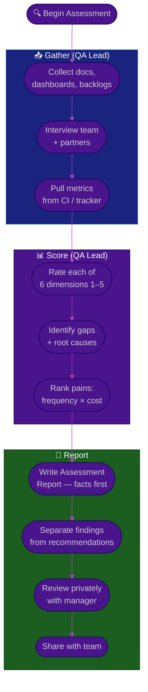

# Procedure: QA State Assessment — Auditing a New Workspace

**Tags:** #procedure #qa #leadership #assessment #audit
**Roles:** QA Lead · QA Engineers · Dev Lead · DevOps · Eng Manager
**Read Time:** ~12 min

> Before you can improve QA, you must see it clearly. This procedure is a repeatable audit across **six dimensions** that turns vague impressions ("testing feels slow") into evidence ("the regression suite takes 6h and is 18% flaky"). Run it in Phase 2 of your [first 90 days](./01-first-90-days.md). The output is a **QA Assessment Report** your manager can act on.

---

## 📌 Table of Contents
- [The Six Dimensions](#the-six-dimensions)
- [Mermaid Swimlane Diagram](#mermaid-swimlane-diagram)
- [ASCII Flow](#ascii-flow)
- [Step-by-Step Responsibility Table](#step-by-step-responsibility-table)
- [Dimension Checklists](#dimension-checklists)
- [Scoring the Maturity](#scoring-the-maturity)
- [Prioritizing Pains](#prioritizing-pains)
- [Related Documents](#related-documents)

---

## The Six Dimensions

| # | Dimension | Key Question |
|:--|:----------|:-------------|
| 1 | **People** | Who tests, what skills exist, where are the gaps? |
| 2 | **Process** | How does work flow from "ready" to "shipped"? |
| 3 | **Tools** | What's used for test mgmt, automation, CI, tracking? |
| 4 | **Environments** | Are test envs stable, available, and production-like? |
| 5 | **Coverage** | What's tested, what isn't, how much is automated? |
| 6 | **Metrics** | What's measured today, and is it trusted? |

---

## Mermaid Swimlane Diagram



---

## ASCII Flow

```
QA STATE ASSESSMENT
══════════════════════════════════════════════════════════════════════════════════

🔍 START
   │
   ▼
┌──────────────────────────────────────────────────────────────────────────────┐
│  GATHER EVIDENCE                                                              │
│    ① Collect: test plans, runbooks, CI configs, bug backlog, retro notes      │
│    ② Interview: QA team, Dev leads, PM, Support — capture pains verbatim       │
│    ③ Pull hard numbers: automation %, suite duration, flaky %, escaped bugs   │
└────────────────────────────────────────┬─────────────────────────────────────┘
                                         │
                                         ▼
┌──────────────────────────────────────────────────────────────────────────────┐
│  SCORE THE 6 DIMENSIONS  (1 = chaotic … 5 = optimized)                       │
│    People · Process · Tools · Environments · Coverage · Metrics               │
│    ④ For each: current score, evidence, root cause of the gap                 │
│    ⑤ Rank pains by FREQUENCY × COST — find the top 3                          │
└────────────────────────────────────────┬─────────────────────────────────────┘
                                         │
                                         ▼
┌──────────────────────────────────────────────────────────────────────────────┐
│  WRITE & REVIEW                                                              │
│    ⑥ Assessment Report: Findings (facts) | Recommendations (clearly labeled)  │
│    ⑦ Review with manager PRIVATELY → then share with team                     │
└────────────────────────────────────────────────────────────────────────────────┘
```

---

## Step-by-Step Responsibility Table

| # | Step | Who Owns | Who Helps | Output |
|:--|:-----|:---------|:----------|:-------|
| 1 | Collect artifacts | QA Lead | QA team, DevOps | Document inventory |
| 2 | Interview team + partners | QA Lead | — | Pain notes (verbatim) |
| 3 | Pull objective metrics | QA Lead | DevOps, Dev Lead | Metrics snapshot |
| 4 | Score 6 dimensions | QA Lead | QA team (sanity check) | Maturity scorecard |
| 5 | Root-cause the gaps | QA Lead | Dev Lead | Gap → cause map |
| 6 | Rank pains | QA Lead | Eng Manager | Top-3 prioritized list |
| 7 | Write report | QA Lead | — | [Assessment Report](./templates/qa-assessment-report-template.md) |
| 8 | Review & share | QA Lead | Eng Manager | Aligned, published report |

---

## Dimension Checklists

### 1. People
- [ ] How many testers? Manual vs automation skills?
- [ ] Who owns what areas of the product (the "bus factor")?
- [ ] Are roles & responsibilities documented, or tribal knowledge?
- [ ] Morale & turnover history — why did the last lead leave?
- [ ] Skill gaps (API testing, performance, security, automation frameworks)?

### 2. Process
- [ ] Is there a written test strategy / test plan, or is it ad hoc?
- [ ] When does QA get involved — at design (shift-left) or after dev (late)?
- [ ] Is there a Definition of Ready / Definition of Done? (See [DoR vs DoD](../../management/02-dor-and-dod-guide.md))
- [ ] How is regression handled? Manual, automated, or skipped under pressure?
- [ ] How are releases signed off, and by whom?

### 3. Tools
- [ ] Test case management (TestRail, Xray, Zephyr, spreadsheet, none)?
- [ ] Automation framework & language (Playwright, Cypress, Selenium, none)?
- [ ] CI/CD — do tests run automatically on PR / merge?
- [ ] Bug tracker (Jira, Linear, GitHub Issues) — is it actually kept current?
- [ ] Are the tools integrated, or is data copied by hand?

### 4. Environments
- [ ] How many environments (dev, staging, pre-prod, prod)?
- [ ] Are they stable and available, or constantly broken/contested?
- [ ] How production-like is staging (data, config, scale)?
- [ ] Test data: realistic, refreshable, and privacy-safe?
- [ ] Can QA reset/seed an environment without begging DevOps?

### 5. Coverage
- [ ] What % of critical user journeys have automated tests?
- [ ] Unit / integration / E2E balance — is the [test pyramid](./03-test-strategy.md) sane or inverted?
- [ ] Which high-risk areas have NO coverage?
- [ ] Flaky-test rate — how much of the suite can't be trusted?
- [ ] How long does the full suite take to run?

### 6. Metrics
- [ ] Are escaped defects (bugs found in prod) tracked?
- [ ] Is test cycle time / lead time measured?
- [ ] Defect density, reopen rate, severity distribution?
- [ ] Are metrics trusted, or does everyone ignore the dashboard?
- [ ] Is there a single place to see release health?

---

## Scoring the Maturity

Rate each dimension on a simple 1–5 scale. This makes progress visible later.

| Score | Level | Meaning |
|:-----:|:------|:--------|
| 1 | **Chaotic** | No process; everything is heroics and luck |
| 2 | **Reactive** | Some process, but inconsistent and undocumented |
| 3 | **Defined** | Documented process, followed most of the time |
| 4 | **Managed** | Measured, automated, and improving |
| 5 | **Optimized** | Data-driven, fast, low-defect, self-correcting |

> Record the score **and the evidence**. "Coverage: 2 — only 12% of critical journeys automated; no E2E on checkout." A score without evidence is just an opinion.

---

## Prioritizing Pains

Don't fix the loudest complaint — fix the costliest one. Score each pain:

```
PAIN PRIORITY  =  FREQUENCY (how often it bites)  ×  COST (time/money/risk each time)
```

| Pain | Frequency | Cost per occurrence | Priority | Notes |
|:-----|:---------:|:--------------------|:--------:|:------|
| Flaky E2E suite | Daily | 2h dev time + lost trust | 🔴 High | Blocks every PR |
| Manual regression | Per release | 3 days × 2 testers | 🔴 High | Delays every release |
| No staging data | Weekly | 1h per tester | 🟡 Med | Workaround exists |
| Slow bug triage | Occasional | Low | 🟢 Low | Annoying, not costly |

Pick the **top 3**. These feed directly into your [Phase 3 plan](./01-first-90-days.md#phase-3--plan-days-3160).

---

## Related Documents
- **Previous:** [01 — First 90 Days](./01-first-90-days.md)
- **Next:** [03 — Test Strategy](./03-test-strategy.md)
- **Template:** [QA Assessment Report](./templates/qa-assessment-report-template.md)
- **Cross-feed:** [DoR vs DoD](../../management/02-dor-and-dod-guide.md) · [SDLC Series](../../management/sdlc/README.md)

---

*Part of the [QA Leadership Playbook](./README.md) · Last updated: 2026-05-31*
