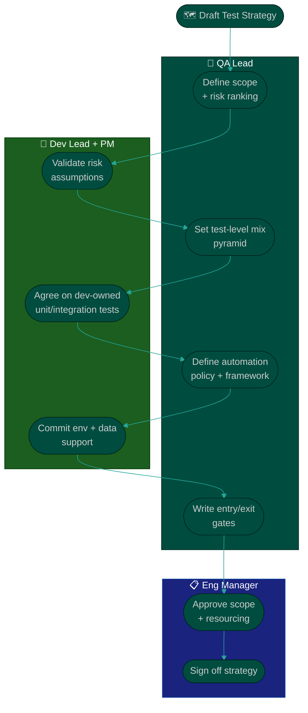

# Procedure: Building the Team Test Strategy

**Tags:** #procedure #qa #leadership #test-strategy #testing
**Roles:** QA Lead · QA Engineers · Dev Lead · PM/PO · Eng Manager
**Read Time:** ~13 min

> A **test strategy** is the single source of truth for *how this team proves quality*. It answers: what do we test, at what level, in which environment, by whom, and what must be true before we ship. Without one, testing is ad hoc and every release is an argument. This procedure builds a strategy in five layers — **Scope → Levels → Environments → Automation → Entry/Exit Gates** — and keeps it short enough that people actually read it.

---

## 📌 Table of Contents
- [Strategy vs Plan](#strategy-vs-plan)
- [The Five Layers](#the-five-layers)
- [Mermaid Swimlane Diagram](#mermaid-swimlane-diagram)
- [ASCII Flow](#ascii-flow)
- [Step-by-Step Responsibility Table](#step-by-step-responsibility-table)
- [Layer 1 — Scope & Risk](#layer-1--scope--risk)
- [Layer 2 — Test Levels (The Pyramid)](#layer-2--test-levels-the-pyramid)
- [Layer 3 — Environments & Data](#layer-3--environments--data)
- [Layer 4 — Automation Approach](#layer-4--automation-approach)
- [Layer 5 — Entry & Exit Criteria](#layer-5--entry--exit-criteria)
- [Related Documents](#related-documents)

---

## Strategy vs Plan

| | **Test Strategy** | **Test Plan** |
|:--|:------------------|:--------------|
| Scope | Whole product / team | One feature or release |
| Lifespan | Months — rarely changes | Days/weeks — per item |
| Owner | QA Lead | QA Engineer |
| Answers | *How we test in general* | *How we test THIS thing* |

You write the **strategy** once and maintain it. Engineers write **plans** from it. Use the [Test Plan template](./templates/test-plan-template.md) for the latter.

---

## The Five Layers

| Layer | Defines | Output |
|:--|:--|:--|
| 1 — **Scope & Risk** | What's in/out, and what's risky | Risk-ranked feature map |
| 2 — **Levels** | Unit / integration / E2E / manual mix | Test pyramid agreement |
| 3 — **Environments** | Where each level runs, and on what data | Environment matrix |
| 4 — **Automation** | What to automate, framework, when it runs | Automation policy |
| 5 — **Gates** | Entry (ready to test) & exit (ready to ship) | DoR/DoD for QA |

---

## Mermaid Swimlane Diagram



---

## ASCII Flow

```
BUILDING THE TEST STRATEGY
══════════════════════════════════════════════════════════════════════════════════

🗺️ DRAFT
   │
   ▼
┌──────────────────────────────────────────────────────────────────────────────┐
│  LAYER 1 — SCOPE & RISK                                                       │
│    What is in scope / out of scope. Rank features by risk (likelihood × impact)│
└───────────────┬────────────────────────────────────────────────────────────────┘
                ▼
┌──────────────────────────────────────────────────────────────────────────────┐
│  LAYER 2 — TEST LEVELS (PYRAMID)                                              │
│    Many unit  ·  some integration  ·  few E2E  ·  targeted manual/exploratory │
└───────────────┬────────────────────────────────────────────────────────────────┘
                ▼
┌──────────────────────────────────────────────────────────────────────────────┐
│  LAYER 3 — ENVIRONMENTS & DATA                                                │
│    Where each level runs · how data is seeded · prod-likeness of staging      │
└───────────────┬────────────────────────────────────────────────────────────────┘
                ▼
┌──────────────────────────────────────────────────────────────────────────────┐
│  LAYER 4 — AUTOMATION                                                         │
│    What to automate first · framework · runs on PR / nightly / pre-release    │
└───────────────┬────────────────────────────────────────────────────────────────┘
                ▼
┌──────────────────────────────────────────────────────────────────────────────┐
│  LAYER 5 — ENTRY / EXIT GATES                                                 │
│    Entry: ready to test (DoR)   ·   Exit: ready to ship (DoD)                  │
└───────────────┬────────────────────────────────────────────────────────────────┘
                ▼
        SIGN-OFF by Eng Manager → publish as living doc
```

---

## Step-by-Step Responsibility Table

| # | Step | Who Owns | Who Helps | Output |
|:--|:-----|:---------|:----------|:-------|
| 1 | Define scope & rank risk | QA Lead | PM, Dev Lead | Risk map |
| 2 | Agree test-level mix | QA Lead | Dev Lead | Pyramid agreement |
| 3 | Map environments & data | QA Lead | DevOps | Environment matrix |
| 4 | Set automation policy | QA Lead | QA team | Automation policy |
| 5 | Write entry/exit gates | QA Lead | PM, Dev Lead | QA DoR/DoD |
| 6 | Approve & publish | Eng Manager | QA Lead | Signed strategy doc |

---

## Layer 1 — Scope & Risk

- **In scope / out of scope:** state both explicitly. "We do not load-test the admin panel" prevents future blame.
- **Risk ranking** — score each feature/area:

```
RISK  =  LIKELIHOOD of failure  ×  IMPACT if it fails
```

| Area | Likelihood | Impact | Risk | Test depth |
|:-----|:----------:|:------:|:----:|:-----------|
| Checkout / payments | Med | Critical | 🔴 High | Full E2E + manual + monitoring |
| User login | Low | Critical | 🟡 Med | Automated E2E + smoke |
| Marketing footer | Low | Low | 🟢 Low | Sanity check only |

> Spend testing effort proportional to risk. Equal effort everywhere wastes the most on the least important.

---

## Layer 2 — Test Levels (The Pyramid)

```
                /\
               /  \      E2E / UI         ← few, slow, high-value journeys
              /----\
             /      \    Integration      ← some, API & service contracts
            /--------\
           /          \  Unit             ← many, fast, run on every commit
          /------------\
         EXPLORATORY / MANUAL (alongside) ← human judgment, new features, UX
```

- **Push tests down** the pyramid: a bug caught by a unit test is 100× cheaper than one caught in production.
- **Beware the inverted pyramid** (mostly slow E2E, few unit tests) — it's the #1 cause of flaky, slow, untrusted suites.
- **Manual/exploratory still matters** — for new features, UX, and edge cases automation can't judge. It sits *beside* the pyramid, not at the top.
- Agree explicitly **who owns unit/integration tests** — usually developers, with QA owning E2E and exploratory.

---

## Layer 3 — Environments & Data

| Environment | Purpose | Who deploys | Test levels run here |
|:------------|:--------|:------------|:---------------------|
| Local | Dev's machine | Developer | Unit, component |
| Dev/Integration | Shared integration | CI | Unit + integration |
| Staging | Production-like validation | CI/CD | E2E, manual, regression |
| Pre-prod | Final gate | Release owner | Smoke, sign-off |
| Production | Live | Release owner | Smoke + monitoring |

- **Test data:** define how it's seeded, refreshed, and kept privacy-safe (no real PII in lower envs).
- **Staging prod-likeness:** document the known differences (scale, third-party sandboxes) so failures are interpreted correctly.

---

## Layer 4 — Automation Approach

- **Automate the stable, repetitive, high-risk paths first** — regression and critical journeys. Don't automate churning new UI.
- **Framework choice:** pick one aligned with the team's stack (e.g., Playwright/Cypress for web, REST-assured/Postman for APIs). Document it; don't let every engineer pick their own.
- **When tests run:**
  - **On PR:** unit + fast integration (must be fast — minutes).
  - **On merge / nightly:** full integration + E2E.
  - **Pre-release:** full regression + smoke.
- **Flaky-test policy:** a flaky test is worse than no test — it trains people to ignore red. Quarantine and fix within a fixed SLA.

---

## Layer 5 — Entry & Exit Criteria

These are QA's gates, aligned with the team's [DoR/DoD](../../management/02-dor-and-dod-guide.md).

**Entry criteria (ready to test):**
- [ ] Acceptance criteria are written and clear
- [ ] Feature is deployed to the correct environment
- [ ] Test data is available
- [ ] No blocking dependencies open

**Exit criteria (ready to ship):**
- [ ] All planned tests executed; critical/high tests pass
- [ ] Zero open SEV-1/SEV-2 defects
- [ ] Regression suite green
- [ ] Acceptance sign-off from PO
- [ ] Rollback plan exists

→ The release-time application of these gates lives in **[05 — Release Sign-Off](./05-release-signoff.md)**.

---

## Related Documents
- **Previous:** [02 — QA Assessment](./02-qa-assessment.md)
- **Next:** [04 — Bug Lifecycle & Triage](./04-bug-lifecycle-and-triage.md)
- **Templates:** [Test Plan](./templates/test-plan-template.md)
- **Cross-feed:** [DoR vs DoD](../../management/02-dor-and-dod-guide.md) · [Feature Lifecycle](../software-delivery/01-feature-lifecycle.md)

---

*Part of the [QA Leadership Playbook](./README.md) · Last updated: 2026-05-31*
