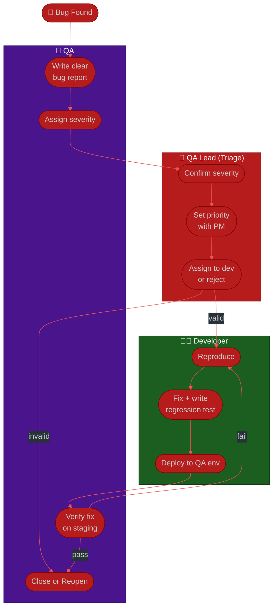

# Procedure: Bug Lifecycle & Triage (QA Lead View)

**Tags:** #procedure #qa #leadership #bug #triage #defect
**Roles:** QA Lead · QA Engineers · Developers · Dev Lead · PM/PO
**Read Time:** ~11 min

> As QA Lead you own the **defect process** — how a bug goes from "found" to "verified fixed," and how the team decides what to fix now vs later. This is where QA's credibility lives: a clear, consistent triage builds trust; chaotic bug handling burns it. This procedure defines severity vs priority, the lifecycle states, and how you run triage without becoming the bottleneck.

> 📎 This complements the team-wide [Bug & Incident Flow](../software-delivery/02-bug-and-incident-flow.md). That doc covers the *whole team's* incident response; this one is the *QA Lead's* operating procedure for everyday defects.

---

## 📌 Table of Contents
- [Severity vs Priority](#severity-vs-priority)
- [Bug Lifecycle States](#bug-lifecycle-states)
- [Mermaid Swimlane Diagram](#mermaid-swimlane-diagram)
- [ASCII Flow](#ascii-flow)
- [Step-by-Step Responsibility Table](#step-by-step-responsibility-table)
- [Running Triage](#running-triage)
- [What a Good Bug Report Contains](#what-a-good-bug-report-contains)
- [Related Documents](#related-documents)

---

## Severity vs Priority

These are **different axes** and confusing them is the most common triage mistake.

| | **Severity** | **Priority** |
|:--|:-------------|:-------------|
| Means | Technical impact if it occurs | Business urgency to fix |
| Set by | QA / Engineering | PM/PO + QA Lead |
| Example | A typo on the legal page = low severity | …but high priority before an audit |

| Severity | Definition |
|:---------|:-----------|
| **S1 — Critical** | Crash, data loss, security hole, core flow blocked |
| **S2 — Major** | Key feature broken, no reasonable workaround |
| **S3 — Minor** | Feature impaired, workaround exists |
| **S4 — Trivial** | Cosmetic, typo, low-impact polish |

| Priority | Fix when |
|:---------|:---------|
| **P0** | Now — drop everything |
| **P1** | This release |
| **P2** | Next release / soon |
| **P3** | Backlog — someday |

---

## Bug Lifecycle States

```
NEW → TRIAGED → IN PROGRESS → IN REVIEW → READY FOR QA → VERIFIED → CLOSED
                    │                                          │
                    └──────────── REOPENED ◄───────────────────┘   (if verify fails)
        REJECTED / DUPLICATE / WON'T FIX  (exit at triage)
```

| State | Owner | Meaning |
|:------|:------|:--------|
| **New** | Reporter | Logged, not yet looked at |
| **Triaged** | QA Lead | Severity + priority set, assigned |
| **In Progress** | Developer | Being fixed |
| **In Review** | Dev Lead | Fix under code review |
| **Ready for QA** | Developer | Deployed to test env, awaiting verify |
| **Verified** | QA | QA confirmed the fix |
| **Closed** | QA Lead | Done |
| **Reopened** | QA | Verify failed — back to dev |
| **Rejected / Duplicate / Won't Fix** | QA Lead + PM | Closed without fix, with reason |

---

## Mermaid Swimlane Diagram



---

## ASCII Flow

```
BUG LIFECYCLE (QA LEAD VIEW)
══════════════════════════════════════════════════════════════════════════════════

🔴 BUG FOUND
   │
   ▼
┌──────────────────────────────────────────────────────────────────────────────┐
│  REPORT (QA / Reporter)                                                       │
│    ① Title · steps to reproduce · expected vs actual · env · evidence         │
│    ② Propose severity (S1–S4)                                                 │
└───────────────┬────────────────────────────────────────────────────────────────┘
                ▼
┌──────────────────────────────────────────────────────────────────────────────┐
│  TRIAGE (QA Lead — daily/regular cadence)                                     │
│    ③ Confirm severity · ④ Set priority WITH PM · ⑤ Assign or reject           │
│       └─ Reject reasons: duplicate · not-a-bug · won't-fix (record WHY)       │
└───────────────┬────────────────────────────────────────────────────────────────┘
                ▼  (valid)
┌──────────────────────────────────────────────────────────────────────────────┐
│  FIX (Developer)                                                              │
│    ⑥ Reproduce · ⑦ Fix + add a regression test (so it can't return) · ⑧ Deploy │
└───────────────┬────────────────────────────────────────────────────────────────┘
                ▼
┌──────────────────────────────────────────────────────────────────────────────┐
│  VERIFY (QA)                                                                  │
│    ⑨ Re-test on staging → PASS → Close   |   FAIL → Reopen (back to Fix)      │
└────────────────────────────────────────────────────────────────────────────────┘
```

---

## Step-by-Step Responsibility Table

| # | Step | Who Owns | Who Helps | Output |
|:--|:-----|:---------|:----------|:-------|
| 1 | Write bug report | QA / Reporter | — | [Bug report](./templates/bug-report-template.md) |
| 2 | Propose severity | QA / Reporter | — | S1–S4 label |
| 3 | Confirm severity | QA Lead | Dev Lead | Triaged ticket |
| 4 | Set priority | QA Lead | PM/PO | P0–P3 label |
| 5 | Assign or reject | QA Lead | — | Assigned / closed-with-reason |
| 6 | Reproduce & fix | Developer | QA | Fix + regression test |
| 7 | Deploy to QA env | Developer | DevOps | Ready-for-QA |
| 8 | Verify | QA | — | Verified / Reopened |
| 9 | Close | QA Lead | — | Closed ticket |

---

## Running Triage

**Cadence:** daily 15-min for active sprints, or twice-weekly for steadier teams. Keep it tight.

**Your job in triage is to decide, fast:**
1. **Is it real and reproducible?** If not → ask reporter for more, or reject.
2. **Severity correct?** Adjust with engineering input.
3. **Priority?** This is a *business* call — bring PM/PO for P0/P1.
4. **Who owns it and by when?**

**Don't become the bottleneck:**
- Empower senior QA engineers to triage S3/S4 themselves.
- Only S1/S2 and anything P0/P1 needs your direct call.
- Keep a written rule for what auto-escalates (e.g., "any prod S1 pages on-call immediately").

**Every rejection gets a reason.** "Won't fix — by design, documented here" closes the loop and prevents the same bug being re-filed.

---

## What a Good Bug Report Contains

A bug the developer can fix without a meeting:

- **Title:** specific — "Checkout fails with 500 when coupon expired" not "checkout broken"
- **Steps to reproduce:** numbered, from a known starting state
- **Expected vs Actual:** the gap, explicitly
- **Environment:** browser/OS/app version/env
- **Evidence:** screenshot, video, logs, request/response
- **Severity:** proposed S1–S4
- **Frequency:** always / intermittent (and how often)

Coach your team to this standard. Bad bug reports are the hidden tax on dev velocity — fixing the *report quality* is one of your easiest early wins. See the [Bug Report template](./templates/bug-report-template.md).

---

## Related Documents
- **Previous:** [03 — Test Strategy](./03-test-strategy.md)
- **Next:** [05 — Release Sign-Off](./05-release-signoff.md)
- **Template:** [Bug Report](./templates/bug-report-template.md)
- **Cross-feed:** [Team Bug & Incident Flow](../software-delivery/02-bug-and-incident-flow.md) · [Ticket Lifecycle](../software-delivery/05-ticket-lifecycle.md)

---

*Part of the [QA Leadership Playbook](./README.md) · Last updated: 2026-05-31*
