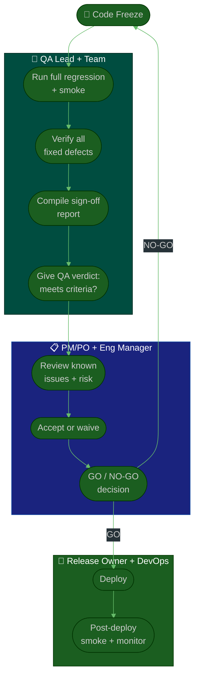

# Procedure: Release Sign-Off & QA Gate

**Tags:** #procedure #qa #leadership #release #signoff #gate
**Roles:** QA Lead · QA Engineers · Dev Lead · PM/PO · Release Owner · DevOps
**Read Time:** ~10 min

> The release sign-off is the moment QA puts its name on "this is safe to ship." As QA Lead you own this gate. Done well, it's a fast, objective checklist everyone trusts. Done badly, it's a last-minute panic where QA is blamed for saying no. This procedure makes the gate **explicit, evidence-based, and owned** — so the answer is never a vibe, it's a checklist.

---

## 📌 Table of Contents
- [The Principle: A Gate, Not a Vibe](#the-principle-a-gate-not-a-vibe)
- [Go / No-Go Criteria](#go--no-go-criteria)
- [Mermaid Swimlane Diagram](#mermaid-swimlane-diagram)
- [ASCII Flow](#ascii-flow)
- [Step-by-Step Responsibility Table](#step-by-step-responsibility-table)
- [The Sign-Off Checklist](#the-sign-off-checklist)
- [When to Say No (and How)](#when-to-say-no-and-how)
- [Related Documents](#related-documents)

---

## The Principle: A Gate, Not a Vibe

> QA does not "approve" a release on feeling. QA reports **objective facts against pre-agreed criteria**, and the release decision follows from them. This protects QA from being the scapegoat and the business from shipping blind.

Two distinct decisions:
- **QA verdict** (QA Lead): *Do the facts meet our exit criteria?* — purely evidence-based.
- **Release decision** (PM/PO + Eng Manager): *Given the facts, do we ship?* — a business call that may accept known risk.

QA's job is to make the risk **visible and accurate**, not to make the business decision alone.

---

## Go / No-Go Criteria

| Criterion | Go | No-Go |
|:----------|:---|:------|
| SEV-1 / SEV-2 open defects | 0 | ≥ 1 |
| Critical & high test cases | All pass | Any fail |
| Regression suite | Green | Red / not run |
| PO acceptance | Signed | Missing |
| Rollback plan | Exists & tested | None |
| Known issues | Documented & accepted | Hidden / unknown |

Anything in the **No-Go** column is either fixed, or **explicitly waived in writing** by the release decision-makers (never silently).

---

## Mermaid Swimlane Diagram



---

## ASCII Flow

```
RELEASE SIGN-OFF & QA GATE
══════════════════════════════════════════════════════════════════════════════════

🏁 CODE FREEZE
   │
   ▼
┌──────────────────────────────────────────────────────────────────────────────┐
│  QA VERIFICATION (QA Lead + team)                                             │
│    ① Run full regression + smoke on the release candidate                     │
│    ② Verify every defect marked "fixed" in this release                       │
│    ③ Compile the Sign-Off Report (facts vs exit criteria)                     │
│    ④ QA VERDICT: meets exit criteria?  →  fact-based, not a feeling           │
└───────────────┬────────────────────────────────────────────────────────────────┘
                ▼
┌──────────────────────────────────────────────────────────────────────────────┐
│  GO / NO-GO (PM/PO + Eng Manager)                                             │
│    ⑤ Review known issues + residual risk                                      │
│    ⑥ Accept risk OR waive a criterion IN WRITING (never silently)             │
│    ⑦ Decision: GO ───────────────► deploy                                     │
│                NO-GO ────────────► fix → re-freeze → repeat                    │
└───────────────┬────────────────────────────────────────────────────────────────┘
                ▼  (GO)
┌──────────────────────────────────────────────────────────────────────────────┐
│  DEPLOY & CONFIRM (Release Owner + DevOps + QA)                               │
│    ⑧ Deploy  ·  ⑨ Post-deploy smoke in prod  ·  ⑩ Monitor dashboards          │
│       └─ If prod smoke fails → execute the rollback plan                       │
└────────────────────────────────────────────────────────────────────────────────┘
```

---

## Step-by-Step Responsibility Table

| # | Step | Who Owns | Who Helps | Output |
|:--|:-----|:---------|:----------|:-------|
| 1 | Run regression + smoke | QA Lead | QA team | Test results |
| 2 | Verify fixed defects | QA team | Devs | Verified list |
| 3 | Compile sign-off report | QA Lead | — | [Sign-Off Report](./templates/release-signoff-template.md) |
| 4 | Give QA verdict | QA Lead | — | Meets / doesn't meet criteria |
| 5 | Review risk | PM/PO | QA Lead | Risk assessment |
| 6 | Accept / waive | Eng Manager | PM/PO | Written waiver (if any) |
| 7 | Go / No-Go | PM/PO + Eng Mgr | QA Lead | Decision (recorded) |
| 8 | Deploy | Release Owner | DevOps | Deployed build |
| 9 | Post-deploy smoke | QA | Release Owner | Prod confirmation |
| 10 | Monitor | DevOps | QA | Health dashboard |

---

## The Sign-Off Checklist

Use the [Release Sign-Off template](./templates/release-signoff-template.md). At minimum:

**Testing complete**
- [ ] All planned test cases executed
- [ ] Critical + high priority cases pass
- [ ] Regression suite green
- [ ] Exploratory testing done on new features

**Defects**
- [ ] Zero open S1/S2
- [ ] All in-scope fixes verified
- [ ] Remaining known issues documented with severity + workaround

**Readiness**
- [ ] PO acceptance signed
- [ ] Rollback plan exists and is tested
- [ ] Monitoring/alerts cover the new changes
- [ ] Release notes & support team informed

**Sign-off**
- [ ] QA verdict recorded (with evidence)
- [ ] Go/No-Go decision recorded with decision-makers named

---

## When to Say No (and How)

Saying "the criteria aren't met" is your job — but *how* you say it determines whether you're a trusted partner or the team's obstacle.

**Do:**
- State facts: *"3 S2 defects open in checkout; exit criteria require zero."*
- Offer options: fix now / waive with documented risk / descope the feature.
- Make the risk concrete: *"If we ship, ~X% of coupon users hit a 500."*
- Put the decision where it belongs: the business may choose to accept risk — that's legitimate, if it's **explicit and recorded**.

**Don't:**
- Block silently or moralize ("I told you so").
- Say a flat "no" with no path forward.
- Let yourself be pressured into a verbal "it's probably fine" — write down what's true.

> The goal isn't to be the gate that says no. It's to be the lens that makes risk visible so the team decides with eyes open.

---

## Related Documents
- **Previous:** [04 — Bug Lifecycle & Triage](./04-bug-lifecycle-and-triage.md)
- **Next:** [06 — Team & Cadence](./06-team-and-cadence.md)
- **Template:** [Release Sign-Off](./templates/release-signoff-template.md)
- **Cross-feed:** [Deployment Flow](../software-delivery/08-deployment-flow.md) · [DoR vs DoD](../../management/02-dor-and-dod-guide.md)

---

*Part of the [QA Leadership Playbook](./README.md) · Last updated: 2026-05-31*
