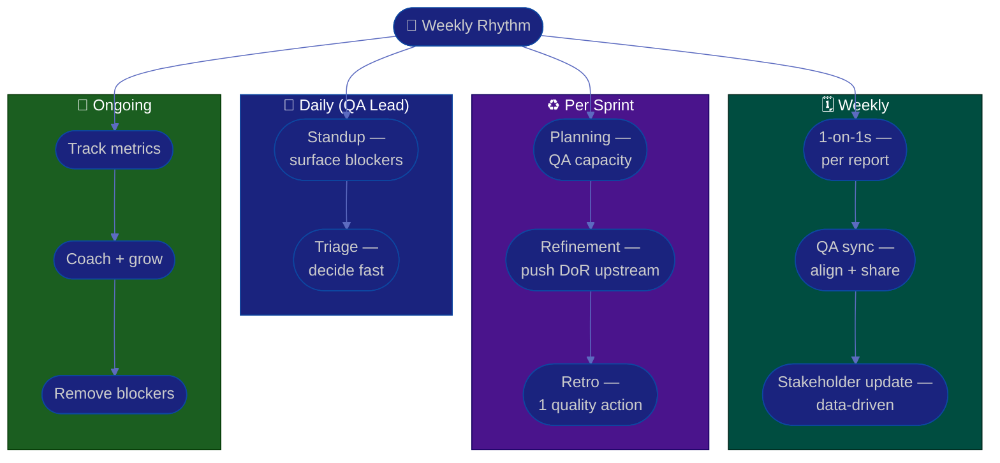

# Procedure: Team, Cadence & Metrics

**Tags:** #procedure #qa #leadership #team #cadence #metrics #1on1
**Roles:** QA Lead · QA Engineers · Eng Manager · Scrum Master / PM
**Read Time:** ~12 min

> Process and tests keep the release safe; **people and rhythm** keep the team healthy and improving. This is the part first-time leads neglect because it isn't urgent — until a good engineer quits or the same bug ships twice. This procedure sets up your operating cadence (the meetings you run), your 1-on-1 practice, the metrics you watch, and how you grow the team. The throughline: **make quality a shared habit, not your personal heroics.**

---

## 📌 Table of Contents
- [The Shift: From Doer to Multiplier](#the-shift-from-doer-to-multiplier)
- [Operating Cadence](#operating-cadence)
- [Mermaid Swimlane Diagram](#mermaid-swimlane-diagram)
- [ASCII Flow](#ascii-flow)
- [Step-by-Step Responsibility Table](#step-by-step-responsibility-table)
- [Running Effective 1-on-1s](#running-effective-1-on-1s)
- [Metrics That Matter](#metrics-that-matter)
- [Growing the Team](#growing-the-team)
- [Related Documents](#related-documents)

---

## The Shift: From Doer to Multiplier

The hardest transition for a first-time lead — especially one promoted from a strong individual contributor:

| As an IC you were valued for… | As a Lead you're valued for… |
|:------------------------------|:-----------------------------|
| Finding the most bugs yourself | The team finding bugs without you |
| Writing the best test cases | The team's tests being good |
| Being the go-to expert | Building experts |
| Doing the work | Removing blockers so others do the work |

> If you're still the person who has to test everything personally, you've scaled to exactly one person. Your output is now the **team's** output. Delegate the doing; own the system.

---

## Operating Cadence

| Ritual | Frequency | Your role |
|:-------|:----------|:----------|
| **Daily standup** | Daily | Surface QA blockers; don't status-report each tester |
| **Bug triage** | Daily / 2× week | Decide severity/priority fast (see [04](./04-bug-lifecycle-and-triage.md)) |
| **1-on-1s** | Weekly or biweekly | Per direct report — their agenda, not yours |
| **Sprint planning** | Per sprint | Ensure testability + QA capacity in the plan |
| **Backlog refinement** | Per sprint | Push acceptance criteria + DoR quality upstream |
| **Retrospective** | Per sprint | Bring quality trends; turn pain into 1 action |
| **QA sync** | Weekly | Team alignment, knowledge share, no surprises |
| **Stakeholder update** | Weekly / biweekly | Quality status to PM + Eng Manager (data, not vibes) |

> Don't add all of these at once. In your [first 90 days](./01-first-90-days.md), establish standup + triage + 1-on-1s first; layer the rest in once they have a reason to exist.

---

## Mermaid Swimlane Diagram



---

## ASCII Flow

```
TEAM, CADENCE & METRICS
══════════════════════════════════════════════════════════════════════════════════

DAILY        ┌──────────────────────────────────────────────────────────────────┐
             │  ① Standup — surface QA blockers (not per-person status reports)   │
             │  ② Triage  — set severity/priority fast; delegate S3/S4            │
             └──────────────────────────────────────────────────────────────────┘

WEEKLY       ┌──────────────────────────────────────────────────────────────────┐
             │  ③ 1-on-1s — THEIR agenda; growth, blockers, feedback both ways    │
             │  ④ QA sync — alignment + knowledge share; no one works in the dark │
             │  ⑤ Stakeholder update — quality status in NUMBERS, not feelings    │
             └──────────────────────────────────────────────────────────────────┘

PER SPRINT   ┌──────────────────────────────────────────────────────────────────┐
             │  ⑥ Planning   — book QA capacity; flag untestable stories early    │
             │  ⑦ Refinement — push acceptance criteria + DoR quality UPSTREAM    │
             │  ⑧ Retro      — bring trends; leave with ONE concrete action       │
             └──────────────────────────────────────────────────────────────────┘

ONGOING      ┌──────────────────────────────────────────────────────────────────┐
             │  ⑨ Watch metrics  ·  ⑩ Coach & grow  ·  ⑪ Clear blockers           │
             └──────────────────────────────────────────────────────────────────┘
```

---

## Step-by-Step Responsibility Table

| # | Activity | Who Owns | Who Helps | Output |
|:--|:---------|:---------|:----------|:-------|
| 1 | Run standup | QA Lead | Scrum Master | Blockers cleared |
| 2 | Run triage | QA Lead | QA team | Triaged defects |
| 3 | Hold 1-on-1s | QA Lead | — | Notes + actions ([template](./templates/one-on-one-template.md)) |
| 4 | Run QA sync | QA Lead | QA team | Aligned team |
| 5 | Report to stakeholders | QA Lead | — | Quality status |
| 6 | Join planning/refinement | QA Lead | PM, Dev Lead | Testable backlog |
| 7 | Drive retro action | QA Lead | Team | 1 improvement/sprint |
| 8 | Track metrics | QA Lead | DevOps | Quality dashboard |
| 9 | Coach & grow | QA Lead | Eng Manager | Growth plans |

---

## Running Effective 1-on-1s

The single highest-leverage habit of a good lead.

- **It's their meeting, not yours.** They set most of the agenda. You listen.
- **Cadence:** weekly (or biweekly for senior, low-touch reports). Protect the time — don't cancel.
- **Rotate through four areas over time:** short-term work/blockers, growth & career, feedback (both directions), and relationship/wellbeing.
- **Good opening questions:**
  - "What's on your mind this week?"
  - "What's slowing you down that I can remove?"
  - "What feedback do you have for me?"
  - "Where do you want to be in a year — are we moving you toward it?"
- **Always end with clear actions** and follow up next time. Trust is built by closing loops.
- **Give feedback close to the event** — praise in public, correct in private, always specific. Don't save it all for the 1-on-1.

See the [1-on-1 template](./templates/one-on-one-template.md).

---

## Metrics That Matter

Pick **3–5**. More than that and no one acts on any of them. Measure trends, not absolutes.

| Metric | What it tells you | Watch for |
|:-------|:------------------|:----------|
| **Escaped defects** (bugs found in prod) | Effectiveness of your testing | Rising = coverage gaps |
| **Defect detection stage** | How early you catch bugs | Catching late = shift left |
| **Test cycle time** | Speed of the QA process | Growing = bottleneck forming |
| **Automation coverage %** | Regression safety net | Flat/falling = tech debt |
| **Flaky-test rate** | Trust in the suite | High = people ignore red |
| **Reopen rate** | Fix quality / verify rigor | High = root causes missed |
| **Release-blocker count** | Release health | Spiky = upstream quality issue |

> ⚠️ **Never measure individuals by "bugs found."** It rewards quantity over impact, punishes testers on stable areas, and pits QA against Dev. Measure the **system**, coach the **people**.

---

## Growing the Team

- **Map skills vs needs** (from your [assessment](./02-qa-assessment.md)) — find the gaps: automation, API, performance, security, domain knowledge.
- **Give stretch assignments** with a safety net — the way people grow is by owning something slightly beyond them.
- **Spread knowledge:** pairing, rotation across product areas, brown-bag sessions. Kill single points of failure ("only Sara knows the payments tests").
- **Document growth paths:** what does Senior QA / QA Lead look like here? Make promotion criteria visible.
- **Hire deliberately** (when you have authority): hire for the gaps the team has, not clones of yourself.

---

## Related Documents
- **Previous:** [05 — Release Sign-Off](./05-release-signoff.md)
- **Start of series:** [01 — First 90 Days](./01-first-90-days.md)
- **Templates:** [1-on-1](./templates/one-on-one-template.md) · [30/60/90 Plan](./templates/30-60-90-plan-template.md)
- **Cross-feed:** [Management & Leadership](../../management/README.md) · [Sprint Ceremonies](../software-delivery/03-sprint-ceremonies.md)

---

*Part of the [QA Leadership Playbook](./README.md) · Last updated: 2026-05-31*
