# Procedure: First 90 Days as a New Support / Customer Success Lead

**Tags:** #procedure #support-lead #customer-success #leadership #onboarding #first90days
**Roles:** Support / CS Lead · Your Manager (Head of CX/COO) · Support Agents · CSMs · Eng/QA · PM/PO
**Read Time:** ~15 min

> Your first Support / Customer Success Lead role, in a new workspace, is won or lost in the first 90 days — not by rewriting the SLA on day 1, but by **understanding the customer and the team before you change anything**. The core shift is profound: you are no longer the top agent or CSM closing tickets and saving accounts yourself — you are now a **multiplier accountable for customer outcomes** and the **voice of the customer inside the company**. This procedure gives you a week-by-week roadmap built on four phases: **Listen → Assess → Plan → Execute.** The biggest mistake first-time leads make is staying the best firefighter — clearing the queue personally because it's familiar — while the system that *creates* the fires quietly stays broken. Resist it.

---

## 📌 Table of Contents
- [The Core Shift: From Top Agent to Multiplier](#the-core-shift-from-top-agent-to-multiplier)
- [Support vs Customer Success — Two Jobs in One Role](#support-vs-customer-success--two-jobs-in-one-role)
- [The Core Principle](#the-core-principle)
- [Support/CS Lead vs EM vs PM/PO](#supportcs-lead-vs-em-vs-pmpo)
- [The Four Phases](#the-four-phases)
- [Mermaid Swimlane Diagram](#mermaid-swimlane-diagram)
- [ASCII Flow](#ascii-flow)
- [Step-by-Step Responsibility Table](#step-by-step-responsibility-table)
- [Phase 1 — Listen (Days 1–14)](#phase-1--listen-days-114)
- [Phase 2 — Assess (Days 15–30)](#phase-2--assess-days-1530)
- [Phase 3 — Plan (Days 31–60)](#phase-3--plan-days-3160)
- [Phase 4 — Execute (Days 61–90)](#phase-4--execute-days-6190)
- [Managing Your Manager & Reporting Up](#managing-your-manager--reporting-up)
- [Anti-Patterns to Avoid](#anti-patterns-to-avoid)
- [Related Documents](#related-documents)

---

## The Core Shift: From Top Agent to Multiplier

The hardest part of becoming a Support / CS Lead is that the job that got you promoted is no longer your job. You were rewarded for being the agent who closed the gnarliest ticket, or the CSM who saved the account everyone had written off. Now your success is **measured entirely through other people — and through customer outcomes you can only influence, not personally control.**

| Before (Top Agent / CSM) | After (Support / CS Lead) |
|:-------------------------|:--------------------------|
| Your output = the tickets you close / accounts you save | Your output = what your team achieves for customers |
| Solve the hard ticket yourself | Make sure the team can solve hard tickets without you |
| Measured on your CSAT / your renewals | Measured on team CSAT, SLA attainment, retention, deflection |
| Be the hero who escalates and gets the fix | Build the *system* that turns recurring pain into fixes |
| Know the product cold | Make sure the *knowledge* is captured so everyone does |
| React fast to the customer in front of you | Own the customer's *outcome* across their whole journey |

This is a **lateral move into a different profession**, not a promotion within the same one. Your new leverage is multiplication, not addition: every hour spent personally clearing the queue is an hour not spent fixing why the queue keeps filling. And there's a second, subtler shift — you are now the **voice of the customer** in rooms where the customer isn't present. Product roadmaps, engineering priorities, and pricing decisions all get better when someone in the room carries credible customer evidence. That someone is now you.

> **You will feel like you're not "doing real work" for a while.** That feeling is normal. The value you create as a lead is diffuse and delayed — a knowledge-base article that deflects 300 tickets next quarter, a churn save-play that becomes a habit, an engineering fix that ends a recurring ticket category for good. Learn to trust slow, invisible leverage.

---

## Support vs Customer Success — Two Jobs in One Role

Support and Customer Success are related but **distinct disciplines**. In larger orgs they're separate teams; in smaller orgs (and likely yours) one lead owns both. You must hold both mindsets and know which one a given situation calls for.

| Dimension | **Support** (reactive) | **Customer Success** (proactive) |
|:----------|:-----------------------|:---------------------------------|
| Trigger | The customer comes to *you* (ticket, chat, call) | *You* go to the customer (check-in, QBR, health alert) |
| Core job | Resolve the issue, fast and well | Drive adoption, value, retention, expansion |
| Time horizon | Minutes to hours (this issue) | Weeks to quarters (the relationship) |
| Primary metrics | SLA attainment, response/resolution time, CSAT, deflection | Retention/churn, NRR, health score, adoption, expansion |
| Unit of work | The **ticket** | The **account / customer journey** |
| Success looks like | "The problem went away, painlessly" | "The customer got the outcome they bought us for" |
| Failure looks like | Slow, repeated, frustrating tickets | Silent churn — they leave without ever complaining |

The danger of running both is letting one swallow the other. **Reactive support is loud and urgent; proactive CS is quiet and important.** If you only feed the fire that's screaming, CS work never happens — and the first sign is a renewal you didn't see coming. Protect proactive time deliberately. Throughout this playbook, sections are labeled where Support and CS practices diverge.

---

## The Core Principle

> **Earn trust before you spend it.** You have no relationship capital on day 1 — not with your team, and not with the customers whose outcomes you now own. Every change you make spends capital; every fire you help put out, every customer you make whole, earns it. Spend the first month earning, then invest deliberately.

A Support / CS Lead has three jobs, in priority order:
1. **Protect the customer experience** — issues get resolved and customers get value, on your watch.
2. **Grow the team** — your agents and CSMs get better, calmer, and more capable because you are there (this is a famously high-burnout role — be humane).
3. **Improve the system** — SLAs, knowledge, escalation paths, and the feedback loop to product/eng get healthier over time.

In the first 90 days you mostly do #1 (keep the queue sane and customers whole), set up #2 (relationships and trust), and earn the right to do #3 (change the operating model and influence the roadmap).

---

## Support/CS Lead vs EM vs PM/PO

These roles are easily confused, especially in a small org. Knowing the boundaries keeps you from doing someone else's job — and from neglecting your own.

| Dimension | Support / CS Lead (you) | [Engineering Manager](../engineering-manager/README.md) | [Product Manager](../pm-leadership/README.md) / [Product Owner](../product-owner/README.md) |
|:----------|:------------------------|:--------------------------|:-------------------|
| Primary focus | **Customer outcomes** — resolution, retention, the voice of the customer | **People** — engineers' growth, health, careers | **Product value** — what gets built and why |
| Owns | SLAs, ticket ops, escalation, knowledge base, churn/retention, feedback loop | Hiring, performance, team health (of eng) | Roadmap, backlog priority, acceptance |
| Authority | Over support/CS practice & process | Direct people-management of engineers | Over product priorities |
| Influences | The roadmap — with **customer evidence**, not authority | Technical staffing & delivery | — (they hold the authority you influence) |
| "Failure" looks like | Slow tickets, silent churn, a feedback black hole | Attrition, burnout, stalled careers | Building the wrong thing |

The people-management craft you'll need — 1-on-1s, feedback, growth, coaching — is the **same craft an EM uses**; lean on the [Engineering Manager Playbook](../engineering-manager/README.md) for that depth (this playbook won't fully re-teach it). The crucial distinction from PM/PO: **they own product priorities; you influence them.** You don't get to put a bug at the top of the sprint — but a well-evidenced "this exact issue generated 412 tickets and is cited in 3 of last quarter's 5 churns" makes the case impossible to ignore. Your power is evidence, not authority. (See [04 — Escalation & Feedback Loop](./04-escalation-and-feedback-loop.md).)

---

## The Four Phases

| Phase | Days | Goal | Output |
|:------|:-----|:-----|:-------|
| **1 — Listen** | 1–14 | Understand customers, team, and pain — change nothing | Stakeholder map, 1-on-1 notes, customer-voice notes |
| **2 — Assess** | 15–30 | Diagnose support/CS maturity objectively across 6 dimensions | [Support & CS Assessment](./02-support-assessment.md) |
| **3 — Plan** | 31–60 | Propose a prioritized improvement plan | [SLA policy](./03-slas-and-ticket-operations.md) + roadmap |
| **4 — Execute** | 61–90 | Ship 1–2 high-impact wins, build cadence | Working SLAs/cadence + first metrics |

---

## Mermaid Swimlane Diagram

```mermaid
%%{init: {'theme': 'dark', 'themeVariables': {'primaryColor': '#1a237e', 'primaryBorderColor': '#0d47a1', 'primaryTextColor': '#ffffff', 'lineColor': '#5c6bc0', 'secondaryColor': '#004d40', 'tertiaryColor': '#4a148c', 'background': '#1e1e1e', 'mainBkg': '#1a237e', 'nodeBorder': '#0d47a1', 'clusterBkg': '#263238', 'titleColor': '#ffffff', 'edgeLabelBackground': '#263238'},
  'themeCSS': 'svg { background-color: #1e1e1e !important; padding: 1rem !important; border-radius: 8px !important; } text, tspan { fill: #ffffff !important; } .edgeLabel rect { fill: #1e1e1e !important; }'
}}%%
flowchart TD
    START([🎯 Day 1 — New Support / CS Lead])

    subgraph LISTEN ["👂 Phase 1 — Listen (Day 1–14)"]
        L1([Meet manager —<br>clarify mandate])
        L2([1-on-1 with every<br>agent & CSM])
        L3([Meet Eng, PM/PO,<br>Sales, Ops])
        L4([Read tickets, churn,<br>shadow the queue])
    end

    subgraph ASSESS ["🔍 Phase 2 — Assess (Day 15–30)"]
        A1([Score 6 dimensions<br>1–5 maturity])
        A2([Find top 3 pains —<br>impact × effort])
        A3([Write Support & CS<br>Assessment])
        A4([Review with manager])
    end

    subgraph PLAN ["🗺️ Phase 3 — Plan (Day 31–60)"]
        P1([Draft SLA policy<br>+ escalation path])
        P2([Prioritize fixes —<br>impact vs effort])
        P3([Socialize plan<br>with stakeholders])
        P4([Get buy-in + budget])
    end

    subgraph EXEC ["🚀 Phase 4 — Execute (Day 61–90)"]
        E1([Ship 1–2 quick wins])
        E2([Stand up cadence<br>+ 1-on-1s])
        E3([Define first<br>customer metrics])
        E4([90-day review<br>with manager])
    end

    START --> L1 --> L2 --> L3 --> L4
    L4 --> A1 --> A2 --> A3 --> A4
    A4 --> P1 --> P2 --> P3 --> P4
    P4 --> E1 --> E2 --> E3 --> E4

    style LISTEN fill:#1a237e,stroke:#0d47a1,color:#fff
    style ASSESS fill:#4a148c,stroke:#12005e,color:#fff
    style PLAN fill:#004d40,stroke:#00251a,color:#fff
    style EXEC fill:#1b5e20,stroke:#003300,color:#fff
```



---

## ASCII Flow

```
FIRST 90 DAYS — NEW SUPPORT / CS LEAD
══════════════════════════════════════════════════════════════════════════════════

🎯 DAY 1
   │
   ▼
┌──────────────────────────────────────────────────────────────────────────────┐
│  PHASE 1 — LISTEN  (Day 1–14)            RULE: change nothing yet             │
│    ① Meet your manager → clarify mandate & how YOUR success is measured       │
│    ② 1-on-1 with every agent & CSM — listen 80%, promise nothing              │
│    ③ Meet Eng/QA, PM/PO, Sales, Ops — "where does support hurt you & them?"   │
│    ④ Read it all: ticket backlog, CSAT, churn history; shadow the live queue  │
└────────────────────────────────────────┬─────────────────────────────────────┘
                                         │
                                         ▼
┌──────────────────────────────────────────────────────────────────────────────┐
│  PHASE 2 — ASSESS  (Day 15–30)           RULE: diagnose, don't prescribe      │
│    ① Score 6 dims: SLAs · Quality/CSAT · Knowledge · Escalation · Retention · │
│      Team — on a 1–5 maturity scale                                           │
│    ② Identify top 3 pains by IMPACT × EFFORT (not loudest complaint)          │
│    ③ Write the Support & CS Assessment (facts, not blame)                      │
│    ④ Review findings with your manager — align before publishing widely        │
└────────────────────────────────────────┬─────────────────────────────────────┘
                                         │
                                         ▼
┌──────────────────────────────────────────────────────────────────────────────┐
│  PHASE 3 — PLAN  (Day 31–60)             RULE: prioritize ruthlessly          │
│    ① Draft the SLA policy + escalation path (the operating source of truth)   │
│    ② Rank fixes: Impact (High/Med/Low) vs Effort — pick the quadrant wins      │
│    ③ Socialize 1-on-1 BEFORE the group meeting (no surprises)                  │
│    ④ Secure buy-in, budget/headcount, and a clear owner for each item          │
└────────────────────────────────────────┬─────────────────────────────────────┘
                                         │
                                         ▼
┌──────────────────────────────────────────────────────────────────────────────┐
│  PHASE 4 — EXECUTE  (Day 61–90)          RULE: ship visible wins              │
│    ① Deliver 1–2 quick wins the team & customers FEEL (an SLA, a KB, a save)   │
│    ② Establish cadence: queue triage, escalation sync, 1-on-1s, feedback loop  │
│    ③ Define 3–5 starter metrics (CSAT, SLA %, deflection, churn, NRR)          │
│    ④ 90-day review: what changed, what the data shows, what you need           │
└────────────────────────────────────────────────────────────────────────────────┘
```

---

## Step-by-Step Responsibility Table

| # | Step | Who Owns | Who Helps | Output |
|:--|:-----|:---------|:----------|:-------|
| 1 | Clarify mandate & success metrics | Support/CS Lead | Your Manager | 1-page "what success looks like" |
| 2 | 1-on-1 with each agent & CSM | Support/CS Lead | — | Notes per person ([template](./templates/one-on-one-template.md)) |
| 3 | Meet cross-functional partners | Support/CS Lead | Eng, PM/PO, Sales | Stakeholder map |
| 4 | Read tickets, CSAT, churn; shadow queue | Support/CS Lead | Team | Customer-pain notes |
| 5 | Assess support/CS maturity | Support/CS Lead | Team | [Support & CS Assessment](./02-support-assessment.md) |
| 6 | Identify top 3 pains | Support/CS Lead | Your Manager | Prioritized pain list |
| 7 | Draft SLA policy & escalation | Support/CS Lead | Eng/QA | [SLAs & Ticket Ops](./03-slas-and-ticket-operations.md) |
| 8 | Prioritize & socialize plan | Support/CS Lead | Your Manager, PM/PO | Roadmap + owners |
| 9 | Ship quick wins | Support/CS Lead | Team | Working improvement |
| 10 | Establish cadence & metrics | Support/CS Lead | Team | [Knowledge, Team & Growth](./06-knowledge-team-and-growth.md) |
| 11 | 90-day review | Support/CS Lead | Your Manager | Review + next-quarter plan |

---

## Phase 1 — Listen (Days 1–14)

**Goal:** Build a mental model of customers, team, and pain. **Make zero process changes — especially no new SLA, no tool migration, no reorg.**

### Week 1 — People & mandate
- **First meeting with your manager.** Ask the questions that define *your* job:
  - "What does success look like for me at 90 days? At 6 months?"
  - "What's the one customer-facing thing you most want fixed?"
  - "Are we measured more on support quality (CSAT/SLA) or on retention/expansion right now?"
  - "Who are my key stakeholders in Eng, Product, and Sales — and what's the history?"
  - "What's my authority — headcount, tooling budget, the right to set SLAs?"
- **1-on-1 with every agent and CSM.** This is the single highest-leverage thing you do all month. They're deciding right now whether to trust you, and they know exactly where the bodies are buried. Same opening questions for each (see [one-on-one template](./templates/one-on-one-template.md)):
  - "What's working well that I should NOT change?"
  - "What's the most frustrating part of your week?"
  - "Which tickets or accounts keep you up at night?"
  - "If you were me, what's the first thing you'd fix?"
  - "Do you feel safe taking real breaks?" *(burnout check — ask early)*
- **Listen 80%, talk 20%.** Take notes. Do **not** promise SLAs, tools, or headcount.

### Week 2 — Customers, product & process
- **Meet cross-functional partners:** Eng/QA lead, PM/PO, Sales/Account Management, Ops/Finance. Ask each: *"Where does support/CS help you, and where does it hurt you?"* Ask Eng specifically: *"What happens to a bug we report?"* (you're already probing the feedback loop).
- **Shadow the live queue and listen to customers directly.** Sit with agents on chats/calls. Read the last 100 tickets, the CSAT/NPS verbatims, the churn/cancellation reasons, and the last few QBR notes. The customer's voice is your raw material — soak in it.
- **Read everything:** any existing SLA/playbooks, the knowledge base, escalation history, the health-score model (if any), renewal calendar, and recent post-mortems.

> 🚩 **Red flag for yourself:** If by day 14 you're itching to grab the worst tickets and "show them how it's done," that urge is the trap. Your credibility now comes from making *them* effective and from fixing the system — not from being the best agent in the room.

---

## Phase 2 — Assess (Days 15–30)

**Goal:** Turn impressions into an evidence-based diagnosis. See the full method in **[02 — Support & CS Assessment](./02-support-assessment.md)**.

- Score across six dimensions on a **1–5 maturity scale**: **Responsiveness & SLAs, Quality & CSAT, Knowledge base & deflection, Escalation & eng feedback loop, Retention/churn & health (CS), Team skills & morale.**
- Quantify where you can: SLA attainment %, median response/resolution time, CSAT, ticket backlog age, deflection rate, gross/net churn, and the count of recurring ticket categories that have no fix.
- Rank pains by **Impact × Effort**, not by who complains loudest. A silent churn driver outranks a loud cosmetic gripe.
- Produce the **[Support & CS Assessment](./templates/support-assessment-template.md)** — facts first, recommendations clearly separated, no naming-and-blaming.
- **Review with your manager privately first.** Align on the story before any wide publication.

---

## Phase 3 — Plan (Days 31–60)

**Goal:** Convert the diagnosis into a prioritized, bought-in plan.

- Draft the foundational artifacts: an **[SLA policy](./templates/sla-policy-template.md)** and a clear **escalation path** — the operating source of truth for how the team responds. See **[03 — SLAs & Ticket Operations](./03-slas-and-ticket-operations.md)** and **[04 — Escalation & Feedback Loop](./04-escalation-and-feedback-loop.md)**.
- Build an improvement roadmap using an **Impact vs Effort** grid:

```
            HIGH IMPACT
                │
    SCHEDULE    │   DO NOW
   (big bets)   │  (quick wins)
                │
  ──────────────┼──────────────  EFFORT →
                │
    AVOID /     │   FILL-IN
   DEPRIORITIZE │  (easy, low value)
                │
            LOW IMPACT
```

- **Surface staffing and tooling needs early.** If coverage has gaps or the tool can't measure SLAs, name it now — these have long lead times.
- **Socialize 1-on-1 before the group.** Walk your manager, Eng, and PM/PO through the plan privately. The group meeting should hold zero surprises — especially the feedback-loop ask, which changes how Eng works.
- For each roadmap item: a clear **owner**, a **due window**, and a **definition of done**.

---

## Phase 4 — Execute (Days 61–90)

**Goal:** Deliver visible value and lock in a sustainable rhythm.

- **Ship 1–2 quick wins the team and customers feel** — e.g., publish a real SLA, clear the worst of the backlog with a focused effort, ship the top-5 deflection KB articles, or run the first churn save-play. Make it visible.
- **Establish the operating cadence:** queue/triage routine, a weekly escalation sync with Eng, regular 1-on-1s, and the feedback-loop ritual that turns recurring tickets into product/eng input. See **[06 — Knowledge, Team & Growth](./06-knowledge-team-and-growth.md)**.
- **Define 3–5 starter metrics** (don't over-instrument): CSAT, SLA attainment %, ticket deflection rate, gross churn / NRR, and median resolution time. Separate **Support (reactive)** metrics from **CS (proactive)** ones so neither hides the other.
- **Run the 90-day review** with your manager: what changed, what the data shows, what's next quarter, and what you need.

---

## Managing Your Manager & Reporting Up

A first-time lead often under-invests in the relationship that now matters most: their manager, and the executives who consume customer metrics.

**Managing up.** Your manager is now a key stakeholder, not just a boss.
- **Agree on a communication contract:** what they want to hear, how often, in what form. A weekly written update with the headline customer metrics beats surprise meetings.
- **No surprises rule:** they should never learn about a churn spike, an SLA breach trend, or a brewing escalation from someone else. Bad news travels to your manager from *you*, early. (See the PM playbook's [Stakeholders & Reporting](../pm-leadership/README.md) for the reporting craft.)
- **Ask for what you need explicitly:** headcount, a better tool, air cover to push back on Sales over-promising. Managers can't read your mind.

**Reporting the voice of the customer up.** You are the conduit. Bring not just metrics but the *story* behind them — a churn isn't "−1 logo," it's "they left because onboarding took 6 weeks and three tickets went unanswered." That narrative is what moves executives and the roadmap.

> The relationship with your manager is the one most new leads under-invest in. A 30-minute weekly check-in and an honest written update buy you enormous trust and room to operate.

---

## Anti-Patterns to Avoid

| Anti-Pattern | Why It Hurts | Do Instead |
|:-------------|:-------------|:-----------|
| **Becoming a ticket-closing machine** | You clear today's queue but never fix why it fills; you crowd out the team | Fix the system; close tickets only to learn, not to be the hero |
| **Firefighting forever** | All-reactive means CS/retention work never happens — silent churn follows | Protect proactive time; treat recurring fires as a backlog to *eliminate* |
| **CS as a glorified help desk** | Treating CS as reactive support means you only react after value is already lost | Run CS proactively — health scores, QBRs, save-plays before renewal |
| **The feedback black hole** | If customer pain dies in tickets, the product never improves and trust rots | Build the loop: recurring tickets → evidenced product/eng input → close back to customer |
| **Reorg / tool migration in week 1** | You don't yet know why things are the way they are | Listen first; change in Phase 3 with evidence |
| **"At my last company we…"** | Erodes trust and ignores this context | Learn THIS context; borrow ideas silently |
| **Promising fixes in 1-on-1s** | You can't keep promises made before you understand the system | "Thank you — I'm collecting these" |
| **Adversarial with Eng/Product** | Demanding fixes by authority you don't have just gets you ignored | Influence with customer *evidence*, framed as shared goals |
| **Ignoring burnout** | This is a high-attrition role; a burned-out team tanks CSAT and churn | Watch load humanely; protect breaks; staff for sustainability |
| **Skipping manager alignment** | Publishing findings your manager hasn't seen is a career risk | Always review privately first |

---

## Related Documents
- **Next step:** [02 — Support & CS Assessment](./02-support-assessment.md)
- [03 — SLAs & Ticket Operations](./03-slas-and-ticket-operations.md) · [04 — Escalation & Feedback Loop](./04-escalation-and-feedback-loop.md)
- [05 — Retention & Customer Success](./05-retention-and-customer-success.md) · [06 — Knowledge, Team & Growth](./06-knowledge-team-and-growth.md)
- **Templates:** [30/60/90 Plan](./templates/30-60-90-plan-template.md) · [1-on-1](./templates/one-on-one-template.md)
- **Cross-feed:** [Bug & Incident Flow](../software-delivery/02-bug-and-incident-flow.md) · [QA Leadership Playbook](../qa-leadership/README.md) · [Engineering Manager Playbook](../engineering-manager/README.md) · [PM Leadership Playbook](../pm-leadership/README.md) · [Product Owner Playbook](../product-owner/README.md)

---

*Part of the [Support & Customer Success Lead Playbook](./README.md) · Last updated: 2026-05-31*
