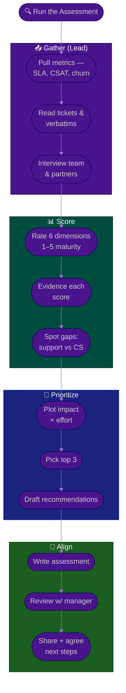

# Procedure: Support & Customer Success Assessment

**Tags:** #procedure #support-lead #customer-success #assessment #maturity #diagnosis
**Roles:** Support / CS Lead · Your Manager · Support Agents · CSMs · Eng/QA · PM/PO
**Read Time:** ~13 min

> You can't improve what you haven't diagnosed. Before you change a single SLA or buy a single tool, you need an **honest, evidence-based picture** of how the support and customer-success operation actually works today. This procedure scores six dimensions on a **1–5 maturity scale**, separates fact from recommendation, and prioritizes fixes by **impact × effort** — so your Phase-3 plan targets the pain that matters, not the pain that shouts loudest. The principle: **measure the system, not the people.**

---

## 📌 Table of Contents
- [The Principle: Diagnose Before You Prescribe](#the-principle-diagnose-before-you-prescribe)
- [The Six Dimensions](#the-six-dimensions)
- [Mermaid Swimlane Diagram](#mermaid-swimlane-diagram)
- [ASCII Flow](#ascii-flow)
- [Step-by-Step Responsibility Table](#step-by-step-responsibility-table)
- [The 1–5 Maturity Scale](#the-15-maturity-scale)
- [Scoring Each Dimension](#scoring-each-dimension)
- [Prioritizing by Impact × Effort](#prioritizing-by-impact--effort)
- [Writing the Assessment](#writing-the-assessment)
- [Anti-Patterns to Avoid](#anti-patterns-to-avoid)
- [Related Documents](#related-documents)

---

## The Principle: Diagnose Before You Prescribe

> A diagnosis built on data survives the politics; a diagnosis built on opinion gets argued away. **Lead with facts, separate recommendations clearly, and never name-and-blame.** The assessment is a mirror for the system, not a report card for individuals.

Two failure modes to avoid:
- **The vibes assessment** — "support feels chaotic." True, maybe, but unactionable and easy to dismiss. Quantify it: backlog age, SLA attainment, CSAT trend.
- **The boil-the-ocean assessment** — 30 findings, all "critical." Stakeholders glaze over. Score everything, then surface the **top 3** by impact × effort.

---

## The Six Dimensions

| # | Dimension | Discipline | Core question | Example signals |
|:--|:----------|:-----------|:--------------|:----------------|
| 1 | **Responsiveness & SLAs** | Support | Do we respond and resolve predictably? | SLA attainment %, response/resolution time, backlog age |
| 2 | **Quality & CSAT** | Support | Is the help actually good? | CSAT, reopen rate, QA review scores, first-contact resolution |
| 3 | **Knowledge & deflection** | Both | Can customers (and agents) self-serve? | KB coverage, deflection rate, article freshness, search success |
| 4 | **Escalation & eng feedback loop** | Both | Do hard issues get fixed at the root? | Escalation clarity, time-to-eng, recurring-ticket fix rate |
| 5 | **Retention/churn & health** | CS | Do customers stay and grow? | Gross churn, NRR, health-score coverage, save-play hit rate |
| 6 | **Team skills & morale** | Both | Is the team capable and sustainable? | Tenure, attrition, training, burnout signals, coverage gaps |

Dimensions 1–2 are core **Support** (reactive). Dimension 5 is core **CS** (proactive). Dimensions 3, 4, and 6 straddle both. Score all six even if your org leans heavily one way — the gap in the *other* discipline is often the biggest hidden risk.

---

## Mermaid Swimlane Diagram



---

## ASCII Flow

```
SUPPORT & CS ASSESSMENT
══════════════════════════════════════════════════════════════════════════════════

🔍 START
   │
   ▼
┌──────────────────────────────────────────────────────────────────────────────┐
│  GATHER EVIDENCE                                                             │
│    ① Pull metrics: SLA attainment, response/resolution, CSAT, churn, NRR      │
│    ② Read the last 100 tickets + CSAT/NPS verbatims + churn reasons           │
│    ③ Interview team & partners (Eng, PM/PO, Sales) — facts, not blame         │
└────────────────────────────────────────┬─────────────────────────────────────┘
                                         ▼
┌──────────────────────────────────────────────────────────────────────────────┐
│  SCORE 6 DIMENSIONS (1–5 maturity)                                          │
│    ④ Responsiveness/SLAs · Quality/CSAT · Knowledge/deflection ·             │
│      Escalation/feedback · Retention/health · Team skills/morale             │
│    ⑤ Attach evidence to every score (number or quote — never "feels")        │
│    ⑥ Note the support-vs-CS gap (which discipline is starved?)               │
└────────────────────────────────────────┬─────────────────────────────────────┘
                                         ▼
┌──────────────────────────────────────────────────────────────────────────────┐
│  PRIORITIZE                                                                  │
│    ⑦ Plot each pain on IMPACT × EFFORT                                        │
│    ⑧ Pick the top 3 (DO-NOW quadrant first)                                  │
│    ⑨ Draft recommendations — clearly separated from the facts                 │
└────────────────────────────────────────┬─────────────────────────────────────┘
                                         ▼
┌──────────────────────────────────────────────────────────────────────────────┐
│  ALIGN                                                                       │
│    ⑩ Review with your manager PRIVATELY first → then share + agree next steps │
└────────────────────────────────────────────────────────────────────────────────┘
```

---

## Step-by-Step Responsibility Table

| # | Step | Who Owns | Who Helps | Output |
|:--|:-----|:---------|:----------|:-------|
| 1 | Pull operational metrics | Support/CS Lead | Ops / tool admin | Metric snapshot |
| 2 | Read tickets, CSAT, churn reasons | Support/CS Lead | — | Qualitative notes |
| 3 | Interview team & partners | Support/CS Lead | Team, Eng, PM/PO | Interview notes |
| 4 | Score 6 dimensions (1–5) | Support/CS Lead | — | Scored scorecard |
| 5 | Evidence each score | Support/CS Lead | — | Fact-backed ratings |
| 6 | Plot impact × effort | Support/CS Lead | Your Manager | Prioritized grid |
| 7 | Pick top 3 pains | Support/CS Lead | Your Manager | Top-3 list |
| 8 | Draft recommendations | Support/CS Lead | — | Recommendations section |
| 9 | Write the assessment | Support/CS Lead | — | [Assessment](./templates/support-assessment-template.md) |
| 10 | Review with manager, then share | Support/CS Lead | Your Manager | Aligned next steps |

---

## The 1–5 Maturity Scale

Use the same scale across all six dimensions so scores are comparable.

| Score | Level | What it looks like |
|:-----:|:------|:-------------------|
| **1** | Chaotic | No process; outcomes are random and depend on heroics |
| **2** | Reactive | Some process exists but it's inconsistent and undocumented |
| **3** | Defined | Documented, repeatable process; followed most of the time |
| **4** | Managed | Measured against targets; deviations are caught and corrected |
| **5** | Optimizing | Continuously improved with data; proactive, self-correcting |

> Most new-workspace assessments land at **1–2 on several dimensions**. That's normal and it's *good news* — it means high-impact, low-effort wins are available. Don't sugar-coat the score to seem positive; an honest 2 you can move to a 3 is more credible than a flattering 4.

---

## Scoring Each Dimension

### 1. Responsiveness & SLAs (Support)
- **Look for:** Are SLAs defined at all? Is attainment measured? Response vs resolution time by priority? Backlog size and *age*?
- **Score 1–2 if:** no SLAs, no priority tiers, "we get to it when we get to it," a multi-week backlog.
- **Score 4–5 if:** tiered SLAs, attainment tracked and met, backlog age controlled. See **[03 — SLAs & Ticket Operations](./03-slas-and-ticket-operations.md)**.

### 2. Quality & CSAT (Support)
- **Look for:** CSAT/NPS captured? Reopen rate? First-contact resolution? Any QA review of agent responses?
- **Score 1–2 if:** no CSAT signal, high reopens, no quality review.
- **Score 4–5 if:** CSAT tracked per agent and trending, low reopens, regular QA sampling with coaching.

### 3. Knowledge & deflection (Both)
- **Look for:** Does a knowledge base exist? Is it current? What % of contacts could self-serve? Is there a deflection metric?
- **Score 1–2 if:** stale or no KB, every question becomes a ticket, knowledge lives in agents' heads.
- **Score 4–5 if:** maintained KB, measured deflection, "create-an-article" baked into ticket resolution. See **[06 — Knowledge, Team & Growth](./06-knowledge-team-and-growth.md)**.

### 4. Escalation & eng feedback loop (Both)
- **Look for:** Is there a clear path to engineering? What's the time-to-eng for a real bug? Do recurring tickets ever get *fixed*, or just re-answered? Does feedback close back to the customer?
- **Score 1–2 if:** bugs vanish into a black hole, Eng ignores support reports, the same issue generates tickets for months.
- **Score 4–5 if:** clear escalation tiers, recurring tickets become evidenced product/eng input, loop closes back. See **[04 — Escalation & Feedback Loop](./04-escalation-and-feedback-loop.md)** and the cross-team [Bug & Incident Flow](../software-delivery/02-bug-and-incident-flow.md).

### 5. Retention/churn & health (CS)
- **Look for:** Is gross/net churn measured? Is there a health score? Onboarding/adoption tracking? Renewal forecasting? Save-plays?
- **Score 1–2 if:** churn is a surprise, no health model, renewals are last-minute scrambles.
- **Score 4–5 if:** health scores drive proactive outreach, churn is forecast, save-plays are habitual. See **[05 — Retention & Customer Success](./05-retention-and-customer-success.md)**.

### 6. Team skills & morale (Both)
- **Look for:** Tenure and attrition, training/onboarding for new agents, coverage gaps, and — critically — **burnout signals** (overtime, no real breaks, cynicism).
- **Score 1–2 if:** high attrition, no onboarding, chronic overload, visible burnout.
- **Score 4–5 if:** stable tenure, structured ramp, sustainable load, growth paths. (This is a high-burnout role — score honestly.)

---

## Prioritizing by Impact × Effort

Plot every meaningful finding. Resist the urge to do the big rewrite first.

```
            HIGH IMPACT
                │
    SCHEDULE    │   DO NOW
   (big bets)   │  (quick wins)
                │
  ──────────────┼──────────────  EFFORT →
                │
    AVOID /     │   FILL-IN
   DEPRIORITIZE │  (easy, low value)
                │
            LOW IMPACT
```

| Quadrant | Examples in support/CS | Action |
|:---------|:-----------------------|:-------|
| **Do now** (high impact, low effort) | Publish a basic SLA; ship the top-5 KB articles; set up CSAT survey | Start this week |
| **Schedule** (high impact, high effort) | New tool migration; build a health-score model; deflection program | Roadmap it with owners |
| **Fill-in** (low impact, low effort) | Tidy macros; rename queues | Batch when convenient |
| **Avoid** (low impact, high effort) | A custom analytics build nobody asked for | Don't |

> **Impact for support/CS = customer pain × volume × business risk.** A bug hitting 5 enterprise accounts up for renewal outranks a cosmetic complaint logged 50 times by free-tier users. Weigh revenue-at-risk and churn signal, not just ticket count.

---

## Writing the Assessment

Use the **[Support & CS Assessment template](./templates/support-assessment-template.md)**. A trustworthy assessment:

- **Leads with the scorecard** — six dimensions, a 1–5 score each, with a one-line evidence note per score.
- **Separates facts from recommendations** — readers must be able to agree with your facts even if they debate your fixes.
- **Quantifies** — "median first response 31h against an implied 24h expectation; 2-week backlog of 180 tickets" beats "support is slow."
- **Names the support-vs-CS gap** — e.g., "Support is a 2; CS effectively doesn't exist (1) — churn is unmonitored."
- **Ends with the top-3 prioritized recommendations**, each with rough impact, effort, and a candidate owner.
- **Is reviewed with your manager privately first.** Align on the story before any wider conversation.

---

## Anti-Patterns to Avoid

| Anti-Pattern | Why It Hurts | Do Instead |
|:-------------|:-------------|:-----------|
| **Scoring on vibes** | Easy to dismiss; can't track improvement | Attach a number or a quote to every score |
| **Naming and blaming** | Destroys trust, hides the real cause | Assess the *system*; people respond to safety |
| **Only scoring Support** | The CS gap (silent churn) goes undiagnosed | Score all six — especially the discipline you lean away from |
| **30 critical findings** | Stakeholders tune out; nothing gets done | Score all, surface the top 3 |
| **Counting tickets, ignoring value** | A loud low-value issue beats a quiet renewal risk | Weigh impact by revenue/churn risk, not raw volume |
| **Publishing before manager review** | A career risk; surprises your boss | Always align privately first |
| **Assessing forever** | Analysis paralysis delays the wins | Timebox to ~2 weeks; ship the diagnosis |

---

## Related Documents
- **Previous:** [01 — First 90 Days](./01-first-90-days.md)
- **Next:** [03 — SLAs & Ticket Operations](./03-slas-and-ticket-operations.md)
- [04 — Escalation & Feedback Loop](./04-escalation-and-feedback-loop.md) · [05 — Retention & Customer Success](./05-retention-and-customer-success.md) · [06 — Knowledge, Team & Growth](./06-knowledge-team-and-growth.md)
- **Template:** [Support & CS Assessment](./templates/support-assessment-template.md)
- **Cross-feed:** [QA State Assessment](../qa-leadership/README.md) · [Bug & Incident Flow](../software-delivery/02-bug-and-incident-flow.md)

---

*Part of the [Support & Customer Success Lead Playbook](./README.md) · Last updated: 2026-05-31*
