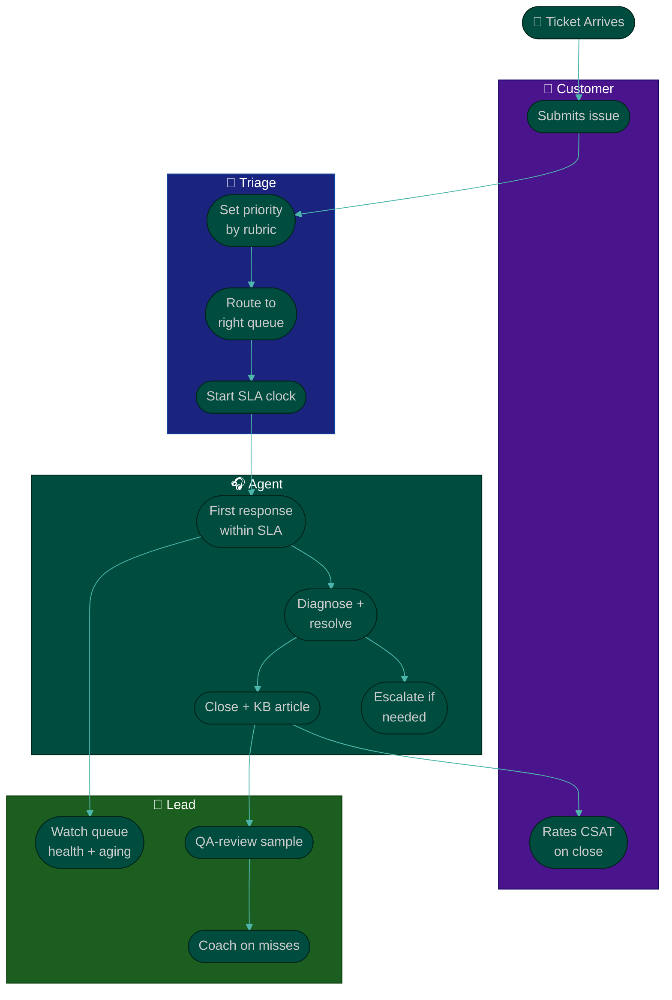

# Procedure: SLAs & Ticket Operations

**Tags:** #procedure #support-lead #customer-success #sla #tickets #operations #csat
**Roles:** Support / CS Lead · Support Agents · Eng/QA · PM/PO · Customers
**Read Time:** ~13 min

> This is the **reactive Support engine** of your operation: how fast you promise to respond, how you triage by severity, how you keep the queue healthy, and how you know the help is actually good. An SLA isn't a stick to beat the team with — it's a **promise to the customer and a design target for the system.** This procedure covers SLAs/SLOs, priority tiers, queue management, staffing and coverage, response vs resolution time, and quality (CSAT/QA reviews) — tool-agnostic, because the discipline matters more than the platform. The principle: **a promise you can't measure is a hope, not an SLA.**

---

## 📌 Table of Contents
- [The Principle: Measurable Promises](#the-principle-measurable-promises)
- [SLA vs SLO vs OLA](#sla-vs-slo-vs-ola)
- [Priority & Severity Tiers](#priority--severity-tiers)
- [Mermaid Swimlane Diagram](#mermaid-swimlane-diagram)
- [ASCII Flow](#ascii-flow)
- [Step-by-Step Responsibility Table](#step-by-step-responsibility-table)
- [Response vs Resolution Time](#response-vs-resolution-time)
- [Queue Management](#queue-management)
- [Staffing & Shift Coverage](#staffing--shift-coverage)
- [Quality: CSAT & QA Reviews](#quality-csat--qa-reviews)
- [Tooling (Tool-Agnostic)](#tooling-tool-agnostic)
- [Anti-Patterns to Avoid](#anti-patterns-to-avoid)
- [Related Documents](#related-documents)

---

## The Principle: Measurable Promises

> An SLA you don't measure is just a slogan. Every target you set must map to a number you can pull, a clock you can start and stop, and a tier you can defend. **Set SLAs you can actually hit at current staffing — then improve them — rather than aspirational numbers you'll breach daily and quietly stop tracking.**

Two failure modes to avoid:
- **The aspirational SLA** — "1-hour response, always!" with three agents and no night coverage. You breach it hourly, the team stops believing in it, and the number becomes noise.
- **The vanity SLA** — measuring only first response (easy to game with an auto-reply) while *resolution* drags for days. Customers don't feel a fast "we got your ticket"; they feel a slow fix.

---

## SLA vs SLO vs OLA

| Term | What it is | Audience | Example |
|:-----|:-----------|:---------|:--------|
| **SLA** (Service Level *Agreement*) | The external promise to the customer | Customers (often contractual) | "P1: respond in 1h, resolve in 8h" |
| **SLO** (Service Level *Objective*) | Your internal target, usually stricter than the SLA | The team | "Hit the P1 SLA 95% of the time" |
| **OLA** (Operational Level *Agreement*) | Internal promise between teams | Support ↔ Eng | "Eng acks escalated P1 within 30 min" |

You set SLAs for customers, hold the team to tighter SLOs (so you have buffer before a customer-facing breach), and negotiate OLAs with Eng so escalations don't stall. The escalation OLA is the bridge to **[04 — Escalation & Feedback Loop](./04-escalation-and-feedback-loop.md)**.

---

## Priority & Severity Tiers

Define a small, unambiguous set of tiers. Map each to response and resolution targets and coverage. Keep production-incident severities **aligned with the cross-team [Bug & Incident Flow](../software-delivery/02-bug-and-incident-flow.md)** so a customer-reported outage and an internally-detected one use the same language.

| Priority | Definition | Typical example | Response | Resolution target |
|:---------|:-----------|:----------------|:---------|:------------------|
| **P1 — Critical** | Service down / data loss / blocking all work | "I can't log in at all; whole team blocked" | 1h (24×7) | 8h |
| **P2 — High** | Major feature broken; significant impact, no workaround | "Checkout fails for 30% of orders" | 4h (business h) | 1 business day |
| **P3 — Normal** | Issue with a workaround; limited impact | "Export is slow but works" | 1 business day | 3 business days |
| **P4 — Low** | Question, cosmetic, feature request | "How do I change my logo?" | 2 business days | Best effort |

> **Priority ≠ the customer's mood.** Every ticket feels like a P1 to the person who filed it. Priority is set by **business impact** (scope × severity × workaround availability), not by tone. Train agents to set it by the rubric, and reserve the right to re-tier — up *or* down — with a brief explanation to the customer.

See the filled **[SLA policy template](./templates/sla-policy-template.md)** for a complete example.

---

## Mermaid Swimlane Diagram



---

## ASCII Flow

```
SLAs & TICKET OPERATIONS
══════════════════════════════════════════════════════════════════════════════════

📨 TICKET ARRIVES
   │
   ▼
┌──────────────────────────────────────────────────────────────────────────────┐
│  TRIAGE                                                                      │
│    ① Set priority by RUBRIC (impact × severity × workaround), not by tone     │
│    ② Route to the right queue / specialist                                    │
│    ③ Start the SLA clock (response + resolution)                              │
└────────────────────────────────────────┬─────────────────────────────────────┘
                                         ▼
┌──────────────────────────────────────────────────────────────────────────────┐
│  WORK THE TICKET                                                             │
│    ④ First response within SLA — a human ack, not just an auto-reply          │
│    ⑤ Diagnose & resolve · ⑥ escalate to Eng if it's a real bug (→ Doc 04)     │
│    ⑦ Close → write/append a KB article so the next customer self-serves       │
└────────────────────────────────────────┬─────────────────────────────────────┘
                                         ▼
┌──────────────────────────────────────────────────────────────────────────────┐
│  MEASURE & IMPROVE  (Lead)                                                   │
│    ⑧ Watch queue health: backlog size, AGE, SLA attainment, breaches          │
│    ⑨ QA-review a sample of closed tickets → coach (private, kind, specific)    │
│    ⑩ CSAT on close → trend it; dig into every detractor                       │
└────────────────────────────────────────────────────────────────────────────────┘
```

---

## Step-by-Step Responsibility Table

| # | Step | Who Owns | Who Helps | Output |
|:--|:-----|:---------|:----------|:-------|
| 1 | Set priority by rubric | Agent | Lead (re-tier) | Tiered ticket |
| 2 | Route to right queue | Agent / automation | Lead | Ticket in queue |
| 3 | Start SLA clock | Tool / automation | — | Clock running |
| 4 | First response within SLA | Agent | — | Human first reply |
| 5 | Diagnose & resolve | Agent | Senior agent | Resolution |
| 6 | Escalate real bugs | Agent | Lead → Eng | [Escalation](./04-escalation-and-feedback-loop.md) |
| 7 | Close + KB article | Agent | — | Closed ticket + KB |
| 8 | Monitor queue & SLAs | Lead | Ops | SLA dashboard |
| 9 | QA-review sample | Lead | Senior agents | Coaching notes |
| 10 | Track & act on CSAT | Lead | Team | CSAT trend + follow-ups |

---

## Response vs Resolution Time

These are different promises and customers feel them differently.

- **First response time (FRT)** — how long until a *human* engages. A fast, real first response buys patience even when the fix takes longer. Auto-replies don't count.
- **Resolution time** — how long until the issue is actually fixed/answered. This is what the customer ultimately cares about.
- **Next-response time** — for multi-touch tickets, the gap between each reply. A ticket that's "in progress" but silent for three days feels abandoned even if it never breached resolution.

> Measure all three. A common trap is optimizing FRT (easy) while resolution and next-response quietly rot. Track **time-in-status** to find tickets that are technically open but actually stuck.

**Pause the clock fairly.** When you're genuinely *waiting on the customer*, pause the SLA clock — but make the team set a clear, friendly "we need X from you" so a paused ticket isn't a parked one. Auto-close stale "pending customer" tickets after a courteous reminder, and make reopening trivial.

---

## Queue Management

A healthy queue is **small, young, and triaged** — not necessarily empty.

| Signal | Healthy | Warning | Action |
|:-------|:--------|:--------|:-------|
| **Backlog size** | Stable / shrinking | Growing week-over-week | Add coverage; deflect; cull |
| **Backlog age** | Oldest < a few days | Tickets aging weeks | Triage sweep; assign owners to old items |
| **SLA attainment** | ≥ SLO target | Dipping below target | Re-balance load; check staffing |
| **Untriaged count** | Near zero | Pile of unset-priority | Tighten intake/triage routine |

Run a **daily triage sweep**: every new ticket gets a priority and an owner; every aging ticket gets a nudge or an escalation. Use **views/queues by priority and age**, not one giant undifferentiated inbox. When backlog spikes (e.g., after an incident), declare it, communicate to customers, and run a focused **backlog burn-down** rather than letting it become the new normal.

---

## Staffing & Shift Coverage

You can't promise a 1-hour 24×7 P1 SLA with one timezone of agents. Coverage and SLAs must be designed together.

- **Map demand:** ticket volume by hour/day, peak windows, and the geographic spread of customers.
- **Match coverage to the promise:** if you sell 24×7 P1, you need follow-the-sun coverage or an on-call rotation. If you only staff business hours, your SLA must say so honestly.
- **Plan for shrinkage:** PTO, sick days, training, meetings — a person is not 100% available. Staff to ~70–80% utilization, not 100%, or you have no resilience (and you breed burnout — see [06](./06-knowledge-team-and-growth.md)).
- **Define an on-call / escalation rotation** for after-hours P1s, with a clear handoff and an OLA from Eng.
- **Cross-train** so one specialist's PTO doesn't blow the SLA for a whole product area.

---

## Quality: CSAT & QA Reviews

Speed without quality is just fast disappointment. Measure both.

- **CSAT** — a one-click survey on ticket close ("How did we do?"). Trend it over time and **read every detractor verbatim** — those are gifts. Watch for survey fatigue; sample rather than survey every ticket if volume is high.
- **Reopen rate** — a closed-then-reopened ticket means you didn't actually solve it. High reopens signal rushed closes or unclear resolutions.
- **First-contact resolution (FCR)** — solved in one touch. Higher FCR usually means happier customers and lower cost.
- **Internal QA review** — sample a handful of closed tickets per agent per week against a simple rubric (correct? complete? kind? on-policy? KB-linked?). **Coach privately, kindly, and specifically.** QA review is for growth, not surveillance — score the work, never rank the people publicly.

> Tie quality back to the customer's voice: a high CSAT with a slow resolution still beats a fast resolution with a 1-star rating. Optimize for the *experience*, not just the clock.

---

## Tooling (Tool-Agnostic)

The discipline outlives any specific tool. Whatever helpdesk/CS platform you use, it should support:

| Capability | Why it matters |
|:-----------|:---------------|
| **Priority/tier fields + SLA timers** | Can't measure promises without clocks per tier |
| **Queues/views by priority & age** | Queue management depends on slicing the backlog |
| **CSAT survey on close** | Quality signal at the source |
| **Macros / saved replies** | Consistency + speed (but keep them human) |
| **Knowledge base integration** | Deflection + close-with-an-article workflow |
| **Reporting on FRT / resolution / attainment** | The metrics this whole doc relies on |
| **Escalation/integration to Eng tracker** | The feedback loop in [Doc 04](./04-escalation-and-feedback-loop.md) |

> Don't migrate tools in your first 90 days unless the current one literally cannot measure SLAs. A tool change is high-effort and disruptive; first prove the *process* works, then let real requirements drive any tool decision.

---

## Anti-Patterns to Avoid

| Anti-Pattern | Why It Hurts | Do Instead |
|:-------------|:-------------|:-----------|
| **Aspirational SLAs you can't hit** | Daily breaches make the SLA meaningless | Set hittable targets at current staffing, then tighten |
| **Measuring only first response** | Resolution rots while FRT looks great | Track FRT, next-response, and resolution |
| **Priority = customer mood** | Loud customers jump real emergencies | Set priority by impact rubric; re-tier with a note |
| **Auto-reply as "first response"** | Customers feel ignored, not served | First response must be a human engaging |
| **One giant undifferentiated queue** | Old/critical tickets get buried | Slice by priority & age; daily triage sweep |
| **Staffing to 100% utilization** | No resilience; guaranteed burnout & breaches | Staff to ~70–80%; plan for shrinkage |
| **QA review as surveillance** | Kills trust and honesty | Coach privately and kindly; score work, not people |
| **Tool migration in week 1** | High-effort distraction before you understand needs | Prove the process first; let needs drive tooling |

---

## Related Documents
- **Previous:** [02 — Support & CS Assessment](./02-support-assessment.md)
- **Next:** [04 — Escalation & Feedback Loop](./04-escalation-and-feedback-loop.md)
- [05 — Retention & Customer Success](./05-retention-and-customer-success.md) · [06 — Knowledge, Team & Growth](./06-knowledge-team-and-growth.md)
- **Template:** [SLA Policy](./templates/sla-policy-template.md)
- **Cross-feed:** [Bug & Incident Flow](../software-delivery/02-bug-and-incident-flow.md) (severity alignment) · [QA Bug Lifecycle & Triage](../qa-leadership/04-bug-lifecycle-and-triage.md)

---

*Part of the [Support & Customer Success Lead Playbook](./README.md) · Last updated: 2026-05-31*
