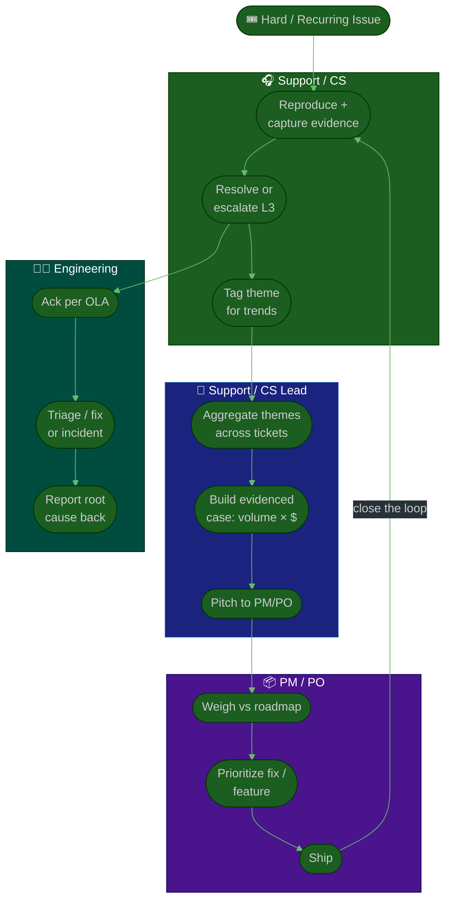

# Procedure: Escalation & the Customer Feedback Loop

**Tags:** #procedure #support-lead #customer-success #escalation #feedback #voice-of-customer
**Roles:** Support / CS Lead · Support Agents · Eng/QA · PM/PO · Customers
**Read Time:** ~13 min

> Two of your most important jobs share one pipe: getting a hard issue **fixed at the root** (escalation), and turning the *pattern* of issues into **product and engineering priorities** (the feedback loop). This is where you become the **voice of the customer** inside the company — and where a great support/CS operation either compounds value or becomes a black hole. You don't own the roadmap; you **influence** it, with evidence. The principle: **a recurring ticket isn't a thing to re-answer faster — it's a thing to eliminate.**

---

## 📌 Table of Contents
- [The Principle: Eliminate, Don't Re-Answer](#the-principle-eliminate-dont-re-answer)
- [Two Pipes: Escalation vs Feedback](#two-pipes-escalation-vs-feedback)
- [Escalation Tiers](#escalation-tiers)
- [Mermaid Swimlane Diagram](#mermaid-swimlane-diagram)
- [ASCII Flow](#ascii-flow)
- [Step-by-Step Responsibility Table](#step-by-step-responsibility-table)
- [Escalating to Engineering](#escalating-to-engineering)
- [Being the Voice of the Customer](#being-the-voice-of-the-customer)
- [Influencing the Roadmap with Evidence](#influencing-the-roadmap-with-evidence)
- [Closing the Loop Back to Customers](#closing-the-loop-back-to-customers)
- [Anti-Patterns to Avoid](#anti-patterns-to-avoid)
- [Related Documents](#related-documents)

---

## The Principle: Eliminate, Don't Re-Answer

> Every recurring ticket is the product talking to you. The reactive instinct is to answer it faster next time; the leadership move is to **make the next ticket unnecessary** — via a fix, a KB article, or a product change. **Your goal is fewer tickets about the same thing, quarter over quarter**, not a faster treadmill.

Two failure modes to avoid:
- **The black hole** — bugs and feedback go into a channel Eng never reads, customers are told "we'll pass it along," and nothing happens. Trust dies on both sides.
- **The escalation flood** — everything gets escalated, so Eng tunes you out. Escalate the *real* and the *patterned*, with evidence, and Eng learns that a ping from support means it's serious.

---

## Two Pipes: Escalation vs Feedback

Keep these mentally separate — they move at different speeds and to different people.

| | **Escalation** (this ticket) | **Feedback loop** (the pattern) |
|:--|:-----------------------------|:--------------------------------|
| Trigger | One urgent/hard issue that's blocking a customer now | A recurring theme across many tickets |
| Speed | Minutes to days | Weeks to a quarter |
| Goes to | On-call / Eng / Team Lead | PM/PO and Eng leadership |
| Looks like | "P1: account X can't process payments" | "Payment timeouts caused 412 tickets this quarter" |
| Cross-link | [Bug & Incident Flow](../software-delivery/02-bug-and-incident-flow.md) | [Product Owner](../product-owner/README.md) / [PM](../pm-leadership/README.md) |

The escalation pipe is operational and largely defined by the company's incident process — **link to it, don't re-invent it.** The feedback pipe is *yours to build* and is where most of your strategic influence lives.

---

## Escalation Tiers

Define who handles what, so agents don't escalate too early (learned helplessness) or too late (a P1 sat for hours).

| Tier | Handled by | When | Target |
|:-----|:-----------|:-----|:-------|
| **L1** | Front-line agent | Known issues, KB-able, account questions | Resolve at first contact where possible |
| **L2** | Senior agent / specialist | Needs deeper product/config knowledge | Within priority SLA |
| **L3 — Engineering** | Eng on-call / owning team | Confirmed bug, data issue, outage | Per OLA (e.g., ack P1 in 30 min) |
| **Incident** | Incident process | SEV-1/2 production impact | Per [Bug & Incident Flow](../software-delivery/02-bug-and-incident-flow.md) |

> Escalation is not failure. An agent who escalates a genuine L3 bug promptly — with a clean repro — did their job *well*. Reward good escalations; the thing you coach against is escalating to dodge effort.

---

## Mermaid Swimlane Diagram



---

## ASCII Flow

```
ESCALATION & FEEDBACK LOOP
══════════════════════════════════════════════════════════════════════════════════

🎟️ HARD / RECURRING ISSUE
   │
   ▼
┌──────────────────────────────────────────────────────────────────────────────┐
│  ESCALATION PIPE  (this ticket — fast)                                       │
│    ① Agent reproduces + captures evidence (steps, account, logs, impact)      │
│    ② Resolve at L1/L2 if possible; else escalate L3 → Eng (per OLA)           │
│    ③ Eng acks → fixes or declares incident (→ Bug & Incident Flow)            │
│    ④ Eng reports root cause back to support                                   │
└────────────────────────────────────────┬─────────────────────────────────────┘
                                         │  (every ticket gets a THEME tag)
                                         ▼
┌──────────────────────────────────────────────────────────────────────────────┐
│  FEEDBACK PIPE  (the pattern — weeks/quarter)                                │
│    ⑤ Lead aggregates themes across tickets (what recurs, who's hurt, $ risk)  │
│    ⑥ Build the evidenced case: volume × revenue-at-risk × churn signal        │
│    ⑦ Pitch to PM/PO — INFLUENCE with evidence, not authority                  │
│    ⑧ PM/PO weighs vs roadmap → prioritizes the fix/feature                    │
└────────────────────────────────────────┬─────────────────────────────────────┘
                                         ▼
┌──────────────────────────────────────────────────────────────────────────────┐
│  CLOSE THE LOOP                                                              │
│    ⑨ When it ships, tell the team AND the customers who reported it           │
│    ⑩ Watch the ticket volume for that theme drop → prove the loop works       │
└────────────────────────────────────────────────────────────────────────────────┘
```

---

## Step-by-Step Responsibility Table

| # | Step | Who Owns | Who Helps | Output |
|:--|:-----|:---------|:----------|:-------|
| 1 | Reproduce & capture evidence | Agent | Customer | Clean repro + impact |
| 2 | Resolve or escalate to L3 | Agent | Senior agent | Resolution / escalation |
| 3 | Ack & triage escalation | Eng | Lead | Eng owning the issue |
| 4 | Report root cause back | Eng | — | Root-cause note |
| 5 | Tag every ticket with a theme | Agent | Lead | Tagged tickets |
| 6 | Aggregate themes | Support/CS Lead | Ops | Theme report |
| 7 | Build evidenced case | Support/CS Lead | — | Volume × $ × churn data |
| 8 | Pitch to PM/PO | Support/CS Lead | Your Manager | Roadmap input |
| 9 | Prioritize fix/feature | PM/PO | Eng | Roadmap decision |
| 10 | Close the loop to customers | Support/CS Lead | Agents | Customer notification |

---

## Escalating to Engineering

The cross-team mechanics of how a bug or incident flows — severity levels, hotfix vs sprint path, post-mortems — are **defined in [Bug & Incident Flow](../software-delivery/02-bug-and-incident-flow.md), and QA's [Bug Lifecycle & Triage](../qa-leadership/04-bug-lifecycle-and-triage.md).** Don't duplicate them; **link to them and align your tiers with theirs.** Your job is to feed that machine clean inputs:

- **A clean repro is your currency with Eng.** Steps to reproduce, expected vs actual, environment/account, timestamps, logs/screenshots, and **business impact** (how many customers, what revenue). A vague "it's broken" gets deprioritized; a tight repro gets fixed.
- **Negotiate an OLA** with Eng for escalation acknowledgement (e.g., ack escalated P1 within 30 min, P2 same business day). Put it in writing so it's not a favor — it's the agreement.
- **Map customer priority to incident severity** so a customer-reported outage and an internally-detected one speak the same language (P1 ↔ SEV-1, etc.).
- **Own communication during incidents.** While Eng stabilizes, *you* keep affected customers informed. That division of labor (Eng fixes, Support communicates) is the backbone of trust during an outage.

---

## Being the Voice of the Customer

Inside the company you are often the **only person in the room who has actually talked to the customer this week.** That's a responsibility and a superpower.

- **Carry the customer's actual words.** A verbatim quote ("I almost cancelled because the import silently dropped half my records") lands harder than a paraphrase.
- **Represent the silent majority, not just the loudest.** One furious enterprise customer matters — but so do the 300 quiet free-tier users who hit the same wall and never wrote in. Use data to surface the silent ones.
- **Bring patterns, not anecdotes, to strategy.** A single ticket is an anecdote; "this theme is 18% of our volume and rising" is a strategy input.
- **Stay credible by being balanced.** Don't cry wolf on every gripe. When you say "this one matters," people should believe you because you've been calibrated and selective.

---

## Influencing the Roadmap with Evidence

You do **not** own product priorities — **PM/PO do** (see [Product Owner](../product-owner/README.md) and [PM Leadership](../pm-leadership/README.md)). You influence them, and evidence is your lever. The difference between being ignored and being heard is almost always the quality of the case you bring.

**A roadmap-ready feedback case includes:**

| Element | Example |
|:--------|:--------|
| **Theme** | "Payment timeouts during checkout" |
| **Volume** | "412 tickets this quarter (18% of all tickets), rising 20% MoM" |
| **Cost** | "~60 agent-hours/quarter re-answering this" |
| **Revenue/churn signal** | "Cited in 3 of last quarter's 5 churns; 2 enterprise renewals at risk" |
| **Customer voice** | 2–3 verbatim quotes |
| **Ask** | "A fix here likely removes ~15% of our ticket volume" |

> **Frame it as shared goals, not a demand.** "Here's evidence that fixing X reduces churn and frees engineering from interrupt-driven support work" beats "support needs you to fix this." You're handing PM/PO ammunition to make a great prioritization call — not issuing orders you have no authority to give. Bring this to backlog refinement and quarterly planning where the roadmap is actually shaped.

---

## Closing the Loop Back to Customers

The loop is not closed until the customer knows. This is the step everyone skips — and it's where trust compounds.

- **Tell the customers who reported it** when their issue ships a fix. "You reported X in March; it's fixed as of this week — thank you for flagging it." This single habit turns frustrated reporters into advocates.
- **Tell the team.** Agents who escalated need to see it pay off, or they stop escalating. Celebrate "this fix came from a ticket Sothea escalated."
- **Tell Product the result.** "Ticket volume for that theme dropped 80% post-fix" proves the loop works and earns you a louder voice next quarter.
- **Maintain a public-ish changelog or "you asked, we shipped" note** where appropriate — it shows the whole customer base that feedback goes somewhere.

> A closed loop is the antidote to the feedback black hole. When customers and agents both *see* that reported pain leads to real fixes, they keep reporting — and your evidence pipeline gets richer.

---

## Anti-Patterns to Avoid

| Anti-Pattern | Why It Hurts | Do Instead |
|:-------------|:-------------|:-----------|
| **The feedback black hole** | Feedback dies; customers and agents stop bothering | Build the pipe; always close the loop |
| **Re-answering recurring tickets forever** | A faster treadmill, never fewer tickets | Eliminate the root cause; track theme volume down |
| **Escalating everything** | Eng tunes you out; real P1s get lost | Escalate the real & patterned, with clean evidence |
| **Vague escalations** | Eng can't act; ticket bounces back | A clean repro + impact is your currency |
| **Demanding roadmap changes** | You have influence, not authority — it backfires | Bring evidenced cases; frame as shared goals |
| **Anecdotes over patterns** | One loud voice skews priorities | Aggregate themes; quantify volume & $ |
| **Crying wolf** | You lose credibility for the issues that matter | Be calibrated and selective |
| **Never closing the loop** | Even fixed issues feel ignored | Tell the customer, the team, and Product |

---

## Related Documents
- **Previous:** [03 — SLAs & Ticket Operations](./03-slas-and-ticket-operations.md)
- **Next:** [05 — Retention & Customer Success](./05-retention-and-customer-success.md)
- [06 — Knowledge, Team & Growth](./06-knowledge-team-and-growth.md)
- **Cross-feed (link, don't duplicate):** [Bug & Incident Flow](../software-delivery/02-bug-and-incident-flow.md) · [QA Bug Lifecycle & Triage](../qa-leadership/04-bug-lifecycle-and-triage.md) · [Product Owner Playbook](../product-owner/README.md) · [PM Leadership Playbook](../pm-leadership/README.md)

---

*Part of the [Support & Customer Success Lead Playbook](./README.md) · Last updated: 2026-05-31*
