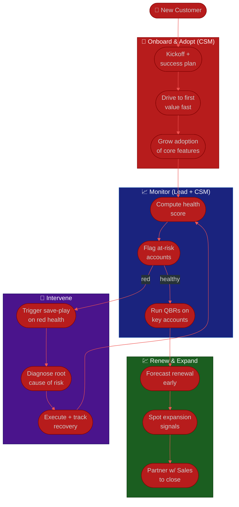

# Procedure: Retention & Customer Success

**Tags:** #procedure #support-lead #customer-success #retention #churn #health-score #expansion
**Roles:** Support / CS Lead · CSMs · Sales / Account Management · PM/PO · Customers
**Read Time:** ~14 min

> This is the **proactive Customer Success engine** — the half of the role that pays the bills you can't see. Support is reactive: you wait for the ticket. **CS is proactive: you act *before* the customer is in trouble** — driving adoption, watching health, running QBRs, predicting churn, and earning renewals and expansion. In most SaaS businesses, keeping and growing existing customers is far cheaper than acquiring new ones, which makes this your highest-leverage strategic work. The principle: **the renewal is won (or lost) months before the renewal date.**

---

## 📌 Table of Contents
- [The Principle: Proactive, Not Reactive](#the-principle-proactive-not-reactive)
- [How CS Differs from Support](#how-cs-differs-from-support)
- [The Customer Lifecycle](#the-customer-lifecycle)
- [Mermaid Swimlane Diagram](#mermaid-swimlane-diagram)
- [ASCII Flow](#ascii-flow)
- [Step-by-Step Responsibility Table](#step-by-step-responsibility-table)
- [Onboarding & Adoption](#onboarding--adoption)
- [Health Scores](#health-scores)
- [Churn Prediction & Save Plays](#churn-prediction--save-plays)
- [QBRs](#qbrs)
- [Renewals & Expansion](#renewals--expansion)
- [Segmentation](#segmentation)
- [Anti-Patterns to Avoid](#anti-patterns-to-avoid)
- [Related Documents](#related-documents)

---

## The Principle: Proactive, Not Reactive

> By the time a customer files an angry ticket or asks to cancel, you're already losing. The whole craft of CS is **moving upstream** — spotting the customer who logged in less this month, never finished onboarding, or stopped using the feature they bought you for, and reaching out *before* they decide to leave. **A reactive CS team is just a help desk wearing a fancier title.**

Two failure modes to avoid:
- **CS as a help desk** — only acting when the customer contacts you. You never see the silent churners, who are the majority.
- **The renewal scramble** — discovering at renewal that the customer hasn't used the product in two months. The save attempt that starts 30 days out is usually too late.

---

## How CS Differs from Support

You run both, but they require opposite reflexes. Know which hat you're wearing.

| | **Support** (reactive) | **Customer Success** (proactive) |
|:--|:-----------------------|:---------------------------------|
| Who initiates | The customer | You |
| Unit | The ticket | The account / journey |
| Win | Issue resolved fast & well | Customer achieves their outcome, stays, grows |
| Metric | CSAT, SLA, resolution time | Retention, NRR, health score, adoption, expansion |
| Cadence | Continuous, interrupt-driven | Scheduled + signal-driven |
| Failure mode | Slow, repeated tickets | **Silent** churn — they leave without a word |

> Reactive support is loud; proactive CS is quiet. The discipline is **protecting CS time** so the quiet-but-important work happens. Block calendar time for health reviews and outreach the same way you'd staff a queue — or the fire always wins.

---

## The Customer Lifecycle

CS work maps to stages of the customer's journey. Each stage has its own goal and its own risk.

| Stage | Goal | Top risk | Your move |
|:------|:-----|:---------|:----------|
| **Onboard** | First value, fast | Never gets started ("dark" account) | Guided onboarding; time-to-first-value |
| **Adopt** | Habitual use of core value | Stalls at shallow usage | Drive feature adoption; remove friction |
| **Value** | Realizes the outcome they bought | Outcome unclear / unproven | QBRs; tie usage to their goals |
| **Renew** | Continue the relationship | Silent non-renewal | Forecast early; de-risk months out |
| **Expand** | Grow seats/tier/usage | Missed upsell; under-served | Spot expansion signals; partner with Sales |

---

## Mermaid Swimlane Diagram



---

## ASCII Flow

```
RETENTION & CUSTOMER SUCCESS
══════════════════════════════════════════════════════════════════════════════════

🤝 NEW CUSTOMER
   │
   ▼
┌──────────────────────────────────────────────────────────────────────────────┐
│  ONBOARD & ADOPT  (the first 90 days set the whole relationship)            │
│    ① Kickoff + a written SUCCESS PLAN (what outcome are they buying?)         │
│    ② Drive to FIRST VALUE fast — measure time-to-first-value                  │
│    ③ Grow adoption of the core features that deliver that outcome             │
└────────────────────────────────────────┬─────────────────────────────────────┘
                                         ▼
┌──────────────────────────────────────────────────────────────────────────────┐
│  MONITOR HEALTH  (continuously — don't wait for the renewal)                │
│    ④ Compute a health score (usage + engagement + support + sentiment + fit)  │
│    ⑤ Flag at-risk accounts EARLY (red/yellow)                                 │
│    ⑥ Run QBRs on key accounts — tie usage back to their business goals        │
└──────────────┬───────────────────────────────────┬───────────────────────────┘
               │ red                                 │ healthy
               ▼                                     ▼
┌────────────────────────────────┐      ┌────────────────────────────────────┐
│  SAVE PLAY                     │      │  RENEW & EXPAND                    │
│    ⑦ Trigger on red health     │      │    ⑩ Forecast renewal early        │
│    ⑧ Diagnose the real cause   │      │    ⑪ Spot expansion signals        │
│    ⑨ Execute + track recovery  │      │    ⑫ Partner w/ Sales to close     │
└────────────────────────────────┘      └────────────────────────────────────┘
```

---

## Step-by-Step Responsibility Table

| # | Step | Who Owns | Who Helps | Output |
|:--|:-----|:---------|:----------|:-------|
| 1 | Kickoff + success plan | CSM | Sales (handoff) | Written success plan |
| 2 | Drive to first value | CSM | Support, Product | Time-to-first-value |
| 3 | Grow core adoption | CSM | — | Adoption metrics |
| 4 | Compute health score | Support/CS Lead | Ops/data | Health scorecard |
| 5 | Flag at-risk accounts | Support/CS Lead | CSMs | Risk list |
| 6 | Run QBRs | CSM | Lead, customer | QBR + renewed plan |
| 7 | Trigger save-play | CSM | Lead | Save-play in motion |
| 8 | Diagnose risk cause | CSM | Support, Product | Root cause |
| 9 | Execute & track recovery | CSM | Lead | Health recovered |
| 10 | Forecast renewals | Support/CS Lead | Sales/Finance | Renewal forecast |
| 11 | Spot & pursue expansion | CSM | Sales | Expansion pipeline |

---

## Onboarding & Adoption

The first 90 days of a customer's life predict the whole relationship. A customer who never reaches first value will churn no matter how good your support is later.

- **Write a success plan at kickoff.** Capture *why they bought* — the outcome, not the features. "Cut month-end close from 5 days to 2" is a success plan; "use the reporting module" is not.
- **Obsess over time-to-first-value (TTFV).** The faster a customer gets one real win, the stickier they become. Remove every avoidable step between signup and that first win.
- **Watch for "dark" accounts** — provisioned but never (or barely) logged in. These are silent churn in slow motion. Reach out fast.
- **Drive adoption of the *core* features** that deliver the bought outcome — not breadth for its own sake. Depth on what matters beats shallow use of everything.

---

## Health Scores

A health score is an **early-warning system**: a single composite signal that tells you which accounts need attention before they're in crisis. Keep it simple enough to trust and act on.

Common dimensions (weight to your business):

| Dimension | Signal | Why |
|:----------|:-------|:----|
| **Product usage** | Login frequency, core-feature use, active seats | The #1 predictor of retention |
| **Engagement** | Responds to outreach, attends QBRs, has a champion | A disengaged account is drifting |
| **Support experience** | Ticket volume, CSAT, unresolved escalations | Lots of unhappy tickets = risk |
| **Sentiment** | NPS, survey tone, relationship feel | The human signal numbers miss |
| **Account fit / stakeholder** | Right use case, champion still employed | A departed champion is a top churn cause |

Roll these into **Green / Yellow / Red** and let the level **trigger an action** (Red → save-play; Yellow → check-in). See the **[Customer Health Scorecard template](./templates/customer-health-scorecard-template.md)** for a worked model.

> A health score is only useful if it **drives action**. A dashboard nobody acts on is theater. Every Red must have an owner and a play; every account should have a known color.

---

## Churn Prediction & Save Plays

**Predict** churn from leading indicators, don't just count it after the fact:
- Declining usage trend, a missed/cancelled QBR, a champion leaving, a spike in unhappy tickets, an unresolved escalation near renewal, or going dark.

**Run a save play** when an account goes Red:

```
RED HEALTH → SAVE PLAY
   ① Diagnose the REAL cause (usage? value? a person? a bug?) — don't guess
   ② Reach the right person (champion or their boss), not just whoever filed tickets
   ③ Bring a concrete plan to restore value — not just "how can we help?"
   ④ Pull in the cavalry where warranted: Product for a fix, Sales for terms, exec sponsor
   ⑤ Track to recovery; set a check-in; update health honestly (don't wish it green)
```

> The most common churn cause isn't a competitor — it's **unrealized value**: the customer never got the outcome they bought. The fix is usually re-onboarding and adoption, not a discount. Lead with value, not price.

---

## QBRs

A **Quarterly Business Review** is the proactive ritual for your key accounts — a structured conversation that ties what they're *doing* in the product to the *outcome* they're trying to achieve.

A good QBR:
- **Reviews progress against the success plan** — are they getting the outcome they bought?
- **Shows their own data back to them** — usage, value delivered, ROI where you can quantify it.
- **Surfaces risks and roadblocks** early, jointly.
- **Looks forward** — their next goals, relevant roadmap items, and expansion that genuinely serves them.
- **Is reserved for accounts where the effort pays off** — high-value/high-touch segments (see [Segmentation](#segmentation)). Don't QBR a $20/mo account.

---

## Renewals & Expansion

- **Forecast renewals early.** Health + usage + sentiment should tell you the renewal outcome a quarter out. A renewal that's a surprise is a process failure.
- **De-risk months ahead.** Address Yellow/Red accounts long before the renewal date; the 30-day scramble rarely works.
- **Expansion follows value, not pressure.** A customer getting strong value is the right one to grow — more seats, a higher tier, new use cases. Watch for signals: hitting plan limits, new teams adopting, asking about advanced features.
- **Partner with Sales/Account Management**, don't compete. CS surfaces the opportunity and the trust; Sales often closes the commercial terms. Define the handoff so the customer experiences one team. (This mirrors how you partner with PM/PO on the roadmap — influence and collaborate.)

---

## Segmentation

You cannot give every customer white-glove attention. Segment by value and match the engagement model.

| Segment | Engagement model | Touch |
|:--------|:-----------------|:------|
| **High-touch** (enterprise / strategic) | Named CSM, scheduled QBRs, success plans | Proactive, 1:1 |
| **Mid-touch** (mid-market) | Pooled CSMs, lighter QBRs, milestone outreach | Mixed |
| **Tech-touch / low-touch** (SMB, self-serve) | Automated onboarding, in-app nudges, email lifecycle, scaled webinars | 1:many, automated |

> Tech-touch isn't "no CS" — it's CS **at scale** via automation and content (this is where CS meets the knowledge base; see [06 — Knowledge, Team & Growth](./06-knowledge-team-and-growth.md)). The art is investing human attention where the revenue and risk justify it, and systematizing the rest.

---

## Anti-Patterns to Avoid

| Anti-Pattern | Why It Hurts | Do Instead |
|:-------------|:-------------|:-----------|
| **CS as a reactive help desk** | You miss every silent churner | Act proactively on health signals, not just tickets |
| **The renewal scramble** | A save that starts 30 days out usually fails | Forecast and de-risk months ahead |
| **Health score as theater** | A dashboard nobody acts on saves nobody | Every Red gets an owner and a play |
| **Wishing accounts green** | Optimistic scoring hides real risk | Score honestly; an ugly Red you act on beats a fake Green |
| **Discounting to save** | Treats the symptom, not unrealized value | Lead with re-onboarding & value; price last |
| **One-size-fits-all touch** | Burns time on low-value, starves strategic accounts | Segment; automate the long tail |
| **Competing with Sales** | Confuses the customer, loses expansion | Define handoffs; partner as one team |
| **Letting fires eat CS time** | Reactive always beats proactive if you let it | Block & protect proactive time on the calendar |

---

## Related Documents
- **Previous:** [04 — Escalation & Feedback Loop](./04-escalation-and-feedback-loop.md)
- **Next:** [06 — Knowledge, Team & Growth](./06-knowledge-team-and-growth.md)
- [03 — SLAs & Ticket Operations](./03-slas-and-ticket-operations.md) (the reactive Support counterpart)
- **Template:** [Customer Health Scorecard](./templates/customer-health-scorecard-template.md)
- **Cross-feed:** [Product Owner Playbook](../product-owner/README.md) · [Business Owner Playbook](../business-owner/README.md) · [PM Leadership Playbook](../pm-leadership/README.md)

---

*Part of the [Support & Customer Success Lead Playbook](./README.md) · Last updated: 2026-05-31*
