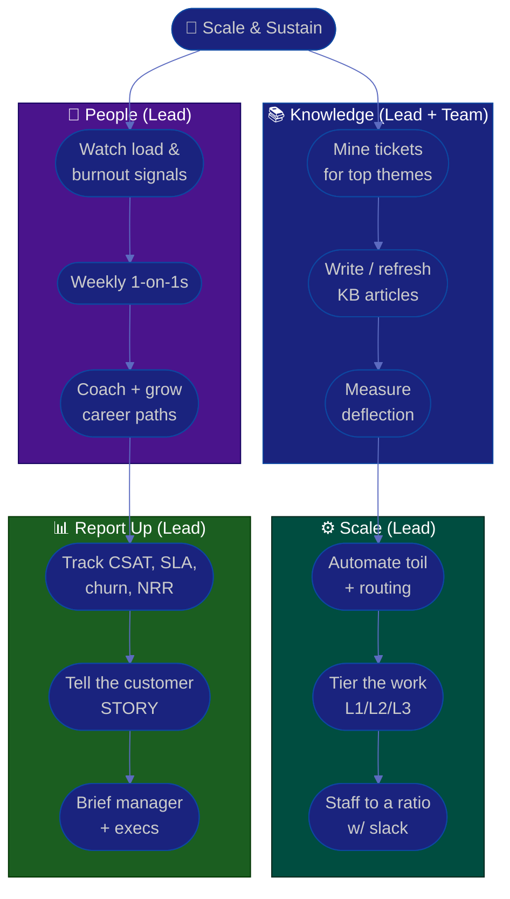

# Procedure: Knowledge, Team & Growth

**Tags:** #procedure #support-lead #customer-success #knowledge-base #deflection #team #coaching #burnout
**Roles:** Support / CS Lead · Support Agents · CSMs · Your Manager · PM/PO
**Read Time:** ~13 min

> This procedure is about **scale and sustainability** — the two things that decide whether your operation breaks as the company grows. You scale customer reach without linearly scaling headcount through a great **self-service knowledge base and deflection**. You sustain the *people* through humane workload, real coaching, and growth paths — because support and CS are famously high-burnout roles, and a burned-out team tanks both CSAT and retention. And you keep your seat at the table by **reporting customer metrics up** so the value of the function is visible. The principle: **scale the knowledge, protect the people, and make the value legible.**

---

## 📌 Table of Contents
- [The Principle: Scale Knowledge, Protect People](#the-principle-scale-knowledge-protect-people)
- [Self-Service Knowledge Base & Deflection](#self-service-knowledge-base--deflection)
- [Scaling Without Linear Headcount](#scaling-without-linear-headcount)
- [Mermaid Swimlane Diagram](#mermaid-swimlane-diagram)
- [ASCII Flow](#ascii-flow)
- [Step-by-Step Responsibility Table](#step-by-step-responsibility-table)
- [Team Morale & Burnout (Be Humane)](#team-morale--burnout-be-humane)
- [Coaching & Growth](#coaching--growth)
- [1-on-1s](#1-on-1s)
- [Reporting Customer Metrics Up](#reporting-customer-metrics-up)
- [Anti-Patterns to Avoid](#anti-patterns-to-avoid)
- [Related Documents](#related-documents)

---

## The Principle: Scale Knowledge, Protect People

> Every answer your team gives twice should have been an article. Every hour of overtime that becomes routine is a future resignation. **The job of a support/CS leader is to make the team's knowledge reusable and their workload survivable** — so the operation grows without grinding people down or hiring linearly with ticket volume.

Two failure modes to avoid:
- **The headcount treadmill** — the only lever you pull for more volume is more bodies. Costs scale linearly, quality drifts, and you're always behind.
- **The burnout factory** — you hit your SLAs this quarter by running the team hot. Next quarter your best people quit, tenure (and CSAT) collapses, and you're rehiring into a worse system.

---

## Self-Service Knowledge Base & Deflection

The cheapest, fastest, most-loved support is the ticket the customer never has to file because they found the answer themselves.

- **Deflection = self-service success.** Measure it: searches/article views that don't become tickets, "was this helpful?" votes, and the ratio of KB visits to tickets. Rising deflection means the KB is working.
- **Source articles from real tickets.** Make "create or update a KB article" part of resolving a recurring issue. The team's tickets *are* the content backlog — mine them for the top themes (this is the same theme data you use in [04 — Feedback Loop](./04-escalation-and-feedback-loop.md)).
- **Keep it current.** A stale KB is worse than none — it erodes trust. Assign ownership, review on a cadence, and retire dead articles. Freshness is a metric.
- **Write for the customer, not the engineer.** Task-oriented, searchable titles ("How to reset your password"), screenshots, plain language. Surface articles *in-product* and in the ticket form (suggest-before-submit) where you can.
- **Two audiences, two KBs:** a **public/customer KB** for deflection, and an **internal KB / playbook** so agents answer consistently and new hires ramp fast.

---

## Scaling Without Linear Headcount

Headcount is the most expensive lever and the slowest to add. Pull the others first.

| Lever | What it does | Example |
|:------|:-------------|:--------|
| **Deflection** | Removes tickets before they're filed | KB, in-app help, suggest-before-submit |
| **Macros / templates** | Speeds repeated answers (kept human) | Saved replies for common issues |
| **Automation / routing** | Cuts triage toil; routes to the right person | Auto-tagging, smart routing, bots for FAQs |
| **Tiering (L1/L2/L3)** | Puts the right work at the right cost | Specialists only on hard issues |
| **Tech-touch CS** | Scales proactive CS to the long tail | Automated onboarding, lifecycle emails |
| **Product fixes** | Eliminates whole ticket categories | The feedback loop in [Doc 04](./04-escalation-and-feedback-loop.md) |

> Headcount is the lever of **last** resort — and when you do add it, do so against a clear ratio (tickets/agent, accounts/CSM) and a staffing model with slack, not by panic-hiring into a broken process. Fixing the system first means every new hire is more productive.

---

## Mermaid Swimlane Diagram



---

## ASCII Flow

```
KNOWLEDGE, TEAM & GROWTH
══════════════════════════════════════════════════════════════════════════════════

🌱 SCALE & SUSTAIN
   │
   ├──────────────────────────────┬───────────────────────────────┐
   ▼                              ▼                               ▼
┌────────────────────────┐  ┌────────────────────────┐  ┌────────────────────────┐
│  KNOWLEDGE             │  │  PEOPLE                │  │  SCALE                 │
│   ① Mine tickets for   │  │   ④ Watch load &       │  │   ⑦ Automate toil +    │
│     recurring themes   │  │     burnout signals    │  │     smart routing      │
│   ② Write/refresh KB   │  │   ⑤ Weekly 1-on-1s     │  │   ⑧ Tier work L1/L2/L3 │
│     (close w/ article) │  │     (their meeting)    │  │   ⑨ Staff to a ratio   │
│   ③ Measure deflection │  │   ⑥ Coach + grow paths │  │     WITH slack         │
└───────────┬────────────┘  └───────────┬────────────┘  └───────────┬────────────┘
            └─────────────────┬──────────┴──────────────────────────┘
                              ▼
┌──────────────────────────────────────────────────────────────────────────────┐
│  REPORT CUSTOMER METRICS UP                                                  │
│    ⑩ Track CSAT · SLA attainment · deflection · churn · NRR                   │
│    ⑪ Carry the customer STORY, not just numbers, to manager & execs           │
│    ⑫ Make the function's value legible → earn headcount & influence           │
└────────────────────────────────────────────────────────────────────────────────┘
```

---

## Step-by-Step Responsibility Table

| # | Step | Who Owns | Who Helps | Output |
|:--|:-----|:---------|:----------|:-------|
| 1 | Mine tickets for top themes | Support/CS Lead | Team | Theme/content backlog |
| 2 | Write & refresh KB articles | Agents | Lead (review) | Current KB |
| 3 | Measure deflection | Support/CS Lead | Ops | Deflection metric |
| 4 | Watch load & burnout | Support/CS Lead | — | Sustainable staffing |
| 5 | Run weekly 1-on-1s | Support/CS Lead | — | [1-on-1 notes](./templates/one-on-one-template.md) |
| 6 | Coach & build growth paths | Support/CS Lead | Each report | Growth plans |
| 7 | Automate toil & routing | Support/CS Lead | Ops/tool admin | Less manual triage |
| 8 | Tier the work | Support/CS Lead | Senior agents | L1/L2/L3 model |
| 9 | Staff to a ratio with slack | Support/CS Lead | Your Manager | Staffing model |
| 10 | Report metrics up | Support/CS Lead | Your Manager | Exec-ready report |

---

## Team Morale & Burnout (Be Humane)

Support and CS are **high-burnout roles**: relentless queues, angry customers, emotional labor, and work that's invisible when it goes well and very visible when it doesn't. Protecting your people is not a soft nicety — it's the highest-leverage thing you do for CSAT and retention, because **a burned-out team produces a worse customer experience**, and attrition resets all your hard-won knowledge.

- **Staff for sustainability, not just SLAs.** A team at 100% utilization has no slack for sickness, training, or a bad day — and breaks. Aim for ~70–80% (see [03 — Staffing](./03-slas-and-ticket-operations.md)).
- **Protect real breaks and time off.** No glorifying overtime. If heroics are routine, the system is broken — fix the system, don't lean harder on people.
- **Watch the signals:** rising overtime, cynicism, dropping CSAT for one person, going quiet, skipped PTO. Name it kindly in 1-on-1s before it becomes a resignation.
- **Rotate the hard stuff.** Spread the worst queues, the on-call, and the angriest accounts so no one person absorbs all the emotional load.
- **Acknowledge the emotional labor.** A hard de-escalation deserves recognition. "That was a brutal call and you handled it with grace" matters.

> The people-leadership craft here — feedback, growth, hard conversations, team health — is the **same craft an [Engineering Manager](../engineering-manager/README.md) uses.** Borrow from that playbook; this section won't fully re-teach it. The content differs (queues and CSAT vs code and architecture); the human discipline is identical.

---

## Coaching & Growth

Support is often a person's *first* job or first step into tech — which makes growth paths both important and a powerful retention tool.

- **Coach from QA reviews and CSAT** — specific, private, kind. "Here's a reply that landed beautifully; here's one we could make clearer." Score the work, never rank people publicly.
- **Build visible ladders:** Agent → Senior Agent → Specialist/Team Lead; or lateral moves into CS, QA, Product, or Sales Engineering. Support is a fantastic launchpad — embrace people growing *out* of the team; alumni become your allies across the org.
- **Develop specialists.** Let people own a product area, the KB, or onboarding — deep ownership beats undifferentiated queue-grinding for both quality and morale.
- **Invest in onboarding/ramp.** A structured new-hire ramp (shadowing, internal KB, a buddy) gets people productive faster and is itself a scale lever.

---

## 1-on-1s

The 1-on-1 is the core ritual of your people leadership — **their meeting**, where you remove blockers, coach, and catch problems early. Use the **[1-on-1 template](./templates/one-on-one-template.md)**.

- **Hold them consistently** (weekly or biweekly). Cancelling them signals the person doesn't matter — the opposite of what you intend.
- **Let them own most of the agenda.** Ask, listen, unblock. It's not a status meeting — that's what the board is for.
- **Make burnout and growth standing topics**, not just task lists. "How's your energy?" and "where do you want to grow?" belong in every few sessions.
- **Two-way feedback.** Ask how *you* can be a better lead. Early on, lean on the discovery questions in the template.

---

## Reporting Customer Metrics Up

You keep your seat at the table — and earn headcount and influence — by making the function's value **legible** to leadership.

- **Report a small, honest set:** CSAT, SLA attainment %, ticket volume & deflection, gross churn / NRR, and the count of recurring issues fixed via the feedback loop. Separate **Support (reactive)** from **CS (proactive)** so neither hides the other.
- **Lead with the story, not the dashboard.** "Churn dropped 2 points because we caught 4 at-risk enterprise accounts early" beats a wall of numbers. Executives act on narrative backed by data. (Borrow the reporting craft from the PM playbook's [Stakeholders & Reporting](../pm-leadership/README.md).)
- **Tie to the business.** Frame support/CS in revenue terms: retention saved, expansion influenced, engineering hours freed by deflection and fixes. That's what protects your budget.
- **Be honest about red.** A trend reported early is a problem leadership can still help with; a surprise at renewal season is a credibility hit. Surface bad news early — same rule as managing up in [01](./01-first-90-days.md).

---

## Anti-Patterns to Avoid

| Anti-Pattern | Why It Hurts | Do Instead |
|:-------------|:-------------|:-----------|
| **Headcount as the only scale lever** | Costs scale linearly; you're always behind | Pull deflection, automation, tiering, fixes first |
| **Stale knowledge base** | Worse than none — erodes trust | Assign ownership; review on a cadence; retire dead articles |
| **Knowledge in agents' heads** | A resignation = lost capability | Bake "write the article" into resolution |
| **Glorifying overtime / heroics** | Routine heroics = a broken system + future attrition | Fix the system; staff with slack; protect breaks |
| **Skipping/cancelling 1-on-1s** | Signals people don't matter; problems fester | Hold them consistently; it's their meeting |
| **QA review as surveillance** | Kills trust and honesty | Coach privately and kindly; score work, not people |
| **Blocking people from growing out** | They leave anyway, resentfully | Build ladders; celebrate alumni across the org |
| **Reporting numbers without a story** | Execs don't act; value stays invisible | Lead with narrative tied to revenue/retention |

---

## Related Documents
- **Previous:** [05 — Retention & Customer Success](./05-retention-and-customer-success.md)
- **Series start:** [01 — First 90 Days](./01-first-90-days.md)
- [03 — SLAs & Ticket Operations](./03-slas-and-ticket-operations.md) · [04 — Escalation & Feedback Loop](./04-escalation-and-feedback-loop.md)
- **Template:** [1-on-1 Notes](./templates/one-on-one-template.md)
- **Cross-feed:** [Engineering Manager Playbook](../engineering-manager/README.md) (people-leadership craft) · [PM Leadership Playbook](../pm-leadership/README.md) (reporting) · [Management & Leadership](../../management/README.md)

---

*Part of the [Support & Customer Success Lead Playbook](./README.md) · Last updated: 2026-05-31*
