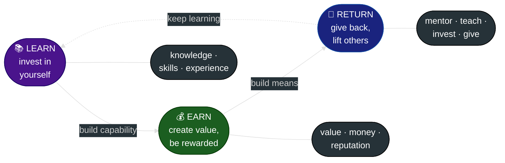

# Guide: Learn → Earn → Return — The Three Arcs of a Career

**Tags:** #ways-of-working #career #growth #mindset #mentorship #life-stages
**Audience:** Anyone building a career · mentors · people deciding "what's next?"
**Read Time:** ~10 min

> A framework shared by an influencer at a talk: a meaningful career moves through three arcs — **Learn → Earn → Return.** First you invest in yourself (learn). Then you turn that into value (earn). Then you give it back (return) — mentoring, teaching, lifting others. The trap most people fall into is getting stuck in *Earn* forever; the people who feel their work *mattered* are the ones who reach *Return*. The three aren't strictly sequential — they overlap and loop — but the *center of gravity* shifts across a lifetime.

---

## 📌 Table of Contents
- [The Big Idea](#01)
- [Mermaid Flow](#02)
- [ASCII Flow](#03)
- [The Three Arcs at a Glance](#04)
- [Arc 1 — Learn 📚](#05)
- [Arc 2 — Earn 💰](#06)
- [Arc 3 — Return 🤝](#07)
- [They Overlap & Loop 🔄](#08)
- [The Trap: Stuck in Earn](#09)
- [Self-Check](#10)
- [Related Documents](#11)

---

<a id="01"></a>
## The Big Idea

> **Learn → Earn → Return.** You can hear it in three words, but it's the shape of a whole working life. Each arc takes what the previous one built and puts it to a higher use.

- **Learn 📚** — pour into yourself: knowledge, skills, experience. You're an *investment*.
- **Earn 💰** — convert that capability into value and reward. You're a *producer*.
- **Return 🤝** — give the knowledge, money, and access back. You're a *multiplier* — your impact now lives through others.

The arcs build on each other: you can't earn well without having learned, and *return* is richest when you have both wisdom (from learning) and means (from earning) to give. Move through all three and the career compounds — not just in money, but in meaning.

---

<a id="02"></a>
## Mermaid Flow



---

<a id="03"></a>
## ASCII Flow

```
LEARN → EARN → RETURN
══════════════════════════════════════════════════════════════════════════════════

   ┌────────────────────┐      ┌────────────────────┐      ┌────────────────────┐
   │   📚 1 · LEARN     │ ───▶ │   💰 2 · EARN      │ ───▶ │   🤝 3 · RETURN    │
   │  invest in self    │      │  create value      │      │  give it back      │
   │                    │      │                    │      │                    │
   │  knowledge ·       │      │  value · money ·   │      │  mentor · teach ·  │
   │  skills · exp.     │      │  reputation        │      │  invest · give     │
   └────────────────────┘      └────────────────────┘      └────────────────────┘
            ▲                                                         │
            └──────────────  keep learning at every stage  ◀──────────┘

   You as…   an INVESTMENT          a PRODUCER             a MULTIPLIER
   Center of  early career          mid career             later / mature
   gravity:   "soak it up"          "make it count"        "make it matter"
```

---

<a id="04"></a>
## The Three Arcs at a Glance

| # | Arc | You are… | You focus on… | The reward | The risk |
|:--|:----|:---------|:--------------|:-----------|:---------|
| 1 | **Learn** 📚 | An investment | Knowledge, skills, experience | Capability | Learning forever, never shipping |
| 2 | **Earn** 💰 | A producer | Creating & capturing value | Money, reputation, freedom | Getting *stuck* here |
| 3 | **Return** 🤝 | A multiplier | Giving back to others | Meaning, legacy, compounding impact | Never starting it |

---

<a id="05"></a>
## Arc 1 — Learn 📚

> First, **invest in yourself.** Early on, your job is to become valuable — soak up knowledge, skills, and experience faster than you earn from them.

In this arc you are an **investment**: the returns come later, so the smart move is to maximize learning even over short-term pay.

- **Prioritize growth over salary early** — the role that teaches you the most often beats the one that pays slightly more.
- **Learn broadly, then deeply** — explore enough to find your edge, then go deep where you have talent + demand.
- **Learn by doing, not just studying** — real skill (and real lessons) come from shipping, failing, and getting feedback.
- **Find mentors** — borrow others' decades of learning; it's the fastest compounding there is.

> The temptation here is the opposite extreme — *perpetual student* who never ships. Learning has to convert into capability you can *use*. That's the bridge to Earn.

---

<a id="06"></a>
## Arc 2 — Earn 💰

> Now **turn capability into value.** What you learned becomes something the world will pay for — money, reputation, freedom.

You shift from investment to **producer**. This is where you build a living, a track record, and the *means* you'll later be able to give back.

- **Convert skill into value others want** — earning is just learning, applied to a real problem people have. (See the [four foundations](../startup/foundations/01-four-foundations-of-starting-a-business.md).)
- **Build assets, not just income** — reputation, relationships, ownership, and savings are stored earning power.
- **Keep learning while you earn** — the best earners never fully leave Arc 1; they learn *on the job* and stay sharp.
- **Earn enough to have a choice** — the real prize of earning isn't luxury, it's the *freedom* to eventually focus on Return.

> Earning is good and necessary — but it's the **middle** arc, not the destination. Which leads to the one trap that catches the most people…

---

<a id="07"></a>
## Arc 3 — Return 🤝

> Finally, **give it back.** Take the knowledge, the money, and the access you've built — and use them to lift others. This is where work becomes *meaning*.

Now you become a **multiplier**: your impact is no longer limited to what *you* can do — it lives on through everyone you help.

- **Mentor & teach** — pass on the learning that took you years, in hours. The cheapest, highest-leverage form of return.
- **Invest in others** — fund, sponsor, hire, and open doors for people who are where you once were.
- **Give back to community** — knowledge, time, or money; build the thing you wish had existed when you started.
- **Build things that outlast you** — institutions, open knowledge, the next generation of leaders.

> Return isn't only for the rich or retired — you can start the *moment* you know something a beginner doesn't. The junior who teaches the intern is already in Arc 3. And paradoxically, returning often *accelerates* your own learning and earning — teaching deepens mastery, and generosity builds the network that comes back to you.

---

<a id="08"></a>
## They Overlap & Loop 🔄

> The three arcs are a *center of gravity*, not rigid stages. In any given year you're probably doing all three — the question is which dominates.

```
LEARN  ████████████░░░░░░░░░░░░░░░░░░░░  ← heaviest early
EARN   ░░░░░░██████████████████░░░░░░░░  ← heaviest mid
RETURN ░░░░░░░░░░░░░░██████████████████  ← grows over time
        early career ───────────▶ later career
```

- **Always be learning** — every arc loops back to Arc 1; the day you stop learning, all three decay.
- **Earn while you return** — many people do their best earning *because* they're known for giving (trust → opportunity).
- **Return while you earn** — you don't have to "finish" earning to start giving back; start now, in small ways.

> It's less a staircase, more a **dial** that turns from *me* toward *others* over a lifetime.

---

<a id="09"></a>
## The Trap: Stuck in Earn

> The most common failure isn't failing to learn or earn — it's **never leaving Earn.** The arc that was supposed to fund a meaningful life becomes the whole life.

| Symptom | What's really happening | The shift |
|:--------|:------------------------|:----------|
| "Just one more milestone, *then* I'll give back" | Earn has no natural finish line — it always wants more | Start Return *now*, in small ways |
| More money, less meaning | You optimized for the middle arc and skipped the third | Redirect some time/skill/money outward |
| Hoarding knowledge to stay ahead | Treating learning as a private edge, not a gift | Teach it — you lose nothing and multiply it |

> The people who look back on a career as *well-lived* are rarely the ones who earned the most — they're the ones who **returned**. Earning buys options; returning spends them on what matters.

---

<a id="10"></a>
## Self-Check

Score yourself honestly 1–5:

| Arc | Question | Score (1–5) |
|:----|:---------|:-----------:|
| 📚 Learn | Am I still actively growing — learning faster than I'm coasting? | ___ |
| 💰 Earn | Am I converting my skills into real, fair value? | ___ |
| 🤝 Return | Am I giving back — mentoring, teaching, lifting others — *already*? | ___ |
| 🔄 Balance | Is my "dial" turning toward others over time, not stuck on *me*? | ___ |

> If **Return** is your lowest — and for most ambitious people it is — that's the invitation. You don't need to wait until you've "made it." Find one person to help this week.

---

<a id="11"></a>
## Related Documents
- [The Painting → Reflection → Documents → Confidence Loop](./01-the-painting-reflection-documents-loop.md) — the team learning loop (the *Learn* arc, operationalized)
- [The Four Foundations of Starting a Business](../startup/foundations/01-four-foundations-of-starting-a-business.md) — Knowledge → Skill → Credit → Problem (the *Earn* arc, for founders)
- [Engineering Manager — Performance & Growth](../engineering-manager/04-performance-and-growth.md) · [Mentoring & Growth](../team-lead/05-mentoring-and-growth.md) — helping others learn (the *Return* arc, as a leader)
- [Leadership Playbooks hub](../leadership-playbooks.md)

---

*Notes written up from a talk · Part of [Ways of Working](./README.md) · Last updated: 2026-05-31*
